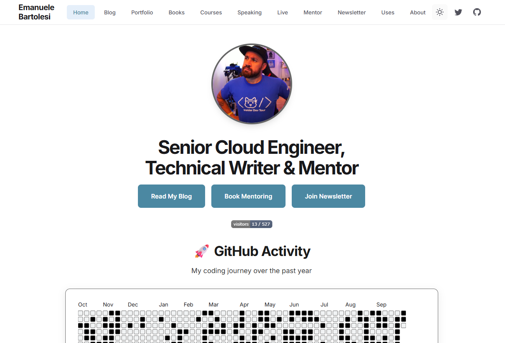
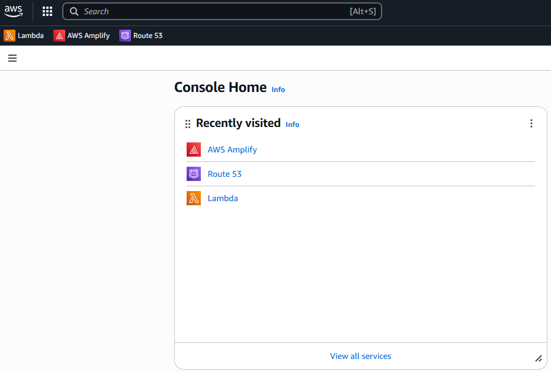
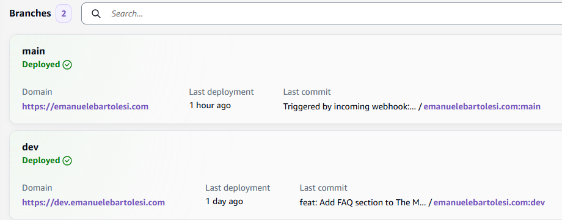
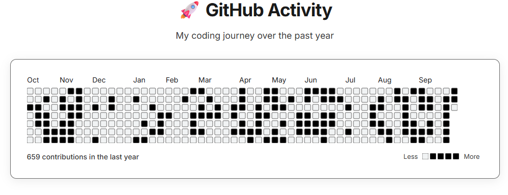
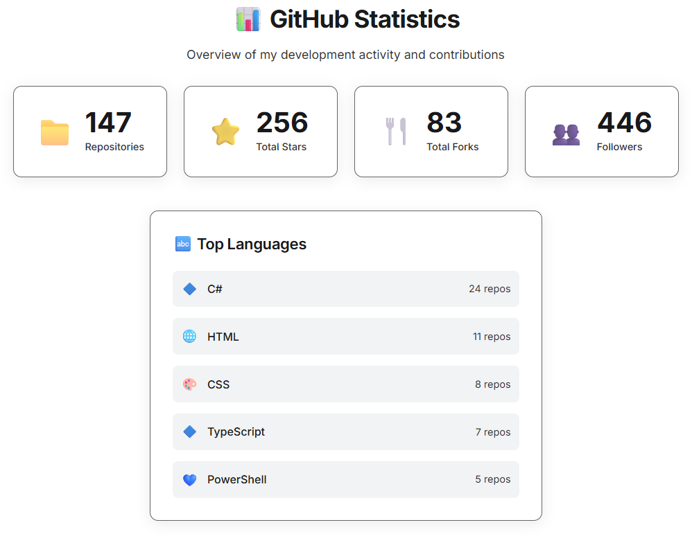
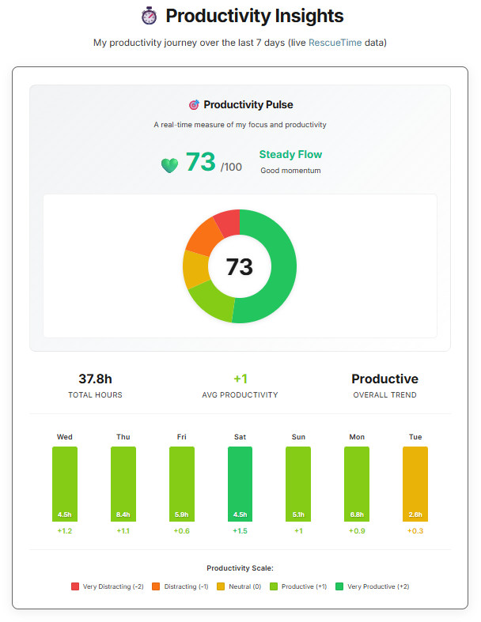

---
{
title: "Building My New Website with Astro, GitHub Copilot, and AWS Amplify",
published: "2025-10-07T12:41:50Z",
edited: "2025-10-07T12:45:31Z",
tags: ["astro", "aws", "githubcopilot", "webdev"],
description: "For me, in general, the best way to learn something new is to start from zero and hit...",
originalLink: "https://dev.to/this-is-learning/building-my-new-website-with-astro-github-copilot-and-aws-amplify-3eoc",
coverImg: "cover-image.png",
socialImg: "social-image.png"
}
---

For me, in general, the best way to learn something new is to **start from zero and hit “publish.”**

That’s exactly what I did when I decided to rebuild my personal website — [emanuelebartolesi.com](https://emanuelebartolesi.com) — from scratch.
No templates. No frameworks I already knew. Just curiosity, a blank repo, and a lot of help from GitHub Copilot.

I had **never touched Astro before**, but I wanted to explore it because it felt and I read about it as the perfect mix between simplicity, speed, and flexibility.
Instead of following tutorials, I decided to apply my own “**Copilot personas**” approach — the same method I use in my daily projects to guide AI tools like GitHub Copilot through different roles: architect, implementer, reviewer, and so on. It felt like pair programming with an assistant that never gets tired.

<!-- ::start:link-preview -->
[GitHub Copilot: A Persona-Based Approach to Real-World Development](/posts/github-copilot-a-persona-based-approach-to-real-world-development-56ee)
<!-- ::end:link-preview -->

To make the challenge even more interesting, I built the entire project **inside GitHub Codespaces**, streamed the first steps **live on Twitch**, and deployed it for the first time ever using **AWS Amplify** with an Astro adapter.
And because I can’t resist automating things, I also set up an **AWS Lambda** function to re-publish the website every two hours — becase I have a lot of data on the website streamed from our external services.

---



## Starting from Zero: Learning Astro with GitHub Copilot

When I started this project, my Astro knowledge level was exactly **zero**.
I knew it existed, I had seen a few demos, but that was about it. I wanted to understand how it actually worked — component structure, routing, layouts, everything.

Instead of spending hours reading documentation or tutorials, I decided to try something different:
I would **learn by building**, with **GitHub Copilot** as my coding partner.

But not just Copilot as a “code completion” tool — I used it through my **personas approach**, a method I’ve been refining for months. The idea is simple:
treat Copilot like a team of specialists instead of a single assistant.

So, for example:

- I’d ask **“Architect Copilot”** to explain how Astro handles layouts and partials.
- Then I’d switch to **“Implementer Copilot”** to help me generate the first components.
- And finally, **“Reviewer Copilot”** to check consistency and readability.

In just a few hours, I had a working homepage, a blog section, and some reusable components.

What surprised me the most (but not so much because Copilot is very good with React) was how **Astro and Copilot worked so well together**.
Copilot was able to suggest entire component structures, meta tag configurations, and even some optimizations for Lighthouse performance.

Here’s a small example — I just typed a comment:

```
with the same style of the other pages, I would like to add a page dedicated to books I written or I am writing.
like this one: https://www.packtpub.com/en-us/product/mastering-minimal-apis-in-aspnet-core-9781803237824
```

and Copilot generated:

```javascript
---
import BaseHead from '../components/BaseHead.astro';
import Footer from '../components/Footer.astro';
import Header from '../components/Header.astro';
import { 
  getFeaturedBooks, 
  getPublishedBooks,
  getUpcomingBooks,
  bookCategories, 
  getBookStats
} from '../data/books';

const featuredBooks = getFeaturedBooks();
const publishedBooks = getPublishedBooks();
const upcomingBooks = getUpcomingBooks();
const stats = getBookStats();
---
```

and the entire HTML and Astro code for the page and the TypeScript class for the data.

---

## Live Coding on Twitch

When I started working on the project, I thought: *“Why not share the process live?”*
So I opened Twitch, hit “Start Streaming,” and decided to **build the first parts of the website in front of everyone**.

Live coding is always a mix of excitement and vulnerability.
You make mistakes, talk through your reasoning, and sometimes get stuck — all in real time. But that’s exactly what makes it authentic.
And since I was diving into **Astro for the first time**, it became a great way to **learn in public**.

During those sessions, I wasn’t trying to “teach” Astro. I was **learning it live**, asking ChatGPT and Copilot questions, and letting people in the chat contribute with suggestions.
Sometimes, Copilot would generate code I didn’t fully understand, and viewers helped me reason through it. Other times, it just worked — and we all learned something new together.

What I loved about this format is how it **kept me accountable**.
When you know people are watching, you can’t just stop halfway because you got stuck on a CSS grid layout. You find a way through — and that’s powerful motivation.

After a few sessions, I already had the basic structure of my site, a working navigation, and a clear plan for the next steps.
Streaming wasn’t just about building a website — it was about **sharing curiosity and the joy of learning**.

You can find me on Twitch here: http://twitch.tv/kasuken

---

## Developing in GitHub Codespaces

One of the decisions I made early on was:

> “I don’t want to install anything locally.”

I wanted this project to be **100% cloud-based**, from the first line of code to deployment.
So I opened GitHub, clicked on the **“Open in Codespaces”** button, and within seconds, I was coding directly in the browser — with my full VS Code setup.

It was surprisingly smooth.
Astro ran perfectly, previews loaded fast, and I had GitHub Copilot right inside Codespaces to help me iterate.
No Node.js version mismatches, no missing dependencies, no setup headaches.
It just worked.

This setup also had another big benefit: **portability**.
I could jump between my MacBook, my Windows laptop that I use for work or my private one (you can find the list of all my hardware on my website, in the Uses page) and continue working exactly where I left off.
Everything — the editor, the extensions, and the environment — was consistent and ready.

That’s it.
No cloning. No manual setup.

I didn't change the default Codespaces image but I use the default one.
Usually I customize the container, but in this case works like a charm, so, no reasons to change it and also the default image is faster to rebuild o start.

For me, Codespaces became **the perfect environment** for experimenting and learning with Copilot (and not only).

When I finally switched to deploying on AWS, everything was already structured neatly in the repo.
No “works on my machine” moments, ever again.

---

## First Steps with AWS Amplify

Once the site was running smoothly in Astro, it was time to bring it online.
I had two main goals for hosting:

1. Keep it **fully automated** from GitHub.
2. Use a platform I hadn’t used before — because this was, after all, a learning project.

So I chose **AWS Amplify**.
It was my **first time** using it, and honestly, I was curious to see how it compared to platforms like Vercel or Microsoft Azure.

The onboarding experience was smoother than I expected.
Amplify detected my GitHub repository, connected automatically, and offered to build and deploy my Astro app in just a few clicks.
No YAML setup, no manual build commands — it just picked up `npm run build` and `dist/` as defaults.

I like the simplicity of the UI (even if I needed 2 days to be productive on the AWS console), especially compared to the Azure Portal.
I used to use Azure since ages now, but actually the AWS console is not so bad.



But I soon realized Astro isn’t natively supported in Amplify…
and that’s when I discovered the **AWS Amplify Adapter for Astro**.

After adding it, everything started to click.

Here’s the short version of what I did:

```bash
npm install astro-aws-amplify
```

Then in my `astro.config.mjs`:

```js
import mdx from "@astrojs/mdx";
import sitemap from "@astrojs/sitemap";
import { defineConfig } from "astro/config";
import awsAmplify from "astro-aws-amplify";

// Conditionally use AWS Amplify adapter for deployments
const isAWSDeployment = process.env.NODE_ENV === 'production' || process.env.AWS_AMPLIFY === 'true';

// https://astro.build/config
export default defineConfig({
  site: "https://example.com",
  integrations: [mdx(), sitemap()],
...(isAWSDeployment && { adapter: awsAmplify() }),
  output: isAWSDeployment ? "server" : "static",
});
```

Once I pushed these changes to GitHub, Amplify automatically rebuilt and deployed the site.
No manual steps, no servers to configure — pure CI/CD magic.

The only thing that I changed from the [official documentation](https://docs.aws.amazon.com/amplify/latest/userguide/get-started-astro.html) is the check of the environment, otherwise I was not able to run the website from my local machine anymore.

I have also contributed to the official repo for AWS Amplify to add the node version as parameter: https://github.com/alexnguyennz/astro-aws-amplify/pull/37

---

## Astro + AWS Amplify Adapter

Once I added the **Amplify adapter** to my Astro project, everything started to feel like a real production pipeline.

The adapter acts as the bridge between Astro’s static-site output and AWS’ serverless infrastructure.
In practice, it takes your built site and wraps it in an **AWS Lambda** function that Amplify can deploy and serve.
That means no servers, no containers — just instant scalability with minimal configuration.

But what really impressed me was how Amplify handled **different branches** from GitHub.
Each branch can become its own environment — automatically.

So, for example:

- **`main` branch →** production (`emanuelebartolesi.com`)
- **`dev` branch →** staging (`dev.emanuelebartolesi.com`)



Every time I pushed a commit to either branch, Amplify rebuilt and deployed it without me touching a thing.

That setup was powerful because it gave me the same comfort I have on larger SaaS projects — **real CI/CD with environment isolation** — but for my personal site.

Here’s what the process looked like visually:

```text
GitHub Repo
 ├── main → Amplify Production → emanuelebartolesi.com
 └── dev  → Amplify Dev Env → dev.emanuelebartolesi.com
```

In just a few hours, I had a multi-environment setup that I used to experiment with new pages, styles, and layout changes before merging them into `main`.
That kind of workflow used to take hours to configure manually — now it was a few clicks and one adapter import.

---

## Automation with Lambda

In my website I have different components that need to load a lot of data from APIs.
For instance, I have a component to render my commmits on GitHub, all the info about my GitHub account and below I have the statistics about my productivity during the day with RescueTime.







So, I created a couple of loader on Astro to load all this data, but I need to rebuild the website everytime I want to update the pages.

If there’s one thing I can’t resist, it’s automation.
Once the site was up and running, I thought:

So I built a **simple Lambda function** that triggers the Amplify build every two hours.
It’s a small piece of automation, but it makes the whole workflow feel alive — and it was surprisingly easy to set up.

Here’s the basic lambda I have created :

```python
import json
import urllib.request

def lambda_handler(event, context):
    r = urllib.request.Request(
        'https://webhooks URL',
        data=json.dumps({}).encode('utf8'),
        headers={
            'Content-Type': 'application/json'
        },
        method='POST'
    )
    urllib.request.urlopen(r)
    return
```

Then I just scheduled it using **Amazon EventBridge** (formerly CloudWatch Events) with a cron rule like:

```text
cron(0 7-17/2 ? * * *)
```

So every two hours, from 7 in the morning to 5 in the afternoon, Lambda wakes up, triggers Amplify, and goes back to sleep — costing practically nothing.

It’s a small piece of the puzzle, but it reflects my favorite principle:

> automate everything that can be automated — even personal projects.

---

## Route 53 and Custom Domains

Once everything was running perfectly on Amplify, it was time for the final touch:
**connecting my own domains**.

I wanted two environments with clean, memorable URLs:

- `emanuelebartolesi.com` for production
- `dev.emanuelebartolesi.com` for my staging environment

I decided to manage everything directly in **AWS Route 53**, mostly out of curiosity — but also because I’d heard good things about how seamlessly it integrates with Amplify.

And honestly, it was **a pleasant surprise**.

Route 53 automatically recognized my Amplify app and helped me configure both records with just a few clicks.
No manual DNS entries, no propagation headaches, no SSL nightmares.

The SSL certificates are provided directly from Route 53.

Here’s roughly what the configuration looked like:

```text
emanuelebartolesi.com        → Amplify Production (main branch)
dev.emanuelebartolesi.com    → Amplify Dev Environment (dev branch)
```

It was one of those moments where everything *just works* —
and it made me appreciate how much AWS has improved in terms of **developer experience**.

The best part?
If I ever decide to add more environments (like preview or experimental builds), I can just connect new branches and Route 53 will take care of the rest.

---

## Lessons Learned & What’s Next

Even though the final result looks clean and simple, getting there wasn’t always smooth.
Astro is a great framework — but when you start going beyond static pages, things get a little more complex.

### ⚠️ Working with dynamic data isn’t as straightforward as it seems

Astro shines for static sites, but integrating **dynamic data from APIs** can be tricky.
I wanted to pull data at runtime, not just during build, and that required experimenting with different patterns — from server endpoints to hybrid rendering.

There were moments where I felt like I was “fighting” the framework a bit.
The documentation is good, but when it comes to *incremental updates* or *live API data*, you often need to combine several Astro concepts together to make it work smoothly.
It’s definitely doable, but not as plug-and-play as other frameworks like Next.js.

### 🧩 The AWS Amplify adapter still has room to grow

Another challenging part was understanding **how the AWS Amplify adapter actually works under the hood**.
It abstracts away a lot (which is great), but when something goes wrong or you want to customize the deployment flow, it’s not always clear where to look.

That curiosity led me to dig into the adapter source code — and eventually, to **contribute directly** to the open-source project:
🔗 [github.com/alexnguyennz/astro-aws-amplify](https://github.com/alexnguyennz/astro-aws-amplify)

It was a small contribution, but it helped me understand the logic behind it — and reminded me how valuable it is when developers give back to the tools they use.

### 🚀 What’s Next

I am preparing a new special page for my website for my next secret project. 🚀🧑🏻‍🚀🦄
Stay tuned!

I forgot to write that my website is open source (because why not) and you can use it as your starting point for your personal website:

<!-- ::start:link-preview -->
[Personal website GitHub](https://github.com/kasuken/website)
<!-- ::end:link-preview -->

---

🙋‍♂️ Hey, I'm Emanuele — you might know me online as **Kasuken**.

👨‍💻 Senior Cloud Engineer | Microsoft MVP (12x) | GitHub Star (4x)\
🛠️ I build things with **.NET**, **Azure**, **AI**, and **GitHub**\
🌈 Turning code into 🦖 and 🦄 — one commit at a time

🚀 If you're into .NET, GitHub, DevOps, or just cool side projects,\
feel free to [connect with me on LinkedIn](https://www.linkedin.com/in/bartolesiemanuele)

P.S. I break things so you don’t have to. 😉
