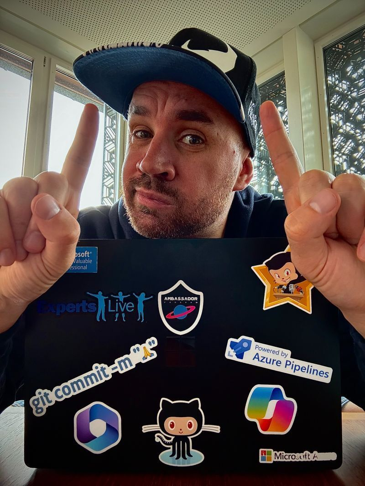
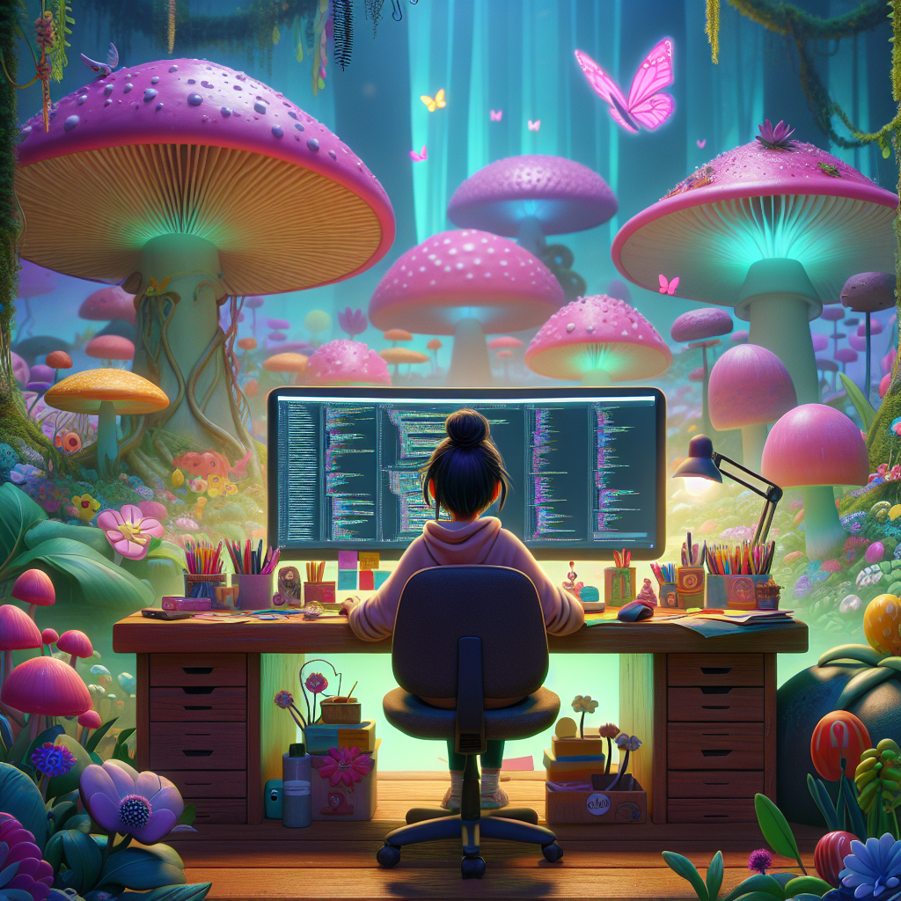

---
{
title: "🎉 Celebrating 11 Years as a Microsoft MVP: A Journey of Perseverance and Gratitude 🌟",
published: "2024-08-22T08:31:53Z",
edited: "2024-08-22T09:34:15Z",
tags: ["microsoft", "awards"],
description: "Introduction to the Microsoft MVP Program   The Microsoft Most Valuable Professional (MVP)...",
originalLink: "https://dev.to/this-is-learning/celebrating-11-years-as-a-microsoft-mvp-a-journey-of-perseverance-and-gratitude-24dg",
coverImage: "cover-image.png",
socialImage: "social-image.png"
}
---

#### Introduction to the Microsoft MVP Program

The Microsoft Most Valuable Professional (MVP) program is a prestigious recognition awarded by Microsoft to technology experts who passionately share their knowledge with the community. MVPs are independent experts who are recognized for their exceptional contributions to the tech community, demonstrating leadership and a deep commitment to helping others. They represent a wide range of expertise across various Microsoft technologies, including Azure, Office 365, AI, and more.

The MVP award is given annually, and being honored once is a significant achievement. To receive this recognition year after year is a testament to one's dedication, expertise, and influence in the tech community.

You can find more information here: https://mvp.microsoft.com/

#### Reflecting on 11 Years as a Microsoft MVP

A few weeks ago I was incredibly happy that I have been recognized as a Microsoft MVP for the 11th consecutive year. 🌟 This milestone is more than just a personal achievement; it represents a journey of growth, resilience, and the unwavering support of a fantastic community. 🙌

When I first received the MVP award 11 years ago, I was filled with immense pride and excitement. 🎉 It was a validation of my hard work and passion for technology. Over the years, this recognition has motivated me to continually push the boundaries, learn new things, and share my knowledge with others. 💻📚

#### Gratitude to the Community

First and foremost, I want to express my deepest gratitude to the incredible tech community. 🤗 Your support, encouragement, and collaboration have been instrumental in my journey. Whether through attending my sessions, reading my blog posts, or engaging in discussions, each interaction has contributed to this achievement. Thank you for being a part of this journey and for inspiring me to keep going. 💖

In the last few months I didn't write too much on this blog, but I still have a lot of post views and now I have more than 1.5M views!

#### Personal Perseverance

Achieving this milestone year after year has not been without its challenges. There have been moments of doubt, setbacks, and hurdles along the way. However, it is during these times that perseverance has played a crucial role. 💪 Staying committed to my goals, continually learning, and adapting to the ever-evolving tech landscape has been key to sustaining this journey. 🚀

I also want to acknowledge the importance of self-belief. 🌟 There were times when the road seemed tough, but believing in my capabilities and staying resilient helped me navigate through those challenges. This award is a reminder that perseverance and self-belief can lead to incredible accomplishments. 🌈

#### An Inspirational Message

To everyone out there chasing their dreams and striving for excellence, remember this:

**"Survive under the clouds ☁️ for ages, just to live one day under the sun 🌞."**

Challenges and obstacles are part of the journey, but they should not deter you from pursuing your goals. Embrace the difficulties, learn from them, and continue to move forward. Your day under the sun will come, and when it does, it will be worth every bit of effort. 🌞🌈

#### Looking Ahead

As I celebrate this milestone, I am also looking forward to the future with renewed enthusiasm. The tech world is constantly evolving, and there is always something new to learn and share. I am excited about the opportunities ahead and the chance to continue contributing to the community. 🌐✨

#### Conclusion

Being recognized as a Microsoft MVP for 11 consecutive years is a profound honor and a reflection of a journey marked by perseverance, dedication, and community support. As I look back on these years, I am filled with gratitude and excitement for the future. Let us all continue to believe in ourselves, embrace the challenges, and strive for excellence. 💪🌟

Thank you for being part of this incredible journey! 🙏

---

If you enjoyed this blog post and want to learn more about C# development, you might be interested in subscribing to my bi-weekly newsletter called Dev Dispatch. By subscribing, you will get access to exclusive content, tips, and tricks, as well as updates on the latest news and trends in the development world. You will also be able to interact with me, and share your feedback and suggestions. To subscribe, simply navigate to https://buttondown.email/kasuken?tag=devto, enter your email address and click on the Subscribe button. You can unsubscribe at any time. Thank you for your support!
