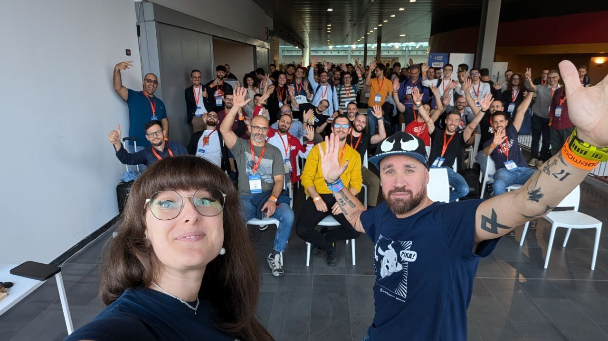
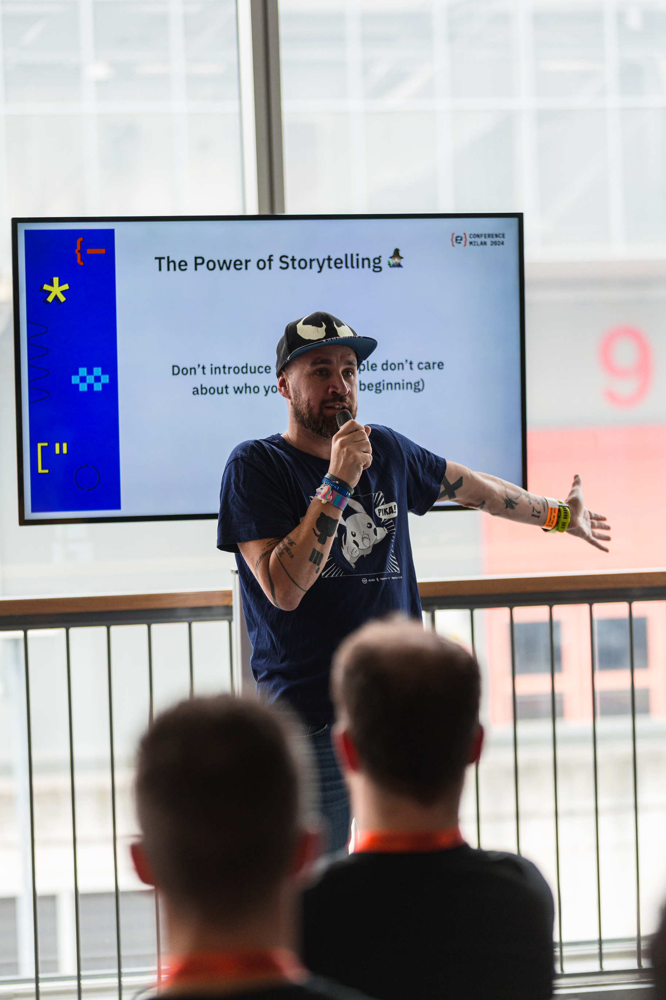
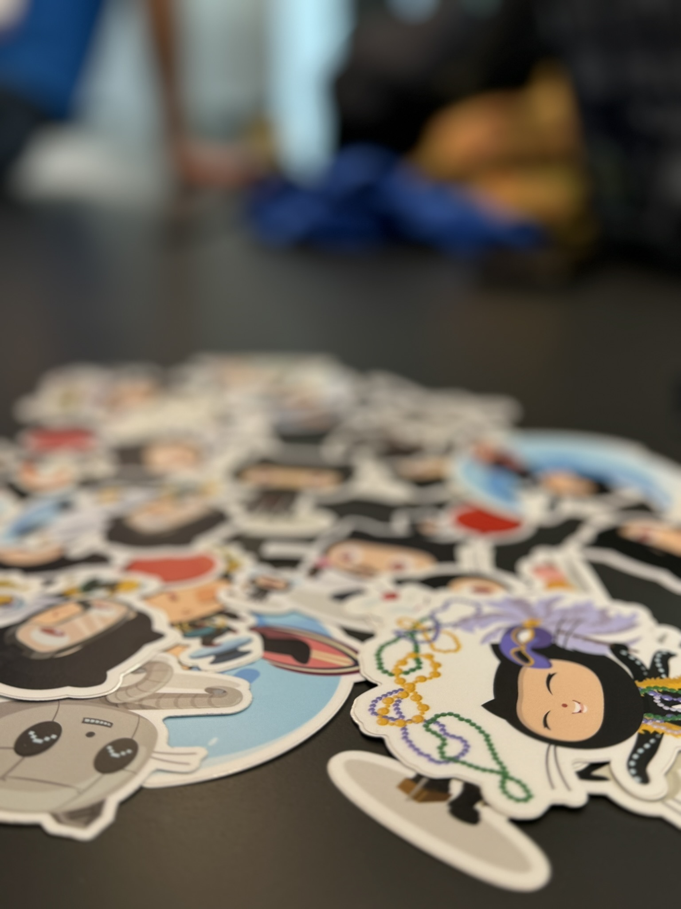
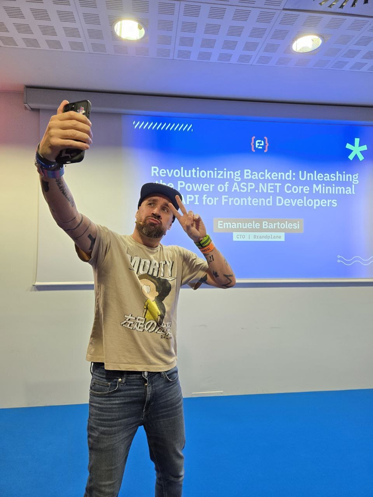
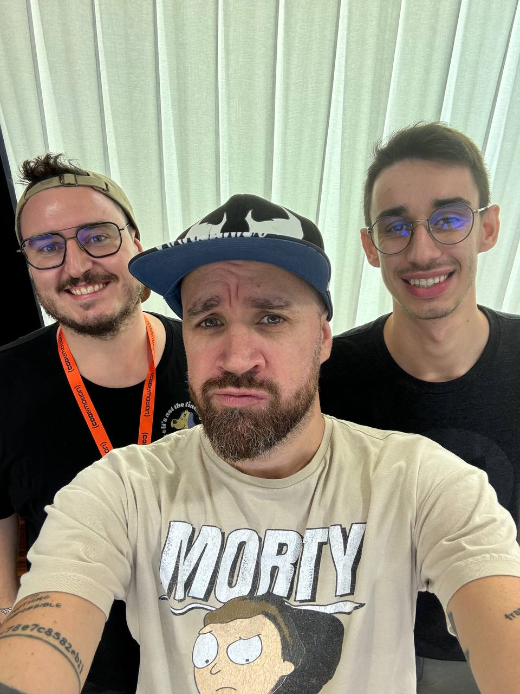
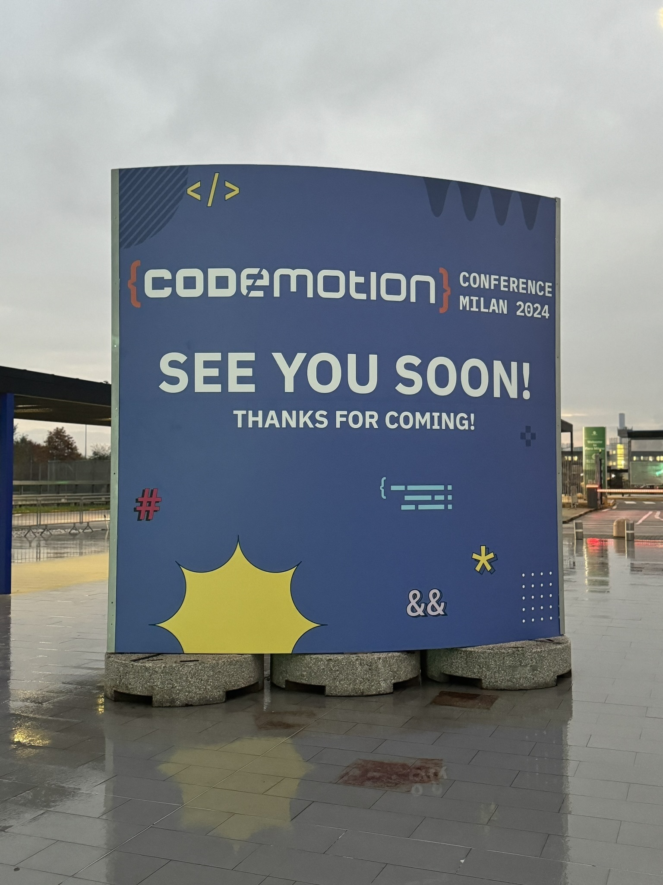

---
{
title: "Codemotion 2024 Milan: Rediscovering My Voice and Passion as a Speaker",
published: "2024-11-06T08:59:57Z",
tags: ["publicspeaking", "devlife", "webdev", "dotnet"],
description: "Codemotion 2024 in Milan was nothing short of spectacular. Imagine being in a place filled with over...",
originalLink: "https://https://dev.to/playfulprogramming/codemotion-2024-milan-rediscovering-my-voice-and-passion-as-a-speaker-171o",
coverImg: "cover-image.png",
socialImg: "social-image.png"
}
---

Codemotion 2024 in Milan was nothing short of spectacular. Imagine being in a place filled with over 2700 people, all buzzing with excitement, ready to learn from more than 100 speakers on topics shaping the future—AI, JavaScript, and beyond. But, for me, Codemotion was also a deeply personal experience—one that sparked joy, pride, reflection, and maybe even a bit of bittersweet realization.

As someone who's been speaking at tech conferences for over a decade, with 130+ sessions under my belt, this event made me reflect on where I am in my speaking journey. While I mentored the next generation of speakers and shared the stage with amazing minds, I also found myself questioning whether I still have that same fire for technical talks.

Here's how it all unfolded.

## **Day 1: Standing Room Only for Public Speaking – My Heartfelt Moment**

Day 1 of Codemotion was unforgettable. I had the honor of speaking about a topic that’s become close to my heart in recent years: *Public Speaking.* After years of focusing on deeply technical subjects, this was a shift—one that I wasn’t sure would resonate with the audience. I thought maybe a handful of people would show up, curious about how they could improve their stage presence.

But when I walked into the room, my jaw nearly dropped. It was packed. People were standing because all the seats had been claimed. I started the session with a smile, feeling an immediate connection with the audience. They weren’t just there to listen—they were there to grow, to take a step forward in their own journeys.

As I spoke, I could feel the energy in the room. And after the session, I couldn’t believe how many people stopped me in the hallways, at lunch, and even outside, to thank me. It wasn’t just the usual “great session” kind of feedback—it was personal. People shared how motivated they felt, how inspired they were to face their fear of speaking in public. Some even said my talk was the push they needed to book a 5-minute lightning talk that afternoon! Watching people immediately act on what I shared felt beyond rewarding.

Later, I was tagged on LinkedIn as one of the top highlights of Codemotion. It’s funny how every time that happens, my impostor syndrome rears its head. It whispers, “Are you really good enough for this kind of praise?” But at the same time, there’s a quiet joy knowing that my words touched people in a meaningful way. I think that’s what keeps me going—knowing that I can help others find confidence in themselves.

---

## **Day 2: A Technical Talk on Minimal API**

Day 2 brought a different kind of challenge. I was slated for the last session of the event, presenting on *Minimal API.* If you’ve ever been to a two-day conference, you know the last slot is tough. People are tired, overloaded with information, and ready to head home. But to my surprise, the room still had eager faces, ready to learn.

Delivering a technical talk in this kind of setting requires more than just explaining code—it’s about keeping people engaged when their energy is running low. I poured everything I had into making the session engaging, keeping it interactive, and simplifying complex concepts. By the end, people were asking insightful questions, showing their curiosity and dedication. It was a good feeling to end the event on a high note, even though it was clear that the adrenaline rush I used to feel during technical sessions was fading for me.

---

## **Mentoring the Next Generation: Riccardo and Leonardo’s Journey**

One of the most fulfilling parts of Codemotion 2024 wasn’t even my own talks—it was watching the next generation of speakers step onto the stage for the first time. This year, I had the pleasure of mentoring *Riccardo* and *Leonardo* (who’s also a GitHub Star, like me), two talented individuals eager to make their mark in public speaking.

Seeing their growth throughout the process was incredible. They were nervous, yes, but determined. And when it was finally time for them to take the stage, they absolutely nailed it. Their 20-minute sessions drew large crowds, and the feedback was overwhelmingly positive. It was a proud moment for me, standing on the sidelines, watching them shine.

Mentoring new speakers reminded me why I started speaking in the first place. It’s not just about sharing knowledge—it’s about helping others find their voice. I’m so happy for Riccardo and Leonardo, and I hope they continue to pursue this path because they have so much potential. Knowing that I played a small part in their journey is a deeply fulfilling feeling that I’ll carry with me.

---

## **A Personal Reflection: Is It Time to Step Back from Technical Talks?**

This year’s Codemotion hit a little different for me. A few weeks ago, I returned to the stage after a nine-month break, and something felt… off. Over the last 12 years, I’ve given more than 130 technical talks, and while I’ve loved every minute of it, I’m starting to feel like my passion for these sessions is fading. That excitement I used to have before a talk? It’s not there in the same way anymore.

After my *Minimal API* session, I found myself wondering: *Is it time to step back from technical talks?* It’s a tough question. On one hand, I’ve spent so much of my career sharing deep technical knowledge, and I’ve loved doing it. On the other hand, I’m not sure I have the same drive for it anymore. It feels like I’m at a crossroads.

But one thing is clear—I still love public speaking. I still love helping others find their voice, build their confidence, and take the stage with purpose. Maybe that’s the direction I need to head toward. Maybe my future lies more in mentoring, coaching, and speaking about personal growth rather than diving into the latest APIs and frameworks.

Photo bombing moment during the final keynote of the event.

---

## **Gratitude and a New Chapter Ahead**

Codemotion 2024 was more than just a conference for me—it was a turning point. I’m incredibly grateful for the experiences I’ve had, for the people who’ve trusted me to guide them, and for the chance to share the stage with so many brilliant minds. But as I look ahead, I’m also excited about the possibility of change. Whether it’s mentoring future speakers or focusing more on the human side of speaking, I know that my journey is far from over.

The path ahead might look a little different, but it’s one I’m ready to embrace. And if my words can continue to help others along the way, then I know I’m exactly where I need to be.

---

**Exciting News!** 🌟\
We're thrilled to introduce **[cloudGlow](https://www.cloudglow.io)** — a powerful governance tool designed to streamline the management of **Entra ID resources** on **Microsoft Azure**.\
**Visit [www.cloudglow.io](https://www.cloudglow.io)** to learn more, get early access, and **subscribe** to our preview! Stay ahead of your cloud management game with **cloudGlow**. 🚀
