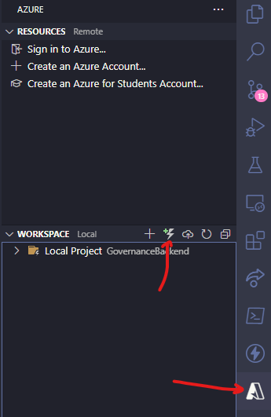
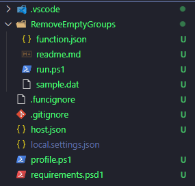
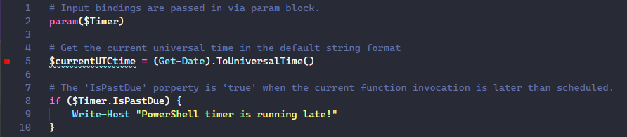
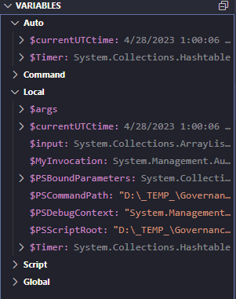
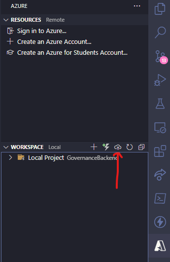

---
{
title: "Create an Azure Function with PowerShell and Visual Studio Code",
published: "2023-04-28T13:03:41Z",
tags: ["azure", "azurefunctions", "powershell"],
description: "In this post, I'm going to show you how to create Azure Functions with PowerShell and Visual Studio...",
originalLink: "https://dev.to/this-is-learning/create-an-azure-function-with-powershell-and-visual-studio-code-3k9n",
coverImage: "cover-image.png",
socialImage: "social-image.png"
}
---

In this post, I'm going to show you how to create Azure Functions with PowerShell and Visual Studio Code.

Azure Functions are serverless applications that run on-demand in response to events or triggers. They are great for building microservices, integrations, or automation tasks.
PowerShell is a powerful scripting language that can interact with Azure resources and services.

## Requirements

To create Azure Functions with PowerShell and Visual Studio Code, you will need the following:

- An Azure account. If you don't have one, you can sign up for a free trial [here](https://azure.microsoft.com/en-us/free/)
- The Azure Functions Core Tools. These are command-line tools that allow you to create, test, and deploy Azure Functions locally or to the cloud. You can install them from [here](https://docs.microsoft.com/en-us/azure/azure-functions/functions-run-local)
- The Azure Functions extension for Visual Studio Code. This extension adds support for creating, debugging, and deploying Azure Functions from within Visual Studio Code. You can install it from [here](https://marketplace.visualstudio.com/items?itemName=ms-azuretools.vscode-azurefunctions)
- The PowerShell extension for Visual Studio Code. This extension adds support for PowerShell syntax highlighting, IntelliSense, debugging, and more. You can install it from [here](https://marketplace.visualstudio.com/items?itemName=ms-vscode.PowerShell)
- Azurite extension for Visual Studio Code. This extension provides a good emulator for storage accounts service and other services. You can install it from \[here] (https://marketplace.visualstudio.com/items?itemName=Azurite.azurite)

## Create a new Azure Function

Once you have installed all the prerequisites, you are ready to create your first Azure Function with PowerShell and Visual Studio Code.

1. Open Visual Studio Code and create a new folder for your project.

2. In Visual Studio Code, press Ctrl+Shift+P to open the command palette and type "Azure Functions: Create New Project". Select it and follow the prompts to create a new Azure Functions project in your folder.
   You can also create the Azure Function directly from the Azure extension on the side bar.
   Click on the icon with the plus button like in the picture below.
   

3. Choose "PowerShell" as the language for your project and "HTTP trigger" as the template for your first function. Give your function a name and an authorization level (I recommend "Anonymous" for testing purposes).

## Triggers availables on Azure

Azure Functions provide different kinds of triggers. I tried to summarize them in the following list.

- **HTTP trigger**: This trigger listens for incoming HTTP requests and triggers the function when a request is received. It can be used for REST APIs, webhooks, and other HTTP-based scenarios.

- **Blob trigger**: This trigger responds to changes in Azure Blob Storage, such as the creation or deletion of a blob. It can be used for tasks such as image processing, file parsing, and data extraction.

- **Queue trigger**: This trigger responds to messages in an Azure Storage queue. It can be used for background processing, such as processing orders or sending notifications.

- **Timer trigger**: This trigger runs a function on a schedule, such as once every hour or every day at a specific time. It can be used for tasks such as data backups, periodic reports, and other time-based scenarios.

- **Event Grid trigger**: This trigger responds to events from Azure Event Grid, which provides a centralized eventing service for Azure services and third-party services. It can be used for scenarios such as reacting to Azure resource changes or integrating with external services.

- **Service Bus trigger**: This trigger responds to messages in an Azure Service Bus queue or topic. It can be used for scenarios such as workflow automation and event-driven architectures.

- **Cosmos DB trigger**: This trigger responds to changes in an Azure Cosmos DB database or container, such as the creation or modification of a document. It can be used for scenarios such as real-time data processing and reactive programming.

- **Durable Functions orchestration trigger**: This trigger is used to orchestrate complex workflows using Azure Durable Functions, which allow for long-running, stateful functions. It can be used for scenarios such as business processes, application integration, and workflow automation.

## Understanding the project structure

When creating an Azure Function in PowerShell, the project structure typically follows the same format as other Azure Functions projects, with a few minor differences specific to PowerShell.

Here is a breakdown of the typical project structure for an Azure Function in PowerShell:

- **host.json**: This file contains configuration settings for the function app host, such as function execution timeouts and function bindings.

- **local.settings.json**: This file contains environment variables for the function app, such as connection strings and API keys. It is used for local development and should not be checked into source control.

- The folder with the function name: This folder contains the PowerShell script files for the function app.

- **function.json**: This file contains the function metadata, such as the function name, trigger type, and input/output bindings.

- **run.ps1**: This file contains the main script code for the function, which executes when the function is triggered.

- **profile.ps1**: this file contains the script code executed when the function start for the first time or after an inactivity time (if you host the function as serverless)

- **requirements.psd1**: this file contains the list of all the modules that you need in your script.

## Write some codes and debug locally

Open the "run.ps1" file and examine the code. You will see that it has some parameters that represent the input and output of your function, as well as some comments that explain how to use them.

To test your function locally, press F5 to start debugging. A terminal window will open and show you the URL of your function. Copy it and paste it in a browser or a tool like Postman to invoke your function.
You should see a message saying "Hello, {name}" where {name} is a query parameter that you can pass to your function. For example, if you use <http://localhost:7071/api/MyFunction?name=MadMax>, you should see "Hello, MadMax".

During the debugging session you can add a breakpoint by clicking on the bar close to the line number.
The cursor will stop at the breakpoint when this line will be executing.

In the Run & Debug panel, when a breakpoint is hitted, you can see the variables values directly on that panel or you can go over with the mouse to some variables and see the values in a popup.

To customize your function, you can edit the "run.ps1" file and add your own PowerShell code.

## Deploy the Azure Function

To deploy your function to Azure, press Ctrl+Shift+P and type "Azure Functions: Deploy to Function App". Select it and follow the prompts to create or select a function app in Azure where you want to deploy your function.
You can also use the icon with the cloud in the Azure extension in the navigation panel.

## Conclusion

In conclusion, creating Azure Functions with PowerShell and Visual Studio Code is a great way to build serverless applications that can run on-demand in response to events or triggers. By following the steps outlined in this article, you can easily create your first Azure Function using PowerShell and Visual Studio Code. With the powerful scripting capabilities of PowerShell and the support provided by the Azure Functions Core Tools and Visual Studio Code extensions, you can build microservices, integrations, or automation tasks to interact with Azure resources and services. By understanding the different triggers available in Azure Functions and the typical project structure for PowerShell-based Azure Functions, you can start building serverless applications with ease.

---

Are you interested in learning GitHub but don't know where to start? Try my course on LinkedIn Learning: [Learning GitHub](https://bit.ly/learninggithub).

---

Thanks for reading this post, I hope you found it interesting!

Feel free to follow me to get notified when new articles are out 🙂


