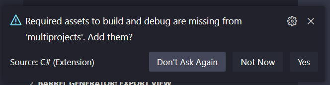
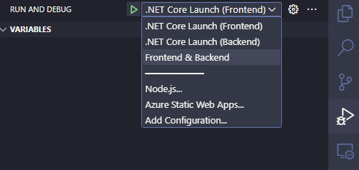

---
{
title: "Debugging Multiple .NET Projects in VS Code",
published: "2023-03-23T09:51:43Z",
tags: ["vscode", "dotnet", "webdev"],
description: "It is quite common, especially in medium/large projects, to have to run multiple projects in debug...",
originalLink: "https://https://dev.to/playfulprogramming/debugging-multiple-net-projects-in-vs-code-28kn",
coverImg: "cover-image.png",
socialImg: "social-image.png"
}
---

It is quite common, especially in medium/large projects, to have to run multiple projects in debug mode at the same time.
The simplest example is a frontend and its services within the same .NET solution.

But is it so difficult to launch multiple .NET projects simultaneously from Visual Studio Code?

## First Steps

Create a folder in your local drive and then create two projects in your favorite terminal with the following instructions:

```
dotnet new webapp --name "Frontend"
```

```
dotnet new webapi --name "Backend"
```

Now, create a solution and add the two projects to a it with the following instructions:

```
dotnet new sln --name AwesomeSolution
dotnet sln add Frontend
dotnet sln add Backend
```

Now we have at least two projects to launch.

## Launch Configurations

Open Visual Studio Code directly from the command line with the instruction:

```
code.
```

This instruction open Visual Studio Code in the current folder.
After a few seconds the editor understands that you are in a .NET project and asks you to enter some files to debug or launch the application.
Accept it and let it create some necessary files.



Now you can open the file "**tasks.json**" and you can replace the task called "**build**" with the following code:

```json
        {
            "label": "buildbackend",
            "command": "dotnet",
            "type": "process",
            "args": [
                "build",
                "${workspaceFolder}/Backend/Backend.csproj",
                "/property:GenerateFullPaths=true",
                "/consoleloggerparameters:NoSummary"
            ],
            "problemMatcher": "$msCompile"
        },
        {
            "label": "buildfrontend",
            "command": "dotnet",
            "type": "process",
            "args": [
                "build",
                "${workspaceFolder}/Frontend/Frontend.csproj",
                "/property:GenerateFullPaths=true",
                "/consoleloggerparameters:NoSummary"
            ],
            "problemMatcher": "$msCompile"
        },
```

The first task is related to the Backend application and the second one to the Frontend.
As you can see, they build the project in the right folder and project. Nothing complicated but VS Code, by default, creates only one task even in your project you have more than one.

## Compounds Configuration

Now that you have the two tasks related to the two individual projects, you can replace the current contents of the "**launch.json**" file with the following json.
I'm going to explain it shortly.

```json
{
  "version": "0.2.0",
  "configurations": [
    {
      "name": ".NET Core Launch (Frontend)",
      "type": "coreclr",
      "request": "launch",
      "preLaunchTask": "buildfrontend",
      "program": "${workspaceFolder}/Frontend/bin/Debug/net7.0/Frontend.dll",
      "args": [],
      "cwd": "${workspaceFolder}/Frontend",
      "stopAtEntry": false,
      "serverReadyAction": {
        "action": "openExternally",
        "pattern": "\\bNow listening on:\\s+(https?://\\S+)"
      },
      "env": {
        "ASPNETCORE_ENVIRONMENT": "Development"
      },
      "sourceFileMap": {
        "/Views": "${workspaceFolder}/Views"
      }
    },
    {
      "name": ".NET Core Launch (Backend)",
      "type": "coreclr",
      "request": "launch",
      "preLaunchTask": "buildbackend",
      "program": "${workspaceFolder}/Backend/bin/Debug/net7.0/Backend.dll",
      "args": [],
      "cwd": "${workspaceFolder}/Backend",
      "stopAtEntry": false,
      "serverReadyAction": {
        "action": "openExternally",
        "pattern": "\\bNow listening on:\\s+(https?://\\S+)"
      },
      "env": {
        "ASPNETCORE_ENVIRONMENT": "Development"
      },
      "sourceFileMap": {
        "/Views": "${workspaceFolder}/Views"
      }
    }
  ]
}

```

As you can see, we created two different configuration with two different name to launch a project one by one.
In the "prelaunchtask" property, it's important to use the same name used in the previous tasks file.

But we are not done yet.
We need to do the last step to launch all the projects at the same time.

After the configurations array, add a "compounds" section.
Specify a name that you want and in the configurations it's important to specify the same name as we used in the configurations section.

```json
  "compounds": [
    {
      "name": "Frontend & Backend",
      "configurations": [
        ".NET Core Launch (Frontend)",
        ".NET Core Launch (Backend)"
      ],
      "stopAll": true
    }
  ]
```

This is the result in the "Run & Debug" panel.



Press "F5" or on the Play button to launch the new launch configuration with multiple projects.

## Conclusion

As you can see it's very easy to configure Visual Studio Code to launch multiple project.
Now that you have the basic setup, you can use this approach all the time, even referring to this easy example with only two projects.
You'll just have to add all your projects that you want to launch, but with the same configuration workflow we've used now.

---

Are you interested in learning GitHub but don't know where to start? Try my course on LinkedIn Learning: [Learning GitHub](https://bit.ly/learninggithub).


---

Thanks for reading this post, I hope you found it interesting!

Feel free to follow me to get notified when new articles are out 🙂

<!-- ::user id="kasuken" -->
