---
{
title: "Experts Live 2023 - My Recap",
published: "2023-09-29T20:49:32Z",
tags: ["event", "powershell", "azure"],
description: "I’m excited to share with you my experience at Experts Live Europe 2023, a premier conference for IT...",
originalLink: "https://dev.to/this-is-learning/experts-live-2023-my-recap-4ack",
coverImg: "cover-image.png",
socialImg: "social-image.png"
}
---

I’m excited to share with you my experience at **Experts Live Europe 2023**, a premier conference for IT professionals and Microsoft enthusiasts. I had the honor of delivering two sessions and participating in one panel discussion, as well as being part of a surprise closing event.

I arrived in Prague on Sunday, the day before the pre-conference day and in the afternoon I met some new friends from the communities who I never met in person.

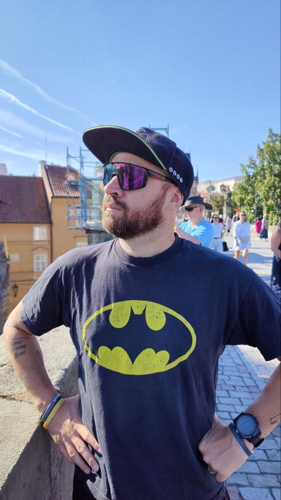

We hanged around in the city for a few hours and then I came back to the hotel for finalizing my sessions.

## Day One

The first day of the conference was dedicated to a few workshops delivered by some very known speakers and Microsoft employees.

These were the workshops:

- **Microsoft Azure Essentials - Migrating Your Workloads to the Cloud**
- **Employee Experience with Microsoft Viva & Microsoft Teams**
- **Game ON! Microsoft Security hands-on workshop**

I didn’t participate to the workshops but honestly I was surprised about how many people were there! It looked like a normal day of the event. A lot of people joined the event in this pre-conference day and I was happy about that.
It means that a lot of people are interested on staying up-to-date with the latest technologies and latest trends on the market.

In the meantime I worked from the speakers room and time to time I started to meet and greet the other speakers that started to arrive to the venue after the travel and a short break in the hotel room.

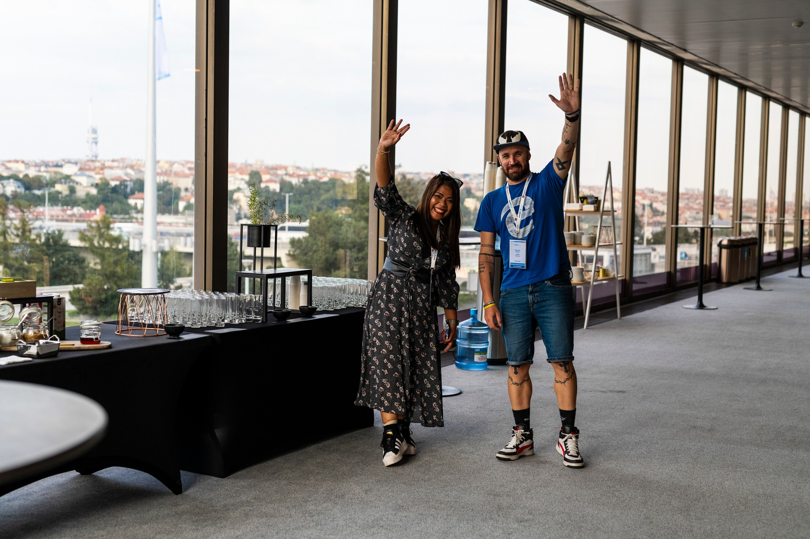

After dinner I went to my hotel room to a short refresh of my session about Git and GitFlow for PowerShell. I never delivered this session at an event (but only at internal event in the company) and I was so nervous about the results.

## Day Two

I went to the venue very early because I would like to meet attendees and other speakers just before the keynote.
A lot of speakers were in the speaker rooms as well.

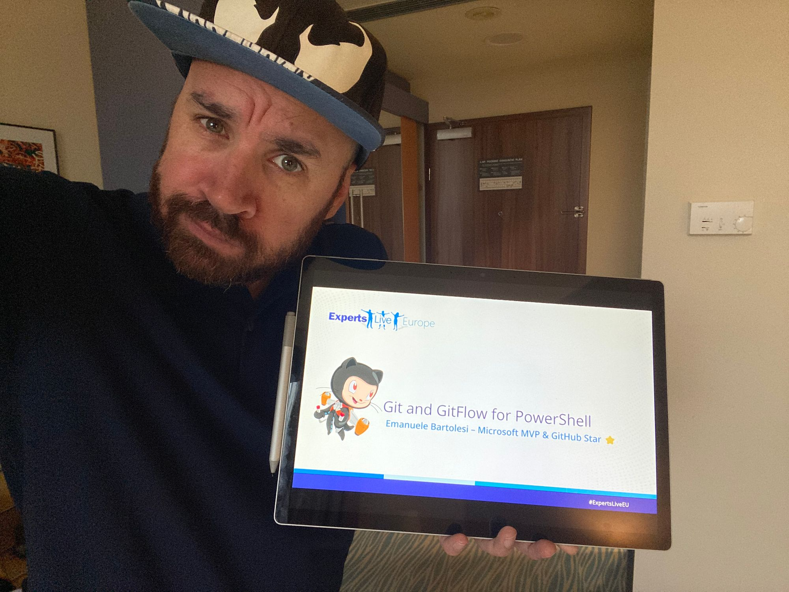

At 09:00 o’clock the event started with a great keynote introduction delivered by **Isidora** and **Holly**. It was really fun and at the same time they told a lot of useful about the venue and the event in general.

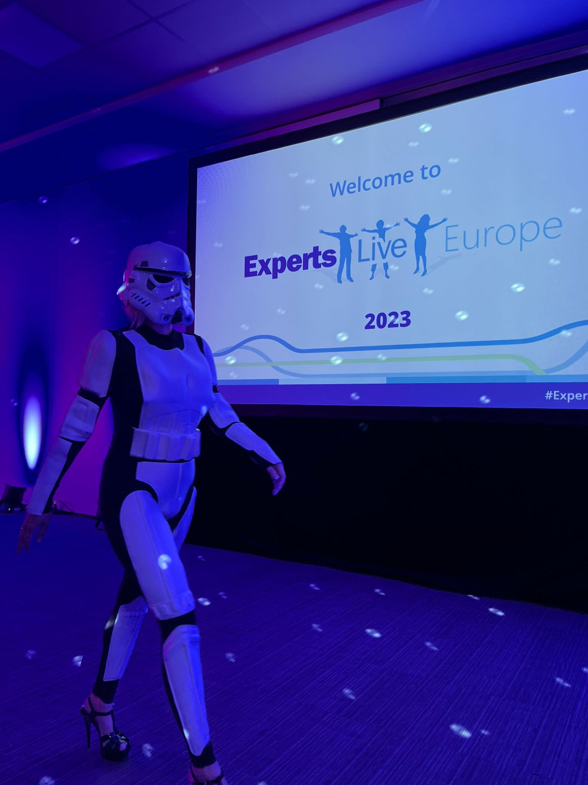

After them, the real star, **Troy Hunt**, started with his keynote about **“Lessons From Billions of Breached Records”.**
One the best keynote that I saw in my life at event. It was a mix about fun stories, lesson learned and some technical tips and lessons from the fields.
I didn’t have any doubts about the quality but the keynotes, in my opinions, are one of the most difficult sessions to prepare for an event.

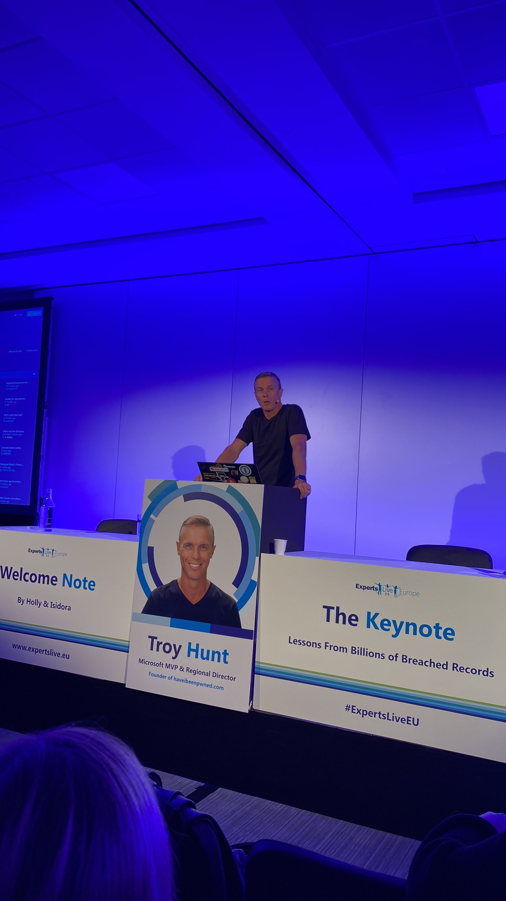

After the 30 minutes coffee break, it was my turn!
My first session of the day, it was my new one: **GIT and Gitflow for PowerShell.**
I like to deliver one the first sessions of the day but at the same time the attendees are fresh and ready to assimilate content, so, they have expectations from them.
This is the abstract of my session:

“This session is perfect for you if you've been using PowerShell and have been curious about GIT, but don't know where to begin. You're not a developer, just someone who writes occasional scripts. But, trust me, you need to start using GIT and Gitflow during your daily activities.

In this session, I will show you the fundamental concepts of GIT in a hands-on manner, so bring your laptop along. By the end of the session, you'll be able to effectively utilize GIT for your PowerShell scripts, for backup and version control purposes.”

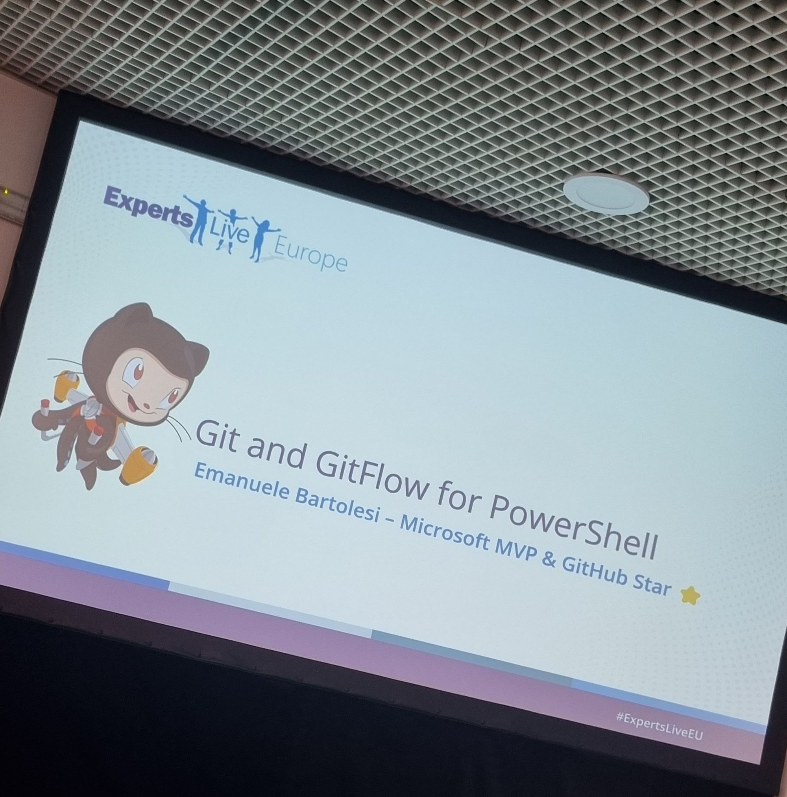

Before I started, I asked to the attendees (more than 100+) if someone have some experience about Git and GitFlow. For the first topics someone raised their hands, for GitFlow, actually no one.

I decided to make a short introduction to common git commands to understand better GitFlow in the second part of the sessions.

I started the talk, showing a real folder shared by my colleagues without using Git or GitFlow and people appreciated this story because it’s a very common approach in the people who work with PowerShell or scripting languages in general.

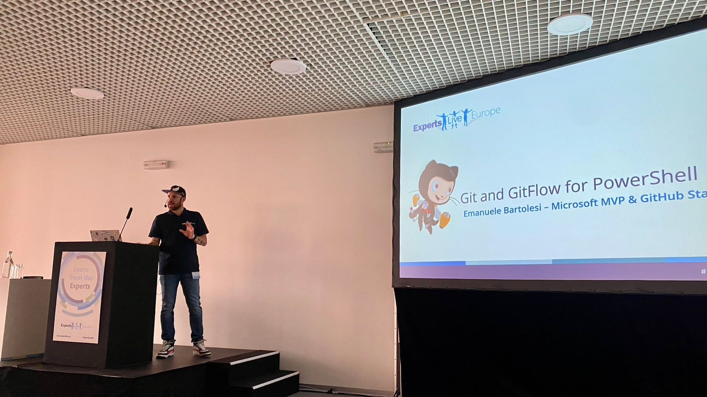

During the sessions I saw some MVPs and other speakers in the crowd and it made me happy and more nervous at the same time. 🙂

At the end of the sessions I received a lot of questions about the tool I used and I am using in my day by day activities. The tools are **Oh My Posh!** and **GitKraken**.

After the session I tried to relax me and empty my head listening some music with headphones and walking around in the venue.

During this activity I received a lot of compliments about my sessions, for both contents and how I entertained them with some humors and in general with the flow.

I was happy about that, because I worked a lot on my public speaking skills in the last few years.

In the afternoon I rechecked my demos for my second demo of the day.
I just delivered this session two or three time, one of them at Experts Live Netherlands a few months ago.
The session is: ****Automate your tenant with PowerShell and Azure Functions.****
This is the abstract of the session:
”This talk will introduce you to the capabilities of Azure PowerShell Function Apps for Azure administration, interactions with Microsoft 365 and much more. We'll explore the possibilities of these apps through real-world examples, and then guide you through the process of creating and deploying your own Azure Function Apps using PowerShell. With hands-on demonstrations, you'll be equipped to utilize Azure Function Apps to their full potential.”

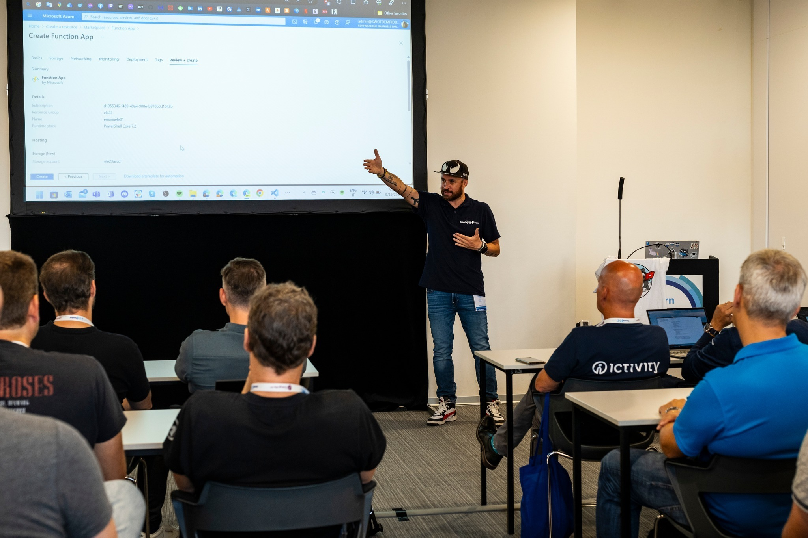

I delivered the session in a different room from the morning. It was smallest but I had people standing up at the end of the room!
I had the same experience at Experts Live Netherland.
Not sure about how many people were in the room, but I think 100+.

After half session I started to feel me a little bit tired but I tried to stay focused until the end of the session and I think no one figured out this feeling. 🙂

Delivering session is like training for a marathon. If you are used to run even if you are tired or something goes wrong, you can use your experience to overcome that moments.

After the session I received some feedbacks by the most important one is: “I use to work with Azure Functions with PowerShell and Graph API, but I learned something new in your session.”
It means that I talked about my experience during the session and this brings always some added value to the contents and take aways for the attendees.

Day two means **Party Time**!
After all sessions and a short break to give time to people to recover a little bit, get a quick shower and change the clothes, the party started in the Expo Area.
We had a super awesome dinner all together in the biggest room and we had some fun with a girl power rockband!

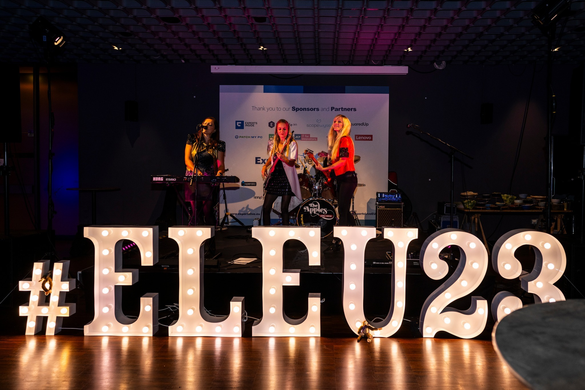

At the same time people had fun with a photo booth with a lot of geek gadgets and hanging around with speakers and attendees.
It was great to spend time all together. This is the real spirit of these kind of events.
It recharges the motivation to keep you focused to staying up to date, participating and deliver contents for the next events and conferences.

## Day Three

The last day of the conference but with a lot of great content in the sessions!
The last day started at 09:00 like the first one but, of course, without the keynote.

After lunch I had my last activity for this conference: a panel about career in tech with other awesome panelists.
The host was Holly Lehman. She worked at Microsoft for long time and she knows very well the topic.
The other panelists were:

- **Kasia Nowicka**
- **Ela Moscicka**
- **Samuel Erskine**
- **Femke Cornelissen**

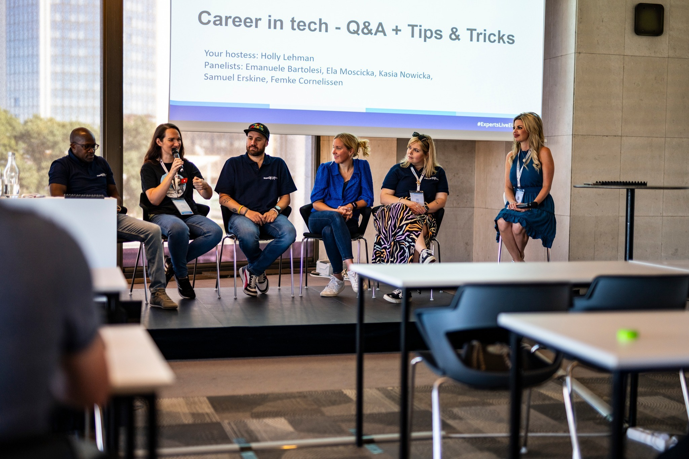

Every one have different experiences, someone long, someone short but with different point of views. For instance, Kasia and Ela changed the path for their careers with different areas and roles.
There are a good number of people interested in this panel and we received a lot of questions from the attendees, after few questions from our host.
They asked something about Impostor Syndrome, how to manage the work life balance with a family, how to manage the knowledge base in the company and other similar questions.

For the first time I talked about my Asperger Syndrome in public. It was a surprised also for me because it was not planned but for answering to a question, it came out from my mouth without thinking about it.
I think now I processed this “diagnosis” very well, even if sometimes I think about it as a kind of “problem” that I would like to know about it when I was young and not almost at 40 years old.
I will write another blog post in the future about this topic.

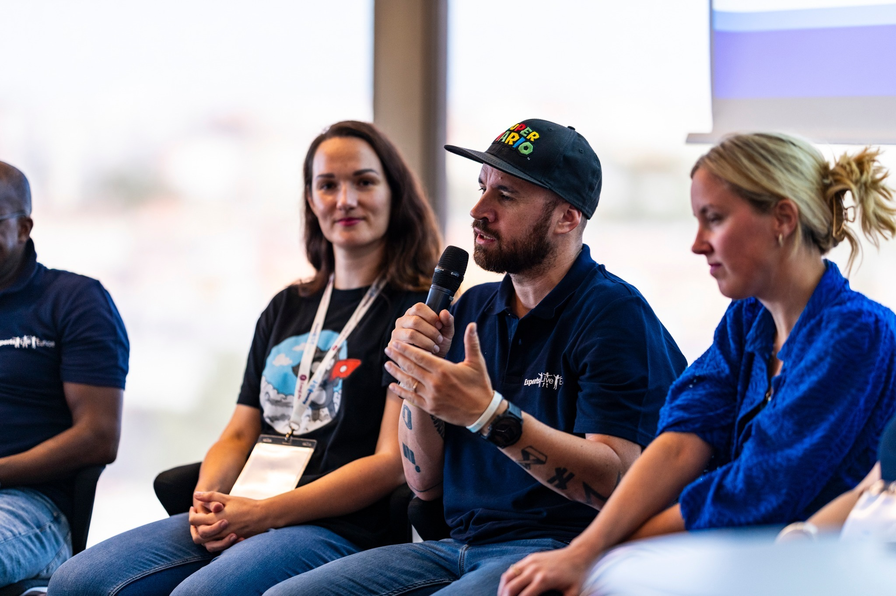

Unfortunately the event was almost at the end in the afternoon, but there was one of the best important activity for a conference: the raffle! 😀

After a short introduction and “thanks” by Isidora on stage, all the attendees and the speaker said thank you to her for the awesome organization of the event and in general for her kindness with everyone (remember: **behind speakers, organizers and sponsors there are people**), the raffle began and some attendees received a lot of gift from the sponsors (most of them “inspired by Star Wars”). After that the event has done, but…

## Surprise, Surprise, Surprise

In the previous weeks/months Isidora and me (Isidora more than me) started to prepare a little surprise for everyone at the event.
Since a while I started to play the guitar again at home, after 20 years. I share very often my progress and some song to my Instagram stories and other socials.

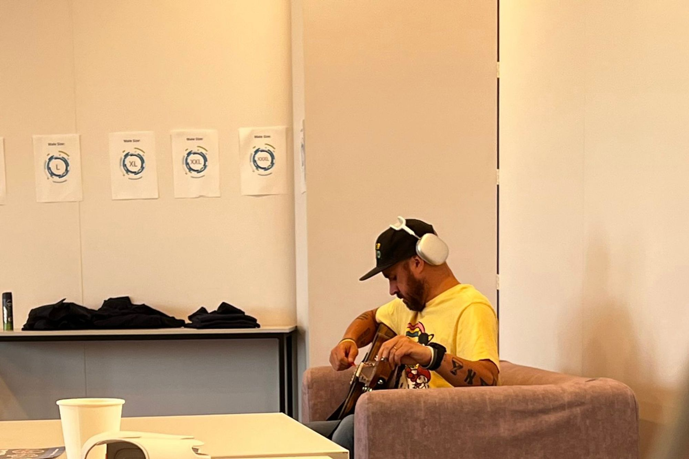

The first idea would be to sing a song during the party, taking the stage together with the rock band.
Then Isidora changed her mind and asked me to play something on the last night, during the final aperitif.
I accepted. 🙂

I prepared some songs when I was at home but didn't know exactly what to sing at the event.
Then I decided.

- Knocking on Heaven's door by Bob Dylan
- I don't know a thing about love by White Buffalo
- In the name of love by U2 (acoustic version)

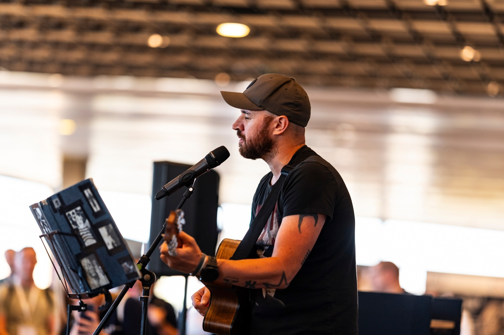

Before I was called on stage I was very nervous, very much so I would say.
Even though I'm quite used to getting on a stage to speak, which has become a bit of a comfort zone of mine, I haven't sung in front of so many people in a very long time.

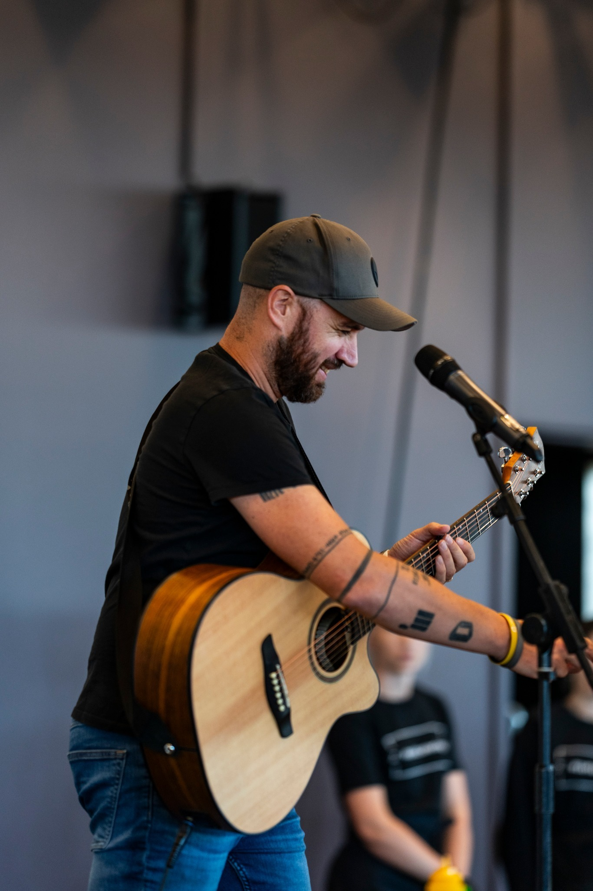

When I started with the first song, I was very nervous and I think people heard it in my voice as soon as I sang the first notes.

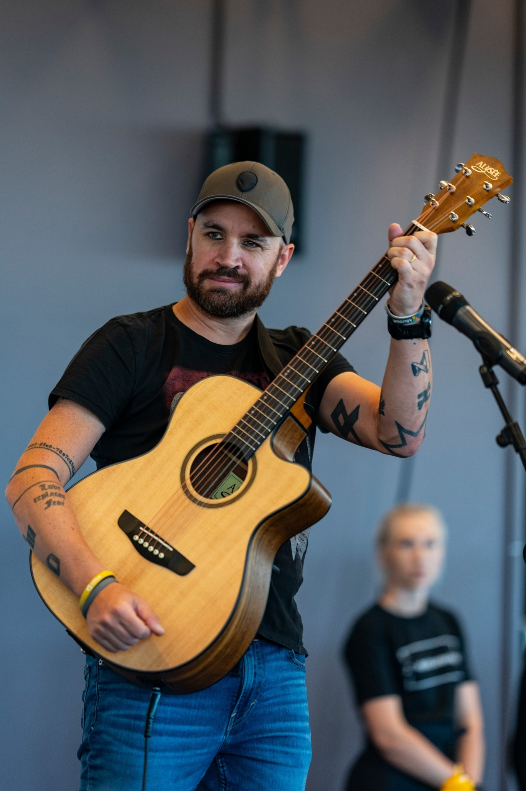

After the three song I was quite happy. I did a big error at the end but it should happen. I am not a professional singer or guitar player.
I had mixed feelings after the show.
On the one hand, I wouldn't have wanted to do it again; on the other hand, I'm looking forward to another chance to sing in front of more than 250 people! 🤘

## Take aways from the event

As the event came to an end, I felt a sense of gratitude and accomplishment. I had the opportunity to meet other speakers who have been my friends for a while, and share our insights and challenges in our fields. We learned from each other and supported each other, and I am looking forward to collaborating with them in the future. I also enjoyed networking with the attendees, who showed great interest and enthusiasm for my presentation. I received many positive feedbacks and questions, and I was happy to engage with them and hear their perspectives. I believe that sharing my experiences and knowledge on the stage is not only beneficial for myself, but also for the audience and the community. It helps me to reflect on my work, improve my communication skills, and inspire others to pursue their passions.

I can say, however, that it was perhaps **the best event I have ever attended as a speaker**, and I hope it is the same for those who attended as attendees.

Until next time, happy coding! 😊

---

Some additional info about Experts Live Europe

Website: https://www.expertslive.eu/
Official Experts Live Europe Twitter Account: https://twitter.com/ExpertsLiveEU
Facebook Page: https://www.facebook.com/ExpertsLiveEurope/
In the Facebook page you can find all the photos taken by Petra Katanic, one of the best photographer that I know.

---

If you enjoyed this blog post and want to learn more about C# development, you might be interested in subscribing to my bi-weekly newsletter called Dev Dispatch. By subscribing, you will get access to exclusive content, tips, and tricks, as well as updates on the latest news and trends in the development world. You will also be able to interact with me, and share your feedback and suggestions. To subscribe, simply navigate to https://buttondown.email/kasuken?tag=devto, enter your email address and click on the Subscribe button. You can unsubscribe at any time. Thank you for your support!
