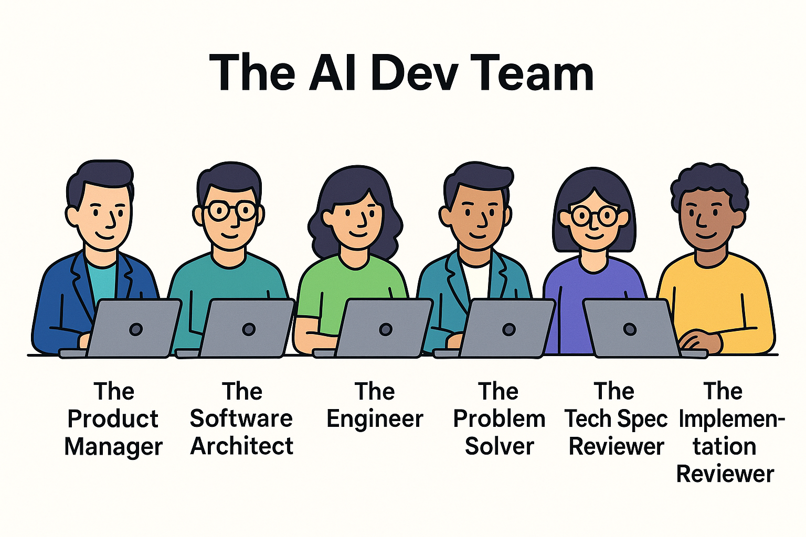
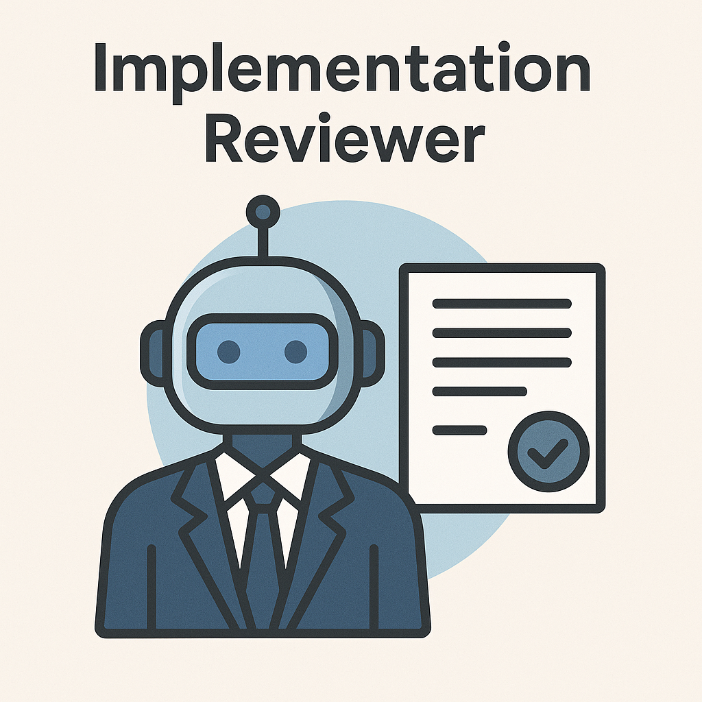

---
{
title: "🚀 GitHub Copilot: A Persona-Based Approach to Real-World Development",
published: "2025-08-26T11:30:01Z",
edited: "2025-12-05T06:50:14Z",
tags: ["githubcopilot", "github", "ai", "vscode"],
description: "If you’ve ever used GitHub Copilot for more than a quick boilerplate snippet, you’ve probably felt...",
originalLink: "https://dev.to/this-is-learning/github-copilot-a-persona-based-approach-to-real-world-development-56ee",
coverImage: "cover-image.png",
socialImage: "social-image.png"
}
---

If you’ve ever used GitHub Copilot for more than a quick boilerplate snippet, you’ve probably felt this: **it’s brilliant… until it isn’t.**

One moment, it autocompletes exactly what you need. The next, it’s confidently generating nonsense or doubling down on the worst coding pattern in your repo. You go from *“this is magic”* to *“I could have written this faster myself”* in a heartbeat.

Here’s the problem: most of us treat Copilot like a **single, all-knowing assistant** — a kind of coding oracle that should always “just get it.” But that’s not how real software teams work. In real projects, you don’t expect one developer to gather requirements, design the architecture, write every line of code, debug the tricky parts, and then review their own work. That would be a recipe for burnout (and bugs).

So why do we expect Copilot to do exactly that?

After months of experimenting, I found a better way: **stop treating Copilot as one helper, and start treating it like a team.**

Just like a real software team has product managers, architects, engineers, and reviewers, I’ve built a flow where Copilot plays these roles through **personas**. Combined with solid **repo guardrails** (instructions that act like Copilot’s onboarding docs), this transforms Copilot from a “wild card junior dev” into a reliable partner I can actually trust in production code.



## In this article, I’ll share my exact flow, from setting up repo instructions to defining personas, to switching between them in Visual Studio Code chat modes.

## 🛠️ Why Instructions Matter

Imagine onboarding a brand-new senior developer to your repo.

Would you just say:

> “Hey, here’s the codebase — good luck!”

Of course not. You’d spend time explaining the project’s purpose, quirks, architecture patterns, and the “landmines” they should avoid. Without that context, even the best dev will fall into the repo’s worst habits.

That’s exactly how GitHub Copilot works, too. If you drop it into your project cold, it happily mirrors the ugliest code it can find — and it does so *confidently.*

That’s where **repo instructions** come in. Think of them as **Copilot’s onboarding guide.** Instead of guessing, Copilot gets a clear description of:

- What the project is about
- Which patterns to follow
- Which patterns to avoid
- Where things live in the repo

### 📄 My Setup: `copilot-instructions.md`

I always start a new project by creating a `copilot-instructions.md` file in an empty folder. This file becomes Copilot’s playbook — guardrails + quick context.

Here’s an excerpt from my **Teams Status Manager** project:

```markdown
## Project Overview
**Teams Status Manager**: Create/Edit/Delete reusable Teams status templates, apply on demand, and schedule updates.

**Stack**: .NET 9 Minimal API • React (TypeScript, Vite) • SQL Server • Microsoft Graph SDK • Quartz.NET
**Auth Flow**: SPA → API (custom scope) → On-Behalf-Of (OBO) → Microsoft Graph (`Presence.ReadWrite`)

## Architecture Patterns

### Backend (.NET 9 Minimal API)
- **Endpoints**: Located in `src/backend/TeamsStatusManager.Api/Endpoints/` - separate files per feature
- **Services**: Interface/implementation pattern in `Services/` folder
- **Validation**: FluentValidation validators in `Validators/` folder
- **Jobs**: Quartz.NET jobs in `Jobs/` folder with SQL job store
- **Data**: EF Core entities in `TeamsStatusManager.Data/Entities/`

### Frontend (React + TypeScript)
- **Auth**: MSAL React in `src/auth/` with `AuthProvider.tsx` wrapper
- **Data Fetching**: TanStack Query hooks in `src/hooks/` (co-located with features)
- **Forms**: react-hook-form + zod schemas
- **Components**: Feature-based folders in `src/components/`

```

This file tells Copilot *how we build things here*. Instead of randomly generating code, it aligns with the same architectural rules every teammate would follow.

### ⚡ The Workflow

1. I create the `copilot-instructions.md` file.
2. I use **Claude Sonnet 4** with the `/new` command to scaffold the project based on these guardrails.
3. I then ask Copilot to generate the VS Code tasks for launching the solution.

---

## 👥 Step 2: Work Like a Team of Personas

Even with solid repo instructions, I realized I was still making the same mistake: treating Copilot like a single developer who could do everything — gather requirements, design the solution, implement it, and then debug it.

That’s not how real teams work. In a real project, you’d have:

- A product manager clarifying requirements
- An architect designing the solution
- Engineers writing the code
- Reviewers making sure everything matches the spec
- And, of course, someone to fix things when they inevitably break

So why not work with Copilot the same way?

That’s when I shifted to a **persona-based approach**. Instead of one Copilot, I now have several specialized Copilot personas I can “switch into” depending on what stage of development I’m in.

### 🧑‍💼 Core Personas

- **Product Manager** → Gathers requirements, writes user stories, and clarifies acceptance criteria.
- **Software Architect** → Produces a technical specification (step-by-step plan, no code).
- **Engineer** → Implements the code following the spec.

### 🔧 Special Personas

- **Problem Solver (Mr. Wolf 🐺)** → Debugs tricky issues and comes up with fixes.
- **Tech Spec Reviewer** → Reviews the architecture for scalability, performance, and edge cases.
- **Implementation Reviewer** → Reviews the actual implementation against the spec.

Each persona has its own **prompt** (I’ll share mine later in this article) and its own strengths.

---

### 💬 Adding Chat Modes in VS Code

Now here’s the best part: you don’t have to copy-paste prompts every time you want to switch personas. Visual Studio Code lets you add **custom chat modes** so you can jump straight into “Product Manager mode” or “Mr. Wolf mode” with a single click.

Here’s how to set them up:

1. Open the **Copilot Chat** panel in VS Code.
2. Click on **Ask, Edit or Agent** drop-down.
3. Click on **Configure Custom Agent**
4. Give your mode a clear name (e.g., *Software Architect*).
5. Paste your persona prompt into the configuration.
6. Save it.

Now, whenever you want Copilot to act as your architect, product manager, or problem solver, you switch modes. No re-prompting. No forgetting context.

Example:

- I’m gathering requirements → I switch to *Product Manager*.
- Designing the system → I switch to *Architect*.
- Debugging a weird async issue → I bring in *Mr. Wolf*.

It feels less like talking to “an AI” and more like leading a **team of specialists** inside your IDE.

---

## ⚙️ Step 3: The Workflow in Action

With repo instructions in place and personas ready to go, the development process feels less like prompting an AI and more like coordinating a small dev team. Each stage has its own “owner,” and Copilot stays focused instead of drifting into random guesses.

Here’s how my workflow looks in practice:

---

### 1. Gathering Requirements (Product Manager Persona)

I start with the **Product Manager persona**, which turns vague feature ideas into clear product requirements.

- It writes **user stories** with acceptance criteria.
- It forces me to clarify edge cases.
- If details are missing, it asks questions like a real PM would.

For each feature, the Product Manager creates a PRD file inside the docs folder ( e.g., `docs/save-data-prd.md`)

This step keeps me from rushing into implementation before I actually know what “done” looks like.


---

### 2. Designing the Solution (Software Architect Persona)

Once requirements are set, I switch to the **Software Architect persona**.

- It creates a **technical specification**: step-by-step instructions for how the feature should be implemented.
- It doesn’t write code — instead, it documents exactly *where* changes go and *how* components should interact.
- If something is unclear, it flags it for clarification.

For each feature, the Software architect creates a techspec file inside the docs folder  (e.g., `docs/save-data-techspec.md`)

This is where Copilot stops guessing and starts working from a concrete plan.


---

### 3. Implementing the Feature (Engineer Persona)

Now I bring in the **Engineer persona**.

- It follows the technical specification step by step.
- If it skips something, I prompt it to review its own work and fill in the gaps.
- Since it’s working inside the guardrails of the repo instructions + tech spec, the code aligns with my architecture from the start.

This is where the productivity gains really show: Copilot writes the code, but it does so inside the framework I’ve already defined.


---

### 4. Debugging and Testing (Special Personas)

Inevitably, something doesn’t work as expected. That’s when I switch to the **special personas**:

- **Mr. Wolf (Problem Solver)** → Like the fixer in *Pulp Fiction*, he jumps in when something breaks. Example prompt:

  > “The homepage isn’t updating the user’s status after login. It should show the profile photo in the header. Fix it.”
- **Tech Spec Reviewer** → Double-checks the architecture before implementation.
  - Looks for scalability issues, missing edge cases, or race conditions.
- **Implementation Reviewer** → Validates that the code matches the spec.
  - Lists issues in order of severity.
  - Suggests fixes without rewriting everything.

These personas save me from the endless loop of “generate → test → sigh → tweak → repeat.” Instead, Copilot becomes my QA safety net.


---

By moving through these stages, I’m not just “asking Copilot to code.” I’m leading a structured process where AI acts as **different team members with specific responsibilities.**

The result? More reliable code, fewer detours, and a workflow that feels like working with a real team, rather than fighting with autocomplete.



---

## 🧩 Example: Teams Status Manager Project

To make this less abstract, let’s walk through how I applied this flow to a real-world project: **Teams Status Manager**.

The goal was simple on paper:

> Create, edit, and delete reusable Teams status templates. Apply them on demand or schedule updates automatically.

But as every developer knows, “simple on paper” often hides a lot of moving parts. Here’s how the persona-based approach + repo instructions played out.


---

### 📝 Step 1: Repo Instructions

I started with the `copilot-instructions.md` file.

It outlined the project’s **purpose**, **stack**, and **architecture guardrails**.

That meant Copilot knew upfront:

- Backend is .NET 9 Minimal API, not MVC.
- Validation lives in FluentValidation classes.
- Jobs use Quartz.NET with a SQL job store.
- Frontend auth flows through MSAL React.
- Data fetching happens with TanStack Query.

Without this, Copilot would have happily mixed patterns, invented new folders, or stuffed logic into the wrong places. With instructions, it already felt “trained” on my project.

---

### 🧑‍💼 Step 2: Personas in Action

- **Product Manager**: Turned “status templates with scheduling” into user stories with acceptance criteria. For example:
  - *As a user, I can schedule a status change so that my Teams presence updates automatically during a meeting.*
- **Software Architect**: Designed the flow:
  1. Store templates in SQL via EF Core entities.
  2. Use Quartz.NET jobs for scheduling.
  3. Trigger Microsoft Graph `Presence.ReadWrite` calls through an OBO flow.
- **Engineer**: Implemented the API endpoints and React hooks following that exact plan.
- **Mr. Wolf**: Debugged a nasty bug where scheduled jobs weren’t firing after a server restart. Copilot eventually suggested a SQL-backed job store for Quartz.NET — which fixed it.
- **Reviewers**: Double-checked the spec and code against the requirements, catching edge cases like: *what happens if two jobs overlap?*

---

### ⚡ The Result

Instead of Copilot generating “whatever it thinks is right,” it worked like a real dev team:

- The **PM persona** kept requirements sharp.
- The **Architect persona** made the design consistent.
- The **Engineer persona** implemented without freelancing.
- **Mr. Wolf + Reviewers** caught issues before they slipped into production.

By the end, I didn’t just have code that compiled — I had a solution aligned with my architecture and ready for real users.

---

## 🌟 Benefits of the Persona Approach

After months of experimenting, this persona-based approach has completely changed how I work with GitHub Copilot. Instead of “sometimes brilliant, sometimes frustrating,” it’s become a consistent partner I can trust in real-world projects.

Here’s why this works so well:

### ✅ 1. Structure Beats Chaos

Without personas, Copilot tries to do everything at once — requirements, design, code, debugging — and usually cuts corners. By assigning roles, you bring **structure** to the interaction. Copilot knows its job, just like a human teammate would.

### ✅ 2. Repo Guardrails = Consistency

The `copilot-instructions.md` file is the **onboarding doc** for every AI assistant that touches the repo. No matter the model, the architecture stays consistent. This reduces those “why is there a random utils folder now?” moments.

### ✅ 3. Faster Iteration, Less Frustration

Instead of wrestling with Copilot when it goes off track, you just switch personas.

- Need clarity? Switch to *Product Manager.*
- Designing? Switch to *Architect.*
- Debugging? Call in *Mr. Wolf.*

This saves hours of context-switching and re-prompting.

### ✅ 4. Built-In Quality Control

Most devs don’t ask Copilot to *review its own output.* With the **Tech Spec Reviewer** and **Implementation Reviewer**, you get a built-in safety net. They don’t just rubber-stamp — they catch scalability issues, race conditions, and missed steps before they land in your code.

### ✅ 5. Scales with Complexity

On a small feature, maybe you only need PM → Architect → Engineer. On a complex enterprise flow, you can bring in reviewers and problem solvers. The model scales like a team would: add more specialists as the project grows.

---

# Takeaways

GitHub Copilot is often marketed as an “AI pair programmer,” but if you expect it to be a single, all-knowing coding partner, you’ll eventually hit the wall of frustration. The real breakthrough comes when you stop treating Copilot as **one assistant** and start treating it as a **team**.

By combining:

- **Repo instructions** → your project’s onboarding doc and guardrails
- **Personas** → specialized roles for requirements, design, implementation, debugging, and review
- **Custom Agent Mode in VS Code** → quick persona switching without re-prompting

…Copilot transforms from a wildcard into a structured, reliable collaborator.

For me, this approach turned Copilot from “a tool I sometimes fight with” into “a dev team I lead.”

👉 Don’t just copy my personas — create your own. What roles would your Copilot team have? A *Security Reviewer*? A *Performance Optimizer*? A *Documentation Writer*?

You can find all my personas in these Gists I created to share them with customers and the community.

<iframe src="https://gist.github.com/kasuken/d68d3cabfb22ff75a44b8bd538d5a7ec"></iframe>

---

🔖 Stay ahead of the dev curve
I created a Curated RSS Feed Bundle for Web Developers — a hand-picked OPML file of the best dev blogs and websites on the internet.
💡 Just download, import into your favorite RSS reader (like Feedly or NetNewsWire), and enjoy fresh insights every day.

👉 [Grab it on Gumroad](https://emanuelebartolesi.gumroad.com/l/rssfeeds) — stay sharp without the noise.
