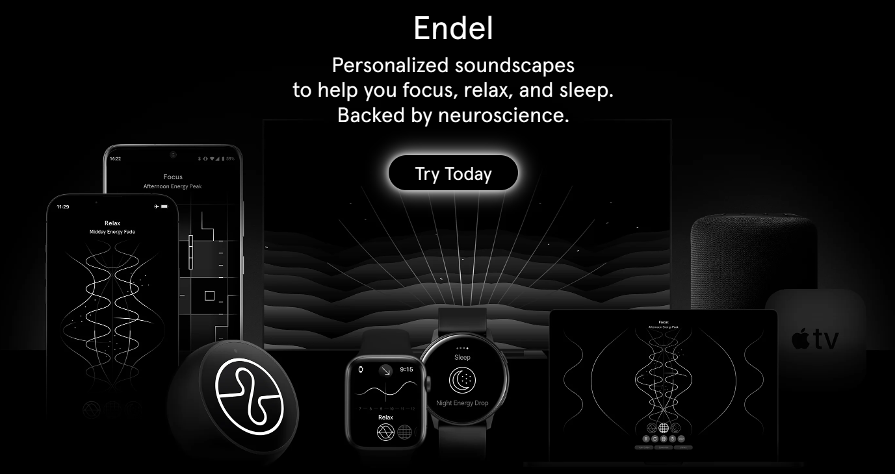

---
{
title: "How Endel App Boosted My Productivity as a Developer and CTO",
published: "2024-01-27T09:00:56Z",
tags: ["productivity", "devlive"],
description: "As a developer and CTO, I have to juggle multiple tasks and projects every day. I need to write code,...",
originalLink: "https://dev.to/this-is-learning/how-endel-app-boosted-my-productivity-as-a-developer-and-cto-5b7n",
coverImage: "cover-image.png",
socialImage: "social-image.png"
}
---

As a developer and CTO, I have to juggle multiple tasks and projects every day. I need to write code, review code, manage my team, communicate with clients, and keep up with the latest technologies. It can be overwhelming and stressful at times, especially when deadlines are looming and distractions are everywhere.

That's why I decided to try Endel app for one month and see if it could help me focus, relax, and sleep better. Endel is an app that creates personalized soundscapes based on your inputs, such as time of day, weather, heart rate, and location. The soundscapes are designed to align with your circadian rhythm and support your mental state. Endel claims to be backed by neuroscience and proven to improve focus and lower stress.

I was curious and skeptical at the same time, so I downloaded the app and gave it a shot. Here are the results of my experiment and how Endel app boosted my productivity as a developer and CTO.

## Focus Mode

The first mode I tried was Focus mode, which is supposed to help you concentrate for longer and block out distractions. I used it whenever I had to write code, debug, or solve a complex problem. I chose the adaptive option, which adjusts the soundscape according to my environment and biometrics.

I have to say, I was impressed by how well it worked. The sounds were soothing and immersive, but not distracting or annoying. They helped me tune out the noise around me and get into the flow state. I felt more alert and attentive, and I was able to finish my tasks faster and with fewer errors. I also noticed that I didn't feel as tired or burned out after a long coding session.

According to Endel, Focus mode increases focus by 7x compared to playlists. I don't know if that's true, but I definitely felt a difference in my performance and productivity.

## Relax Mode

The second mode I tried was Relax mode, which is supposed to calm your mind and create feelings of comfort and safety. I used it whenever I felt stressed, anxious, or overwhelmed by my workload. I also used it during breaks, meditation, or yoga sessions. I chose the adaptive option again, which changed the soundscape according to my mood and situation.

I found Relax mode to be very effective in reducing my stress levels and improving my mood. The sounds were gentle and soothing, and they helped me relax my body and mind. I felt more peaceful and balanced, and I was able to cope with challenges and setbacks better. I also felt more creative and inspired, and I came up with new ideas and solutions.

According to Endel, Relax mode decreases stress by 28% with regular use. I can't verify that, but I can say that I felt more calm and happy after using it.

## Sleep Mode

The third mode I tried was Sleep mode, which is supposed to soothe you into a deep sleep with soft, gentle sounds. I used it every night before going to bed, and sometimes during naps. I chose the adaptive option once more, which matched the soundscape to my sleep cycle and environment.

I was amazed by how well Sleep mode helped me fall asleep and stay asleep. The sounds were relaxing and comforting, and they helped me drift off to dreamland. I woke up feeling refreshed and energized, and I had no trouble getting out of bed. I also slept more soundly and had fewer interruptions.

According to Endel, Sleep mode improves sleep quality and duration. I don't have any data to back that up, but I can attest that I slept better and felt more rested after using it.

## Conclusion

After using Endel app for one month, I can confidently say that it boosted my productivity as a developer and CTO. It helped me focus, relax, and sleep better, and it improved my performance, mood, and well-being. It was easy to use and customize, and it integrated well with my daily routine and workflow.

I highly recommend Endel app to anyone who wants to enhance their productivity and mental health. It's a great tool for developers, CTOs, and anyone who works in a fast-paced and demanding environment. Visit their [website](https://endel.io/) for more information.

---

If you enjoyed this blog post and want to learn more about C# development, you might be interested in subscribing to my bi-weekly newsletter called Dev Dispatch. By subscribing, you will get access to exclusive content, tips, and tricks, as well as updates on the latest news and trends in the development world. You will also be able to interact with me, and share your feedback and suggestions. To subscribe, simply navigate to https://buttondown.email/kasuken?tag=devto, enter your email address and click on the Subscribe button. You can unsubscribe at any time. Thank you for your support!
