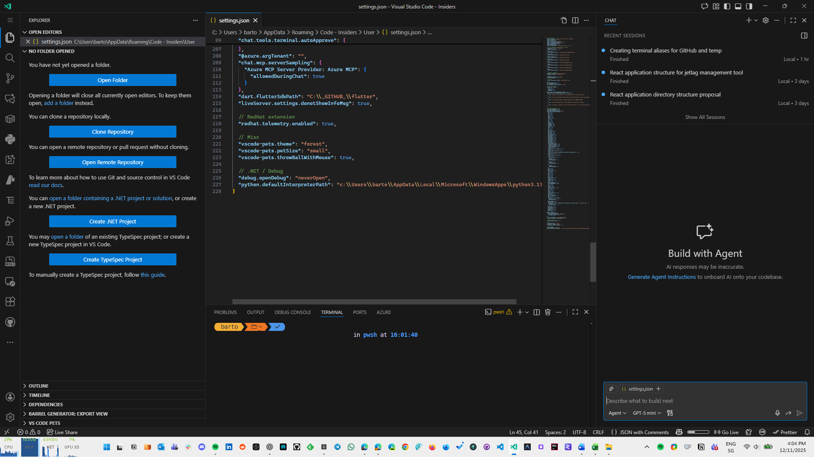
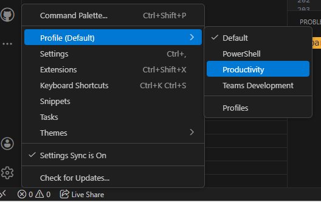
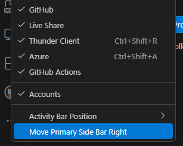
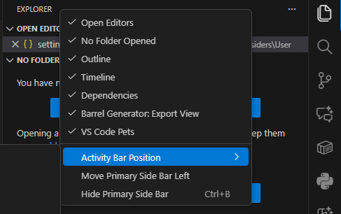
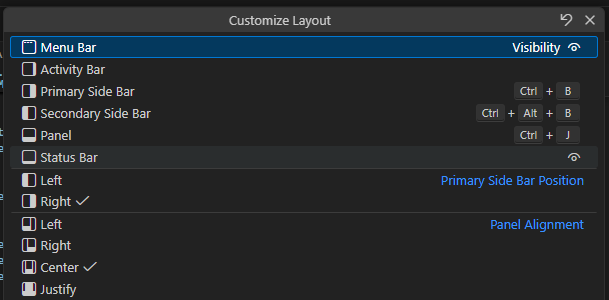
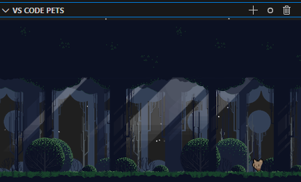
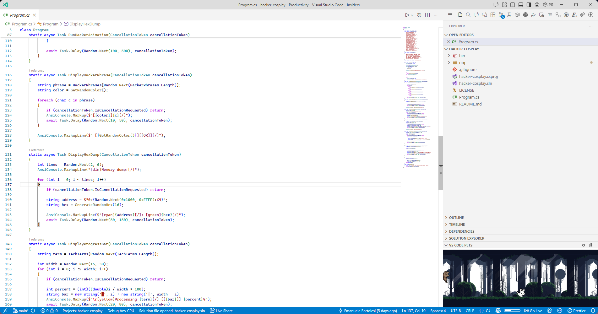

---
{
title: "How I created a Cozy Workspace in VS Code",
published: "2025-12-11T15:54:26Z",
edited: "2025-12-11T22:18:36Z",
tags: ["vscode", "productivity", "development", "githubcopilot"],
description: "I love VS Code. It is fast, flexible, and works for almost any stack. But the default layout is not...",
originalLink: "https://https://dev.to/playfulprogramming/how-i-created-a-cozy-workspace-in-vs-code-4bf0",
coverImg: "cover-image.png",
socialImg: "social-image.png"
}
---

I love VS Code. It is fast, flexible, and works for almost any stack. But the default layout is not great if you want a clean space to think. The editor area is smaller than it should be, and the UI is packed with elements that pull attention away from the code. With the new Copilot Chat panel taking even more space, the problem becomes obvious. Too much noise, not enough room to work.



In the picture above, the default layout, with Copilot opened on the right, the space for code is really limited.

I have been searching for a layout that removes distractions without sacrificing functionality. Something simple, comfortable, and optimized for long sessions. This article explains the setup I finally arrived at. It is a *Productivity* profile built around a few key layout changes: moving the sidebar to the right, putting the Activity Bar at the top, centering Quick Input, hiding the Command Center, switching themes automatically based on daylight, improving cursor visibility, and adding one small bonus to make the day more pleasant.

These changes are minimal but have a clear impact. They turn VS Code into a focused, cozy environment that gives space back to the code instead of the UI.

---

## Creating a Dedicated “Productivity” Profile

VS Code profiles let you build isolated setups for different workflows. This solves a common problem. When you install extensions or change layout settings for one project, everything else gets affected. A dedicated *Productivity* profile keeps your focused environment clean and consistent.

I use this profile only for work sessions. For the training session I usually have, of course I still use the Default profile, otherwise the people are confused and lost.

Creating the new profile takes a minute:

1. Open the Command Palette.
2. Run **Profiles: Create Profile**.
3. Choose **Empty**.
4. Name it **Productivity**.
5. Customize settings only for this profile.

You can also click on the **Gear** icon on the bottom left and select "Profiles" from the menu.



---

## Moving the Primary Sidebar to the Right

By default, VS Code puts the sidebar on the left. This works, but it also competes with your natural reading flow. Having the file tree on the left constantly pulls the eye away from the editor.
Also, when you close the sidebar, the code moves a little bit on the left, because the sidebar is not present anymore.

Moving the sidebar to the right reduces this tension. It keeps the editor centered and makes the coding area the first thing your eyes land on.

```json
"workbench.sideBar.location": "right"
```

You can also click with the right button on the sidebar and select "Move Primary Sidebar Right".



This simple switch makes the layout feel more balanced and less cluttered.

---

## Activity Bar at the Top

The Activity Bar is highly visible. Keeping it on the left (or right, if the primary sidebar is on the right) creates unnecessary vertical columns. Moving it to the top uses horizontal space instead of eating into the editor.

```json
"workbench.activityBar.location": "top"
```

It's possible to change the same settings, even by clicking on the top of the sidebar and choose **Top** from the **Activity Bar Position** menu.



This change pairs well with the right-aligned sidebar and creates a cleaner overall layout.

---

## Centering Quick Input for Better Focus

The Command Palette and file switcher usually appear at the top. This forces a constant eye shift upward. Centering Quick Input keeps everything in your immediate focus area.

```json
"workbench.quickInput.location": "center"
```

This is especially useful if you use the keyboard heavily.

---

## Hiding the Command Center

If you already use keyboard shortcuts and the centered Quick Input, the Command Center becomes redundant. It adds noise without adding value.

```json
"window.commandCenter": false
```

Hiding it cleans up the top UI and keeps attention on the code.

---

## Move the Menu bar

How often do you use the Menu? I think not so much, so, you can use that space for something else by changing the position of the menu, on the top of the Activity Bar.

```json
"window.menuBarVisibility": "compact"
```

If you want to use the UI to change this settings, click on the **Customize Layout** on the top right corner of VS Code window and change the Visibility of the Menu Bar.



One more row is saved but first of all you are not distracted by the menu items on the top.

---

## Automatic Light/Dark Theme Switching With PowerToys LightSwitch

[PowerToys LightSwitch](https://learn.microsoft.com/en-us/windows/powertoys/) changes your Windows theme based on sunrise and sunset. VS Code can detect this automatically and switch between your preferred light and dark themes.

```json
"workbench.preferredDarkColorTheme": "JetBrains Rider Dark Theme",
"workbench.preferredLightColorTheme": "Default Light+",
"window.autoDetectColorScheme": true
```

I use the JetBrains Rider Dark theme because I also use it on Rider, and it helps me stay focused when switching between IDEs.

This keeps the editor comfortable throughout the day with zero manual work.

---

## Improving Cursor Visibility With “Expand” Blinking

The default cursor blink is subtle. In a busy file, it is easy to lose track of it. The “expand” style is more visible without being distracting.

```json
"editor.cursorBlinking": "expand"
```

A small tweak, but surprisingly helpful.

---

## Bonus: A Bit of Fun With VS Code Pets

A cozy environment should be enjoyable, not just efficient. The **VS Code Pets** extension adds a small animated pet to your workspace. It keeps you company during long sessions and adds a bit of charm without affecting focus.



It is optional, but it makes the environment feel more human.

---

## Final Result

A cozy development environment is not about adding more tools. It is about removing friction. By focusing only on VS Code's layout settings, you can reclaim space, reduce noise, and make the editor feel purpose-built for deep work.

In the screenshot below, you can see the final result after all these easy changes.



If you want to spend time changing all the settings manually, you can find all my settings in the following repo:

<!-- ::start:link-preview -->
[Windows 11 Setup](https://github.com/kasuken/Windows11-Setup)
<!-- ::end:link-preview -->

This layout turned VS Code into a cleaner and more intentional workspace for me. If you try it or customize it, share your version. Every developer ends up with their own definition of cozy.

---

📘 **Get the Book with 50% Off!**

I turned my beginner programming mistakes into a guide so you don’t have to repeat them.\
Grab **The Mistakes I Made as a Beginner Programmer** today with a special discount.

👉 [Get it on Gumroad](https://emanuelebartolesi.gumroad.com/l/mistakesasdeveloper/MISTAKESDEVTO50)\
💸 Use code **MISTAKESDEVTO50** at checkout for **50% off**.
