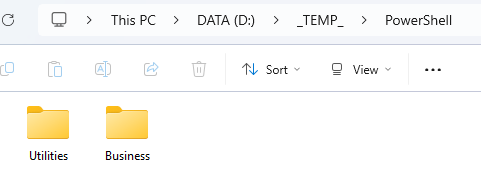
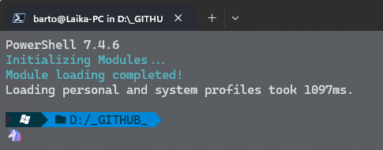

---
{
title: "How I Set Up an Awesome PowerShell Environment for Script Development",
published: "2025-01-09T13:25:02Z",
edited: "2025-01-11T10:52:40Z",
tags: ["powershell", "vscode", "development"],
description: "Over the past few years, I’ve had the opportunity to help colleagues write and refine PowerShell...",
originalLink: "https://https://dev.to/playfulprogramming/how-i-set-up-an-awesome-powershell-environment-for-script-development-d4p",
coverImg: "cover-image.png",
socialImg: "social-image.png"
}
---

Over the past few years, I’ve had the opportunity to help colleagues write and refine PowerShell scripts for a variety of tasks. While I’m not a full-time PowerShell scripter, far from it, in fact, having a reliable and productive environment has been crucial. PowerShell scripting often comes into play when I need to automate a process, troubleshoot an issue, or quickly deliver a solution.

Without the right setup, even simple scripts can turn into a frustrating time sink. That’s why I’ve focused on creating an environment that works seamlessly, boosts productivity, and minimizes the effort required to get started. In this post, I’ll share how I’ve set up my PowerShell development environment to make scripting efficient and enjoyable—even when it’s not my main focus during the day.

## Folders

First of all, on my pc, I have two local folders, called Utilities and Business.



Inside these folders I have some PowerShell modules I created or downloaded.
I have different kind of modules, for compressing a folder, for reading a CSV file and so on.
These modules help me to be more productive during the development or the debug and I don't have every time to remember which module I have to import or similar.

## Add the modules to the profile

As I mentioned before, I don't want to import all the modules every time, manually in my script.
So, I changed the profile script to include all the modules in that folders, when PowerShell is loaded.

For changing the profile, you can open a terminal and write:

```
code $Profile
```

Now, inside the new window of Visual Studio Code, you can paste the following code:

```powershell
Write-Host "Initializing Modules..." -ForegroundColor Cyan

# Ensure any errors during execution halt the script
$ErrorActionPreference = "Stop"

# Define module paths and exclusions
$ModuleDefinitions = @{
    Utilities = @{
        Path    = "D:\_TEMP_\PowerShell\Utilities"
    }
    Business = @{
        Path    = "D:\_TEMP_\PowerShell\Business"
    }
}

# Iterate through each module definition
foreach ($moduleName in $ModuleDefinitions.Keys) {
    $moduleDetails = $ModuleDefinitions[$moduleName]
    $modulePath    = $moduleDetails.Path

    # Update PSModulePath to include the current module path
    if (-Not ($env:PSModulePath -contains $modulePath)) {
        $env:PSModulePath = @(
            $env:PSModulePath
            $modulePath
        ) -join [System.IO.Path]::PathSeparator
    }

    # Load modules from the specified path, excluding unwanted directories
    Get-ChildItem -Path $modulePath -Directory -Exclude @(".git")|
        ForEach-Object {
            Write-Host "Loading Module '$($_.Name)' from '$moduleName'" -ForegroundColor Green
            try {
                Import-Module $_.Name -ErrorAction Stop
            } catch {
                Write-Host "Failed to load module '$($_.Name)': $_" -ForegroundColor Red
            }
        }
}

Write-Host "Module loading completed!" -ForegroundColor Cyan
```

With the code above, every time I launch a PowerShell session, I have all my utilities and modules loaded correctly.

## Install the PowerShell Extension for VS Code

The PowerShell extension enhances VS Code with features like IntelliSense, debugging, and code snippets.

Installation Steps:

- Open VS Code.
- Go to the Extensions view by clicking on the square icon in the Activity Bar or pressing Ctrl+Shift+X.
- Search for "PowerShell" and click "Install" on the extension by Microsoft.

## Other utilities

For the terminal set up, you can follow one of my previous post about it.

<!-- ::start:link-preview -->
[Transforming Windows Terminal into a Productivity Powerhouse](/posts/transforming-windows-terminal-into-a-productivity-powerhouse-53d5)
<!-- ::end:link-preview -->

## Final result

If everything run well, every time you open a new PowerShell instance, you should see something like that:



---


If you enjoyed this blog post and want to learn more about C# development, you might be interested in subscribing to my bi-weekly newsletter called Dev Dispatch. By subscribing, you will get access to exclusive content, tips, and tricks, as well as updates on the latest news and trends in the development world. You will also be able to interact with me, and share your feedback and suggestions. To subscribe, simply navigate to https://buttondown.email/kasuken?tag=devto, enter your email address and click on the Subscribe button. You can unsubscribe at any time. Thank you for your support!
