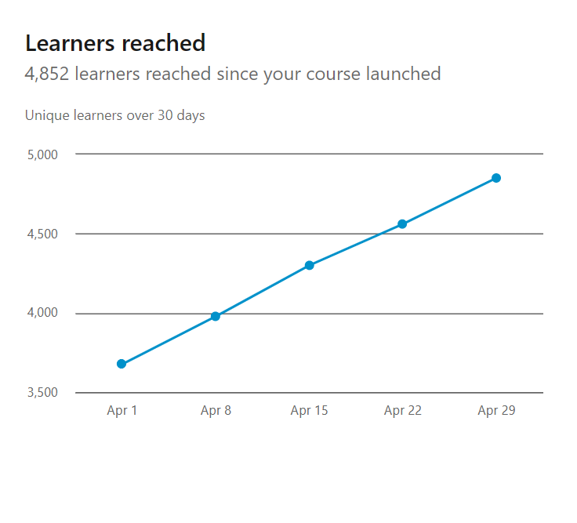
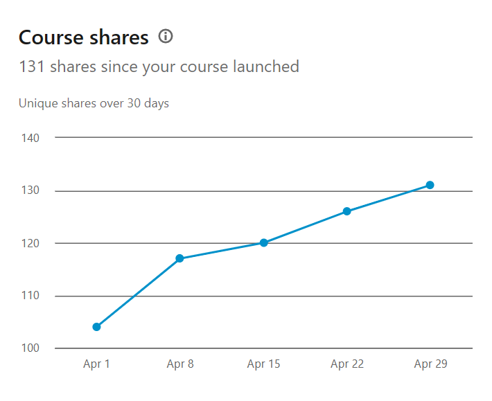
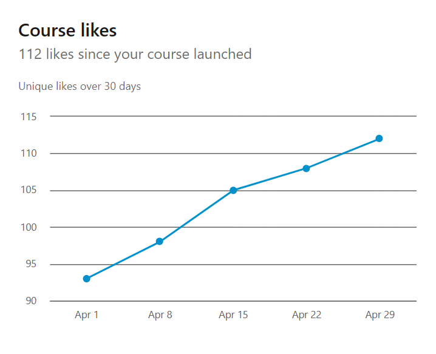
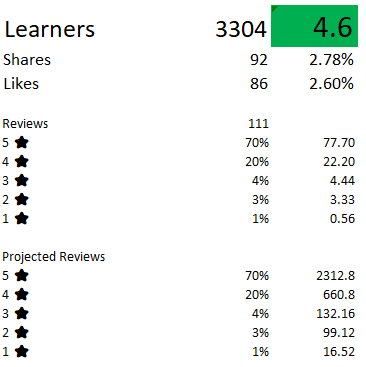
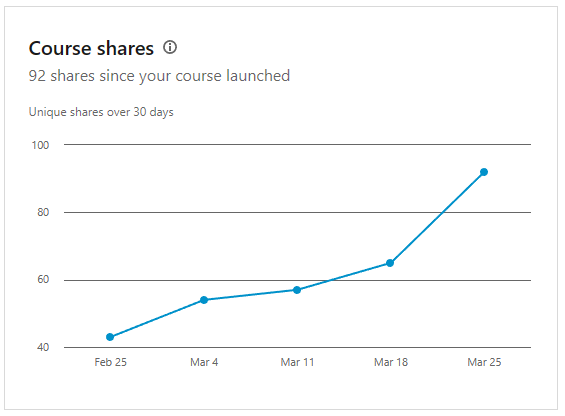
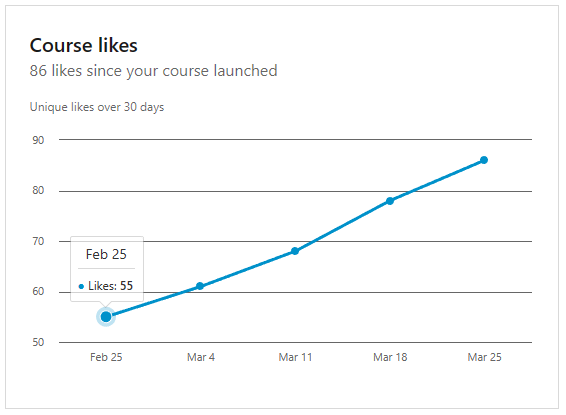

---
{
title: "My LinkedIn Course \"Learning GitHub\" by numbers",
published: "2023-03-27T07:10:34Z",
edited: "2023-04-30T13:23:02Z",
tags: ["github", "learning", "git", "githubcopilot"],
description: "Introduction   A few months ago I started to talk about my journey as a Technical Instructor...",
originalLink: "https://dev.to/this-is-learning/my-linkedin-course-learning-github-by-numbers-237j",
coverImage: "cover-image.png",
socialImage: "social-image.png"
}
---

# Introduction

A few months ago I started to talk about my journey as a Technical Instructor for LinkedIn Learning.

<!-- ::start:link-preview -->
[My Journey as LinkedIn Technical Instructor](https://dev.to/kasuken/my-journey-as-linkedin-technical-instructor-14bn)
<!-- ::end:link-preview -->

By the end of January my course "Learning GitHub" has been released and people start to watch it.

In this post I will publish some updates time to time to see how the course is going and and understand especially user feedback and whether I can improve anything.

# April 2023

At the end of April I reached almost 5k learners on my LinkedIn course.
It was one of the goals I set for myself: 1k, 3k, 5k, 10k, 20k.

The course reached **4852** learners with at least 20% of the course watched.
**131** people shared the course on LinkedIn and **112**liked the course.

learners reviewed my course and based on the percentage:

- 101 people reviewed with 5 ⭐
- 29 people reviewed with 4 ⭐
- 8 people reviewed with 3 ⭐
- 4 people reviewed with 2 ⭐
- 1 people reviewed with 1 ⭐

This means if the same percentage of people wrote a review

- 3300 people reviewed with 5 ⭐
- 970 people reviewed with 4 ⭐
- 290 people reviewed with 3 ⭐
- 145 people reviewed with 2 ⭐
- 24 people reviewed with 1 ⭐

The average rating is: **4.5**.
The only very bad reviews are about my English accent, but it's something I know and I am working on it.
By the way, this bad reviews came from American people. It means it's not enough for us but maybe for a non-native my English is ok.

Additional info about the course

# March 2023

Very near the end of March I reached 3k learners on my LinkedIn course.
It was one of the goals I set for myself: 1k, 3k, 5k, 10k, 20k.
Those are pretty much the goals I put in front of me.
This means that I reached about 55 learners each day for the previous 60 days (since the course was released).
Actually there was an increase in numbers because after one month I had "only" 1,000 learners.
Most likely the course link is now much more visible than before.

To keep track of the evolution of the course over time, I created myself an excel file with some graphs and some statistics that I go to update from time to time, almost once every two days and always after lunch.
It seems that LinkedIn updates the statistics after lunch.

Some interesting things have come out.

The course reached **3304** learners with at least 20% of the course watched.
**92** people shared the course on LinkedIn and \*\*86 \*\*liked the course.

111 learners reviewed my course and based on the percentage:

- 78 people reviewed with 5 ⭐
- 22 people reviewed with 4 ⭐
- 4 people reviewed with 3 ⭐
- 3 people reviewed with 2 ⭐
- 1 people reviewed with 1 ⭐

This means if the same percentage of people wrote a review

- 2313 people reviewed with 5 ⭐
- 661 people reviewed with 4 ⭐
- 132 people reviewed with 3 ⭐
- 99 people reviewed with 2 ⭐
- 17 people reviewed with 1 ⭐

The average rating is: **4.6**.
The only very bad reviews are about my English accent, but it's something I know and I am working on it.
By the way, this bad reviews came from American people. It means it's not enough for us but maybe for a non-native my English is ok.

Additional info about the course

Honestly I am happy about the result after two months.
Looking forward for the April statistics!

---

Are you interested in learning GitHub but don't know where to start? Try my course on LinkedIn Learning: [Learning GitHub](https://bit.ly/learninggithub).

---

Thanks for reading this post, I hope you found it interesting!

Feel free to follow me to get notified when new articles are out 🙂

<!-- ::user id="kasuken" -->
