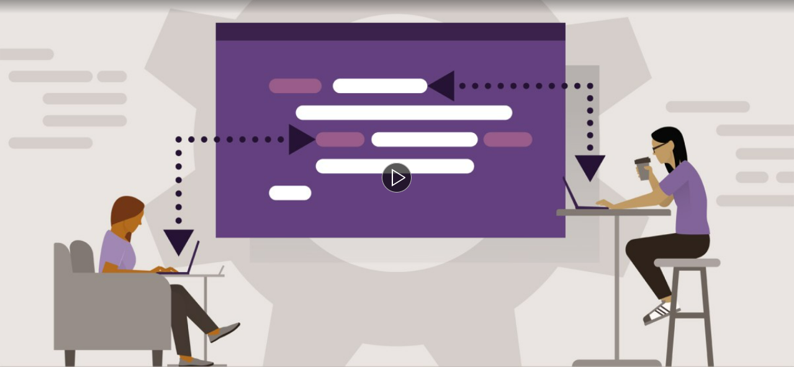
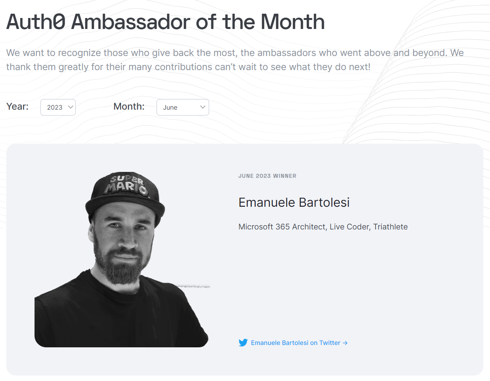
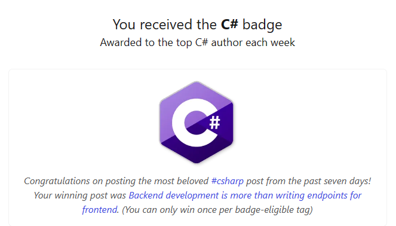
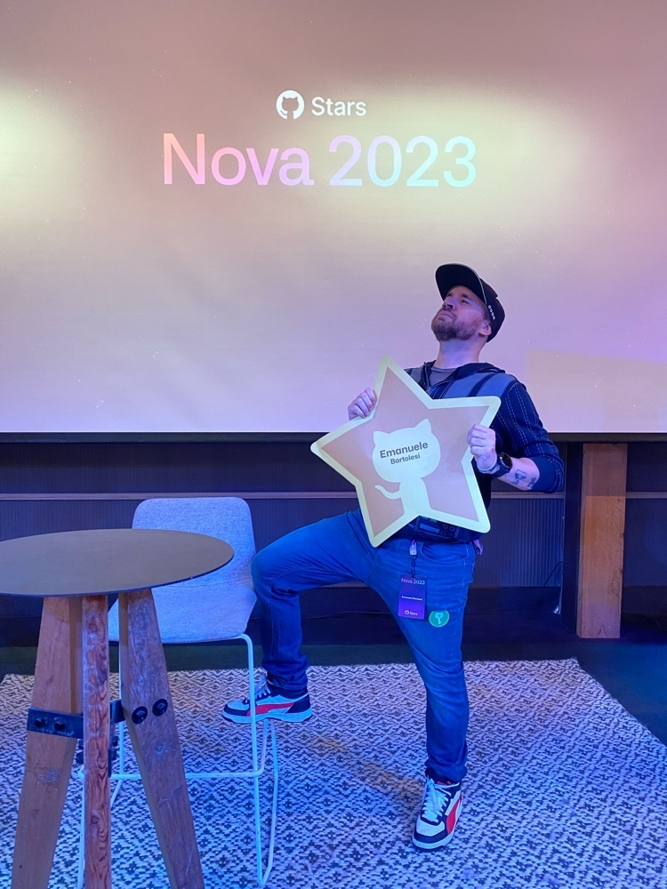
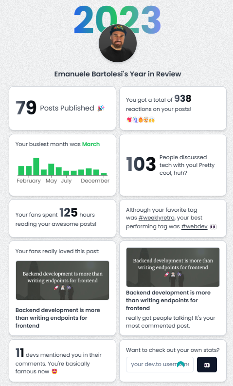

---
{
title: "My Wrap Up of 2023: A Year of Growth and Recognition",
published: "2024-01-21T05:31:21Z",
edited: "2024-01-21T05:40:32Z",
tags: ["career", "community", "writing", "devjournal"],
description: "Hello everyone, this is my last blog post of the year and I want to share with you some of the...",
originalLink: "https://dev.to/this-is-learning/my-wrap-up-of-2023-a-year-of-growth-and-recognition-4b6n",
coverImg: "cover-image.png",
socialImg: "social-image.png"
}
---

Hello everyone, this is my last blog post of the year and I want to share with you some of the highlights and achievements that I had in 2023. It was a year full of challenges, opportunities, and rewards. I learned a lot, I shared a lot, and I received a lot of recognition and support from the community. Here are some of the important things that I achieved this year.

## **January**

- **LinkedIn Learning course out: Learning GitHub**

I started the year with a bang by releasing my first LinkedIn Learning course: Learning GitHub. This course is designed for beginners who want to learn how to use GitHub, the most popular platform for hosting and collaborating on code projects. In this course, I teach you how to create a GitHub account, set up a repository, work with branches, make commits, pull requests, and more. You can check out the course [here](https://www.linkedin.com/learning/learning-github-18719601/getting-started-with-github)

## **February**

- **got the second GitHub Star**
- **1000+ learners on LinkedIn Learning course**
- **Joined This is Learning community** on [dev.to](http://dev.to/) and Discord

In February, I received my second GitHub Star award, which is a program that recognizes some of the most influential and helpful GitHub users around the world. I was honored to be part of this amazing group of people who contribute to the GitHub ecosystem and help other developers. You can learn more about the GitHub Star program \[here].

Also in February, I reached 1000+ learners on my LinkedIn Learning course, which was a great milestone for me. I was happy to see that many people were interested in learning GitHub and found my course useful and engaging. I received a lot of positive feedback and reviews from the learners, which motivated me to keep creating more courses.

Another thing that I did in February was joining the This is Learning community on [dev.to](http://dev.to/) and Discord. This is a community of developers and learners who share their knowledge, experiences, and projects on various topics related to web development, cloud computing, data science, and more. I joined this community as a mentor and a content creator, and I enjoyed interacting with other members and helping them with their questions and challenges. You can join the This is Learning community \[here].

## **March**

- **2000+ learners on LinkedIn Learning course**
- **Joined TomorrowDevs as mentor**
- I have been invited to Microsoft Ignite - Spotlight on Switzerland at Ask the Experts as an Expert - https://dev.to/kasuken/microsoft-ignite-spotlight-on-switzerland-my-experience-at-ask-the-experts-table-27k2
- Finished the “Level A1” German course
- **3000+ learners on LinkedIn Learning course**
- Brandplane's first 3 paying customers
- Brandplane’s first 5 paying customers

March was a busy and productive month for me. I reached 2000+ and then 3000+ learners on my LinkedIn Learning course, which was amazing. I also joined TomorrowDevs as a mentor, which is a platform that connects aspiring developers with experienced mentors who can guide them and help them achieve their goals. I was happy to be part of this initiative and to share my knowledge and skills with the mentees. You can learn more about TomorrowDevs \[here].

One of the highlights of March was being invited to Microsoft Ignite - Spotlight on Switzerland at Ask the Experts as an Expert. This was a virtual event that brought together Microsoft experts, partners, and customers to discuss the latest trends and innovations in cloud, data, security, and more. I was part of the Ask the Experts table, where I answered questions from the attendees about GitHub, Azure, and DevOps. It was a great experience and I learned a lot from the other experts and the audience. You can read more about my experience at the event \[here].

Another thing that I did in March was finishing the “Level A1” German course, which was a personal goal that I had for a long time. I wanted to learn German because I live in Switzerland and I think it is important to know the local language and culture. I took an online course that taught me the basics of German grammar, vocabulary, and pronunciation. I was able to complete the course and pass the final exam with a good score. I was proud of myself for achieving this goal and I plan to continue learning German in the future.

The last thing that I want to mention about March was Brandplane's first 3 and then 5 paying customers. Brandplane is a startup that I co-founded with my friend and colleague. It is a platform that helps businesses create and manage their brand identity online. We launched Brandplane in beta mode in February and we were able to get our first 3 paying customers in March. This was a huge validation for us and our product. We were thrilled to see that people liked our platform and were willing to pay for it. We continued to work hard on improving Brandplane and we got 2 more paying customers by the end of the month. You can check out Brandplane www.brandplane.co.

## **April**

- **Started to work on the new LinkedIn Learning course**

In April, I started to work on my second LinkedIn Learning course, which is about GitHub and Visual Studio Code. This course is designed for intermediate developers who want to learn how to use GitHub and Visual Studio Code together to create, edit, debug, and deploy code projects. In this course, I teach you how to connect GitHub and Visual Studio Code, how to use the GitHub extension for Visual Studio Code, how to work with GitHub Actions, GitHub Pages, GitHub Codespaces, and more. I am still working on this course and I hope to release it soon.

## **May**

- **5000+ learners on LinkedIn Learning Course**
- Started to work on new LinkedIn Learning Course about GitHub and Visual Studio Code

In May, I reached 5000+ learners on my first LinkedIn Learning course, which was a huge achievement for me. I was overwhelmed by the positive response and the support that I received from the learners and the LinkedIn Learning team. I also continued to work on my second LinkedIn Learning course, which is about GitHub and Visual Studio Code. I finished writing the scripts and started recording the videos.

## **June**

- 10k followers on my blog on [dev.to](http://dev.to/)
- My article on Top 7 articles of the week on [Dev.to](http://dev.to/):
- **Auth0 Ambassador of the Month**

In June, I reached 10k followers on my blog on [dev.to](http://dev.to/), which is a platform where I write and share articles about web development, GitHub, Azure, and more. I was amazed by the growth and the engagement that I had on my blog. I also had one of my articles featured on the Top 7 articles of the week on [dev.to](http://dev.to/), which is a weekly newsletter that showcases the best articles from the [dev.to](http://dev.to/) community.

## **July**

- **renewed as an MVP for 10 years in a row**!
- Another article on top 7 articles of the week on [dev.to](http://dev.to/)

In July, I was renewed as an MVP for 10 years in a row! MVP stands for Most Valuable Professional and it is a program that recognizes individuals who have exceptional technical expertise and community leadership. I was first awarded as an MVP in 2014 and I have been renewed every year since then. I am honored and grateful to be part of this amazing program and to be able to contribute to the Microsoft community. You can learn more about the MVP program [here](https://mvp.microsoft.com).

I also had another article on the top 7 articles of the week on [dev.to](http://dev.to/), which was about how to use GitHub Codespaces to create and edit code projects in the cloud. GitHub Codespaces is a feature that allows you to launch a fully configured development environment in your browser or in Visual Studio Code. You can access your code, dependencies, tools, terminals, and more from anywhere and from any device.

## **August**

- Joined an accelerator with BrandPlane

In August, I joined an accelerator with BrandPlane, which is a program that helps startups grow and scale their businesses. The accelerator provided us with mentorship, training, funding, and networking opportunities. We learned a lot from the accelerator and we were able to improve our product, our marketing, and our sales. We also met a lot of other founders and investors who gave us valuable feedback and advice. The accelerator was a great experience and a boost for our startup.

## **September**

- Start to record a new LinkedIn Learning course
- Sing and play guitar in front of 250 people after more than 20 years

In September, I started to record a new LinkedIn Learning course, which is about GitHub and Azure. This course is designed for advanced developers who want to learn how to use GitHub and Azure together to create, manage, and deploy cloud-based applications. In this course, I teach you how to use GitHub and Azure DevOps, GitHub and Azure Functions, GitHub and Azure App Service, GitHub and Azure Container Registry, and more. I am still working on this course and I hope to release it soon.

Another thing that I did in September was singing and playing guitar in front of 250 people after more than 20 years. This was a personal challenge that I had for a long time. I used to sing and play guitar when I was younger, but I stopped doing it for various reasons. I always wanted to get back to it, but I never had the opportunity.

## **October**

- 15k followers on my blog on [dev.to](http://dev.to/)

In October, I reached 15k followers on my blog on [dev.to](http://dev.to/), which was another huge achievement for me. I was humbled and grateful for the support and the feedback that I received from the [dev.to](http://dev.to/) community. I also continued to write and share articles about web development, GitHub, Azure, and more. Some of the topics that I covered in October were how to use GitHub Copilot, how to use GitHub Discussions, how to use GitHub Sponsors, and more.

## **November**

- 15k learners on LinkedIn Learning Course
- Went to GitHub Nova and GitHub Universe in San Francisco
- **Awarded as GitHub Star of the Year**. Maybe the most important achievement of the year and in my career in general. GitHub users are more than 100 Millions, GitHub Stars are more or less 90 and I have been chosen as the GitHub of the Year. It means 0,001% of the chance!
- **1M views on my blog and 15k followers** on [dev.to](http://dev.to/)

November was a month full of surprises and rewards for me. I reached 15k learners on my first LinkedIn Learning course, which was beyond my expectations. I also went to GitHub Nova and GitHub Universe in San Francisco, which were two amazing events that brought together the GitHub community and the GitHub team. I had the opportunity to meet some of the GitHub Stars, the GitHub staff, and the GitHub CEO. I also learned a lot from the sessions, the workshops, and the demos. It was a great trip and a great experience.

But the biggest surprise and reward of November was being awarded as GitHub Star of the Year. This was the most important achievement of the year and in my career in general. GitHub users are more than 100 Millions, GitHub Stars are more or less 90 and I have been chosen as the GitHub of the Year. It means 0,001% of the chance! I was speechless and honored to receive this recognition from GitHub. It was a dream come true for me and I still can't believe it.

I also reached 1M views on my blog and 15k followers on [dev.to](http://dev.to/), which were incredible numbers for me. I was thrilled to see that my blog was reaching and helping so many people around the world. I want to thank all of you who read, comment, and share my articles. You are the reason why I write and you are the best part of my blog.

## **December**

- Take a break from public speaking for a while. Too much pressure and expectations. I need a break
- **Got an the first investment for Brandplane**!

In December, I decided to take a break from public speaking for a while. I have been doing a lot of public speaking this year, both online and offline, and I felt that it was taking a toll on me. I felt too much pressure and expectations from myself and from others. I needed a break to recharge and to focus on other things. I still love public speaking and I will come back to it soon, but for now, I need some time off.

The last thing that I want to share with you is that I got the first investment for Brandplane! This was a huge milestone for me and my co-founder. We have been working hard on Brandplane for almost a year and we have been bootstrapping it with our own money. We were looking for investors who could help us grow and scale our business. We finally found a great investor who believed in us and our product. We signed the deal and we received the money in December. This was a game-changer for us and our startup. We are excited and grateful for this opportunity and we can't wait to see what the future holds for Brandplane.

### **Conclusion**

That's it for my wrap up of 2023. It was a year of growth and recognition for me. I achieved a lot of things that I never thought possible. I learned a lot, I shared a lot, and I received a lot of recognition and support from the community. I want to thank all of you who have been part of my journey and who have helped me along the way. You are amazing and I appreciate you.

I hope you enjoyed reading this blog post and I hope you had a great year too. I wish you all the best for 2024 and I hope to see you soon. Happy New Year! 🎉

---

If you enjoyed this blog post and want to learn more about C# development, you might be interested in subscribing to my bi-weekly newsletter called Dev Dispatch. By subscribing, you will get access to exclusive content, tips, and tricks, as well as updates on the latest news and trends in the development world. You will also be able to interact with me, and share your feedback and suggestions. To subscribe, simply navigate to https://buttondown.email/kasuken?tag=devto, enter your email address and click on the Subscribe button. You can unsubscribe at any time. Thank you for your support!
