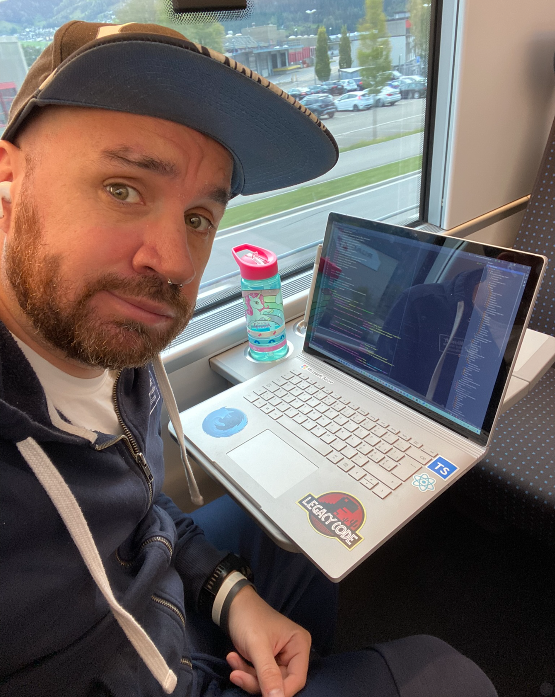
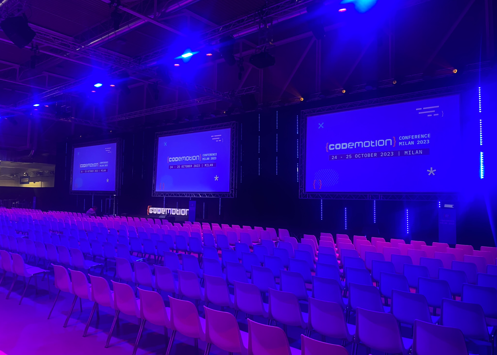
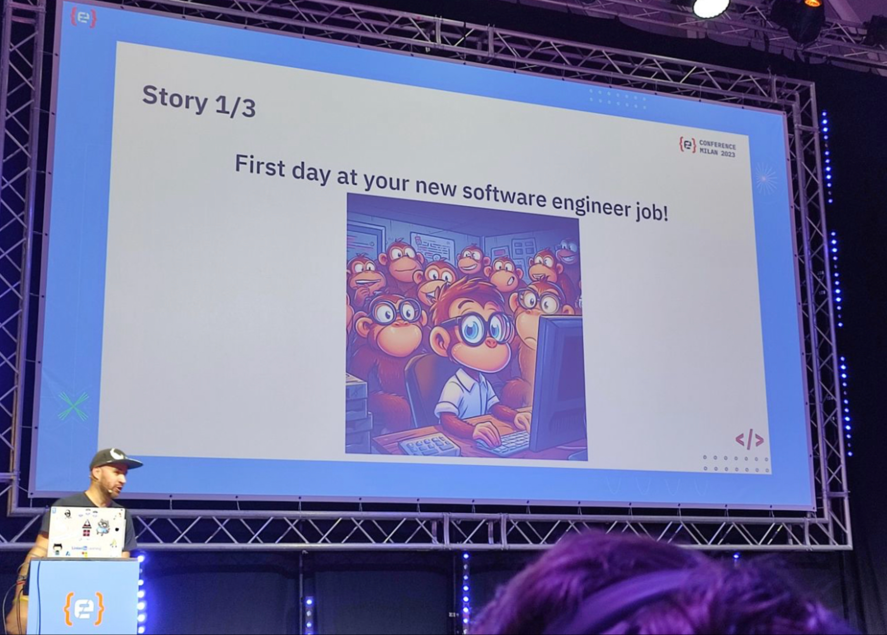
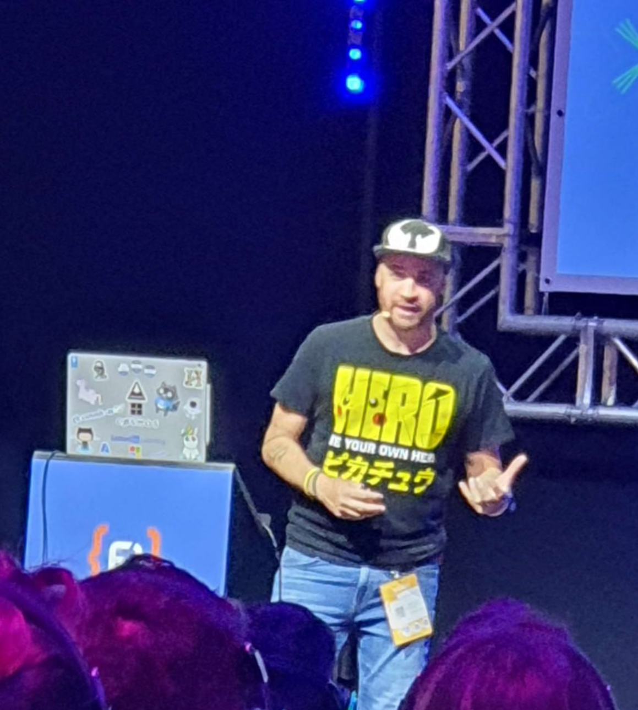
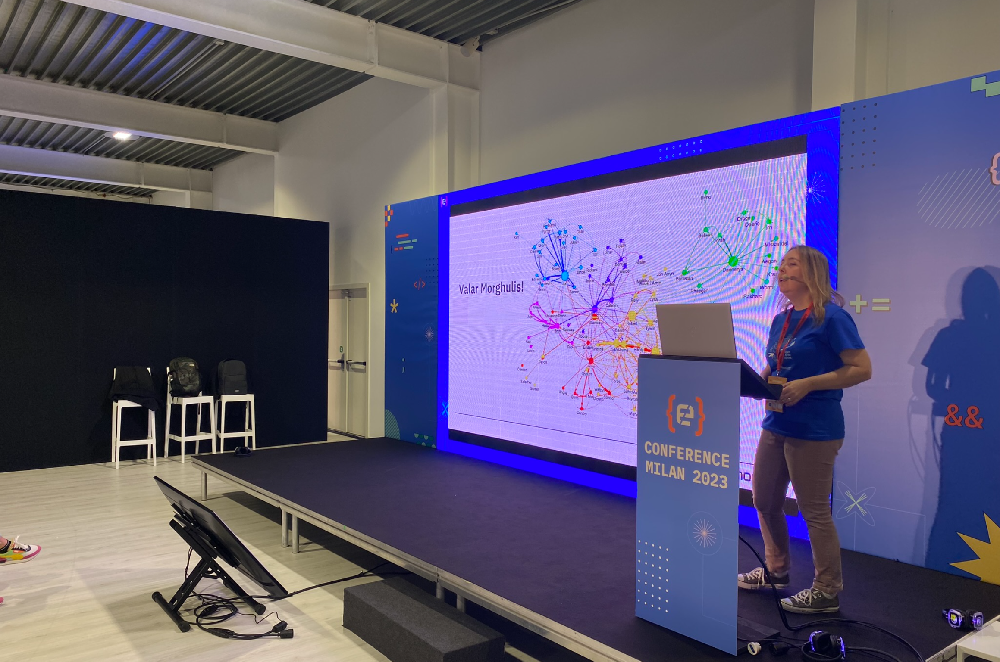
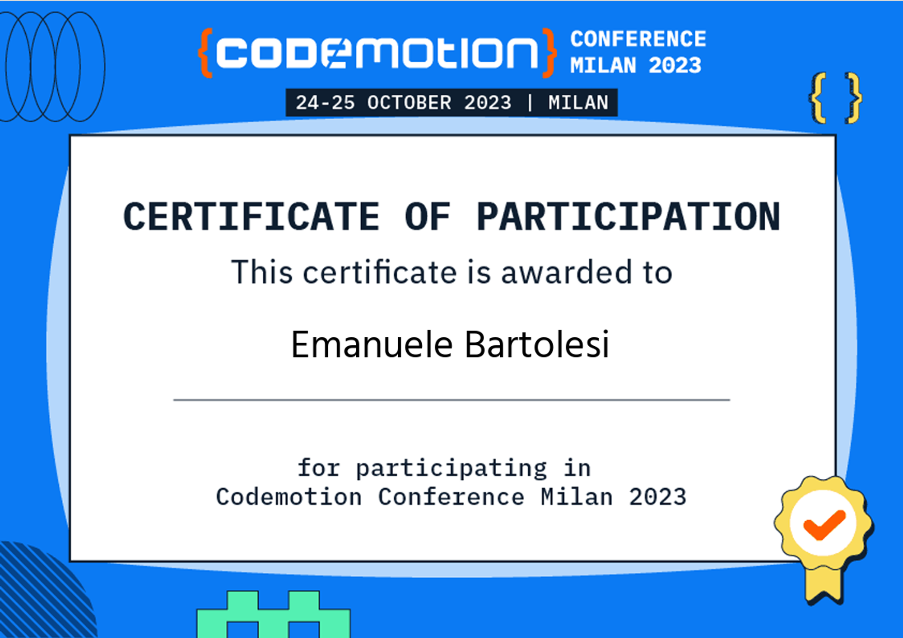

---
{
title: "Recap Codemotion 2023",
published: "2023-10-30T09:06:00Z",
tags: ["eventsinyourcity", "events"],
description: "Last week, I had the opportunity to attend Codemotion 2023, one of the biggest tech conferences in...",
originalLink: "https://https://dev.to/playfulprogramming/recap-codemotion-2023-1o6c",
coverImg: "cover-image.png",
socialImg: "social-image.png"
}
---

Last week, I had the opportunity to attend Codemotion 2023, one of the biggest tech conferences in Europe, as a speaker and an ambassador. It was a fantastic experience that I want to share with you in this post.

## PreConference Day

I arrived in Milan the day before the conference, and I went to the venue to finalize the streaming setup in the Community Area. There, I met some other ambassadors and more or less the entire Codemotion Teams. They were all very friendly and helpful, and I felt welcomed and appreciated.

I came back to the hotel for some calls and meetings, and before going to bed, I checked the slides and the demo for my session the next day. I was going to talk about how to build a serverless web app with Azure Functions and Blazor WebAssembly, a topic that I am very passionate about.

## Day 1

I arrived at the venue early to check again the streaming. Speakers started to arrive, as well as attendees. I hung around with other speakers and made some selfies with attendees (they asked). It was nice to see some familiar faces and meet new people who share the same interests.

I had a few calls for work in the morning, but I managed to squeeze them in between sessions. After lunch, I had my session with more or less 250 attendees. Everything went well, apart from a technical issue. I was not able to duplicate my screen, but just extend it. So, I had my main screen with the code on the second screen, in front of me but below the stage. It was tricky, but I found a way to deliver the session.

A lot of people asked me questions after the session and stopped me when I walked around to compliment me on the content of the session. I was very happy and grateful for their feedback and curiosity.

In the late afternoon, I introduced on stage, for the first time, my friend Davide. I mentored him for about a month and a half before the event about public speaking (I am also writing a small ebook about that). He talked about how to use Azure Cognitive Services to build smart applications. His session went well, as I expected. He was confident and engaging, and he handled questions like a pro.

After the last sessions, we had a speakers dinner at a nice restaurant nearby. It was a lot of fun to chat with them and share our experiences and stories.

## Day 2

Unfortunately, it was the last day of the conference. I didn’t have too much stuff to do, so I hung around in the venue to meet friends, make selfies and talk with people. I attended one or two interesting sessions about AI and cloud computing.

In the late afternoon, I introduced Laura on stage. It was not her first time speaking at a conference, but it was her first time speaking alone. She talked about how to use Azure DevOps to automate your CI/CD pipeline. I mentored her as well, and I was very proud of her performance. The session went well, maybe even better than expected. She was clear and concise, and she showed some cool demos.

I am happy about my two “wannabe speakers”. I hope they will continue in these kind of activities and inspire others to do the same.

I came back home very late because all the transport were delayed. But it was worth it. Codemotion 2023 was an amazing event that I will never forget. Thank you to all the organizers, speakers, sponsors and attendees who made it possible. See you next year!

You can find other photos uploaded from people at this link: https://codemo.tech/photos-MI23CE

---

If you enjoyed this blog post and want to learn more about C# development, you might be interested in subscribing to my bi-weekly newsletter called Dev Dispatch. By subscribing, you will get access to exclusive content, tips, and tricks, as well as updates on the latest news and trends in the development world. You will also be able to interact with me, and share your feedback and suggestions. To subscribe, simply navigate to https://buttondown.email/kasuken?tag=devto, enter your email address and click on the Subscribe button. You can unsubscribe at any time. Thank you for your support!
