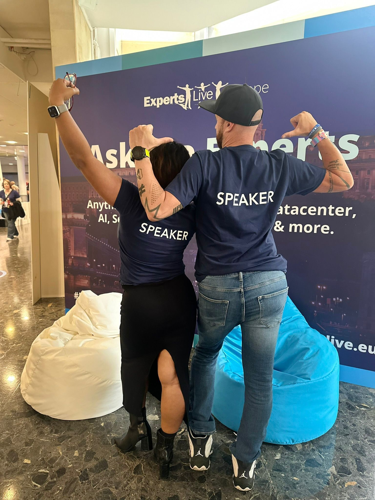
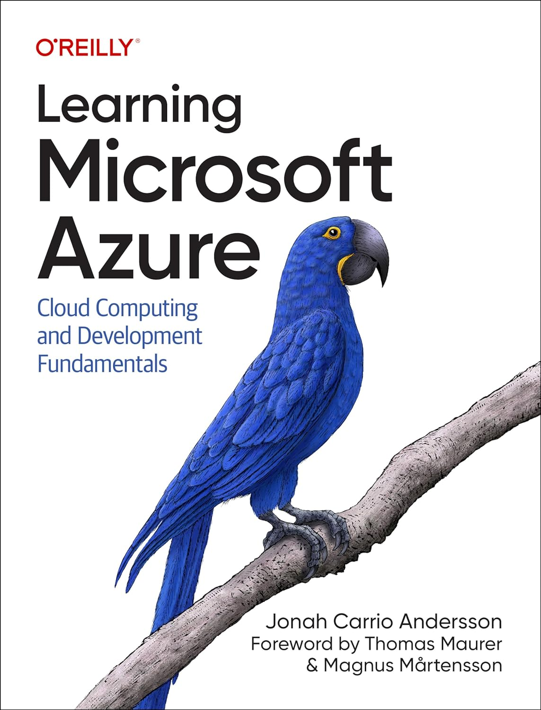
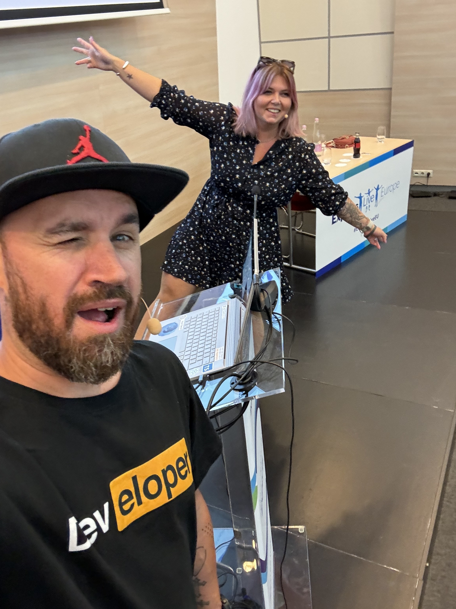
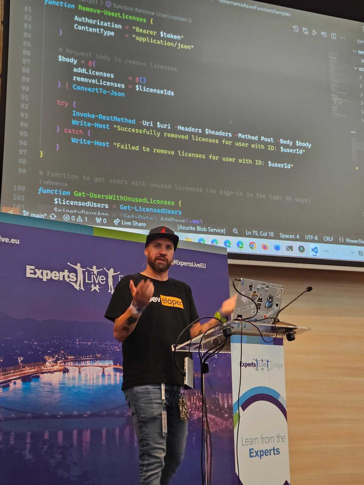
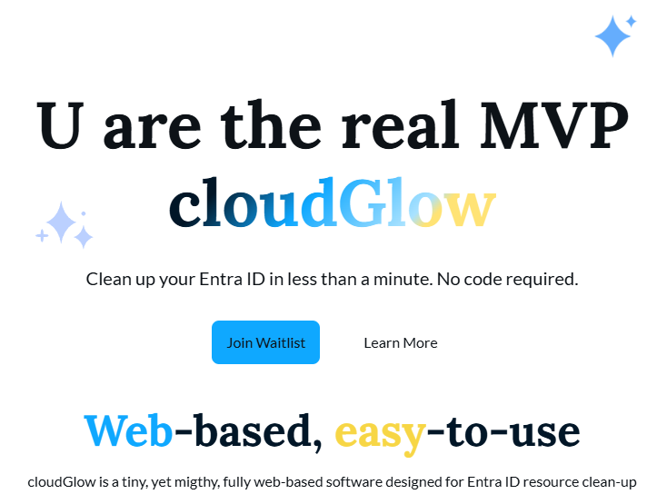

---
{
title: "Recap of Experts Live 2024 in Budapest: Three Days of Cloud, Code, and Connections",
published: "2024-10-07T13:48:51Z",
tags: ["event", "community", "azure", "showdev"],
description: "In a previous post I wrote why it's important to join events and especially, in this case, Experts...",
originalLink: "https://dev.to/this-is-learning/recap-of-experts-live-2024-in-budapest-three-days-of-cloud-code-and-connections-189h",
coverImg: "cover-image.png",
socialImg: "social-image.png"
}
---

In a previous post I wrote why it's important to join events and especially, in this case, Experts Live Europe.

<!-- ::start:link-preview -->
[Why you should attend Experts Live Europe 2024 in Budapest: Unlocking Opportunities in the Heart of Innovation](/posts/why-you-should-attend-experts-live-europe-2024-in-budapest-unlocking-opportunities-in-the-heart-of-innovation-3pbg)
<!-- ::end:link-preview -->

In this post I try to tell you why and how was my experience at the event.

Attending Experts Live 2024 in Budapest was an incredible experience from start to finish. After taking a long break from public speaking (since December last year), I jumped right back into the mix at this three-day conference filled with workshops, sessions, and plenty of networking.

### Day 0: Workshop Day

The official first day of Experts Live is workshop-focused, but I spent this day getting into the rhythm of the event and reconnecting with familiar faces from past conferences. It was a great chance to absorb the energy of the community before the sessions kicked off. Seeing so many attendees eager to learn about cutting-edge tech was a reminder of the power and passion of this industry. While I didn't present on workshop day, I took full advantage of the opportunity to do some networking and refine some last-minute details for my upcoming session.

### Day 1: **Ask The Experts** and My Session on Azure Functions & Graph API

The real action for me started on day one of the conference. I was part of the **Ask The Experts** panel, focusing on Cloud, which was an excellent warm-up for my later session. I fielded questions about Azure OpenAI and other questions about integrations between Azure and local data.

I took this picture with my friend [Jonah Andersson](https://www.amazon.com/Learning-Microsoft-Azure/dp/1098113322), the author of one of the best book about Azure I ever read.

#### My Session: *Attack of the Clones: Multiply Your Microsoft 365 Governance Superpowers with Azure Functions*

That afternoon, I had my main speaking slot with my session titled *"Attack of the Clones: Multiply Your Microsoft 365 Governance Superpowers with Azure Functions."* I co-presented with my business partner and friend, Kasia, which was a real highlight. Sharing the stage with someone you trust makes a huge difference, especially when you’re diving deep into technical demos. It felt great to be back up there after my long public-speaking hiatus, and I quickly found my flow.

The session focused on using **Azure Functions** in combination with **Microsoft Graph API** to automate and manage Microsoft 365 governance tasks. We went through several demos where we showcased how developers can leverage Azure Functions to clone governance policies and apply them across their tenants—essentially multiplying their capabilities without duplicating their workload.

The audience engagement was awesome, with a lot of questions coming in. One thing that stood out was how the attendees resonated with the simplicity and power of the approach we demonstrated. After the session, many participants came up to us, expressing how they could apply these ideas immediately to improve their own workflows.

Getting back into the groove of public speaking was smoother than I expected. This was my first talk in a long time, but the room’s enthusiasm made it easy to get back into the swing of things. There’s nothing quite like the feeling of real-time interaction when your demos hit the mark and your approach connects with the audience.

#### Official Launch of cloudGlow During the Session

One of the most exciting moments of our session was the official launch of **cloudGlow**, our new web-based governance tool for managing **Entra ID** resources on Azure. We chose Experts Live as the perfect venue for the announcement because it’s filled with IT pros and developers who understand the complexities of governance in the Azure ecosystem. cloudGlow simplifies the lifecycle management of app registrations and other Entra ID resources, giving users a streamlined experience right from their own Azure tenant.

If you're curious to check it out, the waiting list is open, and you can sign up now at [cloudglow.io](https://www.cloudglow.io/).

#### The Impact on LinkedIn and the Community

One thing that really surprised and humbled me was how many people tagged me on LinkedIn after the session. It was clear that the demo-driven approach struck a chord with the audience. Several attendees mentioned that our session gave them new ways of thinking about governance automation and they were eager to implement what they had learned. The fact that people were sharing insights from our session online shows the power of community learning—something that’s a hallmark of events like Experts Live.

### Day 2 & 3: Networking and Reconnecting

The remaining two days of the conference were filled with parties, networking events, and catching up with old friends—people I hadn’t seen in far too long due to the pandemic. It was great to have meaningful conversations, discuss industry trends, and even talk about potential collaborations. These events are about more than just sessions—they’re about building and maintaining relationships within the community. Whether it was chatting with fellow .NET developers, Azure architects, or those just starting their cloud journeys, the conversations were always valuable.

Experts Live is unique in how it balances deep technical content with an emphasis on community, and this was evident at every turn. After the past few years of virtual interactions, it felt amazing to be part of an in-person event again.

### Conclusion

Experts Live 2024 was a brilliant reminder of why these events are so important. It's not just about the sessions—though those were excellent—but about the connections, the community, and the sense of shared learning that happens when people passionate about technology come together. I left Budapest energized, full of new ideas, and with a lot of LinkedIn connections to follow up with!

For those of you who couldn’t attend, I’ll be sharing more detailed technical breakdowns from the session soon. And if you were there, thank you for making it such a memorable experience. Looking forward to the next one!

---

**Exciting News!** 🌟\
We're thrilled to introduce **[cloudGlow](https://www.cloudglow.io)** — a powerful governance tool designed to streamline the management of **Entra ID resources** on **Microsoft Azure**.\
**Visit [www.cloudglow.io](https://www.cloudglow.io)** to learn more, get early access, and **subscribe** to our preview! Stay ahead of your cloud management game with **cloudGlow**. 🚀
