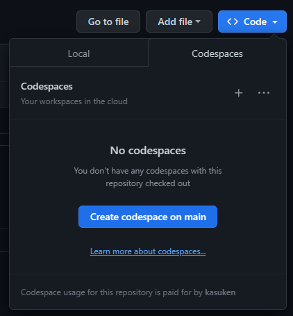
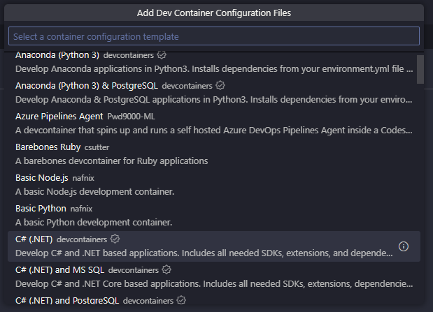
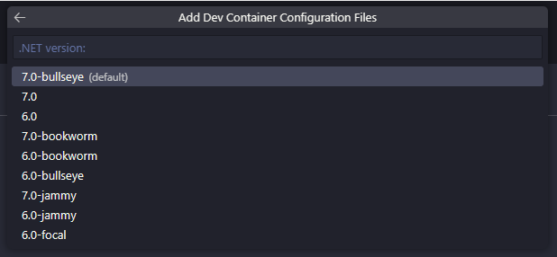
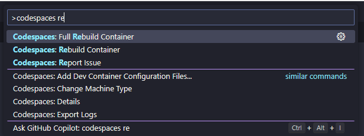

---
{
title: "Set up GitHub Codespaces for a .NET 8 application",
published: "2023-11-21T20:38:45Z",
tags: ["dotnet", "github", "productivity", "docker"],
description: "A few days ago Microsoft released the new version of .NET: .NET 8. This is the stable version of the...",
originalLink: "https://dev.to/this-is-learning/set-up-github-codespaces-for-a-net-8-application-5999",
coverImage: "cover-image.png",
socialImage: "social-image.png",
collection: "GitHub Codespaces: A Faster Way to Develop in the Cloud",
order: 2
}
---

A few days ago Microsoft released the new version of .NET: .NET 8.
This is the stable version of the latest framework by Microsoft.
If you are not able or not sure to install the latest .NET version on your local machine, starting to develop projects with GitHub Codespaces should be a good alternative.

In this article, I will show you how to set up a GitHub Codespaces for a .NET 8 application. We will see:

- Create a GitHub Codespace for your .NET 8 project
- Install the .NET 8 SDK and runtime in your GitHub Codespace
- Write and run a simple Blazor app in your GitHub Codespace
- Use Visual Studio Code features and extensions to enhance your development experience in your GitHub Codespace

Let’s get started!

## Build a container for a .NET 8 project

### Create a default Codespace for the repo

Navigate to your repo and from the "Code" button, select "Codespaces" and then "Create Codespace on the main"



Keep in mind, each Codespace is relative to the branch (by default)

### Create a default image Codespace

When the Codespace is ready, open the Command Palette with the shortcut Shift+Command+P or Ctrl+Shift+P on Windows.
Search for "Codespaces" and choose "Add dev container configuration files".
Choose "Create a new configuration" and then in the following step, click on "Show All Definitions".
Scroll and choose "C# (.NET)".



Choose "7.0-bullseys" or "7.0".



Skip the next step by clicking on "Ok".

## Change the devcontainer.json file

After the wizard, GitHub Codespaces, open the new devcointainer.json file for you.
This is fine but it's not for .NET 8 application.
Select all the file content and replace with the following devcontainer.json file.



## Let's understand what's inside

As you can see, in the features section, there a lot of entries:

```json
    "features": {
        "ghcr.io/devcontainers/features/docker-in-docker:2": {},
        "ghcr.io/devcontainers/features/github-cli:1": {
            "version": "2"
        },
        "ghcr.io/devcontainers/features/powershell:1": {
            "version": "latest"
        },
        "ghcr.io/azure/azure-dev/azd:0": {
            "version": "latest"
        },
        "ghcr.io/devcontainers/features/common-utils:2": {},
        "ghcr.io/devcontainers/features/dotnet:2": {
            "version": "none",
            "dotnetRuntimeVersions": "7.0",
            "aspNetCoreRuntimeVersions": "7.0"
        }
    }
```

This section is not mandatory but it adds some useful features in your codespace like the GitHub CLI, PowerShell (latest version) and other command line tools for Azure.
When you rebuild the cointaner with the new parameters it will take a while because it needs to install some packages to enable all these features.

In the VS Code Extensions, as you can see, the devcontainer will add some extensions just for this container and not for all of your projects or VS Code instances.

```json
        "vscode": {
            "extensions": [
                "ms-vscode.vscode-node-azure-pack",
                "GitHub.vscode-github-actions",
                "ms-dotnettools.vscode-dotnet-runtime",
                "ms-dotnettools.csdevkit",
                "ms-dotnetools.csharp"
            ]
        }
```

The most important extensions here are the C# Dev Kit (you need a Visual Studio License for this one) and C# extension.
They will add a better development experience for .NET and C#.

In this particular container I will add a postCreateCommand for restoring packages when the container is launched.
You don't need to launch this command manually everytime or you don't need to wait minutes when you launch the application.

`"postCreateCommand": "cd ./demo001 && dotnet restore"`

"demo001" is the name of project folder. Change it according your project name (if you have the project in a subfolder).

My Blazor application running on the port 44380. This is the reason why in the "ports" section I added the following settings:

```json
    "forwardPorts": [
        44380
    ],
    "portsAttributes": {
        "44380": {
            "label": "App",
            "onAutoForward": "notify"
        }
    }
```

It means that by default the port 44380 is forwarded to permit the navigation from the browser, and you see the name "App" in the Ports section inside Visual Studio Code.
You will also receive a notification when you start the project and the port becomes active.

## Rebuild the Container

When everything is ready, you need to rebuild the container from with the new settings.
To rebuild the container, open the Command Palette again and choose "Codespaces: Full Rebuild Container"



After few seconds your Codespace will restart and you will be redirected on the loading screen.
As I mention at the beginning of the article, it takes a while to rebuild the container (only the first time) because GitHub Codespaces needs to download and install some packages for the features we added in the devcontainer definition.

## Conclusion

In this article, you have learned how to set up a GitHub Codespace for a .NET 8 application. You have seen how easy and convenient it is to use GitHub Codespaces to code and build your .NET 8 project from anywhere. You have also explored some of the Visual Studio Code features and extensions that can enhance your development experience in your GitHub Codespace. GitHub Codespaces is a powerful tool that can help you save time, resources, and hassle when working on .NET 8 projects.

I hope you have enjoyed this article and found it useful. If you have any questions or feedback, please leave a comment below. Thank you for reading! 😊.

---


If you enjoyed this blog post and want to learn more about C# development, you might be interested in subscribing to my bi-weekly newsletter called Dev Dispatch. By subscribing, you will get access to exclusive content, tips, and tricks, as well as updates on the latest news and trends in the development world. You will also be able to interact with me, and share your feedback and suggestions. To subscribe, simply navigate to https://buttondown.email/kasuken?tag=devto, enter your email address and click on the Subscribe button. You can unsubscribe at any time. Thank you for your support!
