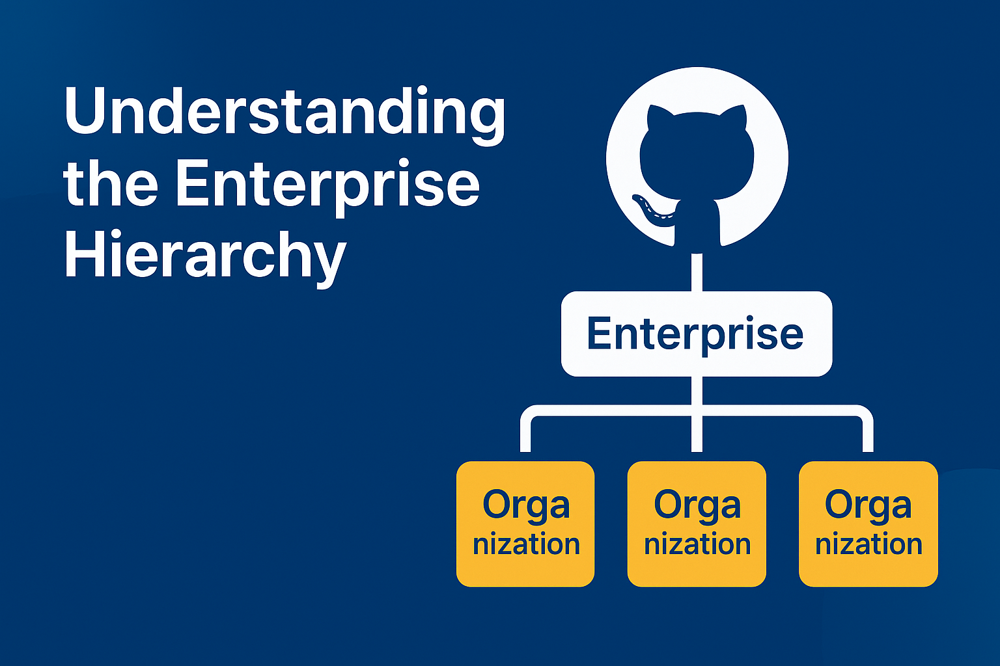
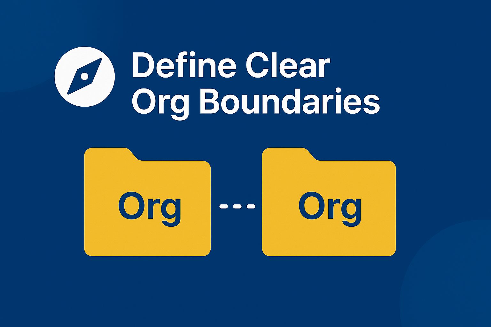
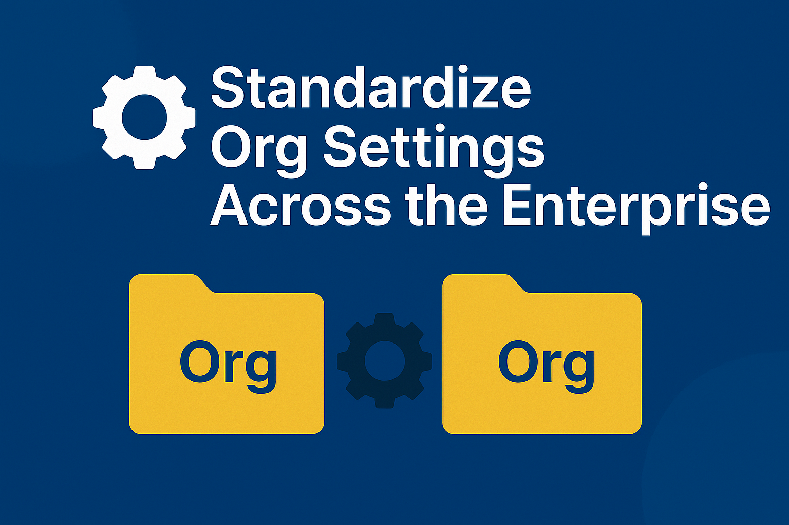
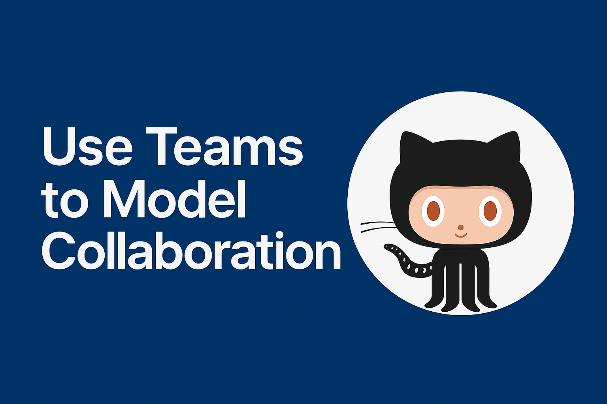
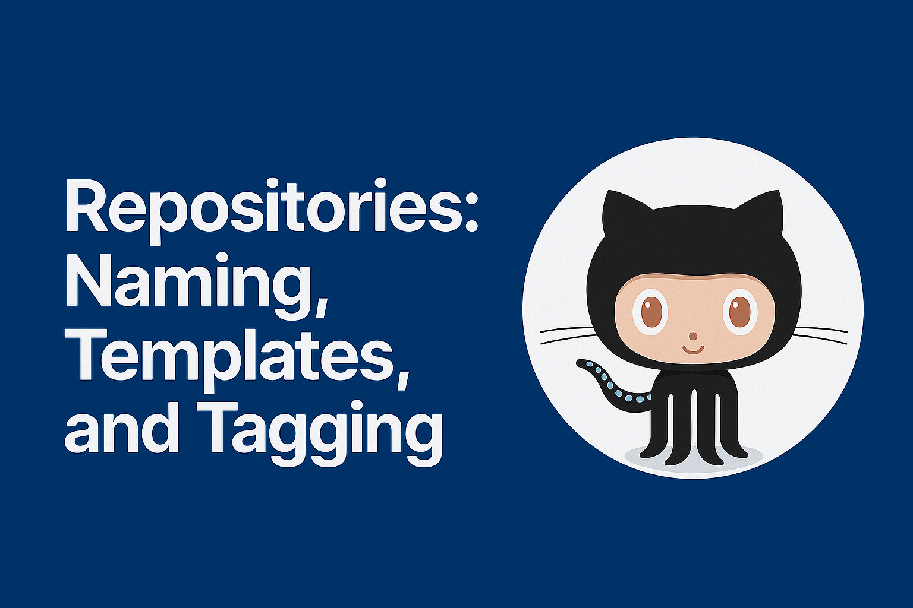
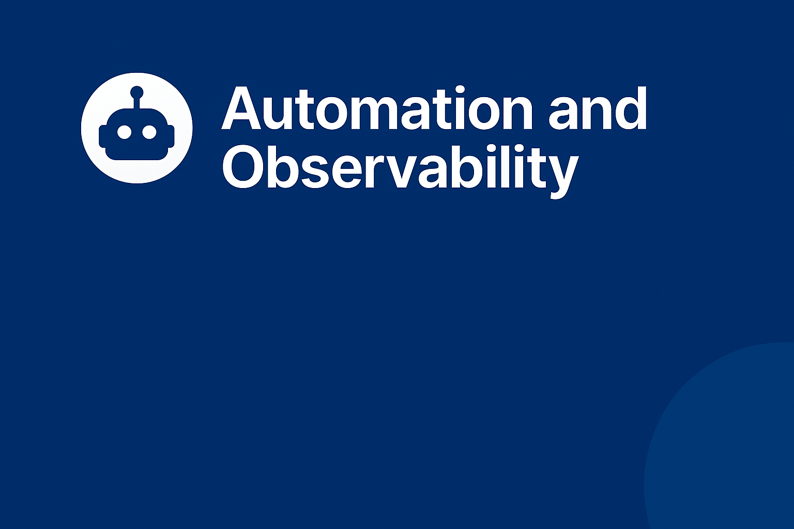

---
{
title: "Structuring GitHub Enterprise: Best Practices from the Org Level Down",
published: "2025-06-17T10:38:11Z",
tags: ["github", "githubactions"],
description: "Ever joined a GitHub Enterprise and thought, “Who organized this… chaos?”   I created this post...",
originalLink: "https://dev.to/this-is-learning/structuring-github-enterprise-best-practices-from-the-org-level-down-45i5",
coverImage: "cover-image.png",
socialImage: "social-image.png"
}
---

> Ever joined a GitHub Enterprise and thought, *“Who organized this… chaos?”*

I created this post because in the last few months I always got the same questions from customers about how they could structure GitHub Enterprise, especially something like: *“How many organizations I need to create?”*

GitHub Enterprise is incredibly powerful — but only if it's structured right. As your engineering org grows, so does your sprawl: multiple organizations, dozens (or hundreds) of repositories, unclear team access, and policies all over the place. The result? Confusion, security gaps, and onboarding pain for every new dev.

I’ve seen GitHub Enterprise setups ranging from tightly governed to *wild west* mode, and the difference usually comes down to one thing: **how well the org is structured**.

This post is based on my experience, mixed with the best practices provided directly from GitHub.

---

## 🏢 Understanding the Enterprise Hierarchy



Before you can optimize your GitHub setup, it’s important to understand the **three key layers** in a GitHub Enterprise environment:

### 1. GitHub Enterprise Account (Top-Level)

This is the umbrella account that holds everything. It includes:

- **Billing and licensing**
- **Audit logs** across all organizations
- **Enterprise-wide policies** (like 2FA, repository rules)
- **SSO & SCIM integration** with your identity provider (e.g., Azure AD, Okta)

You usually won’t push code here — this is where governance and control happen.

### 2. Organizations (Middle Layer)

Organizations are logical groupings under the Enterprise account. Each one has:

- Its own **members, teams, and repositories**
- Its own **settings and policies**
- Use cases like:

  - Different **business units** (`mycompany-core`, `mycompany-research`)
  - **External collaboration** zones (`mycompany-partners`)
  - Open-source/public initiatives (`mycompany-oss`)

> Tip: If different departments need different visibility, access policies, or collaboration models, it might be time to split into multiple orgs.

### 3. Teams and Repositories (Bottom Layer)

Inside each org, you define:

- **Teams** to group developers (more on this later)
- **Repos** that are owned and maintained by those teams
- **Access control** via team-based permissions

This is where day-to-day developer activity happens — cloning, coding, PRs, reviews.

---

## 🧭 Define Clear Org Boundaries



As I mentioned at the beginning of the article, one of the first big decisions in GitHub Enterprise is:
***How many organizations should I have?***

There’s no one-size-fits-all answer, but here’s a rule of thumb:

> Create a new org when access rules, visibility needs, or ownership differ significantly.

### 🚦 When to Create a New Organization

- **By Business Unit**
  Example: `mycompany-core`, `mycompany-research`, `mycompany-ml`
  Useful when teams operate independently or have different release cadences.

- **By Business Context**
  Example: `mycompany-support`, `mycompany-frauddetection`, `mycompany-underwriting`
  Useful when teams operate on a specific context.

- **For External Collaboration**
  Create a separate org (e.g. `mycompany-partners`) with stricter boundaries and fewer permissions.

- **By Region or Legal Entity**
  Helpful in global companies with compliance or legal isolation requirements.

- **For Open Source Projects**
  Public repos often go into a clean, separate org (e.g. `mycompany-open`) to avoid leaking internals.

### ❌ When *Not* to Create a New Org

- If the **same teams** need access to most repos
- If your **SSO policies** are identical across groups
- If managing multiple orgs introduces unnecessary complexity

### ✅ Pro Tips

- Give each org a **clear owner** (individual or team)
- Use **naming conventions** (e.g. `mycompany-[scope]`) to keep things consistent
- Regularly audit orgs — many enterprises discover ghost orgs with no activity or unclear purpose

---

## ⚙️ Standardize Org Settings Across the Enterprise



Once you have your organizations defined, the next step is making sure they **follow consistent rules**. GitHub Enterprise lets you apply **policies and settings** across all orgs — don’t let that power go unused.

### 🛡️ Enforce Enterprise-Wide Policies

At the enterprise level, you can enforce critical standards like:

- **Two-Factor Authentication (2FA)**
- **SSO Enforcement**
- **Repository Visibility Rules**
- **Disabling Forks** for private code

> Tip: These policies apply uniformly across all orgs, reducing the risk of “accidental exposure.”

### 🧰 Use Tools to Keep Things Aligned

- **GitHub CLI (`gh`)**
- **GitHub REST API**

> Tip: I am working on a governance tool for it, but I cannot spoil anything yet 😄

### 📋 Common Settings to Standardize Across Orgs

- Default branch name (`main`)
- Repo creation permissions
- Issue and PR templates
- Required review rules (branch protections)

> Pro tip: Create a **“blueprint” org** with ideal settings, then replicate them when spinning up new orgs. Usually it's also a good idea to have scripts to replicate everything in just "one click"

---

## 👥 Use Teams to Model Collaboration



### 🧩 Functional vs. Project-Based Teams

- **Functional Teams**: `frontend-devs`, `platform-engineering`, `qa-automation`
- **Project-Based Teams**: `checkout-service`, `billing-revamp`, `ml-platform-v2`
- Combine both with **nested teams**: `platform-engineering/api-core`

### 📐 Naming Conventions That Scale

- Use kebab-case: `team-name-subgroup`
- Prefixes: `eng-data`, `design-system`, `ops-infra`
- Avoid names like `devs` or `testers`

### 🔐 Use Teams for Permissions — Never Individuals

Example:

```bash
gh team add-repo eng-api my-org/api-service --role write
```

> Bonus: Sync teams with Azure AD or Okta groups for zero-touch management.

---

## 📦 Repositories: Naming, Templates, and Tagging



### 🏷️ Use Human-Friendly Naming Conventions

- `web-auth-service`, `data-ingestion`, `infra-terraform-modules`
- Avoid: `test123`, `stuff`, `backend-copy-2`

### 📄 Standardize with Templates

- `README.md`, `LICENSE`, `SECURITY.md`, issue/PR templates
- Create new repos from templates:

```bash
gh repo create my-org/new-service --template my-org/service-template
```

### 🧠 Tag with Topics

Examples: `backend`, `terraform`, `internal-tool`, `demo`

> Standardize topic names to avoid fragmentation.

---

## 🔐 Permissions and Security — Without Pain (or at least, less pain)


### 🎯 Follow the Principle of Least Privilege

| Role         | When to use                        |
| ------------ | ---------------------------------- |
| **Read**     | View code, issues, discussions     |
| **Write**    | Contribute via branches or PRs     |
| **Maintain** | Manage issues, settings, workflows |
| **Admin**    | Full control (use sparingly!)      |

Always assign roles to **teams**, not users.

### 🛡️ Protect Main Branches

- Require PR reviews
- Require CI checks
- Restrict force-pushes and deletions

### 👥 Use CODEOWNERS

```text
/apps/web-ui/*  @frontend-team
```

### 🔍 Enable Security Features

- Dependabot alerts and updates
- Code scanning (CodeQL)
- Secret scanning

---

## 🤖 Automation and Observability



### 🔁 Automate the Repetitive Stuff

Example: Auto-approve Dependabot PRs:

```yaml
on: pull_request
jobs:
  auto-approve:
    runs-on: ubuntu-latest
    if: github.actor == 'dependabot[bot]'
    steps:
      - uses: hmarr/auto-approve-action@v3
        with:
          github-token: ${{ secrets.GITHUB_TOKEN }}
```

### 🛠 Tools to Keep GitHub Clean

- **GitHub Insights**
- **Audit Logs**
- **Dashboards** via OctoGraph, Power BI, or custom scripts (or the tool I am developing 🚀)

---

## 😬 Common Pitfalls (and How to Avoid Them)


- **Org Sprawl**: too many orgs, unclear ownership
- **Permission Spaghetti**: direct user access = hard to manage
- **Ghost Teams/Repos**: cleanup abandoned projects
- **No Ownership**: missing `CODEOWNERS` or `MAINTAINERS.md`
- **Security Alerts Ignored**: monitor and act on them

---

## 🚀 TL;DR — Set Up GitHub Enterprise for Scale

GitHub Enterprise is powerful, but only if you treat it like production infrastructure — with intention, automation, and clear ownership.

---

🧠 Tired of Copilot guessing your coding style?

I got you. Head over to [copilotinstructions.xyz](https://www.copilotinstructions.xyz) and grab some battle-tested `copilot-instructions.md` files for PowerShell, C#, Blazor, and more.
🤖 Turn Copilot from **helpful-ish** to **heck yeah, that's exactly what I meant.**

Fork it, tweak it, make it yours. Because Copilot deserves good instructions too.
