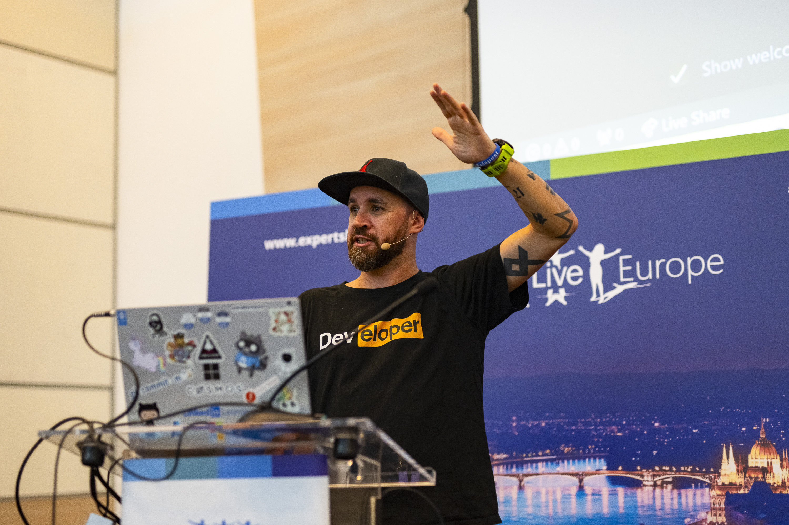
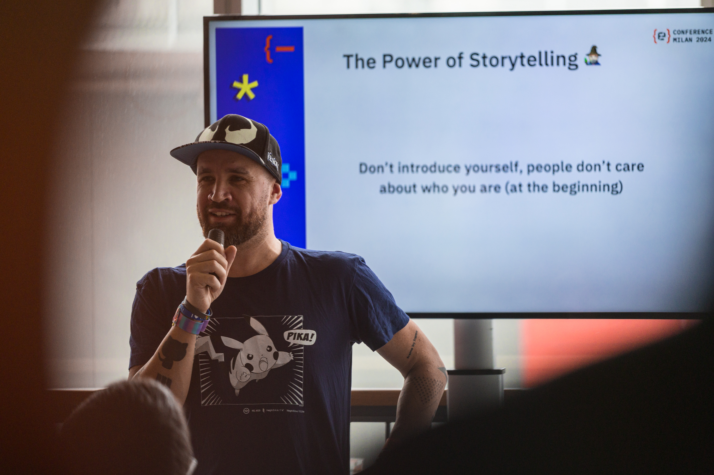
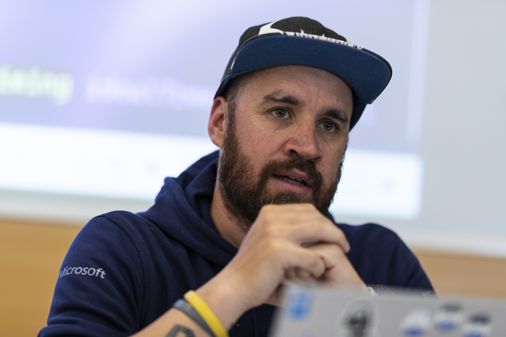

---
{
title: "The Secret Life of a Microsoft MVP",
published: "2024-12-10T10:30:00Z",
edited: "2025-06-16T08:11:18Z",
tags: ["microsoft", "devlife"],
description: "For over a decade now (11 years right now), I’ve carried the title of Microsoft Most Valuable...",
originalLink: "https://dev.to/this-is-learning/the-secret-life-of-a-microsoft-mvp-3dal",
coverImage: "cover-image.png",
socialImage: "social-image.png"
}
---

For over a decade now (11 years right now), I’ve carried the title of **Microsoft Most Valuable Professional** (MVP), a role that has shaped my career but also my identity within the tech community. When I first received that congratulatory email, I felt an exhilarating rush of pride and excitement. I knew it was an honor that came with responsibility, but at the time, I couldn’t fully grasp just how deep this lifestyle would run. Now, after many years of wearing this badge, I can tell you: being an MVP isn’t just a title you add to your résumé; it’s a **way of life**.

The MVP program is a recognition granted by Microsoft to individuals who consistently **share their passion** and technical expertise with the world. We’re not Microsoft employees, but rather community contributors who help others navigate products, learn new skills, and solve tricky problems. In my case, this has meant juggling countless blog posts, meetups, and conferences.

Becoming and staying an MVP demands consistent effort: keeping pace with rapidly evolving technologies, finding time amid daily work and family life to create valuable content, and repeatedly testing the latest features so that I can share reliable insights. Yet, the reward is not just a shiny badge or a private invitation to Microsoft events. It’s the moment someone says, “Thank you, your blog helped me land my first tech job,” or "Thanks for your presentation, it was really interesting and inspirational".

Through ups and downs, late-night debugging sessions, and early-morning blog editing (at least for me), I’ve learned that life as an MVP is a continuous journey of **learning**, **teaching**, **inspiring**, and community engagement.

It’s a secret life that most people outside this circle will never fully understand, and this is the reason why I decided to write this blog post.
I don't want to tell you "How to become a Microsoft MVP", because I don't like that kind of contents or sessions, but I will try to tell you what we are doing, so you can understand better if you are ready to embark this adventure.

## A Day in the Life of a Microsoft MVP

When people hear I’m an MVP, they sometimes imagine a glamorous life filled with exclusive perks and VIP treatment. The truth, however, is far more down-to-earth and, in many ways, more fulfilling. On a typical day, I start off early—often before the rest of my household wakes up—catching up on the latest Microsoft announcements, community posts, and tech trends. This quiet morning time is when I plan what I’ll tackle next. Maybe I need to finish editing a blog article about a new Azure feature, record a screen-sharing demo, or prepare a few slides for an upcoming event or meetup. These small tasks are what fuel my ongoing contributions.

As I move into my workday, I’m usually balancing multiple hats. I have a “day job” that keeps me busy with my products, client meetings, internal team meetings, and deadlines. Being an MVP doesn’t excuse me from that because it’s something I do in addition to my professional responsibilities. I’ll often find myself toggling between a client’s code review and a blog post or a video, switching from solving a tough architectural issue to answering a message on Discord or Slack. It can be a bit like mental gymnastics, but I’ve come to appreciate how these interactions keep me sharp.

By the afternoon, I might set aside a bit of time to learn something new. The pace of technological change is relentless (especially now in the AI era), and as an MVP, I **need to stay ahead of the curve**. I’ll spin up a test environment in Azure or install a new preview release, trying out features well before they’re widely available. There’s a certain thrill in discovering what’s possible and imagining how I can explain it to my audience in a way that’s both accurate and accessible.
Very often I use multiple virtual machines on Azure to test some products because I don't want to use my "daily" machine because I want to stay productive when I work and not waste time on something that doesn't work because it's a preview or something.

Of course, it’s not all work. I’m a athlete (or at least I try to be), a parent, a friend. I set boundaries—closing my laptop at dinner, making time on weekends for family outings, stepping back when I need to recharge. There are nights when I’ll skip community work entirely to watch a movie, play a game, or just wasting times on some trash TV shows. The key is finding a balance that allows me to maintain my enthusiasm over the long haul.

Evenings, after everyone else has settled in, are often my time for more focused community efforts. Maybe I’ll conduct a live stream, or finalize a blog post I’ve been drafting for weeks. Or perhaps I’ll be invited to a late-night call with a product team at Microsoft, giving feedback on a feature still in development. This is the hidden side of being an MVP—these small, sometimes behind-the-scenes engagements that help shape the direction of the tools we all rely on.

By the time I wrap up, I’m usually tired, but fulfilled. I know that every day I spend as an MVP is **another chance to learn something fresh**, share what I’ve discovered, and connect with people who are as passionate about technology as I am. It’s not just a title I carry; it’s a lifestyle defined by **curiosity**, **generosity**, and a persistent drive to give back to a **community** that has given me so much (more than I can describe).

## The Challenges of Being an MVP

I’ll be honest: being an MVP isn’t always smooth sailing. For every moment of excitement and discovery, there are challenges lurking behind the scenes. One of the hardest parts for me, personally, is keeping up with the relentless pace of technology. Microsoft’s ecosystem evolves at a dizzying speed—new features roll out, old ones get deprecated, product lines pivot in response to market changes, and entire development paradigms can shift in what feels like the blink of an eye. Remaining well-versed across multiple product lines is no small feat. I’ve had days where I wake up to an announcement that fundamentally alters how I think about a certain solution. In those moments, I know I have to invest time—often my own personal time—to learn, adapt, test, and figure out how to communicate these changes to my audience (and customers) clearly and accurately.

**Time management** itself can become a trial. This is one of the reason why I started to use a **Second Brain** system a few years ago. Finding a rhythm that allows me to keep my enthusiasm intact while ensuring I don’t burn out is a constant balancing act.

Then there’s the visibility that comes with being an MVP. Let’s face it: when you put yourself out there in the public eye—hosting webinars, writing articles, speaking at events, you open the door to feedback, both good and bad. Constructive criticism can be immensely helpful, guiding me to improve my content or correct a misconception. But sometimes, there’s negativity that doesn’t add value—snarky comments online, people who dismiss my insights without a fair hearing, or individuals who assume MVPs are mere “spokespeople” for Microsoft. This can be discouraging, especially if I’m already feeling stretched thin. Over time, I’ve learned to develop a thicker skin and focus on the positive impact I’m making. I have to remind myself why I do this in the first place: **it’s about the community, not the critics**. It's about my experience, not the absolute truth.

Coping with these challenges often involves leaning on others. The MVP community itself is incredibly supportive. We regularly share experiences, tips for time management, and advice on staying current. There’s a camaraderie that comes from knowing we’re all facing similar pressures. We celebrate each other’s wins and provide a shoulder to lean on during tougher moments. Outside of the MVP circle, my friends and family are also crucial. They help remind me that there’s more to life than the next product release or blog post. Even stepping away from technology entirely—taking a walk, playing sports, spending time on a non-tech hobby—can recharge my batteries and put everything back into perspective.

In the end, I cope by accepting that challenges are inevitable. Nothing worthwhile comes without effort. I try to view **each difficulty as part of my growth**: staying ahead of the technology curve makes me a more knowledgeable professional, managing my time more efficiently helps me deliver better quality content, and learning to handle criticism with grace makes me a stronger, more empathetic community leader. I’ve come to realize that challenges don’t define me, they refine me. They force me to innovate in how I learn, communicate, and give back.

## The Rewards of Being an MVP

Despite all the challenges—balancing my schedule, staying current with technologies, and dealing with the occasional critic, there’s no question that being an MVP comes with its fair share of rewards. Some are more tangible than others, but each one continually reminds me why **I’ve invested so much time and effort into this role**.

One of the most exciting perks for me is getting early access to new tools and features. It’s hard to overstate how invigorating it feels to try out a service before it’s officially released, to tinker with preview builds, and to explore capabilities that many others won’t see for months. This early exposure equips me to share insights that truly matter. When I publish a blog post or give a talk about something fresh off the pipeline, I’m able to provide the community with a head start. Since the beginning, anyway, **I talk and write only about things I use daily basis at work**. I don't like to share opinions or advices about something that I don't really use. I prefer to talk about my experience. I’m not just saying, “Hey, here’s a feature that was released last year.” Instead, I’m guiding people through cutting-edge functionality that can shape their current and future projects.

Then there’s the opportunity to influence product direction directly. To be honest I don't use too much this opportunity just because I don't have too much time to follow also this thing, but in the past happened that I shared some opinions or feedbacks about a product or a framework.

There’s also a strong **sense of community among MVPs** themselves. We’re all going through similar struggles—juggling responsibilities, staying on top of shifting tech landscapes—and this shared understanding creates a network that feels more like a circle of friends than a professional group. We celebrate each other’s milestones, applaud new achievements, and support one another through tough times. There have been instances when I’ve hit a wall—a technical snag in a personal project or a tricky situation in a client engagement—and reaching out to a fellow MVP opened the door to fresh ideas and invaluable advice. This camaraderie extends beyond mere professional courtesy; it’s a bond forged by **mutual respect and a shared love** of technology.
This happened also recently with one of my product. I asked for advices or opinions to a lot of my MVPs friends.

Another powerful reward is the impact I get to have on others’ careers and learning journeys. When I receive a message from someone who landed their first tech job thanks to a tutorial I wrote or got their company’s infrastructure running more smoothly after following my tips, it’s hard not to feel deeply fulfilled. Moments like these remind me **why I started contributing** in the first place. I get to see firsthand how the community benefits from the hours I’ve poured into researching, writing, and presenting. That sense of purpose—knowing I’m helping people build their confidence, improve their skills, and ultimately advance their own careers—is an immeasurable reward that makes every late-night writing session or traveling for a talk worthwhile.

And, of course, the MVP program itself fosters numerous professional opportunities. There’s a certain credibility that comes with the title. Companies and conference organizers recognize the MVP brand as a hallmark of expertise and trust. Over the years, I’ve been invited to speak at events I never thought I’d attend, let alone headline. I’ve had the chance to write for renowned publications, collaborate with other industry leaders, and contribute to resources that reach far beyond my personal blog or local user group. These opportunities help me grow professionally and broaden my reach, **creating a positive feedback loop**: the more I contribute, the more I learn and connect, which in turn boosts the quality and depth of what I share with the community.

Ultimately, the rewards of being an MVP aren’t just personal perks—they’re about the larger ecosystem. They **push me to be better**, to **learn more**, and to **help others** grow. They’re reminders that this journey isn’t only mine; I’m part of a broader story involving countless professionals, learners, hobbyists, and innovators. As I watch features evolve, communities flourish, and people discover the joy of solving tough problems with technology, I know that the rewards far outweigh the hurdles. It’s these moments of satisfaction, influence, and human connection that keep me moving forward, grateful for the chance to play a unique role in this incredible community.

## Is Being an MVP for Everyone?

Looking back at the journey I’ve taken as a Microsoft MVP, I can confidently say that it has been one of the most meaningful and challenging endeavors in my professional life. It isn’t a path paved with ease; it’s an **ongoing commitment** that demands personal time, energy, and a willingness to constantly evolve. It’s not for everyone—and there’s no shame in that. To sustain the level of dedication required, you have to genuinely love the process: learning new technologies, breaking down complex concepts, communicating them clearly, and helping others find their own footing in a rapidly shifting landscape.

Over the years, I’ve come to realize that the MVP title is less about a one-time recognition and more about a way of being. It’s about how I approach learning and teaching, how I engage with the community, and how I respond to the changes and challenges that come my way. The program has taught me that expertise isn’t static; it’s constantly in flux. I need to keep pushing myself—trying new features, revisiting foundational principles, and staying curious—because there’s always more to learn. Ironically, the more I know, the more I realize how vast the universe of technology truly is.

This last sentence is written by my impostor syndrome that lives inside me.

For those who aspire to become MVPs, or for those who’ve recently received the award and are wondering what to do next, my advice is simple: start by **asking yourself what you love** about technology, and channel that enthusiasm. Don’t try to mimic someone else’s style or focus on checkboxes to meet an imaginary quota. Instead, identify where you can make a difference. Maybe you’re a natural at speaking and want to run community events. Perhaps you shine at writing long-form, in-depth tutorials. Or maybe you excel at creating concise, practical code samples that solve real-world problems. Embrace what you do best, because that’s where you’ll have the most impact.

Also, **be patient** with yourself. Building a reputation and refining your craft takes time—sometimes years. It’s easy to feel intimidated when you see established MVPs out there producing content at a rapid clip, but remember that everyone starts somewhere. Contribute what you can, learn from feedback, and let your contributions evolve organically. Over time, you’ll grow into your own voice and style, which is infinitely more valuable than trying to follow someone else’s footsteps too closely.

As I close this chapter, I know the journey isn’t over. The life of an MVP is a continuous loop of discovery, creation, and contribution. There will be more tools to learn, more community members to help, and more personal growth to achieve. But that’s the beauty of it: with each new challenge, I gain another reason to keep moving forward. And when I consider the collective energy and knowledge that the MVP community brings to the tech world, I’m proud to be a part of it. It’s a demanding role—but for those who feel the call, it’s one of the most enriching paths you can take.

---

🧠 Tired of Copilot guessing your coding style?

I got you. Head over to [copilotinstructions.xyz](https://www.copilotinstructions.xyz) and grab some battle-tested `copilot-instructions.md` files for PowerShell, C#, Blazor, and more.
🤖 Turn Copilot from **helpful-ish** to **heck yeah, that's exactly what I meant.**

Fork it, tweak it, make it yours.
Because Copilot deserves good instructions too.
