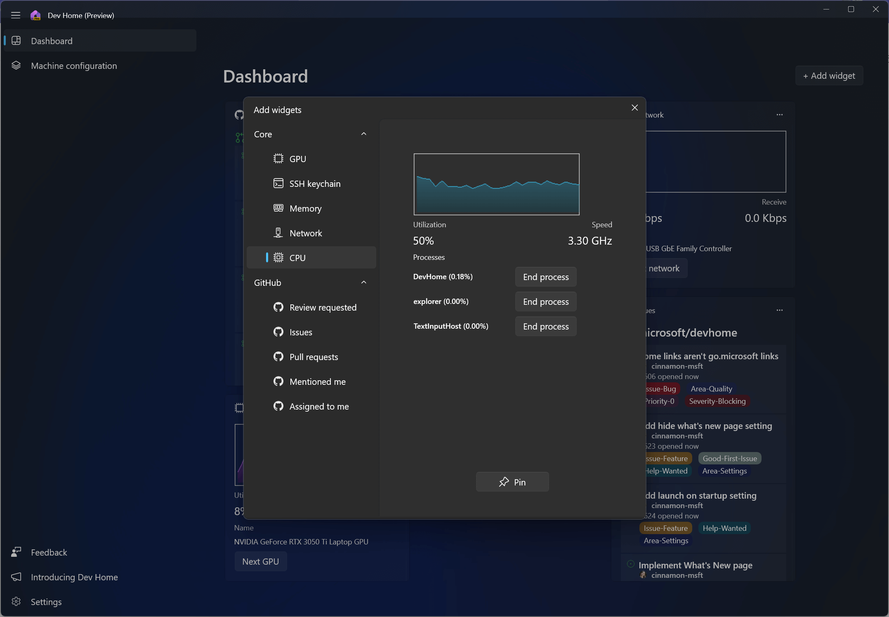
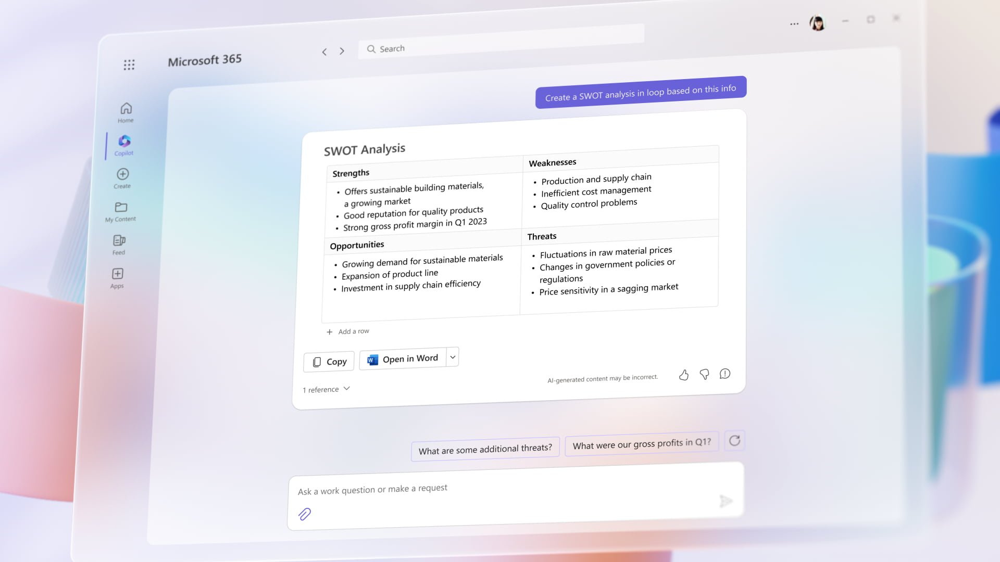
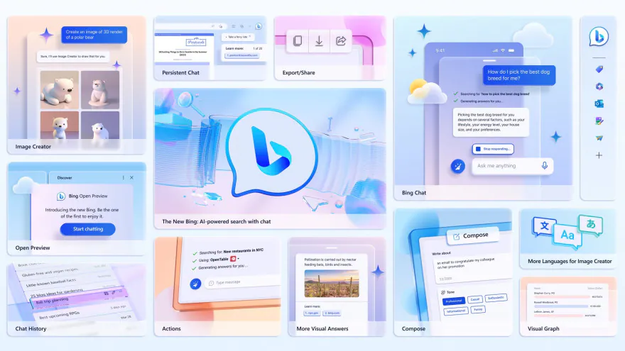
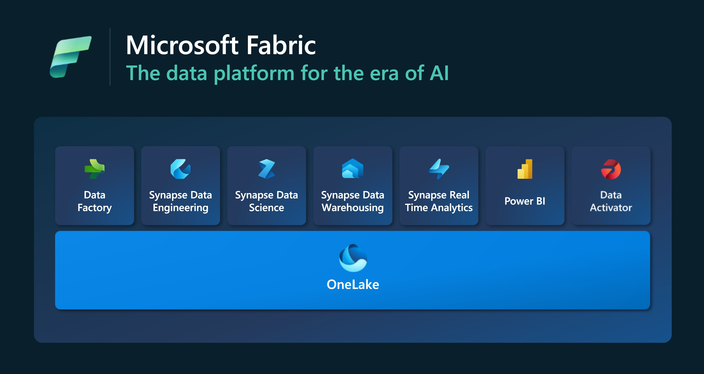

---
{
title: "The Top 5 Best Takeaways from Microsoft Build 2023",
published: "2023-05-26T21:34:00Z",
tags: ["microsoft", "ai", "devhome"],
description: "Microsoft Build 2023 was a three-day event that showcased the latest innovations and tools for...",
originalLink: "https://https://dev.to/playfulprogramming/the-top-5-best-takeaways-from-microsoft-build-2023-43nh",
coverImg: "cover-image.png",
socialImg: "social-image.png"
}
---

Microsoft Build 2023 was a three-day event that showcased the latest innovations and tools for developers. The event focused on how developers can use AI to create intelligent applications and experiences. Here are my top 5 best takeaways from the event, including my favorite DevHome:

## 1. DevHome: A new dashboard for Windows developers

DevHome is a new feature that will be integrated into Windows 11. It is an open-source dashboard that provides a set of tools and services to help developers set up and use Windows dev machines. DevHome allows developers to:

- Link their GitHub accounts and connect to relevant repos
- Install apps, tools, and packages using Windows Package Manager (winget)
- Configure coding environments in the cloud using Microsoft Dev Box and GitHub Codespaces
- Access Dev Drive, a new storage volume that uses ReFS and a performance mode for Microsoft Defender to improve build times and security
- View GitHub widgets that surface issues and pull requests
- Add custom extensions and integrations for DevHome

DevHome will make it easier for developers to get started, stay productive, and collaborate with others on Windows 11. DevHome will start to become available in preview for Windows 11 in June.

## 2. Windows Copilot: A new AI-powered assistant for Windows 11

Windows Copilot is another new feature that will be integrated into Windows 11. It is an AI-powered assistant that can help users with various tasks, such as searching the web, creating documents, managing files, and more. Users can access Windows Copilot by clicking a button on the taskbar, or by using voice commands. Windows Copilot will use natural language understanding and machine learning to provide relevant and personalized suggestions and actions. Windows Copilot will also leverage ChatGPT, a conversational AI system that can generate natural and engaging responses to any query.

## 3. Bing to ChatGPT: A smarter way to get answers

Bing is partnering with OpenAI to bring ChatGPT answers to its users. ChatGPT is a conversational AI system that can generate natural and engaging responses to any query. Bing users will be able to ask ChatGPT questions and get answers that are up-to-date, accurate, and sourced from Bing's web results. Users will also be able to see the source links for each answer, which will increase the trustworthiness and transparency of the service. The new experience is rolling out to ChatGPT Plus subscribers now and will be available to free users soon¹.

## 4. Bing Chat Plugins: A new way to integrate third-party apps with Bing

Bing is also introducing a new feature called Bing Chat Plugins, which will allow users to integrate third-party apps with Bing and ChatGPT. Users will be able to use other apps to provide data to Bing and ChatGPT in order to improve the quality of answers, or to access additional tools and services from third-party apps. For example, users can use a medical plugin to get information from reputable sources like Mayo Clinic or WebMD, or use a law plugin to get legal advice from experts like LexisNexis or LegalZoom. Users can also use plugins for entertainment, education, travel, and more. Bing Chat Plugins are based on an open plugin standard that Microsoft adopted from OpenAI, which will enable interoperability across ChatGPT and Microsoft's copilot offerings.

## 5. Microsoft Fabric: A unified platform for data professionals

Microsoft Fabric is a new platform that aims to simplify and streamline the work of data professionals. It is a one-stop shop for data integration, data engineering, data warehousing, data science, real-time analytics, applied observability and business intelligence. Microsoft Fabric leverages the power of Azure Synapse Analytics, Azure Machine Learning, Azure Purview, Azure Data Factory, Azure Databricks, Azure Stream Analytics, Azure Monitor, Power BI, and more. It also provides a unified user interface, a common metadata layer, and a shared security model across all these services. Microsoft Fabric will enable data professionals to increase their productivity, collaboration, and innovation like never before¹. Power BI customers can get access to Fabric today by turning on the Fabric tenant setting in the Power BI admin portal.

## Conclusion

In conclusion, Microsoft Build 2023 continued Microsoft's speedy developments in AI with many new useful features that developers and users can benefit from. The event demonstrated Microsoft's commitment to democratizing AI and empowering developers with tools and platforms that make their lives easier and their applications smarter.

---

Are you interested in learning GitHub but don't know where to start? Try my course on LinkedIn Learning: [Learning GitHub](https://bit.ly/learninggithub).

---

Thanks for reading this post, I hope you found it interesting!

Feel free to follow me to get notified when new articles are out 🙂

<!-- ::user id="kasuken" -->
