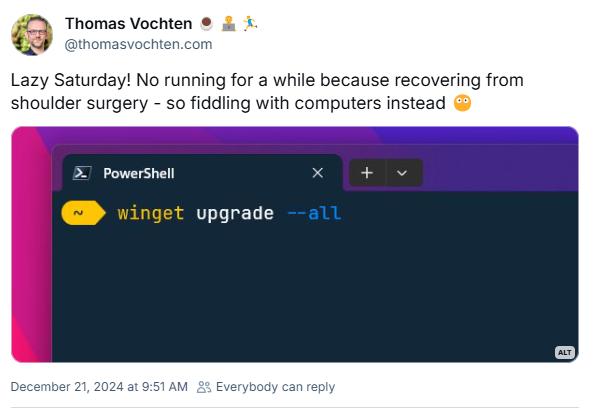
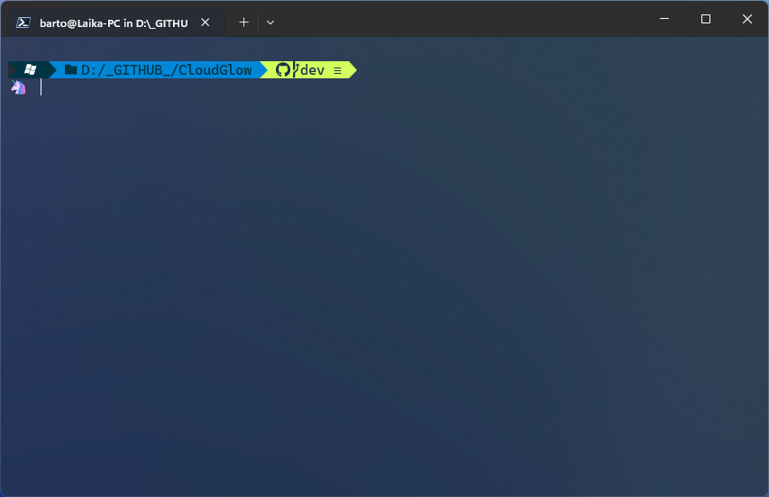
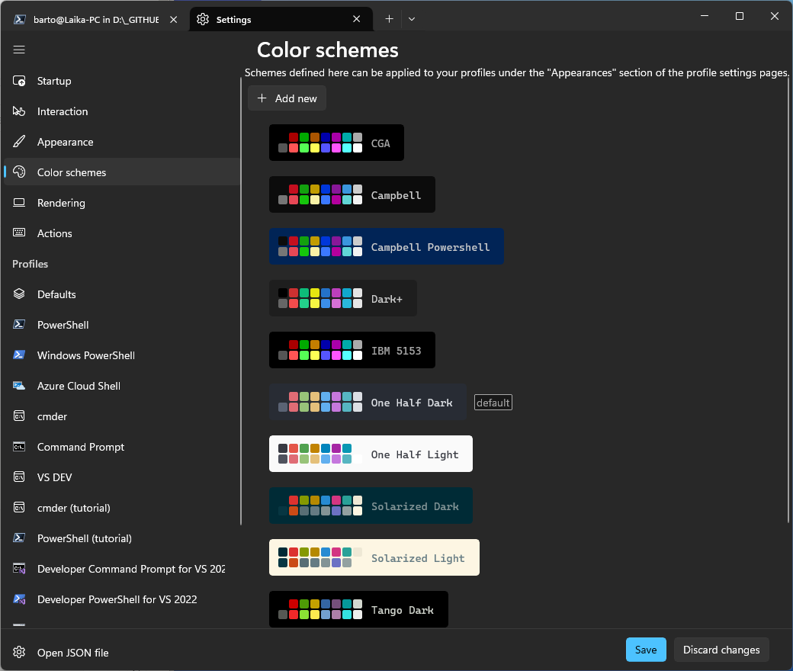
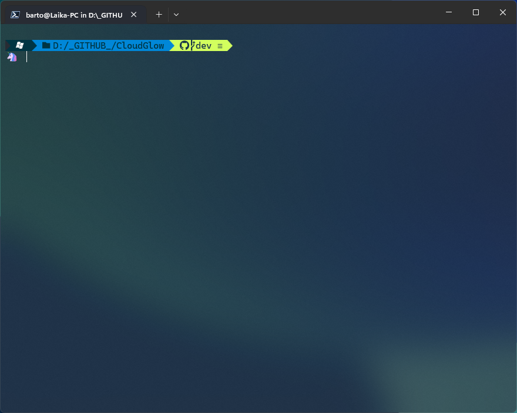

---
{
title: "Transforming Windows Terminal into a Productivity Powerhouse",
published: "2024-12-27T11:16:13Z",
tags: ["windows", "terminal", "cli"],
description: "Everything is started from this post on bluesky, by Thomas - ...",
originalLink: "https://dev.to/this-is-learning/transforming-windows-terminal-into-a-productivity-powerhouse-53d5",
coverImage: "cover-image.png",
socialImage: "social-image.png"
}
---

Everything is started from this post on bluesky, by Thomas -
https://bsky.app/profile/thomasvochten.com/post/3ldsjjmz6dk22



So, I decided to write this blog post. 😱

When it comes to terminal applications, customization can make all the difference. Whether you're coding, managing repositories, or presenting tutorials, a well-configured terminal can boost productivity and make your work more enjoyable.

For developers and Microsoft enthusiasts, **Windows Terminal** offers a modern, powerful, and highly customizable experience. With support for multiple profiles, themes, and third-party integrations, it allows you to tailor the interface to your needs.

In this post, I’ll walk you through my personalized Windows Terminal setup, optimized for **PowerShell**. From my favorite **color scheme** and **font choices** to advanced configurations like **Oh My Posh** and **Quake Mode**, you’ll learn how to create an efficient and visually appealing terminal environment.

---

## **Powering Up with Oh My Posh**

One of the easiest ways to make your terminal both stylish and functional is by using **Oh My Posh**—a prompt theme engine that enhances your PowerShell prompt with colors, icons, and useful information.

---

### **1. Installing Oh My Posh**

To install **Oh My Posh**, open PowerShell and run:

```powershell
winget install JanDeDobbeleer.OhMyPosh -s winget

```

If **winget** isn’t available, download it directly from the [Oh My Posh GitHub releases page](https://ohmyposh.dev/).

### **2. Configuring the Unicorn Theme (Online)**

Once **Oh My Posh** is installed, you can apply the **Unicorn** theme directly from an online source without needing to save it locally.

1. Open your PowerShell profile:

```powershell
notepad $PROFILE

```

2. Add the following line to load the **Unicorn** theme:

```powershell
oh-my-posh init pwsh --config https://raw.githubusercontent.com/JanDeDobbeleer/oh-my-posh/main/themes/unicorn.omp.json | Invoke-Expression

```

3. Save and close the file.
4. Apply the changes immediately by running:

```powershell
. $PROFILE

```

---



---

## **Fun Features: Quake Mode for Quick Access**

One of the coolest features in Windows Terminal is **Quake Mode**. Inspired by gaming consoles, this feature is perfect for multitasking and quickly running commands without leaving your workflow.

---

### **Launch Quake Mode**

1. Open Windows Terminal or Command Prompt.
2. Use the following command or create a new link on your taskbar:

```
wt -w _quake

```

Quake Mode use your default profile by default and you can have only a window at time with this particular mode.

When the Quake Mode windows is enabled, you can toggle it by using the keyboard shortcut.

```
Windows + `

```

Note: it's perfect for demoing!

---

### **When to Use Quake Mode**

- **Quick Access** – Open a terminal instantly without leaving your current task.
- **Multitasking** – Check logs or run short scripts without cluttering your workspace.
- **Presentations** – Toggle it on and off during tutorials for seamless demonstrations.

---

## **Best Practices for Windows Terminal Configurations**

### **1. Backup Your Settings**

Save your **settings.json** file regularly to sync configurations across devices.
Personally I use OneDrive.

### **2. Use Profiles for Different Tasks**

Create profiles for tutorials, debugging, or specific shells for easier management.

---

## **Color Scheme**

My default color scheme is **One Half Dark**, because it's good for mixing readability but at the same time is the right mix of cool colors. 🙂



## **Specific Profiles**

I didn't change the names of the default profiles provided by Windows Terminal, but only selected "PowerShell" as my default one.
Aside of that, when I have to share my screen or deliver webinar or courses, my fonts are not in the right size to do that.
So, I duplicated the PowerShell profile and I called it "PowerShell (tutorial)".
In the appearance settings of this specific profile, I change the font size from 12 to 26.


So, when I have to share my screen or record a video, I use this particular profile.

## **Transparency**

To obtain the transparency effect of the main window of Windows Terminal, from the Profiles menu, Defaults, you can set a value that you like the most.
For me it's 70% but everyone has different preference.



The effect with 70% and a blue wallpaper is something like in the picture above.

---

**What Does Your Terminal Look Like?**

I’d love to hear how you’ve customized your Windows Terminal! Share your setups, tips, and favorite themes in the comments or on social media.
