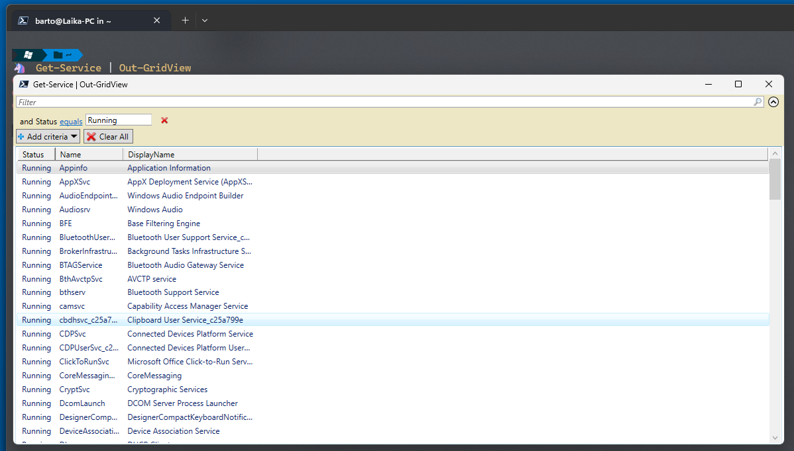
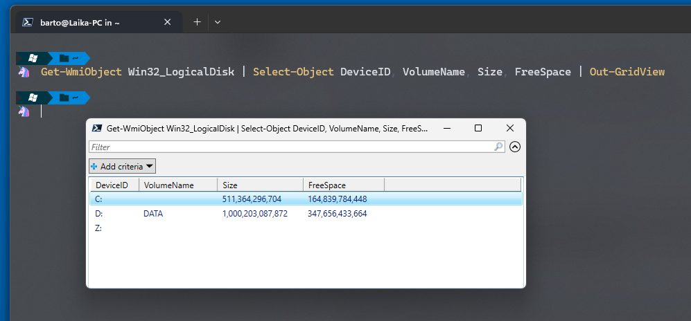

---
{
title: "Unlocking the Power of Out-GridView in PowerShell",
published: "2024-04-30T08:24:43Z",
tags: ["powershell"],
description: "Unlocking the Power of Out-GridView in PowerShell  When it comes to PowerShell, every seasoned...",
originalLink: "https://dev.to/this-is-learning/unlocking-the-power-of-out-gridview-in-powershell-4aei",
coverImage: "cover-image.png",
socialImage: "social-image.png"
}
---

**Unlocking the Power of Out-GridView in PowerShell**

When it comes to PowerShell, every seasoned scripter knows that efficiency and versatility are key. One of the powerful cmdlets that often flies under the radar but can significantly enhance your PowerShell experience is `Out-GridView`. In this article, we'll explore what `Out-GridView` is, its capabilities, and how you can leverage it to streamline your PowerShell workflows.

### What is Out-GridView?

`Out-GridView` is a cmdlet in PowerShell that allows you to display data in an interactive grid view window. This window provides various functionalities such as sorting, filtering, and even selecting data rows, which makes it a handy tool for exploring and manipulating data directly from the PowerShell console.

### Why Use Out-GridView?

The primary advantage of `Out-GridView` is its interactive nature. Unlike the traditional console output, which can be static and limited in functionality, `Out-GridView` empowers users to dynamically interact with data, making it easier to analyze, filter, and understand complex datasets.

### How to Use Out-GridView

Using `Out-GridView` is straightforward. Let's walk through some examples to illustrate its capabilities:

#### Example 1: Displaying Process Information

```powershell
Get-Process | Out-GridView
```



In this example, we're retrieving information about running processes using `Get-Process` and piping the output to `Out-GridView`. This command opens a grid view window displaying details about each running process, including Name, ID, CPU usage, and more.

#### Example 2: Filtering Results

```powershell
Get-Service | Where-Object {$_.Status -eq "Running"} | Out-GridView
```

Here, we're fetching a list of services using `Get-Service`, filtering only those services that are currently running (`Status -eq "Running"`), and then piping the output to `Out-GridView`. This allows us to view and interactively manipulate running services easily.

#### Example 3: Selecting Specific Columns

```powershell
Get-WmiObject Win32_LogicalDisk | Select-Object DeviceID, VolumeName, Size, FreeSpace | Out-GridView
```



In this example, we're retrieving information about logical disks using `Get-WmiObject`, selecting specific properties (DeviceID, VolumeName, Size, FreeSpace) using `Select-Object`, and then displaying the results in a grid view window using `Out-GridView`. This enables us to focus on the essential information and analyze disk usage efficiently.

### Conclusion

`Out-GridView` is a versatile tool that enhances the interactive capabilities of PowerShell, allowing users to explore and manipulate data with ease. Whether you're a system administrator analyzing system resources or a developer inspecting complex objects, `Out-GridView` can significantly streamline your PowerShell workflows.

---


If you enjoyed this blog post and want to learn more about C# development, you might be interested in subscribing to my bi-weekly newsletter called Dev Dispatch. By subscribing, you will get access to exclusive content, tips, and tricks, as well as updates on the latest news and trends in the development world. You will also be able to interact with me, and share your feedback and suggestions. To subscribe, simply navigate to https://buttondown.email/kasuken?tag=devto, enter your email address and click on the Subscribe button. You can unsubscribe at any time. Thank you for your support!
