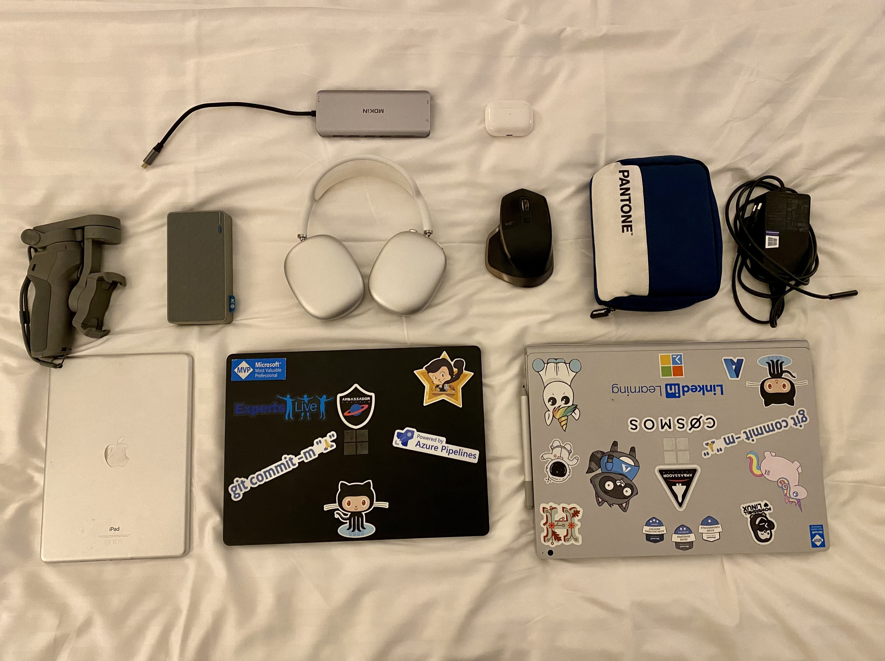

---
{
title: "What's in my bag for Experts Live Europe",
published: "2023-09-17T22:06:31Z",
tags: ["eventsinyourcity", "speaking"],
description: "I am very excited to attend Experts Live Europe, a community-driven IT conference focused on...",
originalLink: "https://https://dev.to/playfulprogramming/whats-in-my-bag-for-experts-live-europe-9dn",
coverImg: "cover-image.png",
socialImg: "social-image.png"
}
---

I am very excited to attend Experts Live Europe, a community-driven IT conference focused on Microsoft cloud, datacenter, security and modern workplace technologies. This event will take place in Prague, Czech Republic from September 18 to 20, 2023. I will be joining hundreds of other IT professionals who are eager to learn from the best experts worldwide, network with peers, and have fun in the beautiful city of Prague.

As a speaker and remote worker, I always want to be prepared for any situation that might arise during the conference. That's why I have packed my bag with some essential items that I think will help me make the most out of this event. Here is a list of what's in my bag for Experts Live Europe:

- **Laptops**: This is a no-brainer. I need my laptop to take notes, write blog posts, check emails, and do some coding if needed. I have a Microsoft Surface Book 3 with Windows 11, which is lightweight, powerful, and has a great battery life. It also comes with a touch screen and a stylus pen, which are very handy for sketching diagrams or annotating slides.
  But I need to work even for SoftwareONE in these days and this is the reason why I have a second laptop with me: my Laptop 4 with Windows 11. On this laptop I have only things related to SoftwareONE and its project (Red Origin product, for example).
- **Smartphone**: Another obvious item. I use my smartphone to stay connected with the world, take photos and videos, scan QR codes, and use various apps that are useful for the conference. I have my iPhone 13, which has an amazing camera, a large screen, and a fast processor. It also supports wireless charging and reverse wireless charging, which are very convenient features. It's not in the photo because I use it for taking this picture. 🙂
- **Power bank**: Even though my laptop and smartphone have good battery life, I don't want to risk running out of juice in the middle of the day. That's why I always carry a power bank with me. I have an XTorm 20000mAh, which can charge my devices multiple times and has two USB ports for simultaneous charging. It also has a LED indicator that shows how much power is left. Very often I use the power bank to charge even my sports watch.
- **Headphones**: Sometimes I need to tune out the noise and focus on my work or relax with some music. That's why I always have headphones with me. I have a pair of AirPods Max wireless noise-canceling headphones, which are very comfortable, have excellent sound quality, and block out most of the ambient noise. They also have touch controls. I also have with me the AirPods Pro because sometimes they are more handy during the day.
- **HDMI adapter**: I need to connect my laptop to an external monitor or projector. That's why I always have an HDMI adapter with me. I have a Mokin HDMI adapter, which is very simple, reliable, and compatible with my laptop. It also supports 4K resolution and it has two HDMI output. In the same adapter I have three USB 3.0, a Lan and an USB-C.
- \**Cables*: I have a box with 1 Billion cables, USB, USB-C, for charging iPhones and headphones and I have also a multiple USB charger for charging up to 4 devices at the same time.
- **DIJ**: I have also my DJI for the iPhone. Very often I make some videos or timelapse during the event or for my social accounts. It's very useful and it works very well since years.
- **Logitech MX Master**: my favorite mouse ever. I use the MX Master since the first release. This is not the last model but still working very good and even the next one will be an MX Master. I can connect up to 3 devices with a simple switch. For me it's perfect because I have my main device (my gaming pc at home that I use as the main machine), my Book 3 and my Laptop 4. I don't use the mouse on my MacBook Air.

These are the items that are in my bag for Experts Live Europe. Of course, everyone has their own preferences and needs when it comes to packing their bags for an event like this. But I hope that this list can give you some ideas or inspiration for your own packing. I look forward to seeing you at Experts Live Europe and sharing our experiences and learnings. Until then, stay safe!

---

If you enjoyed this blog post and want to learn more about C# development, you might be interested in subscribing to my bi-weekly newsletter called Dev Dispatch. By subscribing, you will get access to exclusive content, tips, and tricks, as well as updates on the latest news and trends in the development world. You will also be able to interact with me, and share your feedback and suggestions. To subscribe, simply navigate to https://buttondown.email/kasuken?tag=devto, enter your email address and click on the Subscribe button. You can unsubscribe at any time. Thank you for your support!
