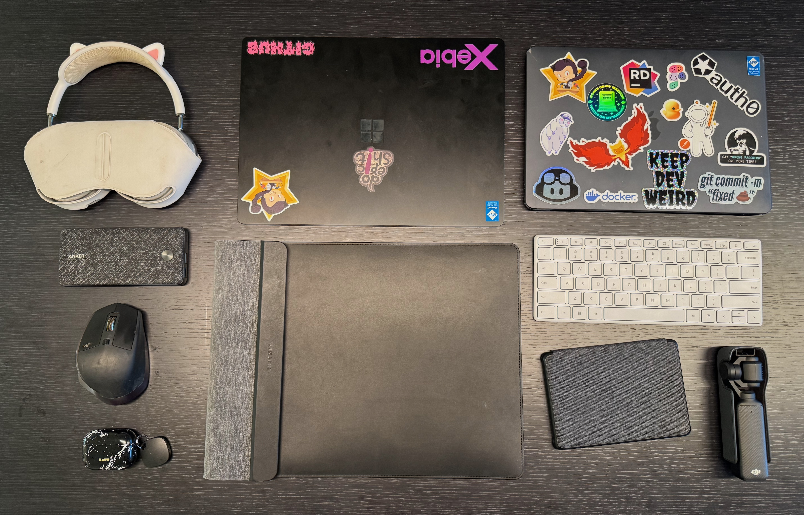

---
{
title: "What’s in My Bag: The Essentials for a Productive Day at the Office [2025]",
published: "2025-03-14T15:52:51Z",
edited: "2025-03-19T12:22:31Z",
tags: ["productivity", "developer"],
description: "As a developer and cloud engineer (or Architect, they call me like that), my work isn't confined to a...",
originalLink: "https://https://dev.to/playfulprogramming/whats-in-my-bag-the-essentials-for-a-productive-day-at-the-office-2025-e2o",
coverImg: "cover-image.png",
socialImg: "social-image.png"
}
---

As a developer and cloud engineer (or Architect, they call me like that), my work isn't confined to a single desk. Whether I'm at the office, traveling by train, or stopping at a coffee shop between meetings, I need a setup that ensures I'm productive no matter where I am. But there's a fine balance between carrying everything I might need and keeping my bag lightweight and practical.

In this post, I'll share what's in my bag when I head to the office, why each item earns its place, and how I optimize for productivity without overpacking (more or less 😂😂😂).

---

---

## **The Core Workhorses: My Laptops**

### **Microsoft Laptop 6**

This is my main work device, especially for my projects at Xebia. Since I work with .NET and AI, I need a Windows machine that seamlessly integrates with the Microsoft ecosystem. The Laptop 6 gives me enough power for coding, debugging, and running AI workloads while maintaining portability (I use two or three SLM with LM Studio).

### **MacBook Air**

My personal laptop is an essential companion, particularly for travel. It’s light, has great battery life, and is perfect for catching up on side projects or writing while on the train. Switching between Windows and macOS may sound inefficient, but each device has its dedicated purpose in my workflow.
Also sharing things between laptops is easy because I have everything on my Notion or in my OneDrive.

---

## **Content Creation on the Go**

### **DJI Osmo**

Capturing content on the fly is always a good idea. Whether it's recording demos, documenting work, or creating social media content, having a compact gimbal like the DJI Osmo ensures stable and high-quality footage without needing a full camera setup.

---

## **My Input Devices**

### **Microsoft Keyboard 65%**

A good keyboard makes all the difference in productivity. Since I’m used to my own layout, I carry a 65% Microsoft keyboard, it’s compact, lightweight, and helps me type faster and more comfortably compared to built-in laptop keyboards.
I use it when I connect my Laptop 6 to the docking station in the office.

### **MX Master 2**

This is my old but reliable mouse, while the MX Master 3s stays at home. It’s still one of the best productivity mice available, offering precision, ergonomic comfort, and great battery life.

---

## **Power and Connectivity**

### **Power Adapter (2 USB-C + 1 USB-A)**

Instead of carrying multiple chargers, I keep one adapter that can charge all my devices. This significantly reduces clutter and ensures I’m always ready to plug in without hunting for a specific charger.

### **Cables, Cables, Cables**

No matter how much we embrace wireless tech, cables are unavoidable. I keep a set of essentials:

- USB-C to USB-C for fast charging
- USB-A to USB-C for compatibility
- Lightning cable for Apple devices
- A small cable organizer to prevent a tangled mess

### **Powerbank**

Running out of battery is never an option. My power bank is powerful enough to charge my phone twice and even provide a boost to my other devices. It’s a lifesaver on long days or when I forget to charge something overnight.

---

## **Video Calls**

### **Microsoft LifeCam HD**

Yes, it’s an old webcam, but it still works flawlessly, and it's so tiny that I can just toss it into my bag. Why do I carry it?

- **Docking station setup:** When I connect my laptop to the docking station, I usually close the lid. That means no built-in webcam for video calls—so the LifeCam is a perfect backup.
- **Flexible angles:** Even when I’m not docked, I sometimes prefer using the LifeCam instead of the built-in webcam because I can position it differently. Whether I’m at another desk or in a Starbucks, I can change the angle of the webcam while keeping the monitor at a comfortable position.

---

## **Reading and Note-Taking**

### **Kindle**

I always keep my Kindle with me. Whether it’s a tech book, a business read, or something to unwind, having an e-reader means I can always make productive use of downtime.

### **Pocket with Pens and Markers**

Digital tools are great, but sometimes nothing beats jotting down notes on paper. I carry a small pocket with pens and markers for quick sketches, diagrams, or brainstorming ideas the old-school way.

---

## **The Laptop Sleeve**

This isn’t just protection for my laptop—it doubles as a workspace. The sleeve acts as a stable base when working on the go, and it even includes a built-in wireless charger for added convenience.

---

## **Audio**

### **Apple AirPods Pro**

For quick calls, noise isolation, and portability, my AirPods Pro are the go-to choice. They’re small enough to always have in my pocket and work seamlessly across my devices.

### **Apple AirPods Max**

When I need deeper focus or better sound quality—especially in noisy environments—I use my AirPods Max. The noise cancellation is excellent, making them perfect for working in open offices, cafés, or during long train rides.

---

## **Final Thoughts: The Balance Between Productivity and Portability**

Packing for productivity is all about balance. I carry everything I need to work efficiently in different environments, but I avoid unnecessary clutter. Every item in my bag has a clear purpose, whether it’s for work, content creation, or staying powered up throughout the day.

The key takeaway? Build a setup that works for you—prioritize what you *actually* use, minimize what you don’t, and refine your essentials over time.

**What’s in your bag? Let me know in the comments or share your own must-have work essentials!**

---

Thanks for reading this post, I hope you found it interesting!

Feel free to follow me to get notified when new articles are out 🙂

<!-- ::user id="kasuken" -->
