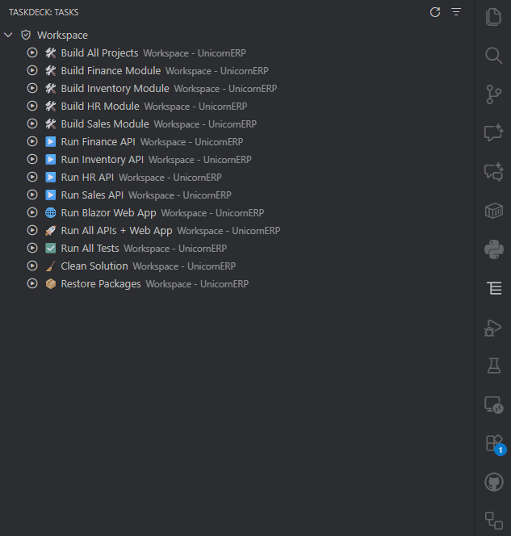
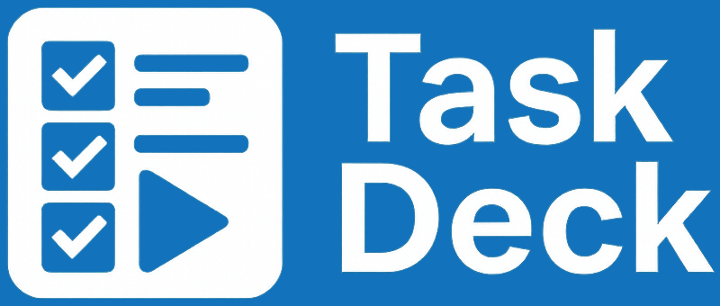

---
{
title: "Why I Built TaskDeck and How It Improves Your VS Code Workflow",
published: "2025-11-20T12:50:24Z",
edited: "2025-11-20T12:53:59Z",
tags: ["vscode", "productivity", "webdev", "showdev"],
description: "VS Code tasks are powerful, but most developers barely use them. The problem is not the feature...",
originalLink: "https://dev.to/this-is-learning/why-i-built-taskdeck-and-how-it-improves-your-vs-code-workflow-4fk9",
coverImage: "cover-image.png",
socialImage: "social-image.png"
}
---

VS Code tasks are powerful, but most developers barely use them. The problem is not the feature itself. It is the workflow. Tasks are hidden behind menus, the command palette, or a `tasks.json` file that nobody enjoys editing. Running the same commands over and over becomes a small but constant tax on your focus.

I built **TaskDeck** to remove that tax. I wanted a simple way to see all tasks in one place, launch them with one click, and stop jumping between JSON files, menus, and shortcuts. No magic, no reinvention. Just a faster way to work inside VS Code.



### Links

- [VS Code Marketplace](https://marketplace.visualstudio.com/items?itemName=emanuelebartolesi.taskdeck)
- [Repository](https://github.com/kasuken/vscode-taskdeck)

---

## The Problem: VS Code Tasks Are Underrated but Hard to Use

VS Code tasks are one of the most useful features in the editor. They let you run scripts, build steps, linters, tests, and any command you need with a single entry. They should save time. Instead, most developers ignore them.

The reason is simple. The workflow is not smooth.

You have to open the command palette, remember the task name, or dig into the `Run Task` menu. If you want to change something, you open `tasks.json`, navigate its structure, and hope you wrote the syntax correctly. Even when tasks are configured well, finding the one you want still requires multiple steps.

This friction adds up. Developers avoid tasks, fall back to terminal commands, and lose the benefits of a shared, consistent workflow. Teams suffer too because tasks are not discoverable. New team members rarely browse `tasks.json`, so useful automation stays hidden.

Tasks are not the problem. The UI is.

---

## What I Wanted as a Developer

I needed something simple. A place where I could see all my tasks without touching JSON or opening menus. A way to run tasks without breaking my focus or switching contexts. Something that made tasks feel like a natural part of my workflow, not an extra step.

I also wanted a solution that worked the same across projects. Some repositories have many tasks. Others have only a few.

Most importantly, I wanted to avoid the constant “open palette, type, run, repeat” cycle. It is fast for one action, but slow if you repeat it all day. A dedicated side panel felt like the obvious answer, yet VS Code did not offer one for tasks. So I built it.

TaskDeck started as a selfish idea: reduce my friction.

---

## Introducing TaskDeck



TaskDeck is a VS Code extension that gives tasks the visibility they deserve. It adds a dedicated side panel that lists every task from your workspace, ready to run with a single click.

When you open a folder, TaskDeck reads your existing `tasks.json` and displays the tasks in a clean, structured tree. If your project contains multiple task groups or compound tasks, TaskDeck shows them clearly so you always know what is available.

The extension does not try to change how VS Code tasks work. It simply makes them easier to use. Developers get a permanent view of their automation without jumping between menus. New team members immediately see what tasks exist. And you get a smoother workflow that stays out of your way.

---

## How TaskDeck Improves Your Workflow

TaskDeck changes how you interact with VS Code tasks by removing unnecessary steps. Everything is in one place. You focus on your work instead of navigating the editor.

**No more context switching.**
You do not need to open the command palette or remember task names. The side panel is always visible, so you click and run. The fewer steps you take, the less mental load you carry.

**Clear visibility for every task.**
A list on the side makes tasks discoverable. You see what exists, how they are grouped, and which ones matter. This is especially helpful in large repositories or monorepos where tasks tend to multiply.

**Faster onboarding for teams.**
New developers immediately understand the available actions in a project. They no longer rely on README notes or tribal knowledge to find build, lint, or test tasks.

**One-click execution.**
The core improvement is speed. Launching a task becomes as easy as launching a file. There is no friction in trying, running, or combining tasks throughout your day.

---

## Key Features with Examples

TaskDeck is built around a simple idea. Make tasks easier to find, easier to run, and easier to understand. Here are the core features that make that happen, with practical examples of how developers use them.

### Side Panel Overview

The extension adds a new **TaskDeck** view in the VS Code sidebar.
It lists all detected tasks in a clean tree, grouped by their `group` property when present.

Example workspace task definition:

```json
{
  "version": "2.0.0",
  "tasks": [
    {
      "label": "build",
      "command": "npm run build",
      "group": "build"
    },
    {
      "label": "test",
      "command": "npm test",
      "group": "test"
    }
  ]
}
```

How TaskDeck shows it:


You see everything immediately. No guessing and no hunting through JSON.

### One-Click Run

Every task has a play button.
You click it and VS Code runs the task right away.

This is especially useful for actions you repeat daily:

- build the solution
- run the backend
- run the frontend
- run tests
- run code generation
- run a watcher

No palette. No typing. No remembering.

### Automatic Detection of Workspace Tasks

TaskDeck loads tasks from:

- `.vscode/tasks.json`
- the root of the workspace
- multi-root workspaces

If tasks are defined, they show up automatically.
If you add a new task, the panel updates without reloading the extension.

### Optional Icons (If Enabled)

If you assigned icons or emojis to your task labels, TaskDeck shows them.
Not required, but useful for visual scanning.

---

## Behind the Scenes: How I Built It

TaskDeck is simple on the surface, but building it required dealing with how VS Code exposes tasks internally. The goal was to keep the architecture small, predictable, and easy to maintain. Nothing fancy. Just a clean extension that does one thing well.

### Activation and Task Loading

The extension activates when a workspace loads.
VS Code exposes an API that returns all tasks defined in the workspace. The extension reads them and organizes them into a structure that can be rendered in the side panel.

Key points I focused on:

- load tasks once on activation
- listen for changes in workspace files
- refresh the tree when tasks.json is updated
- stay lightweight so activation time stays near-zero

No custom parsing. No extra config. Just using the official tasks provider.

### The Tree View

The entire UI is built on VS Code’s `TreeDataProvider`.
Every task becomes a tree item. Groups become parent nodes.
For multi-root workspaces, each folder becomes a root node with its own groups.

Structure example:

```
Workspace Folder
  Build
    - build
    - full-build
  Test
    - test
```

Tree nodes expose:

- a label
- an optional icon
- a tooltip
- a command to run the task

This keeps the implementation small and makes the UI responsive.

### Running Tasks

Running a task is a direct call into VS Code’s task API:

```ts
vscode.tasks.executeTask(task);
```

This means TaskDeck doesn’t reinvent any behavior.
It delegates execution completely to VS Code, which ensures logs, terminals, and task output behave exactly as expected.

### Handling Multi-Root Workspaces

One of the trickiest parts was supporting multi-root folders.
Some projects have one `tasks.json`. Others have several.
TaskDeck detects them all and scopes tasks correctly under each folder.

This avoids the common problem where tasks from different services get mixed together.

### Lessons Learned

A few things became clear while building TaskDeck:

- Tasks are powerful but under-exposed in the UI.
- Most developers never open `tasks.json` unless they have to.
- A simple UI change can unlock the value of an existing feature.
- VS Code’s APIs make this kind of extension surprisingly easy once you understand tree views.
- Good defaults matter more than new features.

TaskDeck was built with a “minimum friction” mindset.
Do less, but do it well.

---

## What’s Next for TaskDeck

TaskDeck is intentionally minimal. It focuses on visibility and speed, but there is room to grow without turning it into a complex automation tool. These are the improvements I am considering next.

### Task Filtering and Search

Large workspaces can contain many tasks.
A small search bar or quick filter inside the panel would help you jump to the right one instantly.

### Inline Task Editing

Not a full editor.
Just a lightweight way to jump directly to the task definition or toggle simple fields without digging through JSON.

### Better Multi-Root Experience

Multi-root workspaces work well today, but a few enhancements could improve clarity:

- collapsible sections
- root-level summaries
- optional grouping modes

### Telemetry-Free Insights

If I add metrics or insights (for example, most-used tasks), they will be completely local.
Developers do not want telemetry in their tools, and TaskDeck will stay strict about that.

### Community Feedback

The next features will depend on what developers find useful.
TaskDeck is small by design, so additions must keep the workflow simple and fast.

If you have ideas or requests, open an issue on GitHub or leave feedback on the Marketplace page.

---

Try it, use it in your projects, and share your feedback.

### Links

- [VS Code Marketplace](https://marketplace.visualstudio.com/items?itemName=emanuelebartolesi.taskdeck)
- [Repository](https://github.com/kasuken/vscode-taskdeck)

---

🙋‍♂️ Hey, I'm Emanuele — you might know me online as **Kasuken**.

👨‍💻 GitHub Technical Lead | Microsoft MVP (12x) | GitHub Star (4x)\
🛠️ I build things with **.NET**, **Azure**, **AI**, and **GitHub**\
🌈 Turning code into 🦖 and 🦄 — one commit at a time

🚀 If you're into .NET, GitHub, DevOps, or just cool side projects,\
feel free to [connect with me on LinkedIn](https://www.linkedin.com/in/bartolesiemanuele)

P.S. I break things so you don’t have to. 😉
