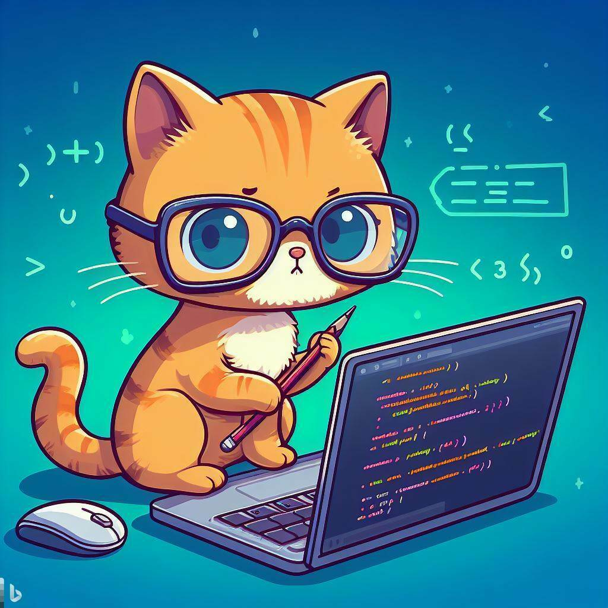

---
{
title: "Why I love Monaspace font for coding",
published: "2023-11-13T06:37:15Z",
tags: ["ide", "font", "productivity"],
description: "As a developer, I spend a lot of time writing and reading code. And one of the most important aspects...",
originalLink: "https://dev.to/this-is-learning/why-i-love-monaspace-font-for-coding-47e7",
coverImage: "cover-image.png",
socialImage: "social-image.png"
}
---

As a developer, I spend a lot of time writing and reading code. And one of the most important aspects of coding is the choice of font. A good font can make a huge difference in the readability, aesthetics, and productivity of coding.

That's why I am a big fan of Monaspace, an innovative superfamily of fonts for code. Monaspace is not just one font, but five fonts that share the same metrics and can be seamlessly mixed and matched. They are:

- **NeNeon**: a neo-grotesque sans serif that is clean and modern.
- **ArArgon**: a humanist sans serif that is friendly and elegant.
- **XeXenon**: a slab serif that is sturdy and authoritative.
- **RnRadon**: a handwriting font that is casual and expressive.
- **KrKrypton**: a mechanical sans serif that is futuristic and technical.

Each of these fonts has three variable axes: weight, width, and slant. This means that you can adjust the font to your liking, from thin to bold, from narrow to wide, and from upright to italic. You can also apply different textures to the fonts, such as healing, eroded, or spliced.

But the best part of Monaspace is that you can use different fonts for different parts of your code, to create more meaning and hierarchy. For example, you can use NeNeon for keywords, ArArgon for variables, XeXenon for comments, RnRadon for strings, and KrKrypton for numbers. You can also use different weights, widths, and slants to emphasize or de-emphasize certain elements. The possibilities are endless!

Monaspace makes the code more colorful, diverse, and interesting, without sacrificing clarity or consistency. It also supports programming ligatures, which are special glyphs that combine characters to create new symbols. For example, the arrow function `=>` becomes `⇒`, the not equal operator `!=` becomes `≠`, and the logical and operator `&&` becomes `∧`. This helps to reduce visual clutter and improve readability.

Monaspace is compatible with many popular IDEs, such as Visual Studio, JetBrains Rider, and Visual Studio Code. You can download Monaspace from its official website, where you can also learn more about its features and design process. Monaspace is **free and open source**, so you can use it for any project, personal or commercial.

Before I discovered Monaspace, I was happy with **Cascadia Code**, another great monospaced font from Microsoft. Cascadia Code is also designed to enhance the modern look and feel of the Windows Terminal and code editors. It has a sleek and simple appearance, and also supports programming ligatures. I still use Cascadia Code for Windows Terminal

But Monaspace has won me over with its versatility, creativity, and fun. It allows me to express myself more through my code, and to make my code more expressive as well. It also keeps me engaged and motivated, as I can experiment with different combinations and settings. Monaspace is not just a font, but a **tool for coding**.

If you are looking for a new font to spice up your coding experience, I highly recommend Monaspace. It is a font that will make you love coding even more. Try it out and let me know what you think!

Stay curious, stay humble, and keep learning, my friends! 🌟

---

If you enjoyed this blog post and want to learn more about C# development, you might be interested in subscribing to my bi-weekly newsletter called Dev Dispatch. By subscribing, you will get access to exclusive content, tips, and tricks, as well as updates on the latest news and trends in the development world. You will also be able to interact with me, and share your feedback and suggestions. To subscribe, simply navigate to https://buttondown.email/kasuken?tag=devto, enter your email address and click on the Subscribe button. You can unsubscribe at any time. Thank you for your support!
