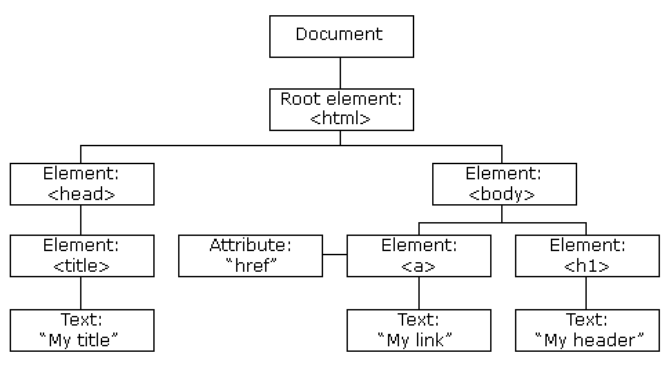
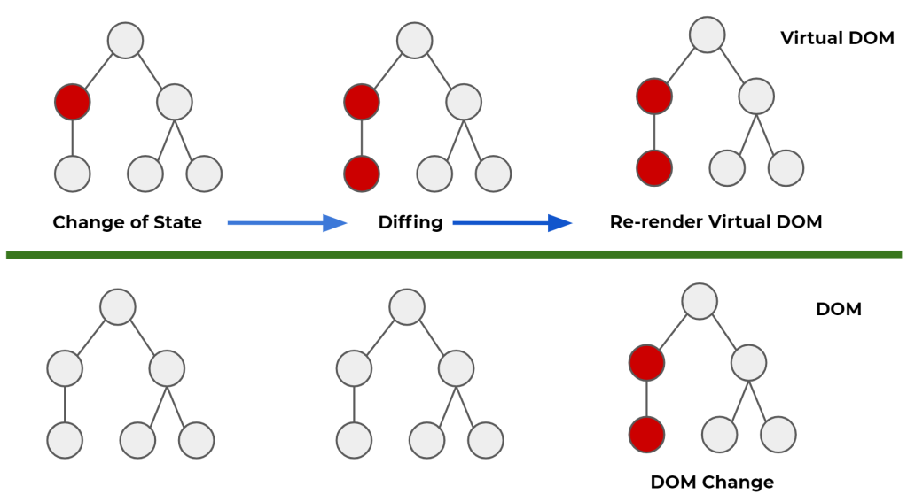

---
{
    title: "Unraveling the Magic of the Virtual DOM",
    description: "The VDOM is the secret sauce that empowers developers to create the captivating, dynamic web applications that we use every day.",
    published: '2023-06-08',
    tags: ['webdev', 'javascript'],
    license: 'cc-by-nc-sa-4',
    originalLink: 'https://sarahgerrard.me/posts/unraveling-the-magic-of-the-virtual-dom'
}
---

If you've worked in web development, there's a good chance that you've come across the term "VDOM" or Virtual DOM. The VDOM is the secret sauce that empowers developers to create the captivating, dynamic web applications that we use every day.

## What is the Virtual DOM (VDOM)?

When crafting HTML for your webpage, the magic happens behind the scenes as the browser translates it into the Document Object Model (DOM) — an internal representation of your web content. The DOM allows browsers like Chrome, Firefox, and Safari to manipulate and interact with the elements of your page, making it the key player in bringing your website to life.

The DOM serves as a representation of the elements in your HTML. It organizes those elements into a hierarchical structure, as seen below, where each one becomes a node in the tree. These nodes can be accessed, manipulated, and interacted with using programming languages such as JavaScript.

The Virtual DOM (VDOM), as the name suggests, is a virtual or secondary representation of the DOM. While the DOM is maintained by the browser, the VDOM exists in JavaScript’s memory stack, where it mirrors the structure and properties of the DOM tree.

The VDOM is an essential layer of abstraction, acting as a replica of the actual DOM. By being implemented in JavaScript, developers gain greater control over the VDOM, simplifying the process of making changes and updates to the web page. This streamlined approach reduces complexity and provides a smoother development experience compared to directly interacting with the DOM APIs.

Instead of updating the real DOM directly, the VDOM is modified whenever a change is made in a web application. These changes are synchronized with the DOM, avoiding the potential slowness associated with direct DOM updates. This approach enhances performance by minimizing direct interactions with the actual DOM, similar to quickly modifying a blueprint. As a result, developers can create highly dynamic and interactive user interfaces while maintaining optimal performance.

This efficient and innovative approach to handling updates and changes modifies the way developers build user interfaces, making it possible to create highly dynamic and interactive experiences without compromising performance.

## How does the VDOM work?

The VDOM works in a way that optimizes and streamlines the process of updating the user interfaces of web applications. In a nutshell, this is how it operates:

1. **Representation**: First, the VDOM presents a virtual representation of the actual DOM. Each time a change occurs, such as a user interaction or data update, a new version of the VDOM is mutated as opposed to immediately changing the actual DOM.

2. **Diffing**: After a new version of the VDOM has been created, the next step is "diffing". Diffing, originating from "difference," is an algorithm that causes the VDOM to conduct a comparison between the two versions of the DOM - the current (old) one, or the newly created one.

    Essentially, diffing meticulously traverses every node (representing elements, components, text, etc.) in the old and new VDOM to spot any differences. These differences can be anything from the addition, removal, or reordering of elements. Even changes in an element's attributes are detected!

3. **Reconciliation**: When the diffing phase has finished and the changes have been identified, the VDOM then moves to the reconciliation phase. In this step, the VDOM takes the identified changes from the diffing process and applies them to the DOM.

    Instead of directly modifying the existing DOM, the VDOM intelligently determines the minimal set of changes needed to bring the DOM in sync with the new version of the VDOM. This avoids the time and resource-consuming tasks of having to re-render the entire webpage.

4. **Rinse and Repeat**: Every time a change is made within a web application, this process is repeated. By continually monitoring for changes and updating only the necessary parts of the DOM, the VDOM ensures a smoother user experience, better performance, and a highly dynamic and interactive web application.

This repeatable process, while simple in concept, has profound implications for the efficiency of modern web applications. Before the advent of the VDOM, developers had to manually manipulate the DOM whenever a change occurred, which was both time-consuming and prone to errors.

## What technologies use the VDOM?

The concept of the VDOM is closely linked with JavaScript libraries and frameworks, notably React and Vue. These libraries make extensive use of the VDOM to enhance the performance of dynamic web applications, which frequently require manipulation of the DOM.

[React](https://react.dev/), in particular, has played a vital role in popularizing the VDOM. Developed by Facebook (now Meta), React utilizes the VDOM as a part of its core functionality. With its component-based architecture, developers can build applications as a series of reusable components which the VDOM then makes possible to efficiently render and update as things change.

[Vue](https://vuejs.org/), another popular JavaScript framework created by [Evan You](https://evanyou.me/), also uses a VDOM. Its system allows developers to build user interfaces that are efficient, reactive, and scalable. Vue's VDOM implementation enables developers to write more complex applications that update efficiently and quickly, resulting in a smooth user experience.

While these are two popular frameworks, there are variants of React (such as [Preact](https://preactjs.com/) and [Inferno](https://www.infernojs.org/)) that have also implemented the concept of the VDOM, but a focus on maximizing performance and minimizing their footprint.

## Pros and Cons of the VDOM

The VDOM has brought several advantages to web development, but it isn't without drawbacks.

**Pros:**

1. **Performance Optimization**: The VDOM introduces a layer of abstraction that allows developers to minimize direct interactions with the DOM. By updating the VDOM instead of the DOM, you reduce the number of expensive operations required to manipulate the webpage leading to significant performance improvements, especially for more complex and frequently updated interfaces.

2. **Efficient Updates**: Through the process of diffing, developers can efficiently update only the necessary parts of the DOM. This minimizes the re-renders in the entire webpage, further speeding up and improving responsiveness.

3. **Simplified Development**: The VDOM simplifies the management and manipulation of the DOM. The virtual representation resembles the DOM, but it is easier to reason with and modify. This means that the VDOM abstracts away the complexities associated with manipulating the DOM, resulting in cleaner and more maintainable code.

4. **Cross-platform Compatability**: The VDOM is something not tied to any specific platform or browser - it provides a consistent and unified approach to handling updates and changes in different environments. This further accentuates the ease of web application development, especially across various devices and browsers.

**Cons:**

1. **Increase Memory Usage**: With the introduction of an additional layer (the VDOM), you create a tradeoff since it requires memory to store. In some cases, this extra memory can be a concern, especially for devices that are resource-constrained or applications with many DOM elements.

2. **Initial Overhead**: Adopting the VDOM adds more overhead to an application's startup time. The process of creating the VDOM and the process of performing diffing and reconciliation can take some time, which could be noticeable when the page loads for the first time. This overhead, typically, is outweighed by the performance benefits during the subsequent updates, however.

3. **Learning Curve**: While the concept of the VDOM is fairly straightforward, adopting it can require some understanding of underlying principles and integrating it with the chosen framework or library. Developers need to learn how to work with the VDOM and utilize it correctly to achieve the desired performance improvements. This can be a challenge to newcomers in web development or developers transitioning from traditional DOM manipulation approaches.

4. **Not Always Necessary**: In some cases, the performance gains of the VDOM may not justify its implementation. If an application includes a relatively simple user interface or does not require frequent updates, the benefits of the VDOM may be negligible compared to the added complexity it introduces.

Overall, the VDOM introduces performance increases and simplifies development by enabling efficient updating. Like other technologies, however, it's always important to evaluate the suitability of using it based on the specific needs and constraints of the project.

## Wrap Up

The Virtual DOM (VDOM) is a transformative concept in web development, providing a virtual representation of the Document Object Model (DOM). It has changed how developers work by offering copies of the DOM that the framework has more control over.

By abstracting away updates to the actual DOM, the VDOM optimizes performance by minimizing direct interactions. Through a process of representation, diffing, and reconciliation, the VDOM identifies and applies changes to the DOM efficiently.

React and Vue, popular JavaScript libraries, leverage the VDOM to enhance the performance of dynamic web applications. While the VDOM brings advantages like performance optimization and simplified development, it also introduces tradeoffs, including increased memory usage and a learning curve.

In the next post, I will demonstrate how you can code your own VDOM, providing insights into the process and empowering you to explore this powerful technique yourself.