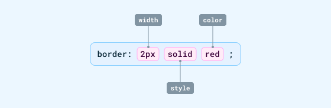
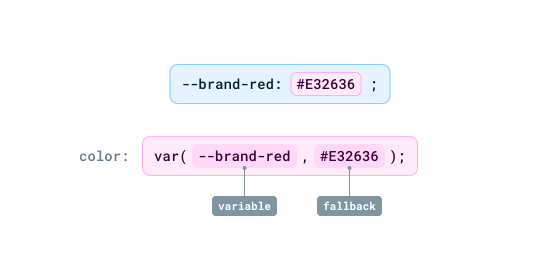
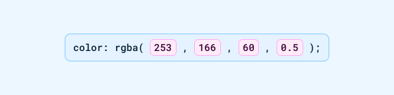
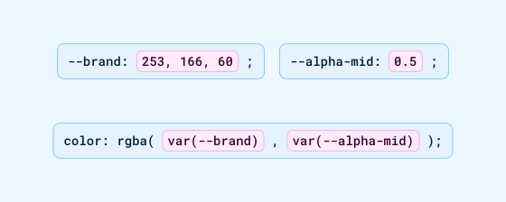
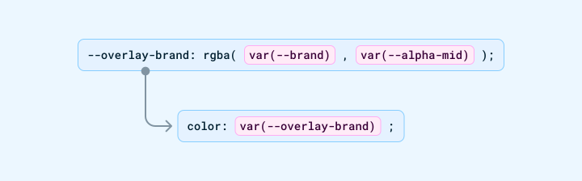

---
{
  title: "Web Fundamentals: CSS",
  description: "The second chapter in our front-end series. Let's delve right into the world of CSS, variables and selectors.",
  published: "2024-08-18T20:08:26.988Z",
  tags: ["css", "html", "design"],
  license: "cc-by-4",
  authors: ["ljtech","edpratti"],
  order: 2
}

---

### Welcome to the second installment of Web Fundamentals!

> **What you should know:**
> This chapter expects you to have read the previous installment of Web Fundamentals.

This article will go over Cascading Style Sheets, detailing what they are, what they allow, and how they are used to bend and style HTML to make up beautiful and responsive designs in an efficient manner. 

Let's waste no time, and get right into it.

# Introduction to CSS

In the previous article, we discussed how HTML is the skeleton of the web. And that's a very apt description, as it provides the necessary structure to our layouts and our elements. Well, CSS is where we get to have control over all the properties that they provide, thus allowing us to build anything we'd like.

CSS defines the styling mechanisms used to theme components and build interfaces. It is a primordial tool in web development. Without further ado, let's dive into what it can do for you.

# Selectors

CSS selectors are used inside `.css` files in order to target HTML elements and allows for CSS rules to be applied.

There are five basic CSS selectors:

| Selector | Usage | Target | Usage example |
| --- | --- | --- | --- |
| **Universal** | `* {}` | All elements | Applying spacing or alpha values to all elements |
| **Class** |  `.example {}` | All with the given class | Applying the same styling to several elements |
| **ID** | `#example {}` | All with the given ID | Applying a style to a specific element |
| **Type** | `h1 {}` or `button {}` | All with the given type | Applying a style to a native HTML element |
| **Attribute** | `[type="submit"] {}` | All with the given attribute | Only applying a style to "Submit"-type buttons |

> 🤓 I recommend using the `.class` selector over the `#id` selector as ID attributes are unique 

## Grouping selectors

You can group selectors under one CSS rule using commas to share properties among multiple selectors:

```css
.foo {
  color: red;
}

#bar {
  color: blue;
}

// The padding will apply to both selectors
.foo, #bar {
  padding: 1rem;
}
```
## Combining selectors

You can also combine selectors using a variety of syntax to target anything from descendants to siblings:

```css
/* This will target all <h1> that are descendants from
a <section> tag,regardless of how nested they are. */
section h1 {
  color: red;
}


/* This will target all <h2> tags that are
direct children from a <section> tag. Once they are
nested in another tag, it will no longer apply. */
section > h2 {
  color: orange;
}


/* This will only target the next <h3> tag 
that immediately follows a <section> tag. */
section + h3 {
  color: yellow;
}


/* This will target all <h4> tags that have 
the same parent as a <section> tag. */
section ~ h4 {
  color: green;
}
```

Selectors can also be used to target browser pseudo-elements:

```css
/* This targets the placeholder text
inside a standard HTML input field */
input::placeholder {
  color: #ddd;
}
```

Using this variety of combinators and selectors you can easily style any part of a web document.

> ⚡ **[Live example: Selectors](https://codesandbox.io/s/selectors-fqw6x?file=/styles.css)**

> **Selectors are very extensive:**
> To learn more about what you can achieve with them, click on the link below.
>
> 📚 [**MDN: Selectors**](https://developer.mozilla.org/en-US/docs/Web/CSS/CSS_Selectors)


# Unit & value types

CSS contains many units. **For the purposes of the web, however, you will commonly run into the following:**

## Absolute units

While CSS contains multiple absolute units, they are mostly for print. For the web, however, you will only find one:

| Unit | Behavior |
| --- | --- |
| `px` | Most common unit. It is a static value and does not resize on its own. |

> **A word of caution on absolute units:** The web is responsive. Websites and applications must adapt to several form factors and that's why `px` values should not be used in elements that need to resize based on the user's context, meaning their viewport, their zoom level or their font size.


## Relative units

Relative units dominate the web. These are the most common type of units, and for good reason; they allow us to design responsive, dynamic apps and websites. Let's look at them!

#### Parent-size units

| Unit | Behavior |
| --- | --- |
| `%` | Relative to the parent element. Setting an inner element's height to `50%` will make it 50% of the parent's height. |

#### Viewport units

| Unit | Behavior |
| --- | --- |
| `vw` | Relative to the viewport's width. Changing the window's width will cause the element's width to change. |
| `vh` | Relative to the viewport's height. Changing the window's height will cause the element's height to change. |

Now that we've looked at these two types of units, I think it's important to highlight their differences in a practical way. In the demo below, you can switch between them and see how they behave within the frame.

<iframe data-frame-title="Percentage and viewport units" src="uu-code:./relative-values?template=node&embed=1&file=src%2Fstylesheet.css" height="800"></iframe>

#### Font-size units

| Unit | Behavior |
| --- | --- |
| `em` | Relative to the parent element's `font-size`. |
| `rem` | Relative to the `:root`'s `font-size`. We will talk more about the `:root` soon. |


## Values

Some CSS properties will only accept certain syntax and types. Let's use `color` for example:

```css
.foobar_keyword {
  color: red; /* Color will accept certain keywords */	
}

.foobar_hex {
  color: #ff0000; /* It will also take hexadecimal values */
}

.foobar_rgb {
  color: rgba(255, 0, 0, 1); /* As well as functional notations */
}

.foobar_integer {
  color: 12; /* This won't work, as it does not point to a color */
}
```

The same is true for `padding`, which will only accept a numerical value:

```css
.foobar {
  padding: "Hello"; /* This won't work, as it does not point to a numerical value. */
}
```

It's also important to make sure how to format your values. Putting a numerical value inside quotation marks turns it into a string value instead!

```css
.foobar {
  padding: 12px; /* This is not inside quotes, and thus, it is a valid value type. */
}
```

```css
.foobar {
  padding: "12px"; /* This won't work as the value is inside quotes, making it a string. */
}
```

> **Learn more:**
> We're just going over the surface of what's available. To learn more, visit the links below.
>
> 📚 [**MDN: CSS types**](https://developer.mozilla.org/en-US/docs/Web/CSS/CSS_Types)<br>
> 📚 [**MDN: Units and values**](https://developer.mozilla.org/en-US/docs/Learn/CSS/Building_blocks/Values_and_units)


## Shorthands

In CSS, some properties can be combined into a shorthand property instead, which takes many values at once.

This keeps your CSS optimized and saves you several lines of code in the long run. A good example of a shorthand property is the `border` property.

</img>

We can then shorten it to this:

</img>

The last example is just as readable, but takes less space.

---

# Variables

CSS variables allow us to define arbitrary, reusable values.

In the example below, we must only change the `--green` value to automatically propagate those changes to the `.foo` and `.bar` elements.

```css
:root {
  --green: #00ff00;
}

.foo {
  background-color: var(--green);
}

.bar {
  color: var(--green);
}
```

Using variables is a great way to improve the maintainability and consistency of your projects, as it allows you to update values from a single point as opposed to using raw values.

Any valid value can become a variable, but you have to be careful about when and how to use them. But don't fret, that's what we'll teach you!

## Declaring variables

Variables are usually declared in the `:root` and declared before anything else.

```css
:root {
  --green: #00ff00;

  --icon-size: 24px;

  --border-width-xl: 8px;

  --heading-1-size: 2rem;
}
```

This is an overly simplistic example, of course. A real stylesheet would have dozens or hundreds of tokens in order to support more complex usecases.


## Fallbacks

Now, one great feature of `var()`s is that they allow the use of fallbacks. If for some reason a variable is unable to be loaded, developers can declare raw values that will be used instead.

</img>

You'll mostly see this with font-face declarations, as those can be finnicky to load.

```css
:root {
  /* If Figtree is not available, it will move on to Arial.
  If Arial is not available either, it will default to
  whatever sans-serif font the system contains. */
  --brand-font: "Figtree", Arial, sans-serif;
}
```
Particularly with fonts, it means that layouts can load with the fallback fonts first, and then update to the desired font once it is loaded.

#### The obvious caveat

Fallbacks are a last-ditch effort by design and are only used as a safety measure to be able to display a webpage in the event of widespread failure.

Unlike the variables that they are replacing, these are raw values, and are not dynamic nor easily edited en masse.

Still, make sure to add fallbacks whenever possible to make sure you can still display content to your users, despite any issues that may arise.

## Nesting

In design systems, it's common to have variables for everything — colors, opacities, border thicknesses, and more.

This means CSS needs to support scalable sets of variables that are sometimes dependent on one another to reduce style declarations.

In our previous example we saw how to declare variables in the `:root`. We can nest variables in the `:root` of our CSS file in order to optimize their use.

```css
:root {
  --green80: #00ff00; // We declare the raw value of the color.

  --brand-default: var(--green80); // We then add semantic value to it.

  --button-bg: var(--brand-default); // Finally, we wrap it inside a component-scoped variable, making it easy to maintain.
}
```

#### Optimizing a `rgba()` value

A really good example of this is the `rgba()` function. It takes a red, green, blue and an alpha value, separated with commas, as shown below.

</img>

However, doing raw color declarations like this is unsustainable, as it becomes difficult to maintain without variables.

**Thankfully, CSS allows us to compartmentalize the values of this function!**

We can section the `rgb` and the `a` from the function, and make variables of both values.

In the image below, the first part of the function is its own color declaration, followed by an alpha variable.

</img>

This means that their value can be managed independently and dynamically.

#### But we can go further!

What if we wanted to reuse this `rgba()` value? We can, yet again, wrap it in a variable! 

</img>

Check the sample below to see the use of variables in action!

> ⚡ **[Live example: CSS Variables](https://codesandbox.io/s/css-variables-tx14z?file=/styles.css)**

> **Learn more about variables:**
> Variables have wide support in CSS. Make sure to read the documentation below to learn more.
>
> 📚 [**MDN: var()**](https://developer.mozilla.org/en-US/docs/Web/CSS/var)


## Functions

Nesting of variables inside functions is commonplace in CSS. You'll often see the calc() function being used a lot.

A good example of a calc function being used to automate a layout is as follows:

> You have a row of avatars. The spec states that they are 40px tall and wide, with a margin of -20px, causing them to overlap.
> The avatars can change size, and the row must maintain its look when scaled up or down.

**We start with this:**

</img>

```css
:root {
  --avatar-size: 40px;
  --avatar-offset: -20px;
}

.avatar {
  height: var(--avatar-size);
  width: var(--avatar-size); 
}

.avatar-row {
  display: flex;
  gap: var(--avatar-offset);
}
```

However, this solution isn't dynamic, and does not support the avatars changing in size. We can use the `calc()` function to automate this process, as such:

```css
:root {
  --avatar-size: 40px;
  --avatar-offset: calc(0 - var(--avatar-size) / 2); // Divide the avatar size in half and turn it into a negative number.
}

.avatar {
  height: var(--avatar-size);
  width: var(--avatar-size); 
}

.avatar-row {
  display: flex;
  gap: var(--avatar-offset);
}
```

The avatar row will now adapt regardless of the avatar size in order to maintain the desired alignment. When we double their size, the result is as we expect:

</img>

> **Learn more:**
> CSS has a ton of functions, and in your frontend journey, you'll run into several of them.
> To learn more about them, click the link below.
>
> 📚 [**MDN: CSS functions**](https://developer.mozilla.org/en-US/docs/Web/CSS/CSS_Functions)

---

# What's next?

Now that we've looked at HTML and CSS, it's time to learn about how layouts work. The next chapter of our series will go over flexbox and positioning features of the web.

There's a lot to cover, so let's get right into it. **Click the button below to move on to the next chapter!**