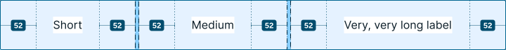

---
{
  title: "Web Fundamentals: Flexbox",
  description: "In the fourth chapter of our series, we'll look at flexbox, a powerful layout feature that allows you to create responsive designs with ease.",
  published: "2024-09-18T20:08:26.988Z",
  tags: ["css", "html", "design"],
  license: "cc-by-4",
  authors: ["ljtech","edpratti"],
  order: 4
}

---

In this chapter we will talk everything layout related, and start getting into the weeds of responsive design. Starting with Flexbox.

> **What you should know:**
> This chapter expects you to have read the previous two installments of Web Fundamentals.
> We will not be covering what HTML and CSS are, or what they do in this chapter.

---

# Flexbox

The CSS property `display: flex` is also known as flexbox. Adding `display: flex` to a container will cause any immediate descendants to become flex items.

Flexbox is used for creating one-dimensional layouts on a column (up and down) or row (left and right) direction. To change said direction, we must change the following property:

# Using `flex-direction`

```css
flex-direction: column;
```


```css
flex-direction: row;
```


---

# Using `flex-wrap`

This property allows you to make dynamic layouts that can respond to dimension constraints. In practice, it means you can tell a `flex` layout to wrap into a new row or column if there is not enough space available. Let's look at a simple example:

```css
.flex-container {
  flex-direction: row;
  flex-wrap: wrap;
}
```


## Wrapping with `min-width`

You can also set a minimum width to elements that are set to fill the flex container.

Applying a `min-width` to a child element will automatically trigger a wrap on the outer container if that element reaches its minimum value.

```css
.flex-container {
  flex-direction: row;
  flex-wrap: wrap;
  width: 480px;
}

.flex-child-item {
  flex-basis: 0;
  flex-grow: 1;
  min-width: 128px;
}
```


Keep in mind that we cannot neatly fit elements into a grid this way. The last overlapping item *will* fill the entire row.

🔗 [**If you need to set up a grid, read our CSS grid article!**](/posts/web-fundamentals-grid)

---

# Tip: Use `flex-flow`!

The `flex-flow` property allows us to use just one command to define both the `flex-direction` and `flex-wrap` properties!

If we wanted to set up the previous example using this property, we'd do so like this:

```css
.flex-container {
  flex-flow: row wrap;
}
```

---

# Using `align-items`

This property allows you to arrange your items between the `start`, `center` or `end` of a given layout.

For the following example, the `flex-direction` has been set to row. This will become important later.

```css
align-items: center;
```


```css
align-items: flex-end;
```


```css
align-items: flex-start;
```


> #### Important! The `start` and `end` suffixes are axis-dependent.
>
> When a flex layout is set to `row`, the start and end will point to top and bottom.
>
> When a flex layout is set to `column`, the start and end will point to left and right.

---

# Using `justify-content`

This property is used to distribute your content across the main axis of a flex layout. 

This can serve as an alignment property, or as a way to space out your content. Here are the available values.

## Start, center & end

These control the alignment from left, to center, to right. Keep in mind that the values `start` and `end` can change depending on RTL layouts.

```css
justify-content: center;
```


```css
justify-content: flex-end;
```


```css
justify-content: flex-start;
```


## Space elements

You can also space elements using three commands: `space-around`, `space-between` and `space-evenly`.


```css
/* Each item has equal emount of space around itself,
meaning gap between items are twice the spacing value. */
justify-content: space-around;
```


```css
/* Space items so that they fill
the entire size of the container. */
justify-content: space-between;
```


```css
/* Make it so the space between the edges and
the gaps between elements are equal. */
justify-content: space-evenly;
```


---

# `Grow`, `shrink` and `basis`

With flexbox, you'll find these three properties that are rarely used, but help us define how elements change size based on their container and their sibling elements.

As a baseline, `grow` defines how items take up empty space, `shrink` defines how items that overflow can decrease in size to properly fill the available space, and `basis` defines the initial size of a flex item.

Let's look at them more closely.

## Using `flex-grow`

This property defines how empty space is distributed among the objects inside a flex container.

Say you have three items, one each with a number inside. They contain their own padding, but apart from that, have nothing else applied.

You'll be met with this flex layout:


But now let's distribute these items so that we have a 3x1 grid instead of a pack of boxes. To do that, we will apply the following code to the `.box` class.

```css
.box {
  flex-grow: 1;
}
```


This works out perfectly! But what if we wanted to change the contents? For the sake of demonstration, let's change each label and make their lengths very different.


Now the items are no longer distributed properly... But why?

<br>

### How grow works

This has to do with how `flex-grow` works in tandem with an object's initial size.

In our first example, all of our labels had the same width, and thus, all of our objects had the same size.
<br>


<br>
This is because the `flex-grow` property *distributes the space* that's available around the elements.

This means that, if the starting size of an element is bigger than another, they will continue to be larger when `flex-grow: 1` is set!



<br>

> **The value used for the property determines the percentage of the available space that a particular item will take.**

We can see this in action by dividing the space unevenly to see how it'll behave:
<br><br>

<br><br>
And if the growth value does not add up to 1, we can expect there to be empty spaces in our flex layout, as in the following example:
<br><br>

<br><br>

#### How do we solve our original problem?

For that, we need to move onto the next property, which helps us set the initial size of an element.

---

## Using `flex-basis`

The basis property lets us define the initial size of an element. This can be any numerical value, but also some special property values as well.

| Value | Behavior |
| --- | --- |
| `flex-basis: auto` | This is the default value. It will by default attempt to take either the width or height of the element, depending on the `flex-direction`. If those dimensions are unset, it defaults to `fit-content`. |
| `flex-basis: fit-content` | As the name suggests, it sets the initial dimension as the content's dimensions on the appropriate axis. |
| `flex-basis: min-content` | Sets the initial value as the minimum possible dimension. This means squishing the flex layout until it can no longer be shrunk. |
| `flex-basis: 0` | Sets the initial value of the element to zero. Visually, however, that doesn't actually happen. It reaches `min-content` and stops. |

Here are different examples of how `flex-basis` works with different values.


<br>

### Applying our solution

To distribute flex items evenly, we must set two properties to all child elements of the flex container.

```css
.box {
  /* Distribute the available
  space evenly among elements */
  flex-grow: 1;

  /* Set the initial value of
  all elements to zero. */
  flex-basis: 0;
}
```

While visually, `flex-basis: 0` sets the minimum dimensions to `min-content`, it actually does set the initial value to `0` behind the scenes.

This means that, when we apply `flex-grow: 1` to all elements, their initial size will be null, and the space of the entire container will be shared evenly. 


---

# When to use flexbox?

- Used in headers, lists, tags, or any other block or inline content with the appropriate `flex-direction`;
- Primary method to align and justify content in small components;

---

# What's next?

It's time for the next step - **CSS Grid!** Grid is an extremely powerful feature that allows you to create really complex layouts that are responsive and flexible.

Join me on the next chapter below!
