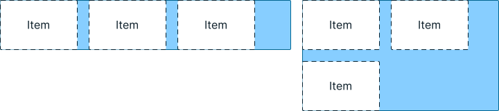

---
{
  title: "Web Fundamentals: Flexbox",
  description: "In the third chapter of our series, we'll look at flexbox, a powerful layout feature that allows you to create responsive designs with ease.",
  published: "2024-08-18T20:08:26.988Z",
  tags: ["css", "html", "design"],
  license: "cc-by-4",
  authors: ["ljtech","edpratti"],
  order: 3
}

---

In this chapter we will talk everything layout related, and start getting into the weeds of responsive design. Starting with Flexbox.

> **What you should know:**
> This chapter expects you to have read the previous two installments of Web Fundamentals.
> We will not be covering what HTML and CSS are, or what they do in this chapter.

---

# Flexbox

The CSS property `display: flex` is also known as flexbox. Adding `display: flex` to a container will cause any immediate descendants to become flex items.

Flexbox is used for creating one-dimensional layouts on a column (up and down) or row (left and right) direction. To change said direction, we must change the following property:

# Using `flex-direction`

```css
flex-direction: column;
```


```css
flex-direction: row;
```


# Using `flex-wrap`

This property allows you to make dynamic layouts that can respond to dimension constraints. In practice, it means you can tell a `flex` layout to wrap into a new rowUr columnUf there is not enough space available. Let's look at a simple example:



# Using `align-items`

This property allows you to arrange your items between the `start`, `center` or `end` of a given layout.

For the following example, the `flex-direction` has been set to row. This will become important later.

```css
align-items: center;
```


```css
align-items: flex-end;
```


```css
align-items: flex-start;
```


> #### Important! The `start` and `end` suffixes are axis-dependent.
>
> When a flex layout is set to `row`, the start and end will point to top and bottom.
>
> When a flex layout is set to `column`, the start and end will point to left and right.


# Using `justify-content`

This property is used to distribute your content across the main axis of a flex layout. 

This can serve as an alignment property, or as a way to space out your content. Here are the available values.

## Start, center & end

These control the alignment from left, to center, to right. Keep in mind that the values `start` and `end` can change depending on RTL layouts.

```css
justify-content: center;
```


```css
justify-content: flex-end;
```


```css
justify-content: flex-start;
```


## Space elements

You can also space elements using three commands: `space-around`, `space-between` and `space-evenly`.


```css
/* Each item has equal emount of space around itself,
meaning gap between items are twice the spacing value. */
justify-content: space-around;
```


```css
/* Space items so that they fill
the entire size of the container. */
justify-content: space-between;
```


```css
/* Make it so the space between the edges and
the gaps between elements are equal. */
justify-content: space-evenly;
```


Here is a list of CSS properties used to control flexbox properties: 

> [`flex-grow`](https://developer.mozilla.org/en-US/docs/Web/CSS/flex-grow): Controls a `flex` items grow factor

> [`flex-shrink`](https://developer.mozilla.org/en-US/docs/Web/CSS/flex-shrink): Controls a `flex` items shrink factor

> [`flex-basis`](https://developer.mozilla.org/en-US/docs/Web/CSS/flex-basis): Controls the initial size of a `flex` item

> ⚡ [Live Code Example: Flexbox Layout](https://codesandbox.io/s/flexbox-layout-p4cy8?file=/styles.css)


<TODO: EXPAND THIS>


---

# When to use flexbox?

- Used in headers, lists, tags, or any other block or inline content with the appropriate `flex-direction`;
- Primary method to align and justify content in small components;

For example, YouTube uses a flexbox to space out their headers children elements:


---

# Now what?

Now that we've learned a little bit of HTML, CSS, and looked over the main mechanics used to create beautiful and functional layouts, it's time to add interactivity to our prototypes! In the next chapter, we'll learn about native interactivity triggers, and how to add your own using JavaScript!

> **Coming soon:**
> The JavaScript chapter is currently in progress. It won't take long, but it's not ready just yet. Come back soon!