---
{
  title: "Web Fundamentals: Grid",
  description: "In the fourth chapter of our series, we're going to be introduced to CSS grid, a well-known feature to display content, and used in almost every website you visit.",
  published: "2024-09-18T20:10:26.988Z",
  tags: ["css", "html", "design"],
  license: "cc-by-4",
  authors: ["ljtech","edpratti"],
  order: 4
}
---


The CSS property `display: grid` is commonly referred to as gridbox. Unlike flexbox, it is capable of creating two-dimensional layouts using intersecting columns and rows.

Today we'll learn how to use grid's features to build dynamic layouts that adapt to users' needs.

# Grid sizing

Grids and grid cells take in numerical values. They can be a value relative to the parent size, a fixed size that is repeated throughout the grid, or a size relative to the size of its elements!

| Value | Behavior |
| --- | --- |
| `px` | Sets a static size for each column. |
| `fr` | Sets a fraction value based on the container size or the content size, if a container size is not set. This will take into account the `gap` property, and make sure content does not overflow. |
| `%` | Sets a percentage value based on the container size. Unlike `fr`, this will ignore the `gap` property, and content will overflow if the sum of the percentage and `gap` is bigger than 100%. |
| `vw`, `vh` | Set a percentage value based on the viewport size. Unlike `fr`, this will ignore the `gap` property, and content will overflow if the sum of the percentage and `gap` is bigger than 100%. |

Now let's look at the properties we'll be working with.

# Templates

## Areas

To define how many areas a grid will have, `grid-template-areas` takes in any term to specify layout slots. The number of terms defines the number of "slots" a particular layout can take up.

**Here we are creating a 3x3 layout.** The distribution of each layout, however, is as such:

```css
grid-template-areas:
  "a a a"
  "b b c"
  "b b c";
```

To better illustrate it, let's change the terms from letters to our actual content and use real CSS:

```css
.grid-container {
  grid-template-areas:
    "heading heading heading"
    "content content sidebar"
    "content content sidebar";
  gap: 16px;
  height: 376px;
}

```

- A header that takes up the whole top row.
- Content takes 2/3 of the remaining grid space. ***We will come back to this.***

<iframe data-frame-title="Grid: Template areas" src="pfp-code:./template-areas?template=node&embed=1&file=src%2Fstylesheet.css"></iframe>

### Customizing areas

Using `grid-template-areas` will define the default distribution, but that does not mean it cannot be customized. Using the `column` and `row` commands, we can tweak how we want to display each template area.

By default, columns and rows are distributed evenly.

```css

grid-template-areas:
  "a a"
  "b c";
```

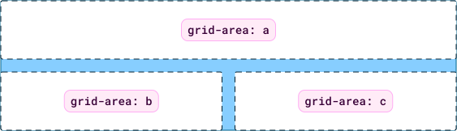

**However, there's a caveat: Their size is also dependent on content.**

Let's look at each now.

## Columns

If the content exceeds the regular size of a column, that column will grow to accomodate it. **This means that in order to force the distribution, we must call upon another property, called `grid-template-columns`.**

The `grid-template-columns` property accepts a numerical value. It can be a value relative to the parent size, a fixed size that is repeated throughout the grid, or a size relative to the size of its elements!

Let's look at an example where we override the column values to make the `grid-template-areas` and `grid-template-columns` be in opposition to one another. ***In this demo, despite the content taking more space according to the area, the column override causes it to take less space.***

<iframe data-frame-title="Grid: Column override" src="pfp-code:./column-override?template=node&embed=1&file=src%2Fstylesheet.css"></iframe>

---

## Rows

If the content exceeds the regular size of a row, that row will grow to accomodate it. **This means that in order to force the distribution, we must call upon another property, called `grid-template-rows`.**

The `grid-template-rows` property accepts a numerical value. It can be a value relative to the parent size, a fixed size that is repeated throughout the grid, or a size relative to the size of its elements!

```css
/* This tells the middle row to take twice as much space as the rest of the rows. */
grid-template-rows: 1fr 2fr 1fr;
```

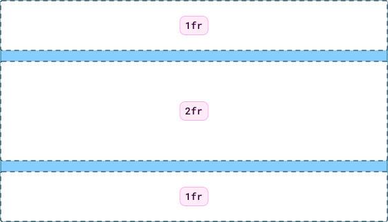

## Gaps

The `gap` property is self explanatory. It's a shorthand property that defines the space between grid cells. It accepts two inputs of any of the numerical values that we've already discussed, like percentages, fractions, viewport units and everything else.

```css
/* 
The following code
is the same as

row-gap: 24px;
column-gap: 16px;
*/

.grid-container {
  display: grid;
  gap: 24px 16px; 
}
```

> **Learn more:**
> 📚 **[MDN: gap](https://developer.mozilla.org/en-US/docs/Web/CSS/gap)**

---

# Auto properties

## Flow

By default, `grid-auto-flow` sets the order to elements to `row`, meaning items will be ordered in rows until they fill, and then they will proceed to wrap to the next one.

```css
.grid-container {
  display: grid;
}
```

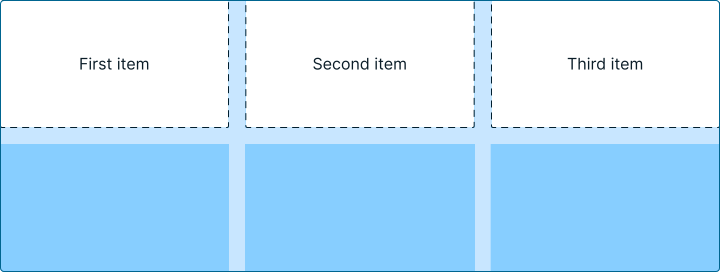

You can set the `grid-auto-flow` property to `column`. In this case, items will be laid vertically and then wrap to the next column once one is filled.

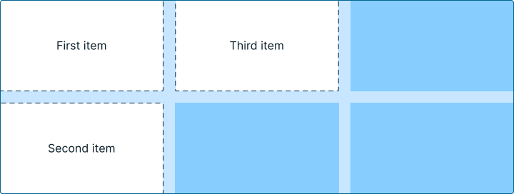

---

## Columns and rows

Sometimes, items may exceed the size of your grid, or you may want to create an invisible grid system to place items in.

In those situations, you can specify the size of auto generated cells.

```css
.grid-container {

  /* We set up two columns and two rows */
  display: grid;
  grid-auto-flow: column;
  gap: 16px;

  /* We set the default size for each of the cells */

  grid-template-rows: 48px 48px;
  grid-template-columns: 72px 72px;

  grid-auto-columns: 128px;

  /* Generated columns will be thinner */
  grid-auto-columns: 100px;                        
}

.fifth-item {
  /* This is outside of our 2x2 grid.
  It will be placed in an auto cell. */
  grid-column: 5;
  grid-row: 2;
}
```

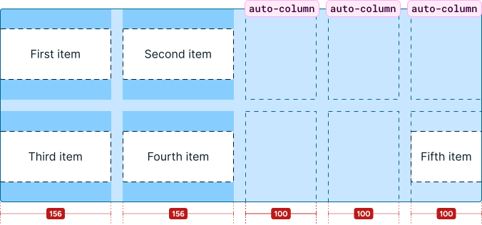

<iframe data-frame-title="Grid: Auto column" src="pfp-code:./auto-grid?template=node&embed=1&file=src%2Fstylesheet.css"></iframe>

> ⚡ [Live Code Example: Gridbox Layout](https://codesandbox.io/s/gridbox-layout-tnu5b?file=/styles.css)

---

# Alignment 

Adding `display: grid` to a container will cause any immediate descendants to become grid items. Similar to **[flexbox](./web-fundamentals-flexbox)**, we can use placement methods to help align, justify, and space grid items inside the container.


## Using `place-items`

Place items is a shorthand for `align-items` and `justify-items`, respectively.

```css
/* The following code: */

place-items: start end;

/* ...is the same as: */

align-items: start;
justify-items: end;
```

Now let's see it in action.

```css
/* Center vertically and horizontally */
place-items: center center;
```

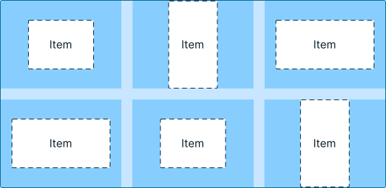

```css
/* Center vertically and align them to the right edge */
place-items: center end;
```

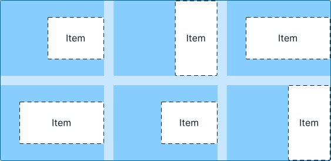

```css
/* Align items to the bottom right corner */
place-items: end end;
```

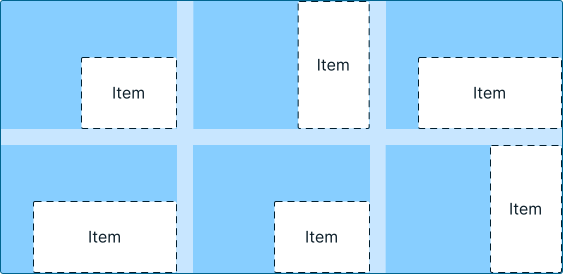

```css
/* Align items to the top left corner */
place-items: start start;
```

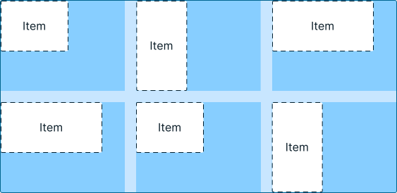

```css
/* Center vertically and align them to the left corner */
place-items: start center;
```

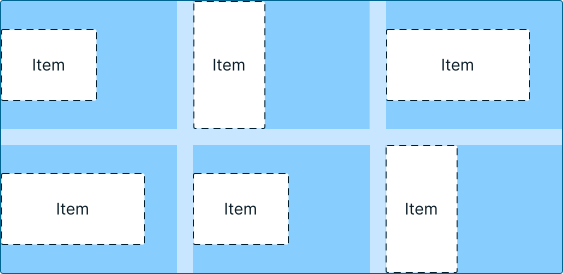

---

# Subgrid

Subgrid is a powerful feature that answers the following questions:

> - What if I wanted to make child elements of my grid items also align to the grid?
> - What if I want to make sure that certain elements are aligned in an axis regardless of the content?

Or even:

> - What if I'd like to style a particular set of grid cells?

Subgrid is fantastic for all of these use cases.

In theory, subgrid is very simple. To make a subgrid item, we must apply these properties:

```css
.subgrid-container {
  grid-template-columns: subgrid; /* Use the parent's grid on the column axis. */
  grid-template-rows: subgrid; /* Use the parent's grid on the row axis */
}
```

We can then set, in any child layout, the same property we've been using for grid items:

```css
.subgrid-item {
  grid-area: /* area-name; */
}
```

This will cause that layout to attach to the parent's grid cell. Everything works as you'd expect!

---

## Using subgrid

**Let's take our own website as an example to learn from!**

In our homepage, we have a grid of cards. And in these cards, **we have a container with tags.**

Let's rebuild the layout as we can, using flex layouts and just stacking containers; you know, the usual.

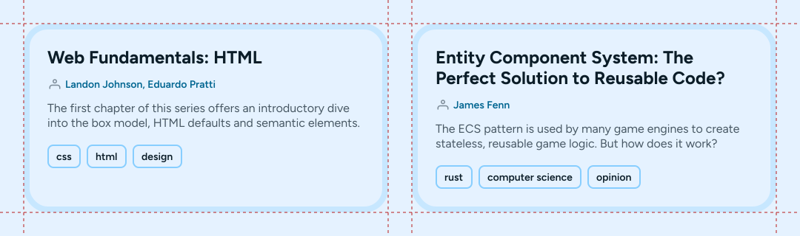

<iframe data-frame-title="Grid without subgrid" src="pfp-code:./no-subgrid?template=node&embed=1&file=src%2Fstylesheet.css"></iframe>

This follows the design closely, but one thing is different: The placement of the tag container.

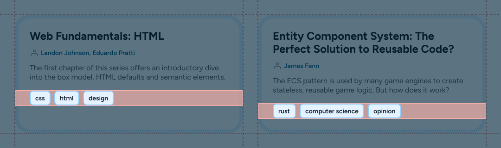

In our design we intentionally aligned it to the bottom of the cards to provide an anchor point to the distribution of content.

We can use `subgrid` and `grid-template-areas` to make sure they align properly!

```css
.grid-container {
  width: clamp(640px, 100vw, 960px); /* Responsive stuff */
  display: grid;

  /* Set up both columns. 
  Rows are left unstyled so they fit the content. */
  grid-template-areas: "content content"
                       "tags tags";
  grid-template-columns: 1fr 1fr;
  gap: 0px 32px;
  padding: 32px;
  background-color: #E5F2FF;
  box-sizing: border-box;
}
```

That leaves us with the updated grid:


> But wait... That looks the same.

Indeed! If none of the children are using `grid-area`, and dimensions have not been set to draw cells, the grid cell will simply collapse into nothing.

> While it may not seem like it, there are two rows in our layout, but we need to attach content to fill them!

## Refactoring our layout

In our demo above, every item inside our article cards was loose inside the flex outer container.

To properly adapt our layout, we will now separate the contents of the article card into two layouts: The `content-container`, and the `tag-container`.

```html
<div class="grid-container">
  <div class="article">
    <div class="content-container">
      <h2>Web Fundamentals: HTML</h2>
      <p>The first chapter of this series offers an introductory dive into the box model, HTML defaults and semantic elements.</p>
    </div>
    <div class="tag-container">
      <div class="tag">css</div>
      <div class="tag">html</div>
      <div class="tag">design</div>
    </div>
  </div>
  <div class="article">
    <div class="content-container">
      <h2>Entity Component System: The Perfect Solution to Reusable Code?</h2>
      <p>The ECS pattern is used by many game engines to create stateless, reusable game logic. But how does it work?</p>
    </div>
    <div class="tag-container">
      <div class="tag">rust</div>
      <div class="tag">computer science</div>
      <div class="tag">opinion</div>
    </div>
  </div>
</div>
```

What we just did was separate the `tag-container` from the rest of the layout so it could be tied to the `tags` template row.

```css
.article {
  /* This is necessary to define a subgrid. */
  display: grid; 
  grid-template-columns: subgrid;
  grid-template-rows: subgrid;

  /* Article cards must span
  both rows, to encapsulate all content */
  grid-row: content / tags; 

  padding: 24px;
  border: 8px solid rgba(135, 206, 255, 0.32);
  border-radius: 32px;
  box-sizing: border-box;
}

.content-container {
  /* Tie the content container to the content area */
  grid-area: content;

  display: flex;
  flex-direction: column;
  height: fit-content;
  gap: 8px;
  padding-bottom: 16px;
}

.tag-container {
  /* Tie the tags container to the tags area */
  grid-area: tags;

  display: flex;
  flex-wrap: wrap;
  height: fit-content;
  gap: 8px;
}
```

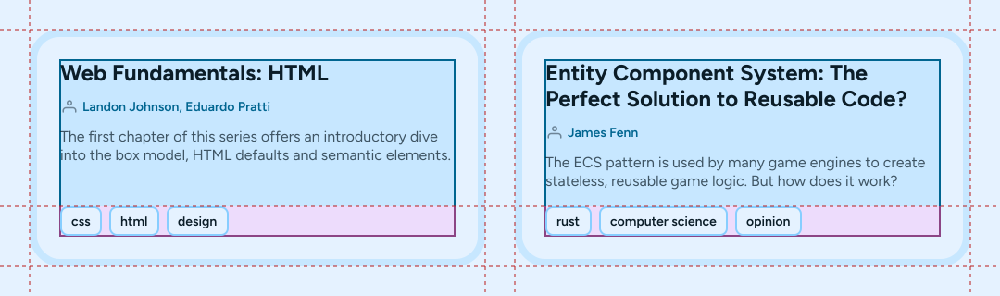

**With this, we have successfully aligned our tags!**

They will also remain aligned even if the tags overflow into another line! The demo below shows this behavior when the viewport is resized.

<iframe data-frame-title="Subgrid alignment" src="pfp-code:./subgrid?template=node&embed=1&file=src%2Fstylesheet.css"></iframe>

---

# Why use CSS grid, after all?

CSS grid is extremely popular for a reason! The main advantages of grid are:

1. Able to create complex layouts that require both columns and rows
2. Provides the easiest and shortest way to center elements
3. Verbose and powerful, with tons of customization options

---

# Now what?

Now that we've learned a little bit of HTML, CSS, and looked over the main mechanics used to create beautiful and functional layouts, it's time to add interactivity to our prototypes! In the next chapter, we'll learn about native interactivity triggers, and how to add your own using JavaScript!

> **Coming soon:**
> The JavaScript chapter is currently in progress. It won't take long, but it's not ready just yet. Come back soon!