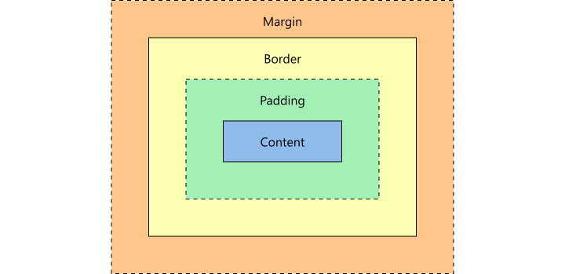
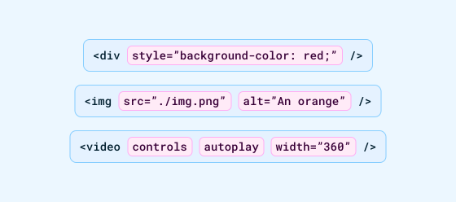
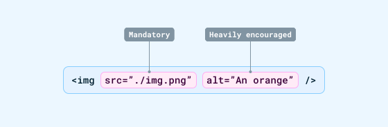
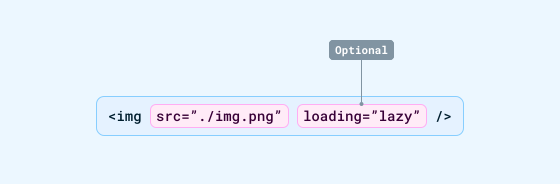

---
{
  title: "Web Fundamentals: HTML",
  description: "The first chapter of this series offers an introductory dive into the box model, HTML defaults and semantic elements.",
  published: "2024-09-03T20:08:26.988Z",
  tags: ["css", "html", "design"],
  license: "cc-by-4",
  authors: ["ljtech","edpratti"],
  order: 2
}

---

This series will guide you through the fundamentals of CSS, HTML & JavaScript in one - or a few - steps at a time.

In our first chapter, we'll talk a little - well, *more than a little* - about HTML's box model and the elements that make up the web as you see today.

> **What you should know:**
> This series only expects you to know what HTML and CSS are on a **very** basic level. If you need an introduction, check the article below.
>
>[📚 **Introduction to HTML, CSS and JavaScript**](https://unicorn-utterances.com/posts/intro-to-html-css-and-javascript)

---

# The box model

HTML is the skeleton of a page. It defines the structure of how a page will be displayed, but doesn't have any "meat" to it. That being said, every piece of that skeleton follows one universal convention: **They all have a box model**. 

A box model is a representation of a document's element through a set of boxes. They are usually shown inside browser inspecting tools as follows:



- [**`Margin`**](https://developer.mozilla.org/en-US/docs/Web/CSS/margin): Wraps any border, padding, and content as white space.
- [**`Border`**](https://developer.mozilla.org/en-US/docs/Web/CSS/border): Wraps any padding and content.
- [**`Padding`**](https://developer.mozilla.org/en-US/docs/Web/CSS/padding): Wraps any contents, again, as white space.
- **Content**: Contains text, imagery, videos, etc.

To better understand this, let's look at the following example; click on the button to switch modes and watch as the boxes translate into a real-world layout.

<iframe height="600px" data-frame-title="HTML: Box model card" src="pfp-code:./box-model?template=node&embed=1&file=src%2Findex.html"></iframe>

This structure is the foundation of HTML, and is used to build everything you see onscreen. In fact, some components are already built into the web for you to use.

Let's look at them now.

---

# Introduction to the `<div>`

A `<div>` is the purest form of a container. It has no default styling or special behavior of its own. It has no assignated function apart from being a simple, blank container. When inspecting any layout, you'll see that almost everything is enclosed within a `<div>`.

However, it's important to understand when to use them. While you can use a `<div>`, HTML has introduced several elements that provide the same function but are more accessible towards developers and users.

**This is what is commonly known as "semantic elements."**

The reason these elements are important is that users with screen readers must be told what is currently onscreen to be able to navigate effectively. A screen reader cannot interpret a screen like a human would, and thus has to rely on ***the accessibility tree***\* to understand the hierarchy and navigation patterns to do its job.

The problem is that, when not using semantic elements, the user is not given the proper context for a particular part of your application or webpage, and going through it with a screen reader becomes that much more difficult.

It's important to understand that semantic elements are best practice for a reason, and accessibility should always be a priority. If you'd like to learn more, we have a fantastic post going over web accessibility.

> #### **[Intro to accessibility](/posts/intro-to-web-accessibility)**
> Accessibility allows as many people to use your product as possible. That, in turn, generates more profit. Here's how to improve it on web.

Now let's dive into the elements, shall we?

# Semantic elements & defaults

HTML has a lot of elements out-of-the-box, and every one of them has a place and a purpose. It is important to know about HTML defaults and so you can work with them and not against them when styling a document.

Some HTML elements are strictly used for grouping content and are generally referred to as containers, while other HTML elements are used for text, images and more.

These elements all have some browser styles called HTML defaults. These may change depending on the browsers rendering engine.

## Input elements

Here's an example of a group of **input** elements, which help users interact with a website.

<iframe data-frame-title="HTML: Input elements" src="pfp-code:./input-elements?template=node&embed=1&file=src%2Findex.html"></iframe>

These elements contain controls, input fields, date pickers, and generally anything that can assist a user to perform an action or add data to a particular screen.

## Container elements

Now let's look at a small subject of semantic **container elements** that you have access to. Unlike the input elements, these **do not** have any visual representation or styling of their own, and are there to  tell both developers and screen-readers what each container does and their purpose.

```html
<body>
	<!-- There can only be one body. It contains all the document's content -->
</body>

<nav>
	<!-- Contains links for navigating to current or related documents -->
</nav>

<header>
	<!-- Headers represent the first child of a given container -->
</header>

<main>
	<!-- Contains the primary content inside a body container -->
</main>

<section>
	<!-- Contains a standalone piece of content -->
</section>

<aside>
	<!-- Represents anything indirectly related to the documents content -->
</aside>

<footer>
	<!-- Footers represent the last child of a given container -->
</footer>
```

## View all elements

This list is by no means comprehensive. HTML is a complex set of tools, and it's important to take some time to dive into its documentation to learn more about its widgets. You can access a list of all remaining elements below.

> **Learn more about HTML and its elements:**
> To view a full list of all HTML elements, click the link below. 
>
> 📚 [**MDN: HTML**](https://developer.mozilla.org/en-US/docs/Web/HTML/Element)

---

# HTML attributes

HTML elements have native attributes that define their functionality, styling or add important information to them. These can be either required attributes - meaning an element cannot be displayed or function without them - or optional, depending on the developer's needs.

An example of HTML attributes are as following:

</img>

## Global attributes

Global attributes can be applied to any HTML element. Some of the most used ones are:

| Attribute | Functionality |
| --- | --- |
| `id` | **Specifies a string ID that must be unique to that element.** <br>Useful when combined with CSS and/or JavaScript to apply styling or behaviors to an specific element. |
| `title` | **Specifies a title for the element.** <br>Useful for accessiblity, as it tells screen readers what the content of a particular object is. |
|  `class` | **Specifies a CSS class to style the element with.** <br>This is a core feature of front-end development that allows you to reuse the same styling to several different elements by applying the same class. |
| `style` | **Allows the use of inline CSS code inside an HTML element.** <br>Useful for quick and specific CSS overrides that are not meant to be applied universally to a particular element or class. |

> **View all global attributes:**
> To see a comprehensive list of global attributes, click on the link below.
>
> 📚 [**MDN: Global attributes**](https://developer.mozilla.org/en-US/docs/Web/HTML/Global_attributes)

## Mandatory attributes

HTML elements require certain attributes to function, and which attributes differ depending on the element beind used. Let's look at an example, using an `` tag, which defines an image block in HTML.

</img>

| Attribute | Functionality |
| --- | --- |
| `src` | **This is a mandatory attribute.** It tells the `` tag which source file to load. Without it, there would be nothing to display. |
| `alt` | **This is not a mandatory attribute, but it may as well be.** This is essential for screen readers to be able to tell visually-impaired users what is currently being shown onscreen. |

## Optional attributes

</img>

| Attribute | Functionality |
| --- | --- |
| `loading` | **This is an optional attribute.** It tells the browser when to load an image.<br>`lazy` tells the browser to load an image **only when it is close to or within the viewport.** This helps to load a webpage faster, but may result in users waiting if the image is simply too large to load instantly.<br>`eager` tells the browser to load the image **as soon as possible**. |

> Because optional and mandatory attributes differ per element, it is important to check the documentation when using an existing HTML element.

---

# Styling HTML with CSS

Now that we've looked over some of the components HTML has, you may be wondering how you can take control of their aesthetics and make it your own.

For that, we're going to use **CSS**, short for *Cascading Style Sheets*. These tie with HTML elements to allow you to change their properties.

## Initial values

Most components contain their own default values for styling. But these can be customized using CSS.

Let's take a form, for example. By simply changing a couple of values in CSS, we can get a new look and feel very easily.

| Property | Initial value | Custom value |
| --- | --- | --- |
| `background-color` | `#FFF` | `#E5FEFF` |
| `border` | `2px inset #767676` | `2px solid #55B4ED` |
| `padding` | `2px` | `16px` `12px` |
| `font-weight` | `400` | `700` |

<iframe data-frame-title="HTML: Initial values" src="pfp-code:./initial-values?template=node&embed=1&file=src%2Findex.html"></iframe>

> **Default values are not consistent!:**
> The values shown here are the default values in Chrome.
> The default styling of HTML components can change drastically depending on the platform it is being displayed on.

# Let's learn more about CSS!

CSS is extremely powerful, which means it warrants its own article! We'll be looking at properties, values, variables, selectors and more!

**Follow me to the next chapter below!**