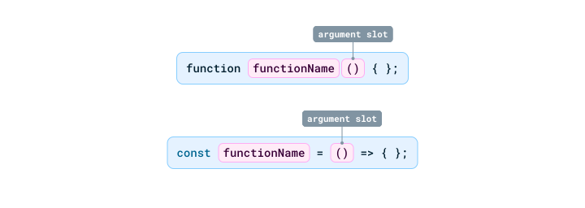
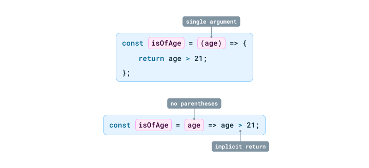

---
{
  title: "Web Fundamentals: JavaScript Basics",
  description: "The seventh chapter of this series contains the first look into JavaScript and its basic components.",
  published: "2024-11-12T20:08:26.988Z",
  tags: ["css", "html", "design"],
  license: "cc-by-4",
  authors: ["edpratti"],
  order: 8
}

---

**Today, we're learning about the basics of JavaScript.** If you've been to the web, you've been subjected to huge amounts of JavaScript.

JavaScript is a powerful programming language primarily used for creating dynamic and interactive content on websites. It runs in the browser, allowing real-time updates and user interactions without needing to reload the page.

One of its core functions is manipulating the Document Object Model (DOM), which enables developers to change the structure and content of web pages dynamically. ***We're not going to talk about the DOM and how to manipulate it in this chapter of Web Fundamentals, however.***

JavaScript is event-driven, meaning it can respond to user inputs like clicks or keyboard presses, making it essential for building interactive websites. Additionally, it supports asynchronous programming, allowing tasks like fetching data from servers without disrupting the user interface.

### Recap if you must!

Before we get started, it's important to have read up on every part of our Web Fundamentals series. We're not going to stop to explain concepts that were previously explored. The goal for this chapter is to learn the essentials so we can move on to cooler, more fun things in the next one!

---

# Basics: Variables & types

### Variables

Variables in JavaScript differ slightly from the CSS variables we've looked at in part two of our series. This is because while CSS can only define one type of variable, JavaScript has three.

| Variable type | Mutability | Scope | Details |
| --- | --- | --- | --- |
| `var` | Mutable | Global | **Mostly deprecated.** This is the equivalent to a CSS variable, being able to be accessed and modified from anywhere within the document. This is unadvised, as it can cause problems due to its careless scope. |
| `let` | Mutable | Block-scoped | **This is the most common type of variable declaration in JavaScript.** Contained within the scope of the block it is declared on, controlling its usage. |
| `const` | Immutable* |  Block-scoped | **Defines a variable with an immutable reference.** Contained within the scope of the block it is declared on, controlling its usage. |

> The `const` declaration functions differently when dealing with Objects as opposed to primitive types. To learn more, visit our article on [**Object Mutability**](/posts/object-mutation).

### Types

Types are categorized into two groups: Primitive types and Object types.

| Type | Details |
| --- | --- |
| Primitive | Number, string, boolean, symbol, null, undefined and BigInt. |
| Object | Object, Array, function, Date, RegExp. | 

---

## Number

The number type can return either an integer or a float.

```js
let age = 27;
let pi = 3.14;
```

## BigInt

When using regular numbers, we are limited to what is called a `MAX_SAFE_INTEGER`, whose value is capped at `9007199254740991`.

If you need to represent a value bigger than allowed by `number`, you can use a `BigInt` value instead. We declare a `BigInt` by appending an `n` at the end of a number, or using the `BigInt()` function.

```js
/* Same as let hugeNumber = 9007199254740991n */
let hugeNumber = BigInt("9007199254740991");
```

---

## String

The string type is created by encapsulating any content into quotation marks.

```js
let name = "Eduardo";
let gender = "male";
let country = "Brazil";
```

The quotation marks nullify any perceived type of the content, meaning that, as long as it is within quotes, it always considered a string.

```js
/* This is not considered a number.
We cannot manipulate the value as one. */
let age = "27";


/* This will not work, as we're trying
to add an integer to a string value! */
age = age + 1;
```

---

## Boolean

A `boolean` is a value that can be either `true` or `false`.

```js
let a = 3;
let b = 1;

/* Always returns true. */
let isLarger = a > b;

/* Let's make b larger than a */
b += 5;

/* Now it returns false. */
isLarger = a > b;
```

---

## Undefined

The `undefined` value is a default value that is applied when one is not provided.

```js
let value;

/* Returns undefined */
console.log(value);
```

---

## Null

The `null` is as it's described; unlike `undefined`, **it specifically sets an empty value.**

```js
let result = null;
```

---

## Objects

Objects are powerful tools in JavaScript that allow us to store key and value pairs for data management. An example of a object would be as such:

```js
const person = {
  name: "Eduardo";
  age: 27;
  country: "Brazil";
}
```

We can then retrieve those values or modify them.

```js
console.log(person.name); /* Returns "Eduardo". */
console.log(person.age); /* Returns 27. */

person.age++; /* Age is now 28. */

console.log(person.age) /* Returns 28. */
```

Like we mentioned previously, `Object`s can be modified despite being attached to a `const` variable. This is because, while their reference is immutable, **their contents are not.** To learn more, visit our article on [**Object Mutability**](/posts/object-mutation).

---

## Arrays

Arrays are a type of `Object` as well. They can hold any content type, including other arrays!

```js
const numberArray = [1, 2, 3, 4, 5];
const stringArray = ["Corbin", "Eduardo", "Obi", "Sarah"];
const mixedArray = [1, "Corbin", null, undefined];
```

We can retrieve values from array positions using their index value.

```js
const numberArray = [1, 2, 3];

console.log(numberArray[0]); /* Outputs 1; */
console.log(numberArray[3]); /* Error: No value found at the 4th position. */
```

---

# Functions

Functions, as the name implies, are used to perform reusable tasks or return values.

We can declare functions in two different ways.

## Standard functions

A function in JavaScript may look familiar to those that have used other languages in the past.

```js
function functionName() {
  /* Function body. */
}
```

A function can take as many arguments as necessary. Arguments have no restriction. They are merely "slots" for types that the function may use in its task. Let's look at a simple example.

In the following function, we are `return`ing a value. By comparing the `first` and `second` parameter with a `>` operator, we are returning a Boolean.

```js
function isLarger(first, second) {
  return first > second;
}
```

The function above, `isLarger(first, second)`, takes two arguments. Unlike other statically typed languages like Java, there is no way to specify a type for these arguments. While intuitively, the function expects two numbers, we can't ensure that unless we write our own checks.

```js
function isLarger(first, second) {
  if (typeof first !== 'number' || typeof second !== 'number') {
    throw new TypeError('Both arguments must be numbers!');
  }

  return first > second;
}
```

## Arrow functions

Arrow functions are more succinct version of standard functions. 

</img>

```js
/* A function like the following: */
function isLarger(first, second) {
  return first > second;
}

/* Can become the following arrow function: */
const isLarger = (first, second) => first > second;
```

A much shorter syntax is achieved when there is only one `return` statement, as shown above, ignoring the need for the body brackets (`{}`).

</img>

Besides that, arrow functions differ in one important area: The context of the `this` keyword.

> **Learn more:**
> Learn how context matters when using `this` and how standard and arrow functions differ when assigning properties.
><br>
> 📃 [**Mastering JavaScript's `this` keyword using `bind`**](/posts/javascript-bind-usage)

### Calling functions as values

> 📝 **[Functions, in and of themselves, are values.](./javascript-functions-are-values)**<br>
> We have an article that goes over this in much more detail. Please check it out to learn more.

We can encapsulate functions and their returns in variables.

```js
const isLarger = (first, second) => first > second;

if (isLarger()) {
  console.log("The number is larger, indeed!");
}
```

In this case, the `if` statement calls out the function because we add `()` at the end. **Adding the parentheses tells the code to run the function as soon as it is referenced.**

### Referencing, but not running, functions

There are instances where we do want to simply reference a task so that it is triggered when appropriate.

Let's say we have a task that needs to run when a button is clicked. We only want it to trigger when the button is clicked, so we cannot add the `()` at the end, otherwise we will immediately run the function.

```js
/* The task when the button is clicked */
const handleClick = () => alert("Button clicked!");

/* Here, we attach the function reference in the addEventListener,
but it is not run, because it is missing the () at the end. */
document.querySelector("button").addEventListener("click", handleClick);
```

Now our function will only trigger when the button is pressed.

---

# Classes

Classes were saved for last for being the most robust. Classes allow us to build `Object`s with ease, and provide Class-specific methods that can be reused.

For the next example, we're going to create a coffee cup class. This class needs to be able to:

- Support multiple cup sizes with different amounts
- Be depleted
- Be refilled

Let's start with the basics.

```js
class CoffeeCup {
  constructor(size) {
    this.size = size;
    this.amount = this.getCapacity();  /* Set the initial amount based on size */
  }

  /* Method to get the maximum amount of coffee based on the cup size */
  getCapacity() {
    switch (this.size) {
      case 'small': return 50;
      case 'large': return 150;
      default:      return 100;  /* Default to 'medium' */
    }
  }
}
```

## Constructors

Constructors are used to create properties attached to instances of a particular class. For our example, our coffee cup needs to have a `size` and this size determines yet another property; its `amount`.

For this, we define a `constructor(size)` that attaches the desired size argument to our `this.size`.

**The `this` keyword:**<br> When creating properties for classes, we use the `this` prefix to bind them. If we do not use `this.size`, we cannot retrieve a value with `CoffeeCup.size`.

## Methods / functions

Now let's add our additional functions, `sip()` and `refill()`, to interact with our coffee.

```js
/* Method to take a sip, reducing the coffee amount */
sip() {
  if (this.amount > 0) {
    this.amount -= 10;
    console.log(`You took a sip. ${this.amount}% coffee left.`);
  } else {
    console.log("The cup is empty! Time to refill.");
  }
}

/* Method to refill the coffee cup */
refill() {
  this.amount = this.getCapacity();  /* Use getCapacity to refill based on size */
  console.log(`The cup is now full again! (${this.size} size)`);
}
```

Now we can create a cup of coffee and interact with all of our previously set up methods.

```js
const myMediumCoffee = new CoffeeCup('medium');

myMediumCoffee.sip();   
/* Output: You took a sip. 90% coffee left. */

myMediumCoffee.refill();
/* Output: The cup is now full again! (medium size) */
```

---

# Up next: Understanding the DOM

In our next chapter, we're going to learn about the DOM — Document Object Model — and how it renders content inside of our browsers. This will be very important for the second part of our JavaScript section! I'll see you there.