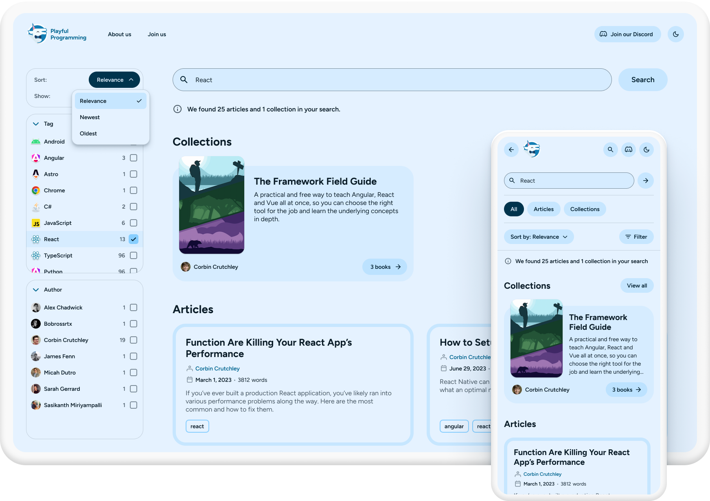

---
{
  title: "Web Fundamentals: Responsive design",
  description: "The fifth chapter tackles responsive design, breakpoints, media queries and more!",
  published: "2024-10-03T20:08:26.988Z",
  tags: ["css", "html", "design"],
  license: "cc-by-4",
  authors: ["edpratti"],
  order: 5
}

---

Responsive design aims to solve a common problem: devices and form-factors have gotten considerably more diverse along the years.

Because of this, it's important that we know how to tackle scenarios where displaying content can be problematic and learn how to use our current HTML and CSS knowledge to make it responsive!

# Introduction to responsiveness
<br>



The principle behind responsiveness is to neatly adapt your content so that it is readable to all of your users. This means hiding, showing, replacing and mutating aspects of your layout to better fit a specific scenario.

In practice, it means we'll be working with relative units! However, you'll most likely still use absolute units in several cases.

## Absolute units

The absolute unit you'll use predominantly will be `px`, or pixels.

| Unit | Usage |
| --- | --- |
| `px` | Paddings, margins, borders, corner radius, icon sizes, drop-shadow properties & more. |

But when it comes to resizing contents and detecting configuration changes, we need to go a bit deeper.

## Relative units

There are different relative units for each context. Use them accordingly!

#### Parent-size units

| Unit | Behavior |
| --- | --- |
| `%` | Relative to the parent element. Setting an inner element's height to `50%` will make it 50% of the parent's height. |
| `fr` | Relative to the parent element. Sets a fraction value based on the container size. |

#### Viewport units

| Unit | Behavior |
| --- | --- |
| `vw` | Relative to the viewport's width. Changing the window's width will cause the element's width to change. |
| `vh` | Relative to the viewport's height. Changing the window's height will cause the element's height to change. |

#### Font-size units

| Unit | Behavior |
| --- | --- |
| `em` | Relative to the parent element's `font-size`. |
| `rem` | Relative to the `:root`'s `font-size`. |

Now let's learn a little about how to trigger a change in layout.

---

# Responsive layouts

In order to build responsive layouts, we must detect the viewport size that the content is being displayed on. This is commonly done using `@media` queries.

## Media queries

Media queries are the bread and butter of responsive design. Thet take many parameters into account, allowing for a lot of customization.

For our purposes, however, they'll be mostly shown as such:

```css
@media screen and (min-width: 360px) {
  /* Your changes here */
}
```

- The `@media` prefix is tells the browser that we're going to start specifying attributes for our media query.
- The `screen` notation means we are only targeting this for what's being shown in our devices, and not for `print`, for example. Media queries would allow us to customize it for two different contexts easily.
- The `and` is the connecting tissue between rules.
- **The `(min-width: 360px)` is our rule.** It tells that browser that whatever is contained within the `{}` can only trigger after the viewport has equalled or exceeded `360px` in width.

In the following demo, a button is hidden by default, until there is enough space to display it. To achieve this, we used our previous rule.

```css
@media screen and (min-width: 360px) {
  .pfp-btn {
    /* Overrides display: none; */
    display: inline-block;
  }
}
```

<iframe data-frame-title="@media query: min-width" src="pfp-code:./media-query-min-width?template=node&embed=1&file=src%2Fstylesheet.css"></iframe>

With this simple query, we have successfully updated our content and hid the content when necessary.

But in the real world, media queries are used to target specific device form factors with certain breakpoint values. Let's learn a little bit about breakpoints.

## Breakpoints

While screen sizes have increased and bezels have gotten thinner, breakpoints remain generally the same.


[**The NNGroup website**](https://www.nngroup.com/articles/breakpoints-in-responsive-design/) has a great resource on breakpoints, but essentially, you'll be dealing with these values:

| Width | Breakpoint |
| --- | --- |
| `320px` ~ `480px` | <b>Mobile phones.</b> <br>Note that these are the most extreme examples of mobile phone breakpoints. Android and iOS zoom levels do not go below 320pt, and no phones display content on portrait at widths larger than 420pt. |
| `480px` ~ `768px` | <b>Foldable devices and smaller tablets.</b> |
| `768px` ~ `1280px` | <b>Larger tablets and laptops.</b> |
| `1440px` ~ `1920px` | <b>Large monitors.</b> Going past `1920px` is optional, as larger monitors are still not widely adopted. |

### Stepping up a notch

Now that we're figured the mechanism of hiding and showing elements using queries, we're going to use it in a very simple layout.

For this next demo, we have a layout that contains two sidebars. One for a table of contents, the other for related articles.

There are two different media queries, designed to hide items progressively:
- First, we hide the related content, at `768px`.
- And then the sidebar, at `480px`.

```css
@media screen and (max-width: 480px) {
  #toc {
    display: none;
  }
}

@media screen and (max-width: 768px) {
  #related-articles {
    display: none;
  }
}
```

> **Note:**
> We are using `id` values (`#`) to hide specific portions of the interface, as the `.side-container` class is shared among them!
> This allows us to reduce unnecessary duplicates by reusing code!

<iframe data-frame-title="@media query: Responsive layout" src="pfp-code:./media-query-responsive-layout?template=node&embed=1&file=src%2Fstylesheet.css"></iframe>

In this demo, we're also using the knowledge we got from the [**Web Fundamentals: Flexbox**](/posts/web-fundamentals-flexbox) article!

---

# Responsive typography

When designing responsive layouts, it is imperative that text remains legible and accessible.

As we've already discussed, there are two ways of sizing text in an accessible way. One of them is using `rem` values, relative to the `:root` `font-size`. And the other is `em`, relative to the parent element's `font-size`.

They both have different use cases and it's important to know when to use each.

## When to use `rem`

**In almost all situations, using `rem` is advised.** The *root em* is the value that browsers change according to the user's text size preferences. The sizes for Chromium-based browsers are as follows:

| Text size (Chromium) | `px` value |
| --- | --- |
| Small | `14px` |
| Normal (Default) | `16px` |
| Large | `20px` |
| Extra Large | `24px` |

### Setting up text styles

When setting up text styles at the base level, always defer to `rem`. This ensures it scales alongside the browser's text size.

```css
h1 {
  font-size: 3rem;
  line-height: 1;
}

h2 {
  font-size: 2.5rem;
  line-height: 1;
}

h3 {
  font-size: 2rem;
  line-height: 1.125;
}

/* And so on... */
```

In the following demo, we are simulating the `rem` to `font-size` relationship.

> The demo also scales with the browser's `rem`, but this wasn't necessary.

<iframe data-frame-title="Using rem" src="pfp-code:./using-rem?template=node&embed=1&file=src%2Fstylesheet.css"></iframe>

---

## When to use `em`

**While `em` has less applications, it can solve fragmentation in some cases.** It is used primarily to style text elements or elements based on the `font-size` of their parents.

A really good use-case for `em` values is when they are applied to `<span>` elements, nested inside `h1`, `h2`, ... `<p>` elements. In this context, `<span>` are intrinsically dependent on the original tag for their styling, and thus, we can ensure that they scale alongside each other, without having to update two values.

Let's better illustrate this with a demo. In it, I have highlighted a specific portion of this text. We still have full control over the `font-size`.

<iframe data-frame-title="Using em" src="pfp-code:./using-em?template=node&embed=1&file=src%2Fstylesheet.css"></iframe>

- **When using `em` for the padding**, we can observe that the size of the highlight is always proportional to the text size.
- **When using `rem` for the padding**, as the text grows larger, the highlight becomes smaller in comparison. This is because the `font-size` does not affect the `rem` and its value remains static.

---

# Responsive graphics

Videos, images, and other sorts of media come in specific aspect ratios. When designing a responsive application, we must ensure that they maintain their ratio so that content is not squished or stretched.

CSS thankfully has us covered, with the `aspect-ratio` and `object-fit` properties!

## Using `aspect-ratio`

We can easily set up an image's aspect ratio by declaring the following:

```css
img {
  aspect-ratio: 16 / 9;
}
```

It also accepts the following values:

```css
img {
  /* This example is equivalent to 1 / 2 */
  aspect ratio: 0.5;
}
```

```css
img {
  /* Will respect the image's original aspect ratio. */
  aspect ratio: auto;
}
```

## Using `object-fit`

The `object-fit` property defines how the image will behave within its aspect ratio's bounds.

**To better illustrate this, I've built a demo that allows us to customize both `aspect-ratio` and `object-fit` in tandem!**

<iframe data-frame-title="Responsive graphics" src="pfp-code:./responsive-graphics?template=node&embed=1&file=src%2Fstylesheet.css"></iframe>

---

TO-DO: PUT IT ALL TOGETHER, WITH GRID!