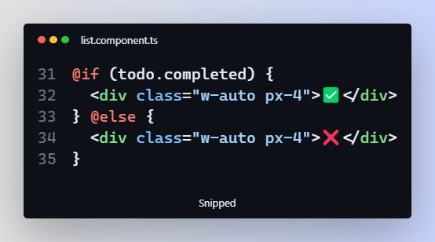
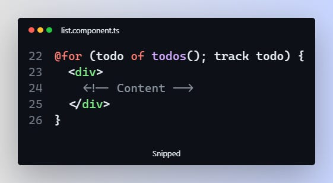

---
{
title: "A deep dive into new control flow syntax for Angular (17)",
published: "2023-11-20T15:18:19Z",
tags: ["angular", "webdev", "typescript", "javascript"],
description: "With the release of Angular 17, I wanted to explore the control flow syntax in Angular and...",
originalLink: "https://newsletter.unstacked.dev/p/a-deep-dive-into-new-control-flow",
coverImage: "cover-image.png",
socialImage: "social-image.png"
}
---

With the release of Angular 17, I wanted to explore the control flow syntax in Angular and demonstrate its benefits. The new syntax, which was part of the release for v17 of Angular, alongside a torn of other features we are going to look at in the future, is a big deal and a huge departure from how we accomplished control flow in Angular.

Control flow is the order in which statements are executed by the computer in a script. We can use conditions (`if…else, switch` statements) to determine which statements to execute and which to skip when certain conditions are met. We can even repeatedly execute statements using loops.

Subscribed

Angular is getting a new syntax for control flow, a major departure from what things were (I will refer to it as the old syntax), and still are, as the new control flow syntax is still in the developer preview.

First, let’s compare the new syntax with the old syntax.

#### If Conditions

Let’s say we want to show a section of our template if the conditions are true. With the old syntax, we would do it like this:


Old if….else conditional syntax in Angular

But now, with the all-new syntax, this would look like this:



New Angular if…else conditional syntax

Or can be further simplified to:


#### For Loop

What about for loops:

**Old**


For Loop before V17

**New**



New Angular For Loop Syntax

As you can see, we are also passing a tracking expression that yields a unique key that we can use to associate the array items and their place in the DOM for performance reasons. This is required in the new control flow syntax, while before with the old syntax, it was optional.

#### NgSwitch

Here is an example of the old syntax


And here is what that looks like now, with the new syntax


Notice something? The new syntax is more readable (I know, it’s subjective, but I think we can both subjectively agree) and familiar, it looks like the very familiar syntax you would come across while writing Typescript or Javascript (or most languages for that matter). If you are new to Angular, good luck understanding the old syntax without a few head scratches and squinting your eyes.


And then there is another huge benefit, **syntax highlighting and formatting**. In the old syntax, we didn’t have much in the syntax highlighting corner, as the structural directive we part of the HTML attribute. Since now the control flow isn’t part of the HTML tags, syntax highlighting is already available. On top of that, the prettier npm package (update to the latest version) now supports formatting of the new Angular syntax and it’s just glorious.

Combine these two, and you can now easily tell where one block ends and the other one starts and any nested blocks within the template are easy to identify. This should aid in code readability and improve it exponentially.

And did I mention there is no more unnecessary `ng-container` and `ng-template` for conditional HTML blocks? This leads to much cleaner code with less boilerplate.


I wish things were that simple

So far we have seen if and for syntaxes, what about the switch, here is an example.

### Improvements over the Old Syntax

#### → for loop: required track expression

With the new syntax, providing a track expression that yields a key to keep track of each item in the array to the view location in the DOM for improved performance, especially over large lists is required.

Trying to leave it out, you get the following error:

```
@for loop must have a "track" expression
```

On top of that, Angular is using a new optimized algorithm for the for loop so that it’s more performant by making DOM operations as a response to collection changes minimal and hence more efficient.

#### → for loop @empty Keyword

On top of that, we now have an `@empty` keyword that we can use to handle situations where the list is empty, which is kind of neat.


### → readable else

As we saw earlier, doing else in the old control flow syntax in Angular was not really readable and required a lot of boilerplate code, however with the new control flow, it’s much more readable and more familiar, especially for developers just starting out in Angular.


### What about the Async Pipe?

Just like before, we can still the async pipe to subscribe to observables just like before.

Within for loops, this is how we can achieve this:


The same can be done for the if blocks:


### I am sold, how do I switch?

First, make sure you have updated your Angular project to v17 and then you can run the following schematic to convert existing control flow syntax to the new control flow syntax.

```
ng g @angular/core:control-flow-migration
```

When prompted for a path, enter the path to your project and that’s it.

A word of caution, which is a huge step forward in Angular, is that the control flow syntax is in the [developer preview](https://angular.io/guide/releases#developer-preview). This means some things may change under the hood without following semantic versioning, as it gives the Angular team flexibility to move first and fix issues and concerns that may arise before it’s generally available with the same [guarantees Angular](https://angular.io/guide/releases) provides for all its features.

### Next on Unstacked: The all-new @defer syntax

On top of that, Angular is getting a new `@defer` syntax that can be used to lazy load components, directives, and pipes in the template, until certain conditions are met. I am going to go over this in the next issue of Unstacked in the next couple of weeks as this post is becoming overly long for a newsletter.

### Conclusion

In this post, we took a look at the new control flow syntax for angular and the benefits it brings along as compared to the old syntax. We learned that the new control flow syntax is more familiar and subjectively more readable as compared to the old one, and requires less mental gymnastics to understand what’s going on, even for experienced Angular devs, let alone newbies. We also learned how the new syntax not only replaces the old syntax but improves upon it by bringing in extra helpers such as `@empty` and required track by expression for improved performance.

That’s it from me, and until next time, keep on learning.
