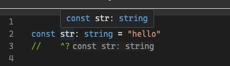
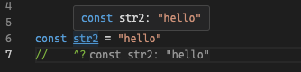
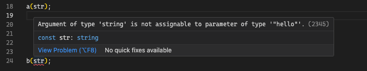
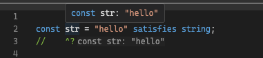
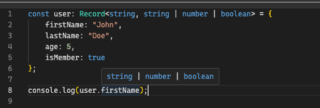
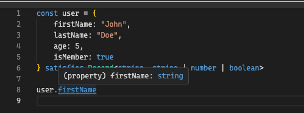
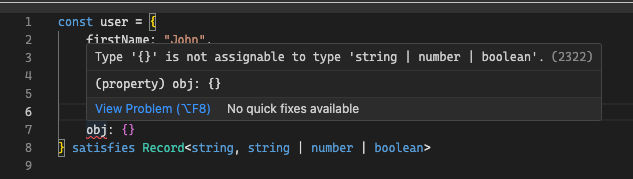
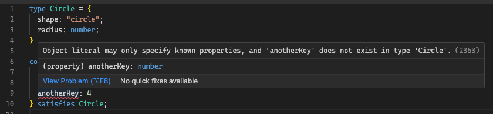

---
{
title: "A Deep Dive into the satisfies operator in Typescript",
published: "2024-03-12T19:36:44Z",
edited: "2024-03-12T19:42:16Z",
tags: ["javascript", "typescript", "webdev", "tutorial"],
description: "In Typescript version 4.9, Typescript introduced the satisfies operator. Over the last few months, I...",
originalLink: "https://www.allthingstypescript.dev/p/a-deep-dive-into-the-typescript-satisfies",
coverImage: "cover-image.png",
socialImage: "social-image.png"
}
---

In Typescript [version 4.9](https://www.typescriptlang.org/docs/handbook/release-notes/typescript-4-9.html), Typescript introduced the satisfies operator. Over the last few months, I have seen examples of it being used out in the world more often, and even I have found myself getting comfortable using it. In this issue, I want to do a deep dive and try and answer the following questions:

- Why it exists

- Why not annotations

- Why not assertions

- When to use it

### What is the `satisfies` Typescript operator

According to the Typescript [docs](https://www.typescriptlang.org/docs/handbook/release-notes/typescript-4-9.html), the new `satisfies` operator lets us validate that the type of an expression matches some type, without changing the resulting type of that expression.

So, what does this mean? When we add type annotations to a variable, Typescript doesn’t usually infer the Type to its narrowest possible value. So, if we say a variable’s type is a string, Typescript takes our word for it and checks the value we assign to it against the type annotation we provided, as shown below:

```
const str: string = "hello"
```

In the case above, despite us using const, and having all the information at hand to narrow the above type to the `hello` literal type, Typescript doesn’t do that and instead takes our annotation as the type of the variable.



This is in contrast to when we allow type inference to work for us, instead of explicitly providing Type annotations, as shown below:



As you can see from the above example, when we use explicit type annotations, we lose the narrower type that we would have gotten if we had let Typescript infer the type for us.

Why is this important, you may ask? To answer this, let me show you an example, take the following two functions:

```
function a(input: string) {
  // do something
}

function b(input: "hello") {
  // do something 
}
```

The first function accepts a string and the second accepts a literal type - `hello`. With the first variable, we annotated the type explicitly, this can be passed to the first function without any issues.

But in the second function, despite the first variable value being hello, Typescript will make you jump through to accept the variable, simply because it expects a narrower type than the type of string we provided.



In the second function, you would need to narrow the variable for it to work, as shown below:

```
if(str === "hello")  b(str);
```

> In our case above, we are using control flow to narrow the type of str variable to hello, from a broader type of string. You can learn more about type narrowing in this previous [issue](https://www.allthingstypescript.dev/p/narrowing-types-in-typescript).

#### How does the `satisfies` operator help?

If you are wondering what this has to do with the satisfies operator, I am getting to the point in a moment.


What if you wanted to ensure that `str` is a string, without losing the narrowness of the inferred type? If you remember at the beginning, we said that the satisfies operator allows you to validate (think type-check) a variable type without changing the resulting type of that expression. The **resulting type** being the Type inferred by Typescript in the absence of explicit type annotation.

So, if we went back to our example, instead of using type annotation for our variable, and instead we used the `satisfies` operator, as shown below:

```
const str = "hello" satisfies string;
```

Our variable wouldn’t carry the type of string as it did previously when we used type annotations, but the resulting inferred type is retained.



And this means, we can now pass the variable to the second function without needing to narrow the type.

```
const str = "hello" satisfies string;
//    ^? type = "hello"

// this works now
b(str);
```

#### “Real-world” Example

Okay, I know what you are thinking, this isn’t a practical example. And that’s true, but I needed a straightforward example, that hopefully was easy to follow and understand, which I hope worked, and if it didn’t let me know in the comment section below.

Let’s see a more realistic example. Let’s say we want an object, with property names being `string` and values being either `string`, `number`, or `boolean`, as shown below:

```
const user = {
    firstName: "John",
    lastName: "Doe",
    age: 5,
    isMember: true
};
```

With the above object, we might want to have Typescript type-check the content of the object. In such a situation we have two options:

- providing explicit type annotations

- or the `satisfies` operator.

If we use type annotations and try accessing one of the properties, Typescript doesn’t know the properties that are inside the object or their types, this is despite us explicitly adding them and adding them upfront.

```
const user: Record<string, string | number | boolean> = {
    firstName: "John",
    lastName: "Doe",
    age: 5,
    isMember: true
};
```

In this case, Typescript goes with the type from our Type annotation for the property values.



This isn’t great, for one, we can include properties that don’t exist inside our user object or typos and which may introduce bugs within our codebase. However, if we went with the `satisfies` operator, then things work out quite differently and for the better.

```
const user = {
    firstName: "John",
    lastName: "Doe",
    age: 5,
} satisfies Record<string, string | number | boolean>
```

If we try and access the property firstName, we get both auto-completion 👌🏾 and it has the correct type, as shown below:



We also can’t access properties we didn’t explicitly add to the user object.


And we also get the excess property checking we got when we provided explicit type annotations.



This has a few benefits:

- Improved type safety as demonstrated in the last example. This is twofold:

  - validating the object properties and values are of certain types, and

  - avoiding changing the objects’ inferred type, which means the property value types are narrow instead of wide.

- Reduced the amount of code we write - we don’t need to engage in type narrowing to use our properties above, they already have a narrow type.

#### Use Cases

Now that we have seen how we can some of the use cases of the `satisfies` operator.

##### Constraining the type of variable

We can use the satisfies operator to constrain or limit the types that can be used for a variable, without interfering with the type inference. A good example of this is our example above, where we limited our variable `str` to string, but let it be inferred as a narrower type by typescript, using the available information.

```
const str = "hello" satisfies string;
```

##### Constraining the Property Names of an Object and Catching Excess Properties

We can use the `satisfies` operator to make sure our object only has the keys and nothing extra.

```
type Circle = {
  shape: "circle";
  radius: number;
}

const circle = {
  shape: "circle",
  radius: 4,
  anotherKey: 4
  // this will throw an error as shown bolow
} satisfies Circle;
```



##### Constraining the values of Properties, the opposite of the above

The following will throw an error because the shape property is missing.

```
const circle = {
  radius: 4,
} satisfies Record<any, number>;
```

##### Ensuring an Interface is Implemented

```
interface Person {
  delete: () => void;
  get: () => Record<string, unknown>
}

const thisPersion = {
  delete:  () => {};
  get: () => ({})
} satisfies Person;
```

For more about the `satisfies` operator, check out the following [issue](https://github.com/microsoft/TypeScript/issues/47920), where the discussion for adding the satisfies operator to Typescript happened.

### Conclusion

In this issue, we took a look at the `satisfies` Typescript operator, and how it can be used to validate a type, without changing the inferred type of the expression. This is different from how both type assertions and annotations work because Typescript takes that as the type of the object, which is sometimes not desired.

When using the `satisfies` operator, Typescript only type-checks our variable against the provided type while inferring the type using the information available (Learn more about Type Widening here).

The inferred type is usually narrower, meaning it can be used without the need for narrowing, which may not be the case for using assertions and annotations, while also type-checking it against a specific type, which ensures type safety isn’t compromised.

---

**If you loved today’s content and would be interested in supporting my work, please consider supporting me (*****you can buy me a double latte, the juice that powers my creativity ☕️*****) through [Github Sponsors](https://github.com/sponsors/mainawycliffe/).**
