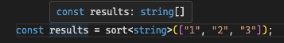
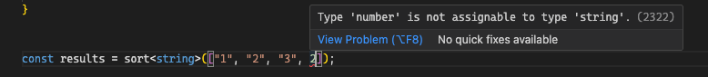
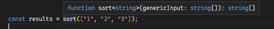

---
{
title: "A Gentle Introduction to Generics in Typescript",
published: "2024-03-26T07:21:09Z",
tags: ["typescript", "javascript", "webdev", "tutorial"],
description: "One of the more advanced topics in Typescript is Generics and understanding and adding them to your...",
originalLink: "https://www.allthingstypescript.dev/p/a-gentle-introduction-to-generics",
coverImg: "cover-image.png",
socialImg: "social-image.png"
}
---

One of the more advanced topics in Typescript is Generics and understanding and adding them to your Typescript coding toolbox can be very powerful. As we continue with our journey of learning Typescript and building amazing projects, we want to have more and more tools that we can use to make our job easier, without making compromises when possible.

### What are generics?

Let’s see a useful case on why generics can be very important and even crucial. Let’s say we want to build a function to sort strings. It would look something like this.

```
function sortString(str: string[]): string[] {
    // sort algorithm
}
```

But after a while, the requirements of our project change, and we need to be able to sort numbers as well. The algorithm to sort the strings and numbers is the same but to have it strongly typed we would need to create a second function for that as well.

```
function sortNumber(num: number[]): number[] {
    // sort algorithm
}
```

In the future, the requirements of our project could change and we could end up sorting different types of variables. As you can see, we could end up duplicating the original function, more and more, as we need to be able to sort different types of arrays.

#### Can we use the `any` Type to solve this problem

Yes, we could. But this comes with one huge disadvantage, compared to having multiple functions, we lose type-safety and type precision, and we certainly don’t want this.

You can learn more about why you should avoid using the `any` type in one of my previous issues [here](https://www.allthingstypescript.dev/p/why-avoid-the-any-type-in-typescript).

```
function sort(num: any[]): any[] {
//                  ^ DON'T DO THIS
    // sort algorithm
}
```

#### Is there a better solution?

Before I can answer that, let’s recap. *So, we want a solution that allows us to write a single sort function, without compromising type-safety and losing type precision*. Back to the question, yes, there is a better solution.

What if, instead of writing a sort function with static types for arguments and return values as we did previously, we could write a function whose types can be specified when the function is being called?

So, in our case, we would allow the caller of our sort function to specify the type of function [argument](https://developer.mozilla.org/en-US/docs/Web/JavaScript/Reference/Functions/arguments) (the array to be sorted) and output (sorted array).

This is exactly what generics allow us to achieve in programming, and [Wikipedia](https://en.wikipedia.org/wiki/Generic_programming) has a very good definition of it.

Generic programming is a style of computer programming in which algorithms are written in terms of data types to-be-specified-later that are then instantiated when needed for specific types provided as parameters.

To break the above down in relationship to our sort function requirement, we want to write our sort function algorithm, without tying that algorithm to a specific type - `string`, `number`, `boolean`, etc. but also allow the caller to let us know the type that we can use for type-checking.

#### So, how do they work?

In Typescript, we use generics by providing the type variable inside angle brackets (`<Type>`). A type variable is a special kind of variable that works on types rather than values. You have free reign in naming the type variables, just like the naming of other variables.


For instance, in functions, we provide the type variable, in angle brackets (`<Type>`), in between the function name and brackets used to specify the arguments. We will see about generic classes, types, and interfaces later on. The type specified here can then be used within the function, or for arguments and return types, as shown below.

```
function sort<SortType>(genericInput: SortType[]): SortType[] {
~~~~~~~~~~~~~~   ^ Type Variable
    return genericInput.sort();
}
```

In the above function, we are specifying the type variable, which is the `SortType` type, and then for the function argument, we use `SortType` as the type of the first function argument and output. And this is how we use the above function:

```
const x = sort<string>(["1", "2", "3"]);
```

We are providing the string type, as the type variable and now Typescript can use the information to type-check the function arguments and outputs.



This works for a variety of types:

```
const nums = sort<number>([1, 2, 4, 5])
//            ^? function sort(input: number[]): number[]

const str = sort<string>(["str", "str2"])
//            ^? function sort(input: string[]): string

// we can even mix up things now
const both = sort<string | number>([1, 2, "str"])
//            ^? function sort(input: (string | number)[]): (string | number)[]     
```

If we try a different type other than the one provided in our generic type variable, Typescript is going to throw an error, as shown below:



***Typescript will type-check the function arguments against the Type variable we provided.***

And just like functions arguments, you can have multiple type variables:

```
function manyGenerics<A, B, C, D>(a: A, b: B, c: C, d: D): [A, B, C, D] {
    return [a,b,c,d]
}
```


#### Do I have to provide the type variable every time?

The answer is no, and this is because Typescript can use Type [inference](https://www.allthingstypescript.dev/p/all-things-typescript-newsletter-issue-13-type-inference-in-typescript-1211063) so you don’t have to provide the functions generic type with every call.



Typescript will use the type inferred for our generic input, as the type for our variable type, which can save you from having to always specify the type variable.

This is so good that many developers use generics daily without realizing it. For instance, the `Array.sort()` functions and other [Array methods](https://developer.mozilla.org/en-US/docs/Web/JavaScript/Reference/Global_Objects/Array) are generic functions.

For instance, the following [Array.map](https://developer.mozilla.org/en-US/docs/Web/JavaScript/Reference/Global_Objects/Array/map) method:

```
[1, 5, 3, 11, 6 ].map(x => x.toString());
```

It can also be written like this, with the type variable provided.

```
[1, 5, 3, 11, 6].map<string>(x => x.toString());
```

### Where else can we use generics?

So far, we have seen generics in function space. But we can use generic in a variety of places, not just functions. Let’s see some of this:

#### Classes and Methods

Just like functions, when defining a class, we can request a type variable(s) for the class, which we can then use within the class.

```
class SomeClass<Type>{
// ~~~~~~~~~~~~~ ^ Type Variable

    property: Type;
    //         ^ We can use the Generic type for types of properties

    doSomething(input: Type): Type {
    //                  ^ and for methods input
    }
}
```

And on top of that, we can provide type variables for the methods themselves, if need be:

```
class SomeClass{
    doSomething<Type>(input: Type): Type {
        //       ^? Type Variable
    }
}
```

#### Types and Interfaces Definition for Key-Value Objects

When defining types for key-value objects using either [interface or type](https://www.allthingstypescript.dev/p/type-vs-interface-in-typescript-all), you can use generics to provide types for some of the properties.

```
type Person<Type> = {
//            ^ Type Variable
    name: string;
    id: string;
    properties: Type;
}
```

We can do the same with interfaces:

```
interface Person<Type> {
//                ^ Type Variable
    name: string;
    id: string;
    properties: Type;
}
```

### What’s next?

So far, we have had a very brief introduction to Typescript generics, where we looked at creating Generics in Typescript and how we can use them. Generics are powerful and are very useful and in our latest issue, we looked at constraining our generic types, here is the [issue](https://www.allthingstypescript.dev/p/generic-constraints-a-gentle-introduction).

See you next week and [subscribe](https://www.allthingstypescript.dev/) to not miss the next issue.

---

**If you like my content and want to support my work, please consider supporting me (*****you can buy me a double latte, the juice that powers my creativity and determination ☕️*****) through [Github Sponsors](https://github.com/sponsors/mainawycliffe/).**

[☕️ Consider buying me a cup of coffee](https://github.com/sponsors/mainawycliffe/)

---

### Conclusion

In this issue, we looked at Typescript generics. We looked at a simple example of a sorting function, that enabled us to see in which situations generics can be very useful and how generics can help us write less code without compromising type safety.

In the next issue, we will continue looking at generics and some advanced techniques that we can do with generics to even lead to more Type safety.

So, until next, keep on learning.
