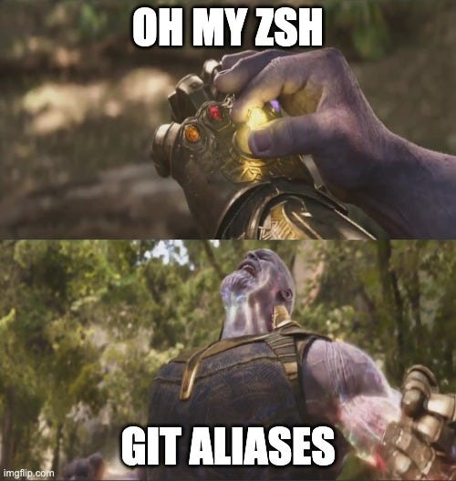

---
{
title: "Boost your productivity by mastering Oh My ZSH git aliases",
published: "2024-03-06T07:03:05Z",
tags: ["tooling", "git", "devex", "productivity"],
description: "Since I discovered Oh My Zsh a few years ago, it has been a god-sent gift to me. I believe it has...",
originalLink: "https://newsletter.unstacked.dev/p/boost-your-productivity-by-mastering"
}
---

Since I discovered Oh My Zsh a few years ago, it has been a god-sent gift to me. I believe it has impacted my productivity in a very positive way, for instance, with the history autocomplete plugin, I no longer have to keep hitting the up arrow until I get to the command I wanted, I can just start typing and Oh My Zsh will give me suggestion s based on my history. It’s just genius.

> PS: If you are looking to get started with Oh My Zsh, you can find the installation instructions [here](https://github.com/ohmyzsh/ohmyzsh/wiki).


I guess this is the one plugin I can probably not survive with, my flailing memory would suffer greatly to have to remember all my previous commands, even the ones I worked out myself. A close second plugin for my workflow and I believe vital for most developers is the git plugin. It’s just genius.

Subscribed

Of course, with Oh My Zsh, you have an arsenal of plugins that you can call upon to do your bidding, such as the docker, node, and npm, to mention a few. You can learn more about Oh My Zsh plugins (installation and list of plugins) in the official wiki [here](https://github.com/ohmyzsh/ohmyzsh/wiki/Plugins).

For a long time, I and the git plugin, have become very close buddies. Want to rebase, push (force push), pull, etc, the plugin will autocomplete everything for you including the git branches, I never get the spelling right on the first try, heck I am even known for copy-pasting them.

I even adapted my naming of git branches, starting with the issue number, followed by the title slug so that I can get even faster autocomplete. Don’t even ask what I was naming them before.


I digress

### Oh My Zsh Git Aliases

A few months ago, I came across Oh My Zsh git aliases, and well this has transformed my workflow. I can type into my terminal a combination of letters (3 to 5 characters, sometimes 6) and accomplish the same thing I did with a whole sentence.



I know, we as developers have been accused of being overpaid 🤷🏾 and lazy and I am playing up to my character incredibly well here. I will take any shortcut I can to do more, by doing less. On the other hand, I am a huge fan of a good developer experience and I will put anything in my toolbox that improves it, including Github Copilot - I guess I owe another article here as well.

#### Examples

To show you what I mean, I will demonstrate why I am a huge fan of Git Aliases and why you should start using them. First, with the command that I have always had many struggles with, not because I can’t memorize it, but because I have to remember the branch name - `git push -f branch-name`.

If you work with Git issues, you probably create branch names for your issues, which could be anything. So, after a rebase against your main branch, you need to push the changes remotely to the PR (for those of us using Github, but there are equivalents for other remove hosting services such as Gitlab), so you need to type the above command:

```
git push -f whatever-the-****-your-branch-name-is
```

If you have Oh My Zsh and the Git Plugin, you will probably use it to autocomplete the branch name you want to force push, which is quite helpful. But you can make your life even more easier by using the following git alias:

```
ggf
```

Yeah, it’s that simple and will force-push your current branch without you having to worry whether you got the correct branch name or not (*god forbid you are not force-pushing on the main branch* 🙈). Magic. Now imagine this, you have a few branches that are behind that you want to rebase and force push remotely. This does make your life a little bit easier, doesn’t it?

And did I mention, that it even makes rebasing way easier? So, let’s say, you notice that your branch is behind the origin main branch, instead of checking out the main branch and pulling the changes, you can simply fetch the remote main and merge your branch against it, as shown below:

```
git fetch origin
git rebase origin/main
```

If you think typing the above is a lot of work, like me, you can simplify that by using the following Git Aliasis.

```
gfo && grbom
```

The above two aliases will fetch the origin branches and rebase the current branch against the origin main branch. And now you can simply run `ggf` to force push remotely.


Impressed?

Yes, there is a learning curve, of course, you have to memorize the above Aliases, nothing good comes for free. But I believe it’s worth it and they will come naturally to you with time.

Another thing I want to emphasize is that as you go on your way to memorizing and becoming a 10x lazier developer, learn the underlying Git commands, and understand what each Alias you use maps to and what the command does, this way, you will know when not to use an Alias and when to find a different one.

So, if you hear me and want to start using Git Aliases with Oh My Zsh, where do I start? Here are some of the most useful links to installing Oh My Zsh and a cheat sheet for the Aliases to help you memorize them.

- [Installing Oh My Zsh](https://github.com/ohmyzsh/ohmyzsh/wiki)

- [Oh-My-Zsh Git Cheat Sheet - Kapeli](https://kapeli.com/cheat_sheets/Oh-My-Zsh_Git.docset/Contents/Resources/Documents/index)

- [Plugins Wiki](https://github.com/ohmyzsh/ohmyzsh/wiki/Plugins)

### Conclusion

In this post, we took a look at how can use Oh My ZSH git aliases to boost our productivity and improve our developer experience, With git aliases we can accomplish more while writing less, this is especially useful when performing rebates and pushing changes across multiple branches where the actions are compressed into just a few characters.

I hope this post convinced you to add Git Aliases to your developer toolbox.

Thank you for reading and until next time, keep on learning.
