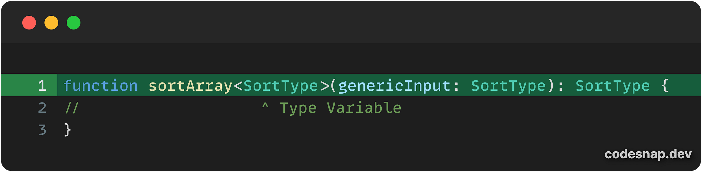
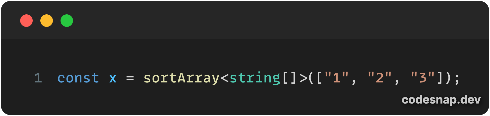
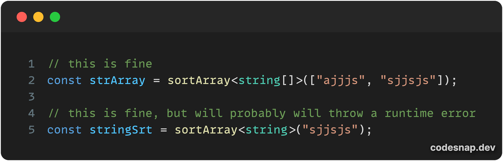
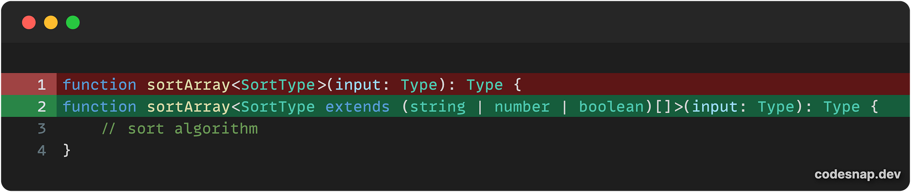
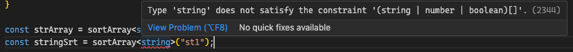
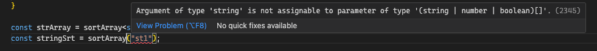
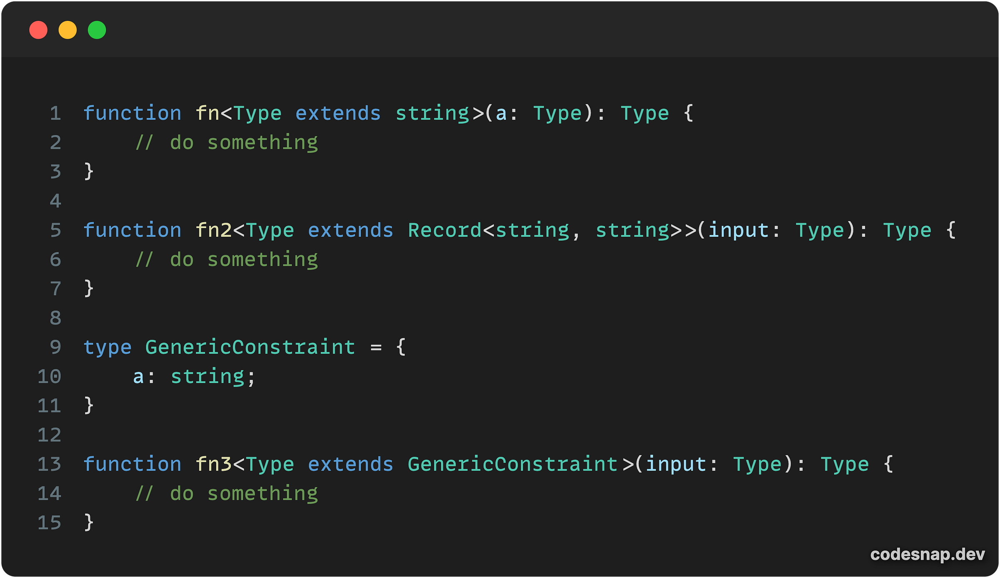
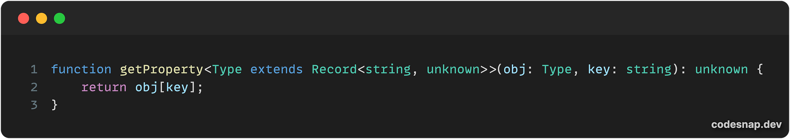
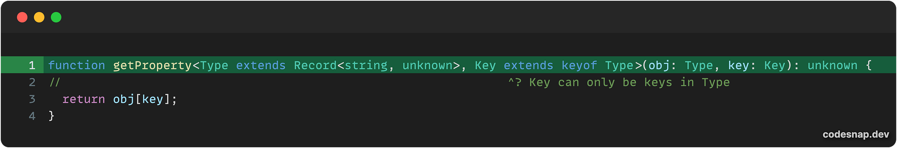

---
{
title: "Generic Constraints - A Gentle Introduction to Generics in Typescript",
published: "2024-04-09T07:43:40Z",
edited: "2024-04-09T13:41:53Z",
tags: ["webdev", "javascript", "tutorial", "typescript"],
description: "In a previous issue, we learned about the fundamentals of Generics in Typescript and how we can use...",
originalLink: "https://www.allthingstypescript.dev/p/generic-constraints-a-gentle-introduction",
coverImage: "cover-image.png",
socialImage: "social-image.png"
}
---

In a [previous issue](https://www.allthingstypescript.dev/p/a-gentle-introduction-to-generics), we learned about the fundamentals of Generics in Typescript and how we can use generics to make our lives easier as developers. You can find the last issue [here](https://www.allthingstypescript.dev/p/a-gentle-introduction-to-generics).

But to quickly recap the last issue, Generics allows us to write our code in a way the data types we are dealing with will be specified later on. In Typescript, we do this using the type variable specified inside **Angle** `<>` **brackets**, which we can then use within our application.

> **A type variable** is a special kind of variable that works on types rather than values.

Here is an example of a `sortArray` function, that can sort any array, accepting a `SortType` type variable, for the function input and output.

In the above functions sort generic functions, we need to specify the type of array we are sorting by providing the `SortType` type variable, just before we provide the arguments for functions, as shown below.

And this can be done for classes and when defining other types using either interface or type, to learn more, check out the previous issue [here](https://www.allthingstypescript.dev/p/a-gentle-introduction-to-generics).

### What are generic constraints?

Before we can try and define generic constraining, let’s define the word constraint, on its own. Stay with me here, I know this is a Typescript newsletter, not an English newsletter and I am probably the worst person to teach English, considering it’s probably my third language. I digress anyway.

According to the [Cambridge Dictionary](https://dictionary.cambridge.org/dictionary/english/constraint) one of many definitions **(I cherry-picked 🤷🏾)**, **a constraint is something that controls what you do by keeping you within particular limits**. The key part I want you to remember for this issue is **keeping you within particular limits**.

Back to Typescript and Generics, if we looked at the previous example we had, our `sortArray` function is meant to sort arrays, not other data types, which would probably require a different algorithm for arrays.

However, our function will accept array types as well as non-array types, and this is not the desired behavior. This isn’t type-safe, as the function will probably throw a runtime error if we attempt to sort a string data type when we wrote it to sort arrays.

Typescript was meant to eliminate these kinds of errors, but we just made it even simpler to make them, and no way to know ahead of time.

And this is where generics constraints come in. They enable us to limit (restrict or constrain) the types that can be provided for our type variables. This way, our function will accept arrays, but it will not accept non-array types. We do this by using the extends keyword and providing the types we want to contain our type variable to.

For instance, in our `sortArray` function, we can restrict our type variable to be only an array of `string`, `number`, or `boolean`, as shown below.

And now, when we try to pass in a string, as we previously did, Typescript catches the type error for us, as shown below:

Typescript now catches and warns us that we can not pass a `string` type as the Type variable as it doesn’t satisfy the type constraint we provided. This works with Type inference too, as discussed in the previous issue.

As you can see generic constraints allow us to achieve type safety by restricting the Types for our application. By using Typescript generics constraints, we can now write our generics code knowing that we are dealing with a known pool of types rather than all types available. In our case, we are only dealing with arrays and not non-array types.

In the previous example. we looked at constraining it to be an array, but we can constrain it to any type, as shown below:

In the first case, we are constraining to only accept strings (and their subtypes), and in the second case, we want it to be a key-value object and in the last case, we are providing our type, to just demo the different ways you can constraint a Generic.

#### Type variable constrained by another Type Variable

So far, we have dealt with simple but useful cases. I don’t want to go into some of the most advanced use cases of generics yet, because this is still a gentle introduction to generics but let’s look at another common scenario.

For instance, let’s say we want to create a function that returns a property from a key-value object, given its key, as shown below:

As you can see, we are using a Generic constraint to ensure that the first argument is always a key-value object, but we have a slight problem. We would like the second function argument - `key` - to be only a key that exists inside the object we pass in. At the moment, we can pass anything and this could lead to undesired characteristics from our application.

We can fix this issue by adding a second type variable that we can call `Key` and whose type will be constrained to the keys of the object, for this we can use the `keyof` operator to get the keys of the first type variable, as shown below.

And now, if you try to provide keys that aren’t present in the object in the first argument, Typescript will warn you.

As you can see, we get a warning when we provide a key that doesn’t exist and Typescript provides suggestions for keys you can use.

#### Bonus

There is one final thing we can do to make the function more complete and type-safe. As you can see, our function return type is unknown, which doesn’t tell us much and we would need to narrow it before using it. But we can use our type variables - the object and the key passed in, to look up the type of that property in the object.

So, we are combining the type variables provided for the `getProperty` function, where we are annotating the return type of the function to be the type of the property for the key provided.

In Typescript, this is known as indexed access types. Indexed access types allow us to look up specific properties of other types. You can learn more about this in a previous issue [here](https://www.allthingstypescript.dev/p/indexed-access-types-in-typescript).

---

**If you like my content and want to support my work, please consider supporting me (*****you can buy me a double latte, the juice that powers my creativity and determination ☕️*****) through [Github Sponsors](https://github.com/sponsors/mainawycliffe/).**

---

### Conclusion

In today’s issue, we discussed generic constraints and why they are important in Typescript for increased type safety and improved developer experience. Generic constraints enable us to provide guard rails to the generics types so that we can be certain that the type of data that can be passed in is what is expected leading to enhanced type safety.

This hasn’t been an easy issue to write, breaking down the concepts into something easy to understand and I hope you found it very illuminating.
