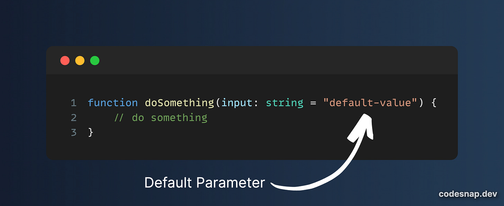
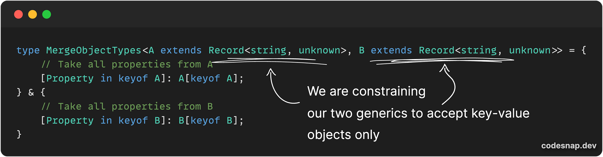
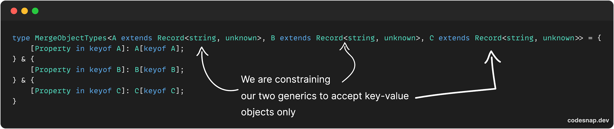
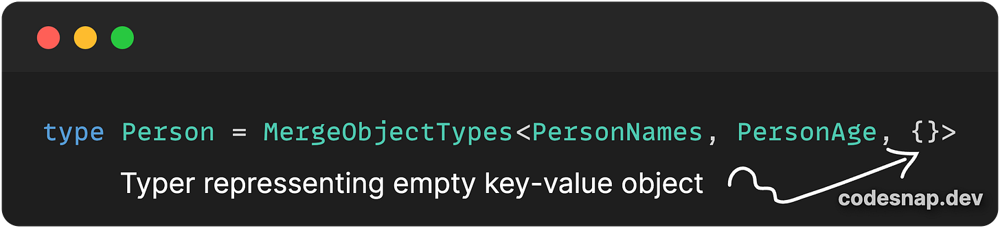
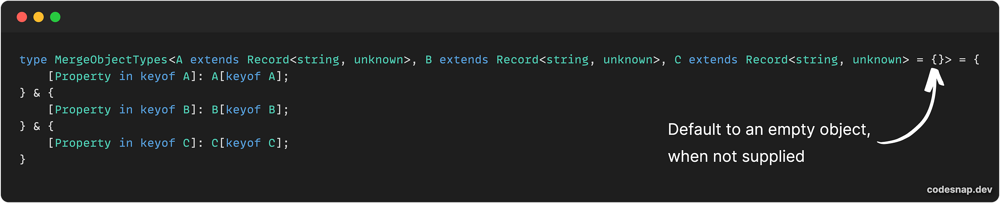
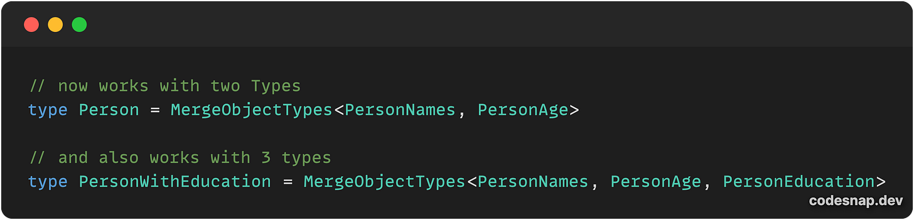
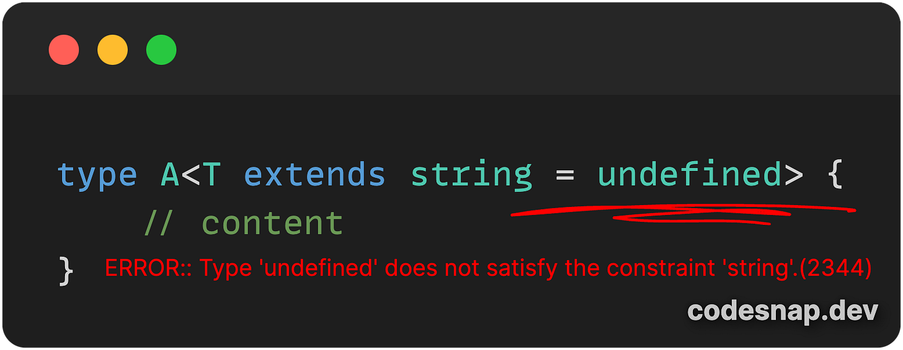
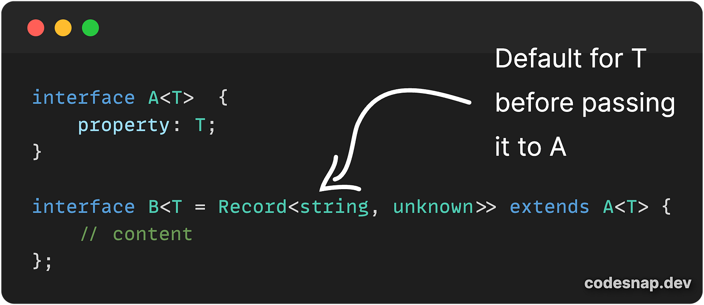

---
{
title: "Making Generics Types Optional - Generics Fundamentals in Typescript",
published: "2024-04-30T16:20:31Z",
edited: "2024-05-01T05:08:53Z",
tags: ["typescript", "webdev", "javascript", "tutorial"],
description: "In the last two issues, we started exploring generics, where we looked at the fundamentals of...",
originalLink: "https://www.allthingstypescript.dev/p/making-generics-types-optional-generics",
coverImage: "cover-image.png",
socialImage: "social-image.png"
}
---

In the last two issues, we started exploring generics, where we looked at the [fundamentals of generics](https://www.allthingstypescript.dev/p/generic-constraints-a-gentle-introduction) and how to [create generics constraints](https://www.allthingstypescript.dev/p/generic-constraints-a-gentle-introduction). I believe this has given you a good foundation for working with generics in Typescript.

In this issue, I wanted to explore how we can make a generic Type optional by providing a default for the Type variable, that can be used when no Type is passed in and Typescript cannot infer the Type. Before we can look at generics, let’s draw some parallels with functions and how defaults work values for functional arguments.

Let’s take the following simple example.

```
function doSomething(input: string) {
    // do something
}
```

In the above example, the function `input` parameter is required. In some cases, we want to provide a fallback value, that will be used if the function is called without a value.

For functions, the syntax to achieve this is the one shown below:



In the above example, we are simply telling Javascript that if the `input` parameter isn’t provided or undefined, use `default-value` as the value for the variable. This makes the input string optional, and not required.

While Typescript will type-check the function’s `input` parameter if provided an incorrect Type or if we simply don’t provide it, it also means that we need to provide the input every time we call the function.

By providing a default value, we made the parameter optional, but this also means we have also expanded the types from being just string to string and undefined and to consume it, we might need to narrow the type. You can learn more about type narrowing [here](https://www.allthingstypescript.dev/p/narrowing-types-in-typescript).

However, by providing a default value, it means we don’t need to provide it, so we don’t have to do the extra step of checking if the input is string or undefined, avoiding the extra step for narrowing types, as we already have a fallback value, when undefined.

---

**If you like my content and want to support my work, please consider supporting me (*****you can buy me a double latte, the juice that powers my creativity and determination ☕️*****) through [Github Sponsors](https://github.com/sponsors/mainawycliffe/).**

[☕️ Consider buying me a cup of coffee](https://github.com/sponsors/mainawycliffe/)

---

#### What does this have to do with generics?

Default Types for generics types work similarly. We can achieve the same thing we did with function parameters with Generics, where we can provide a fallback type for the **type variable** if not provided and cannot be inferred.

> **A type variable** is a special kind of variable that works on types rather than values.

Let’s look at an example. Let’s create a simple utility type. Utility types utilize generics to help you do type transformation. Typescript has some in-built utility types that you can learn more about [here](https://www.typescriptlang.org/docs/handbook/utility-types.html).

Our utility type will take two types (*that are key-value objects*) and merge their properties into a single Type, with the properties from both Types.

Here is an example of what our implementation looks like:



We will go into the details of the above example, in a future issue (hopefully next week), as we explore Mapped Types and other Types in Typescript.

To use our utility type, we just need to provide two object types and we get a single object with properties from both types that were passed in, as shown below:

You can find the above code [here](https://www.typescriptlang.org/play?#code/C4TwDgpgBAshBOBzCB5ARgKwgY2AFXAgGcAeAQSggA9gIA7AEyKgCUcB7eBko4eASzqIANFACudANZ12AdzoA+UQCFKNek1YcuPPoJHipM+QoVQAvFADeAKCj2oAbQAK8dpHigogqJIgh2ADMoMgBdAC4Qxz8A4LCAbhsAXygAMms7Bxc3Dy8fGKCoZQii6P9C4sSkmxrQSChnBCJ2OgA5AEMAW2ILDIcoQP54Xg7uyN4BIUT+gBt2ka6Icb0p5NrCBqaWsmRe23725GXJxGmHBnY0Y-0q9frG4ZbeuCRUTBx8QlIH5rbFolEP22yAUNUCElw-CeFwAyuxusAABb6AAUgjAYmAkSBdAAlH0HOjMQA6Q4QZJAA).

Our example above doesn’t do much, but let’s say that in the future the requirements of our project change and we want to expand it so that we can merge two or three types.



The problem is that this would work with merging 3 Types, but to work with merging two Types, we would need to provide an empty object Type, as shown below:



Wouldn’t be nice if we could skip that part, and just provide our two types? And this is where Generic type variable defaults come to the rescue.

Just like function parameters, we can provide a default Type for our Type variable and essence making them optional, as shown below:



And now, our `MergeObjectTypes` utility type can accept either two or three Types and merge their properties into a single Type.



And we can go crazy now and add more type variables to merge 4, 5, or 10 even object properties while ensuring our utility types work with 2 to 10 types, and anywhere in between.

> If you are interested, see if you can modify the above example to work with 5 types.

#### Rules for Default Types

Just like function parameters, there are a few rules to keep in mind for generic default Types.

- The first and most obvious one is that when you provide a default value, a Type variable is deemed as optional.

  - You are required to provide the required type variables.

  - Remember, Type inference in most cases can help you, so you don’t provide the required Type variables.

  - If you don’t provide an optional Type variable, then the default type is used, unless Typescript can infer a different type based on usage.

- And just for functions, required type variables come first, followed by optional type variables.

- If you are using a generics constraint, the default type must satisfy that constraint.

  

- For classes and interfaces, when extending either a class or an interface, you can introduce a default for an existing Type parameter and you may also introduce a new Typer variable, as long as it’s optional (has a type variable).

  

### Conclusion

In this issue, we looked at making generics Type variables optional by providing a default or fallback type. We drew parallels between Generics default types with functions parameters default values and how they behave almost the same, but with the key difference being one applies to variables while the other one applies to types.

To demonstrate how useful default generics types can be, we took a look at an example where we can create a custom utility type that we can use to merge properties for an object type, for either two or three types, and how we can utilize defaults to make this work seamless for either of the cases.
