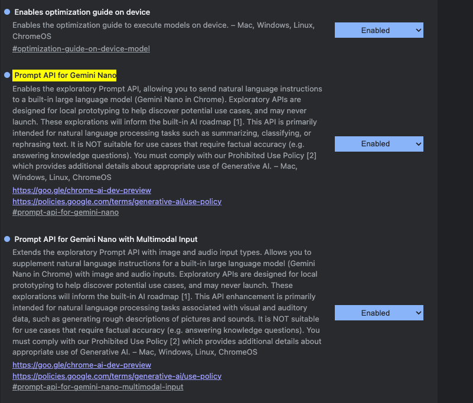

---
{
title: "On-Device AI with the Google Chrome Prompt API",
published: "2025-11-17T18:50:02Z",
tags: ["webdev", "ai", "typescript", "javascript"],
description: "Unless you’ve been living under a rock, it’s hard to miss the rise of Generative AI. At the centre of...",
originalLink: "https://mainawycliffe.dev/blog/on-device-ai-with-the-google-chrome-prompt-api/"
}
---

Unless you’ve been living under a rock, it’s hard to miss the rise of Generative AI. At the centre of this movement are **Large Language Models (LLMs)** such as Google’s Gemini and OpenAI’s ChatGPT. Typically, building solutions around these models involves sending data to their APIs and receiving a response.

But not everyone is comfortable with this approach. Concerns around **privacy, trust, legal compliance, and governance** often arise. This is where **on-device AI** comes in: data is processed locally, addressing most of these issues.

In this article, we’ll explore how to use the **Chrome On-Device Prompt API** to process data locally. This is the first in a series of articles covering Chrome’s on-device AI capabilities.

### Step 1: Download Google Chrome & Enable Required Flags

Make sure you’re running the latest version of Chrome (currently version 142). These APIs are Chrome-specific for now, though they may eventually become web standards.

Enable the following flags by navigating to `chrome://flags` in your browser:

- \#prompt-api-for-gemini-nano
- \#optimization-guide-on-device-model
- \#prompt-api-for-gemini-nano-multimodal-input



Then, restart the browser, using the relaunch bar that will be displayed at the bottom of the page. You can learn more about Chrome Flags [here](https://developer.chrome.com/docs/web-platform/chrome-flags?ref=cms.mainawycliffe.dev).

We can confirm that the api is enabled by running the following code inside the browser console, as shown below:

```typescript
if (typeof LanguageModel !== 'undefined') {
  console.log("Model is enabled")     
}
```

### Step 2: Check Model Availability

Now that we have enabled the on-device model on Chrome, we need to check if the user has already downloaded the model to use, and if not, download it. Otherwise, we can't prompt the model until that is done.

We can do this by calling the `LanguageModel.availability()` method, as shown below:

```typescript
 const status = await LanguageModel.availability();
```

The above model checks whether the user has downloaded the model and is ready for use. If it's not, the next step is to download the model.

> If not yet downloaded, you’ll need to trigger the download (\~1.5 GB). Note that user interaction is required before downloading. You can check this with:

```typescript
if (navigator.userActivation.isActive) {
  // Create an instance of a built-in API
}
```

Another approach is to use a button to trigger the download, and then you wouldn't need to check for activation, as that would only be triggered when the user clicks the download button.

### Step 3: Download the Model

Next, we can use the `LanguageModel.create` method to trigger the download of the model and monitor the progress, as shown below:

```typescript
const aiSession = await LanguageModel.create({
  monitor: (m) => {
    m.addEventListener('downloadprogress', (e) => {
      const progress = e.loaded * 100;
      this.downloadProgress.set(progress);
    });
  }
});
```

Make sure to report the progress and inform the user of what's going on, as this is a large download and may take a while. For Angular, we can use signals in a service to report that back to the user, as shown below:

```typescript
@Injectable({
  providedIn: 'root',
})
export class ChromeAiService {
  private session = signal<AILanguageModel | null>(null);
  readonly isAvailable = signal<boolean>(false);
  readonly availability = signal<AIAvailability>('no');
  readonly downloadProgress = signal<number>(0);
  readonly isDownloading = signal<boolean>(false);

  async initializeSession(): Promise<void> {
    if (!this.isAvailable()) {
      throw new Error('Chrome AI is not available');
    }

    try {
      this.isDownloading.set(true);
      this.downloadProgress.set(0);

      const aiSession = await LanguageModel.create({
        monitor: (m) => {
          m.addEventListener('downloadprogress', (e) => {
            const progress = e.loaded * 100;
            this.downloadProgress.set(progress);
          });
        },
      });

      this.session.set(aiSession);
      this.isDownloading.set(false);
      this.downloadProgress.set(100);
    } catch (error) {
      this.isDownloading.set(false);
      throw error;
    }
  }
}
```

### Step 4: Prompt the Model

Once the model is downloaded, it's ready for use.

```typescript
const stream = session.analyzeText(prompt);

const prompt = "YOUR PROMPT";
let result = '';

for await (const chunk of stream) {
  result += chunk;
}
```

> Please note, the model is very small, with a very limited number of tokens.

We can also pass an initial prompt, which can be used to give it a persona and give it some ground rules, as shown below:

```typescript
const languageModel = await LanguageModel.create({
  initialPrompts: [{
    role: 'system',
    content: 'You are a helpful assistant and you speak like a pirate.'
  }],
});
```

You can learn more about the Prompt API [here](https://developer.chrome.com/docs/ai/prompt-api?ref=cms.mainawycliffe.dev).

### Step 5: Clean up

Afterwards, always terminate the session when you are done.

```typescript
session.destroy();
```

## Conclusion

We’ve covered enabling the Prompt API, checking availability, downloading the model, prompting it, and cleaning up. This is just one of several **on‑device ML APIs** in Chrome — future articles will explore the rest.
