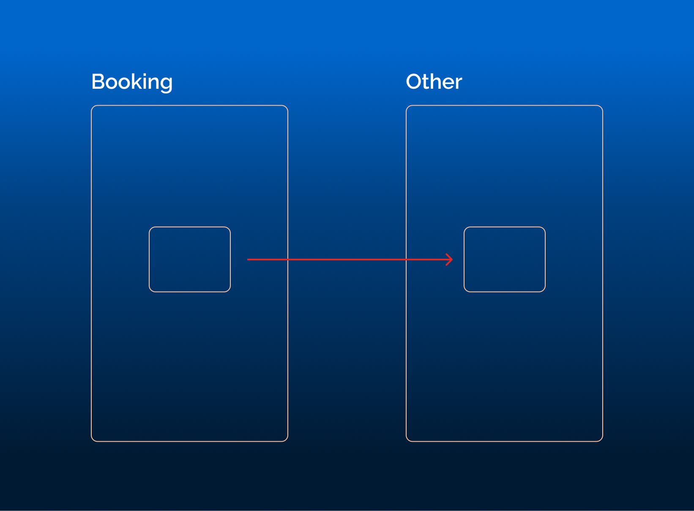
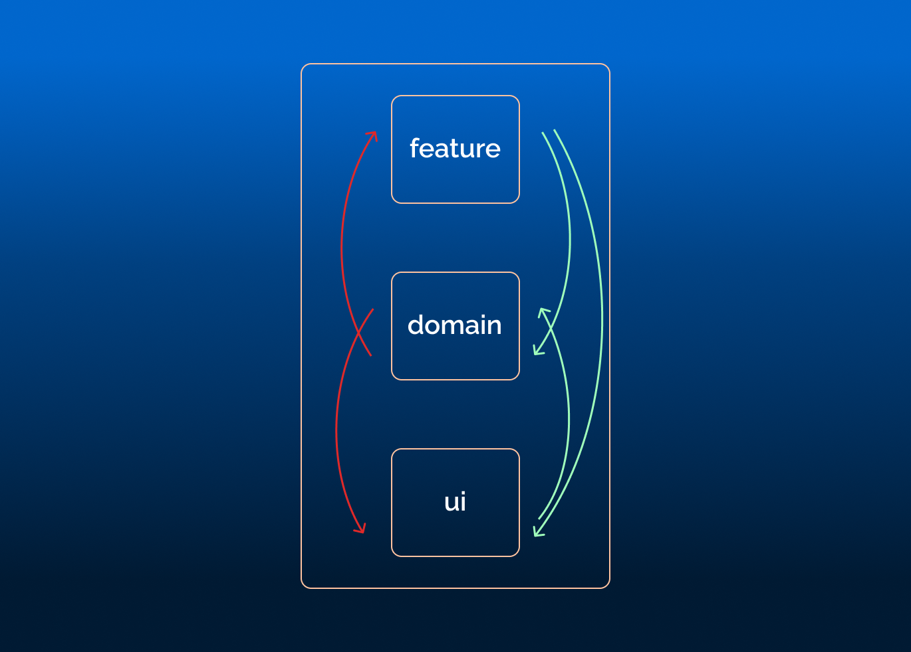

---
{
title: "Architects Delight: Enforcing Layers and Project Boundaries with Nx",
published: "2023-06-11T12:20:53Z",
edited: "2023-06-14T14:09:04Z",
tags: ["webdev", "architecture", "monorepo", "nx"],
description: "Introduction   When I embarked on my journey as a software developer, I delved into the...",
originalLink: "https://dev.to/this-is-learning/architects-delight-enforcing-layers-and-project-boundaries-with-nx-2d8o",
coverImg: "cover-image.png",
socialImg: "social-image.png"
}
---

## Introduction

When I embarked on my journey as a software developer, I delved into the depths of software architecture. Renowned books such as "Clean Architecture" and "Domain-Driven Design (DDD)" provided valuable insights into concepts like project boundaries and software layers (both vertical and horizontal). Yet, what was sorely missing was a quick and efficient tool to enforce these principles.

Then, I discovered Nx, specifically its `@nx/enforce-module-boundaries` ESLint plugin, which has revolutionized how I enforce these boundaries.

## The Hidden Side of the Iceberg

Interestingly, although the `@nx/enforce-module-boundaries` ELLint plugin is embedded in the generated code of every integrated Nx-Monorepo, it seems to fly under the radar when the conversation turns to Nx's merits, which are indeed numerous. Even Nx's video, "The Nx Iceberg," doesn't mention it, despite its focus on the tool's lesser-known features.

Several authors, including Manfred Steyer, [Lars Gyrup Brink Nielsen](https://dev.to/layzee), and myself, have delved into this subject. Still, many developers using Nx aren't utilizing this feature as much as possible. That sparked me to write this article highlighting Nx's power in enforcing project boundaries.

## What are Project Boundaries and Layers?

Before we delve into enforcing project boundaries, it's essential to understand what they are. These rules or principles dictate how different parts of our software interact.

For instance, software architects often use philosophies such as onion architecture and clean architecture to define horizontal layers. These layers are then grouped into vertical slices or boundaries using principles like the strategic design from Domain-Driven Design.

Without automated tools, though, maintaining these boundaries becomes tricky. Developers might inadvertently cross these boundaries, leading to issues with maintainability and scalability.

## Creating Projects and Boundaries with Nx

Firstly, we must have projects and boundaries before we start enforcing boundaries restrictions. Nx simplifies this process with its generators that swiftly create applications and libraries. Here is a simple command to generate a library:

```bash
nx generate @nx/js:library feature-booking
```

But a main ingredient is missing; Nx project tags are crucial here. They act as written definitions of our boundaries. For instance:

```json
// project.json
{
...
  "tags": ["bounded-context:booking", "type:feature"],
...
}
```

In the current example, we define a vertical slice or vertical layer based on the bounded context containing the library: The **booking** bounded context. Not only that, but we also define a horizontal layer based on the type of the library: The **feature** type.


Additionally, we can use grouping folders with Nx to further streamline the structure. I believe there should be a direct connection between tags and grouping folders. I've discussed these patterns extensively in my article ["Semantic Grouping Folders with Nx."](https://dev.to/this-is-learning/semantic-grouping-folders-with-nx-3467)

## Enforcing Project Boundaries with Nx

With our projects and boundaries in place, we can utilize the power of the Nx `@nx/enforce-module-boundaries` ESLint plugin to set restrictions between layers.

For example, if we want to restrict that, a library belonging to the **booking** bounded context can only import libraries from the same bounded context. Or in other words, if we want to enforce the vertical boundary defined by the bounded-context tags, we can do the following:

```json
        "@nx/enforce-module-boundaries": [
          "error",
          {
            "enforceBuildableLibDependency": true,
            ...
            "depConstraints": [
              ...
              {
                "sourceTag": "bounded-context:booking",
                "onlyDependOnLibsWithTags": ["bounded-context:booking"]
              },
              ...
            ]
          }
        ]
```



The same can be done for our horizontal layers. In the following example, we will enforce the following:

- libraries with type **feature** can only import libraries with type **feature**, **domain**, **ui**
- libraries with type **ui** can only depend on libraries with type **ui** and **domain**
- libraries with type **domain** can only depend on libraries with type **domain**.

```json
        "@nx/enforce-module-boundaries": [
          "error",
          {
            "enforceBuildableLibDependency": true,
            ...
            "depConstraints": [
              ...
              {
                "sourceTag": "type:feature",
                "onlyDependOnLibsWithTags": ["type:feature", "type:domain", "type:ui"]
              },
              {
                "sourceTag": "type:ui",
                "onlyDependOnLibsWithTags": ["type:domain", "type:ui"]
              },
              {
                "sourceTag": "type:domain",
                "onlyDependOnLibsWithTags": ["type:domain"]
              },
              ...
            ]
          }
        ]
```



With these restrictions in place, if you try to import a library that breaks one of these enforced boundaries, you will get an ESLint error. Here is a hypothetical situation:

```typescript
// File: libs/boundary/domain/types.ts
import { Button } from '@my-org/ui';
```

```bash
error  A project tagged with "type:domain" can only depend on libs tagged with "type:domain"  @nx/enforce-module-boundaries
```

This error message signifies that we've attempted to cross a boundary, thus helping us maintain the integrity of our architecture.

And this is not everything; we can even restrict external imports as described in the [docs](https://nx.dev/recipes/enforce-module-boundaries/ban-external-imports). I've found this. tool extremely useful when using technologies that look similar like React, Qwik and SolidJS; or even backend and frontend like Angular and NestJS.

## Conclusion

Enforcing project boundaries and layers easily was a dream I thought was too much to ask.

Nx's `@nx/enforce-module-boundaries` ESLint plugin offers a powerful solution. The more we understand its potential and learn to utilize its power, the more we move towards creating robust, scalable, and maintainable software solutions. Nx is genuinely leading the way in the future of software architecture.
