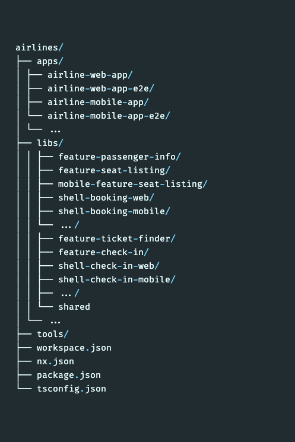
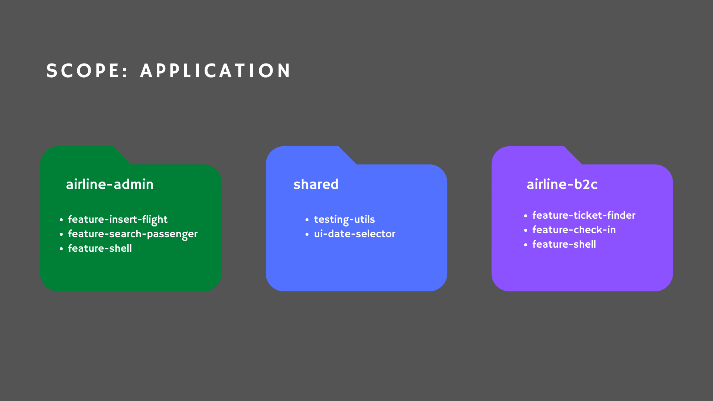
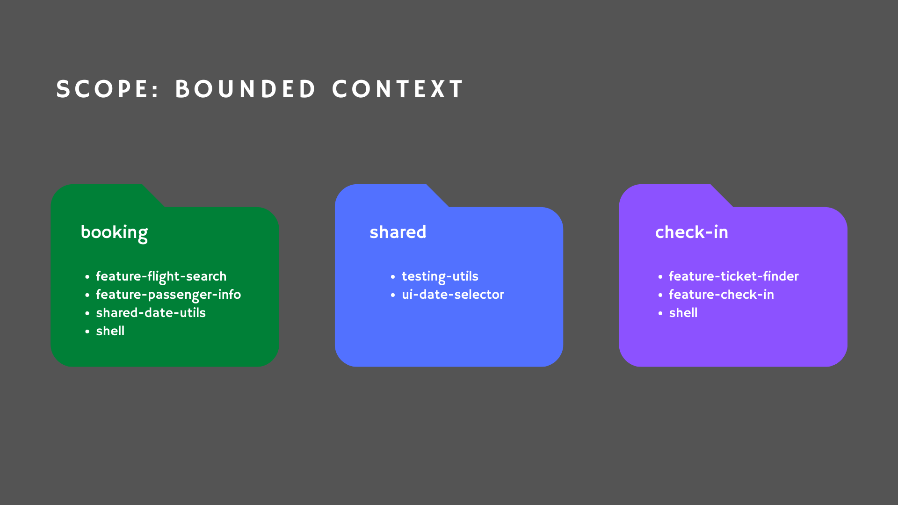
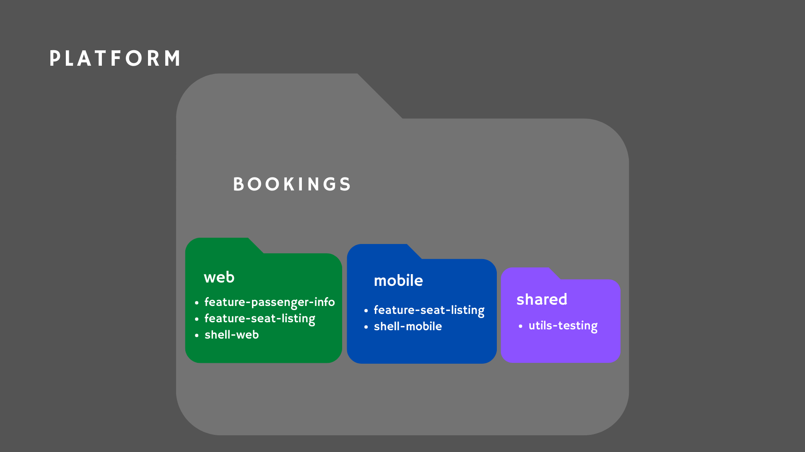
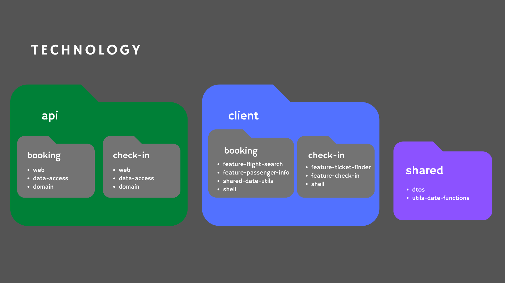
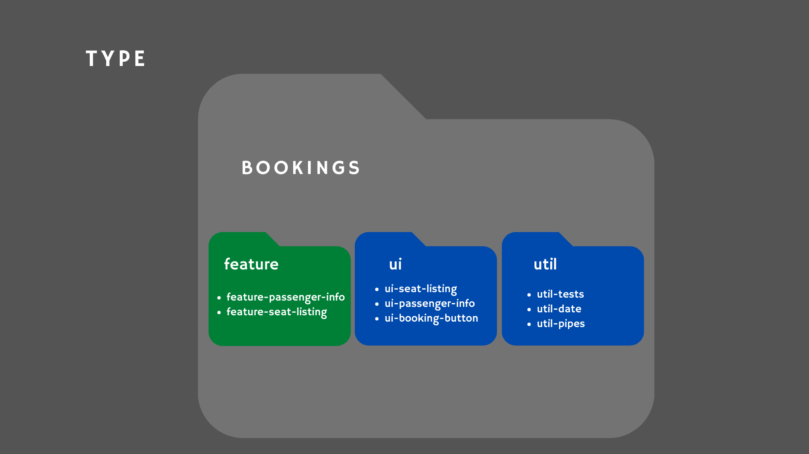

---
{
title: "Semantic Grouping Folders with Nx",
published: "2021-04-06T05:30:07Z",
edited: "2021-04-12T07:56:49Z",
tags: ["architecture", "angular", "react", "nx"],
description: "Photo by Barn Images on Unsplash         This article is part of the Angular Architectural Patterns s...",
originalLink: "https://dev.to/this-is-learning/semantic-grouping-folders-with-nx-3467",
coverImg: "cover-image.png",
socialImg: "social-image.png"
}
---

<figcaption>Photo by <a href="https://unsplash.com/@barnimages?utm_source=unsplash&utm_medium=referral&utm_content=creditCopyText">Barn Images</a> on <a href="https://unsplash.com/s/photos/organization?utm_source=unsplash&utm_medium=referral&utm_content=creditCopyText">Unsplash</a>
  </figcaption>

---

> This article is part of the Angular Architectural Patterns series.

Grouping Folders in an **Nx** and Monorepo context are folders that only contain other Grouping Folders and projects (applications, libraries, testing projects).

In this article, we will focus on Grouping Folders containing other Grouping Folders and libraries.

They help us enforce our architectural decisions and act as a guideline for our team.

This article will discuss the most common types of Grouping Folders and their impact on our architecture.

We will also discover how to use **Nx** schematics to give additional semantic value to our Grouping Folders.

## A world without Grouping Folders

Why do we need Grouping Folders?

That is a very valid question;  I'm happy you asked!

It would be better if I show you.

The following folder structure is a snapshot of a fictitious airline software project taken from the free Nrwl e-book.



<figcaption>Listing 1. Ungrouped libraries workspace</figcaption>

---

**Listing 1.** is a contrived example; production apps could have hundreds of libraries and dozens of applications.

It follows the **Nx** suggested type libraries; it uses *shell* libraries to coordinate configuration and navigation.

However, it is hard to grasp by just looking at this structure, which files you are supposed to work on when dealing with a new use case or making amendments to an existing one.

Therefore, it is violating the **Common Closure Principle.**

We struggle to keep control of the relationship between our libraries and applications.

It is not easy to tell if we are implementing strategic design since we don't have clear evidence of **Bounded Contexts** or vertical slices.

This design problem is time-consuming for the developer, and the harm grows at the same rate as the source code.

There is a short limit of how many "naked" libraries we can handle.

Can Grouping Folders help?

## Seeking shelter on Grouping Folders

When we are writing Nx and Monorepo based projects, we are encouraged to split our application content into libraries.

There are many ways to perform such splitting, but four main basic classifiers guide this process; we split our libraries by *scope, type, platform, and technology.*

Classifiers are represented in our workspace as **Tags**.

Tags are a great tool to enforce horizontal and vertical dependency boundaries, making them an efficient mechanism to guide the creation of library-enclosing Grouping Folders.

The following sections describe the fundamental Grouping Folders building-blocks created due to a successful library classification and tagging.

Those are the foundations of more elaborate architectural structures and Grouping Folder combinations.

## Scope Building Blocks

The library's scope tag provides context about the piece of the domain to which the library is related or subordinated.

The matching Grouping Folder could represent the domain-wise application, a Bounded Context, or merely a vertical slice in the domain to which it belongs.

### Scope: Application

We use the *Application Grouping Folders* to organize libraries exclusive to an application of the workspace.

Having our libraries restricted to a single application is a simple and effective way to group our libraries by scope.

It focuses on how libraries collaborate at a higher level, increasing cohesion and readability.

<figcaption>Listing 2. Grouping folders by scope Application group workspace libraries based on the application where they are used.</figcaption>

---

**Listing 2.** shows us a typical example of application-scoped Grouping Folders.

In that workspace, `airline-admin` and `airline-b2c` are individually deployed applications.

Grouping Folders with the same name as workspace applications encapsulate all libraries specific to the matching application.

As a consistency recommendation, we should have one Grouping Folder per workspace application when following this pattern.

Each application imports and orchestrates its specific libraries by using a single `feature-shell` library.

The third Grouping Folder in **Listing 2.** is an *application-level Shared Grouping Folder*.

*Application-level Shared Grouping Folders* contains the libraries used between the different workspace applications, extracting common logic and other sharable code.

Application Grouping folders can be created at the root scope level (as a child of the libs folder), as a child of a root-level Platform grouping folder, or as a child of a *root-level Technology grouping folder*.

### Scope: Bounded Context

*Bounded Context Grouping folders* cluster sub-domain-specific libraries that change at the same pace or for the same reasons.

This way of organizing our libraries produces a higher cohesion than only using *Application Grouping Folders.*

We cluster our libraries in more tight groups following the **Common Closure Principle** and the domain experts' descriptions of the model.

Bounded Context is a Domain-Driven Design concept with a more significant implication than just acting as a grouper.

Vertical Slice is a more general concept compatible with Bounded Contexts when talking about Grouping Folders' usage.

Nonetheless, both concepts are used interchangeably in the current article.



<figcaption>Listing 3. Grouping folders by scope Bounded Context group workspace libraries based on the Bounded Context where they are used.</figcaption>

---

**Listing 3.** is a representation of a **Bounded Context** organized workspace.

In the example, **booking** and **check-in** are vertical slices of the application domain.

**Grouping Folders** contain libraries marked with the tag `scope:<bounded-context-name>` or `bc:<bounded-context-name>` for greater granularity.

Libraries in a *Bounded Context Grouping Folder* can be used in different workspace applications.

However, it is a good recommendation **NOT** to import libraries from a *Bounded Context Grouping Folder* directly.

Instead, treat the functionality inside these Grouping Folders as a unit.

Use one or more [Composite Shell libraries](https://indepth.dev/posts/1117/the-shell-library-patterns-with-nx-and-monorepo-architectures) as the Bounded Context entry points.

As a result, we can connect applications and *Bounded Context Grouping Folders* in a many-to-many cardinality.

The third Grouping Folder in **Listing 3**. is a *bounded-context-level Shared Grouping Folder*.

*Bounded-Context-level Shared Grouping Folders* contains the libraries shared between the different libraries at the same Grouping Folder level.

*Bounded Context grouping folders* can be created independently and as a child of an application Grouping folder.

## Platform

The **platform tag** refers to the deployment platform, like web, mobile, or desktop.

It organizes features that are only included in the platform build of an application or Bounded-Context/Vertical-Slice.

It may only make sense when the same application or bounded context is used differently for different platforms.



<figcaption>Listing 4.Grouping folders by Platform group workspace libraries that are specific to a deployment platform.</figcaption>

---

**Listing 4.** shows how inside the same sub-domain, we can split logic based on the platform where it is meant to be used.

This example shows that two `feature-seat-listing` libraries are present, one for each platform.

These libraries are not the same, they provide the same or a similar feature, but they are implemented differently for each platform.

Creating the *Platform Grouping Folder*, adds semantic value to each library, and therefore there is no need for extra differentiation like prefixing or suffixing the library name with the platform type.

*Platform-level Shared Grouping Folders* contain libraries that are being used by different platforms at the same scope level.

In the example, web, mobile, and shared are Platform Grouping folders used at an Application or Vertical slice scope level of name Booking.

The Platform Grouping Folders can be created at any scope level.

## Technology

The technology classifier includes all those libraries that can only be used in a particular technology context.

It could be a high-level division like `api` and `client` or, more specific like react and angular.

It could also separate libraries from different languages or frameworks like **Go** and **C#**.

Do not confuse with *Platform Grouping Folders* which only refer to the change of features based on the deployed platform.



<figcaption>Listing 5. Grouping folders by Technology group workspace libraries that are specific to a development technology.</figcaption>

---

**Listing 5.** shows how server-side libraries are grouped independently of client-side libraries.

*Technology-level shared Grouping Folders* contain those libraries that can be used between different technologies.

A good candidate for the shared Grouping Folder is the DTO library. However, this is only possible when the technologies are dealing with the same programming language.

The Technology Grouping Folders should only exist as a direct child of the libs folder.

## Type

The **type** classifiers identify to which horizontal layer of functionality our library belongs.

It could be **data-access**, agnostic **ui**, business specific **feature**, **utils** and others.

Most of the time, you would not create Grouping Folders for this type of classifier. Instead, it is usual to use these classifiers as a prefix of the libraries' names and include them in scope-type Grouping Folders.

Nonetheless, if the number of libraries inside a Grouping folder increases, adding type-based Grouping Folders can lighten the burden.



<figcaption>Listing 6. Type grouping folders organize libraries with the same type classifier</figcaption>

---

**Listing 6.** shows how we can organize our libraries by their type.

The Type Grouping Folders can be created at any scope level.

## A word on Shared Grouping folders

Shared Grouping folders can be created by Scope, Platform, and sometimes by Technology.

Shared Grouping folders semantic level is determined by the classifier of its siblings' Grouping Folders.

For example, if a Shared Grouping Folder is the sibling of one or more Bounded Context Grouping Folders, it is a Bounded Context-level Shared Grouping Folder.

This design decision derives some extra rules.

- Every scope level, including the root scope level, can only contain Grouping Folders of a single classifier type (technology, platform, application, or bounded context).
- Libraries inside a Shared Grouping Folder can only be accessed by the libraries within its siblings' Grouping Folders or by libraries in children Grouping Folders.

Of course, all the mentioned restrictions are made to ensure a consistent, maintainable design. Unless you actively enforce these constraints in your tslint/eslint configuration, it is a matter of discipline to keep your workspace sharp.

## Tags and restrictions

When creating a grouping folder, we are also creating a semantic context that encloses our libraries.

A different way of defining and enforcing this context is by using tags and restrictions.

Library tags are declared in the `nx.json` configuration file. In contrast, restrictions are added as eslint/tslint rules.

It is often recommended to create companion tags for our Grouping Folders and vice-versa.

Nrwl, in its Architecture Free E-books, articles and documentation usually mention two tag and restriction dimensions; *scope* and *type*.

In this article, we have added the technology and platform dimensions. Also, we have expanded the scope dimension in two, application and bounded context (bc).

Using *type, technology, application, platform, and bc* as our tags dimension instead of *scope* and *type*, allow us to achieve fined grain restrictions.

Otherwise, we could not distinguish a Technology-level Shared Grouping folder from other Shared Grouping Folders from a restriction perspective.

When creating a new library, this library should inherit all the tags related to its ancestors Grouping Folders.

## Composing

In previous sections, we have briefly mentioned some limitations about where to place our Grouping Folders. Now, we will see some real examples of Grouping Folder composition.

Going back to the Nrwl Airlines example, let's see how we can fix the flat folder structure mess seen at this article's start.


<figcaption>Listing 7. Refactored Nrwl Airlines example using all existing Grouping Folders</figcaption>

---

**Listing 7.** shows how we could refactor the Listing 1. example by using all the discussed Grouping Folder types.

This is an extreme, demonstration-only usage of our Grouping Folders. It serves as educational material.

In practice, we might not want to have this level of nesting and use only a few Grouping Folder types.

However, **Listing 7** can be a valid use case as it is.

### Technology Grouping Folders

We use `api` and `client` as our top Technology Grouping folders. Those split our libraries between Backend and Frontend libraries.

Now we can add **"technology:api"** and **"technology:client"** as tags for every library place in one of these folders. Then we can add restrictions to enforce the boundaries.

```javascript
{
    "sourceTag": "technology:api",
    "onlyDependOnLibsWithTags": [
       "technology:api",
       "technology:shared"
    ]
},
{
    "sourceTag": "technology:client",
    "onlyDependOnLibsWithTags": [
       "technology:client",
       "technology:shared"
    ]
},
{
    "sourceTag": "technology:shared",
    "onlyDependOnLibsWithTags": [
       "technology:shared"
    ]
},
```

At the same level, we added a Technology-level shared Grouping Folder where we placed the DTO's library.

The DTO's library and any other library in the Technology-level shared Grouping Folder receives the tag **"technology:shared"**.

### Application Grouping Folders

One level below Technology, we placed our Application Grouping Folders, where we can isolate and group everything unique to each Application.

Every library grouped into an Application Grouping Folder should have a tag identifying the application to where they belong.

For example, every library descendent of the airline-admin Application Grouping Folder should at least have the tags **"application:airline-admin"** and **"technology:client"**.

We could add the following restrictions for the current example.

```ts
{
    "sourceTag": "application:airline-admin",
    "onlyDependOnLibsWithTags": [
       "application:airline-admin",
       "application:shared"
    ]
},
{
    "sourceTag": "application:shared",
    "onlyDependOnLibsWithTags": [
       "application:shared"
    ]
},
```

A sibling Application-level Grouping Folder is present. This contains the `ui-button` and `utils-date-pipe` libraries shared between all our applications.

These shared Grouping Folders will receive the **application:shared** tag.

### Bounded Context Grouping Folders

Our application *airline-admin* contains two Bounded Contexts, *booking*, and *check-in*.

One Grouping Folders of the same name is created for each of our Bounded Contexts plus a *Bounded-Context-level Shared Grouping Folder*.

The resulting tags can be **"bc:booking"**, **"bc:check-in"** and "bc:shared" and the following restrictions can be applied.

```ts
{
    "sourceTag": "bc:booking",
    "onlyDependOnLibsWithTags": [
       "bc:booking",
       "bc:shared"
    ]
},
{
    "sourceTag": "bc:check-in",
    "onlyDependOnLibsWithTags": [
       "bc:check-in",
       "bc:shared"
    ]
},
{
    "sourceTag": "bc:shared",
    "onlyDependOnLibsWithTags": [
       "bc:shared"
    ]
},
```

### Platform Grouping Folders

*web* and *mobile* are our Platform Grouping Folders. They also shared common logic using a Platform-level Shared Grouping Folder.

Within our Platforms Grouping Folders, we placed platform-specific libraries, no matter the libraries' depth.

The resulting tags are **"platform:mobile"**, **"platform:web"** and **"platform:shared"**.

Adding the restrictions.

```ts
{
    "sourceTag": "platform:web",
    "onlyDependOnLibsWithTags": [
       "platform:web",
       "platform:shared"
    ]
},
{
    "sourceTag": "platform:mobile",
    "onlyDependOnLibsWithTags": [
       "platform:mobile",
       "platform:shared"
    ]
},
{
    "sourceTag": "platform:shared",
    "onlyDependOnLibsWithTags": [
       "platform:shared"
    ]
},
```

### Type Grouping Folders

Finally, we created a "feature" Type Grouping folder where we placed the multiple "feature" libraries at a given level.

Type Grouping Folders don't have sibling shared Grouping Folders.

The related tag, in this case, would be **"type:feature"**, but it is independent of the existence of the Grouping Folder library.

Different decisions could have been made for the current example, but it is clear that Grouping Folders play a major role in our system architecture.

## Acknowledgements

This article wouldn't be possible without the long and stimulating discussion with my friend and mentor [Lars Gyrup Brink Nielsen](https://dev.to/layzee) who always provides the most accurate reviews.

Thanks to Nacho Vazquez Sr, my dear father, for helping me to find the right words when English was challenging.

## Conclusions

Maintaining large multi-application monorepos involves discipline, good practices, and clear guidelines.

Grouping Folders can help your team to create boundaries and enforce organization and architectural decisions.

In this article, we have covered some of the most common Grouping Folders.

We saw how Nx tags and restrictions can provide additional semantic value to our folders, and together enforce the architectural boundaries defined beforehand.

This is just an introduction, be imaginative and adapt your solution to the problems. Find new ways of composing Grouping Folders, and create the companion rules that best apply to your workspace.

## References

- [Enterprise Angular Monorepo Patterns](https://connect.nrwl.io/app/books/enterprise-angular-monorepo-patterns)
- [Imposing Constraints on the Dependency Graph](https://nx.dev/latest/angular/structure/monorepo-tags)
- [Shell Library Pattern with Nx and Monorepo Architectures](https://indepth.dev/posts/1117/the-shell-library-patterns-with-nx-and-monorepo-architectures)
