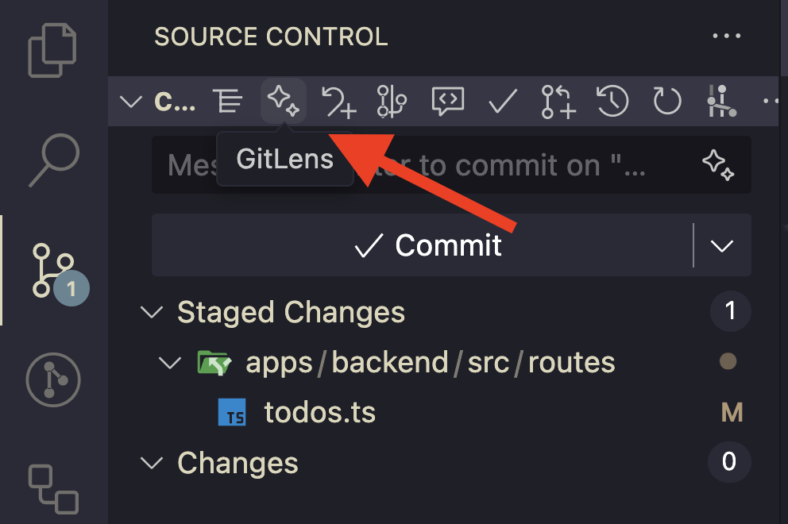
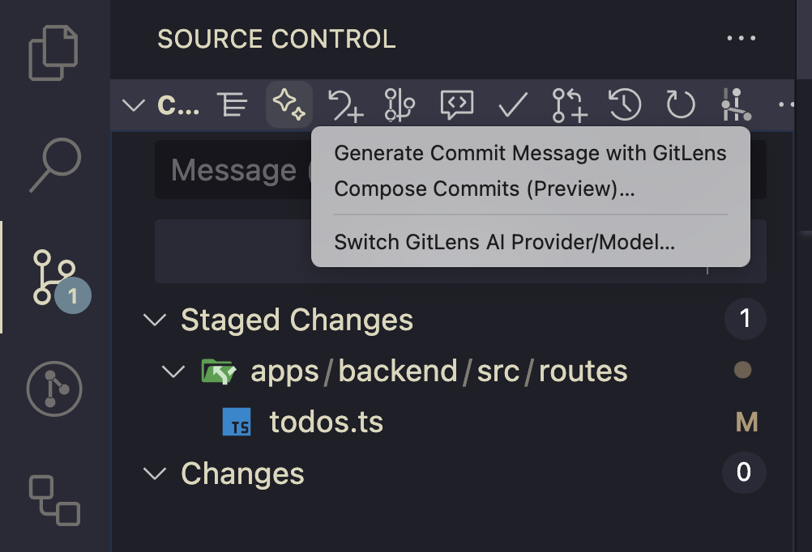
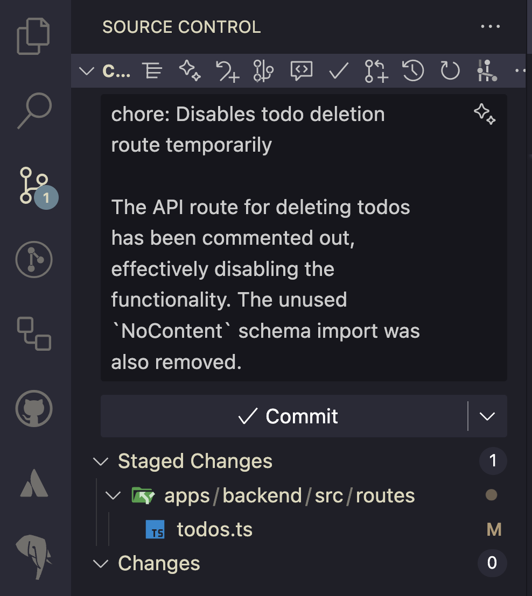

---
{
title: "Improve Your Git Commit Messages with GitLens Tips",
published: "2025-10-03T06:13:45Z",
edited: "2025-10-03T06:15:11Z",
tags: ["git", "gitkraken", "ai", "gitlens"],
description: "In the AI era, we can do many different things with LLM: generate code, images, videos or ask...",
originalLink: "https://blog.delpuppo.net/improve-your-git-commit-messages-with-gitlens-tips",
coverImg: "cover-image.png",
socialImg: "social-image.png"
}
---

In the AI era, we can do many different things with LLM: generate code, images, videos or ask whatever we want and wait for an answer.\
The AI is here, and we cannot snub it. I love using it to simplify my day, help me find solutions, or learn new things. For instance, one of the most challenging tasks I perform every day is crafting a commit message for my next commit. I love to commit often, and I avoid commit messages like “WIP”, “work in progress”, “first step”, “second step”, and so on.\
In the past, I spent a considerable amount of time crafting the perfect commit message for the next commit. Currently, thanks to [GitLens](https://www.gitkraken.com/gitlens) (by [GitKraken](https://www.gitkraken.com/)), I can ask for help from the AI to generate a prefilled message based on my actions, and then review the generated message.

## How to generate messages

To generate the commit messages, first of all, you have to change your codebase 😎\
After that, when you are ready to commit, it’s time to generate the message.\
To do that, you need to go to the Source Control panel in [VSCode,](https://code.visualstudio.com/) and if you have the [GitLens](https://www.gitkraken.com/gitlens) extension installed, you can use the “Magic” icon to generate the message.

If you click the button, you should have three options

1. Generate Commit Message with GitLens

2. Compose Commit (Preview)

3. Switch GitLens AI Provider/Model

It goes without saying that the first option is the correct one to use when generating your commit message.

After clicking the button, you must wait for a couple of seconds, and the result will appear in the text box.

As you can see, the result is excellent. A commit message that follows the conventional commit rules and a small description of what happened in the code.

Now, you can decide whether the message is okay and commit without changing it, or review it and then commit with your edited message.

## Custom Instructions

As with all AI features, instructions are crucial to achieving the best possible result.\
Also, for this feature, we can set up instructions to guide the AI in creating the messages.\
To do that, you have to go to Settings and search for “GitLens commit message AI custom instruction”.\
You should find an option “**Gitlens › Ai › Generate Commit Message: Custom Instructions (Preview)”**, and this option has a text box that you can fill.\
In my case, I inserted this instruction: “Please generate the commit message in the format of conventional commit,” but you can insert all the instructions that you want.\
These instructions will help the AI generate the best messages based on your needs, and they will likely reduce the changes required to achieve the best message in the end.

## Conclusions

As you can see, this feature is pretty simple but very helpful. It can reduce the time you spend generating commit messages and help you describe the intention of your commits in the best way.\
I use it daily, and it helps me to be more precise in my commit messages, which in turn helps me summarise the commit in the best way.\
*N.B. I’m not a native English speaker, and this feature helps me express myself in the best possible way in my commits.*

Okay, that’s all, folks. I hope you’ve enjoyed the content and found it helpful.\
See you soon

Bye Bye 👋
