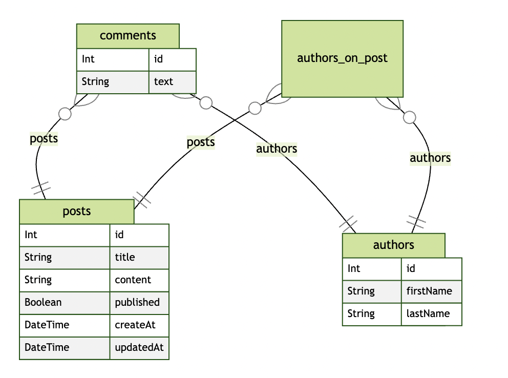

---
{
title: "It's Prisma Time - Create Relations",
published: "2021-12-28T07:21:03Z",
tags: ["javascript", "typescript", "database", "orm"],
description: "Hi Folks 👋 today I'll show you how to create relations among your entities. So don't waste time and...",
originalLink: "https://dev.to/this-is-learning/its-prisma-time-create-relations-1ohb",
coverImage: "cover-image.png",
socialImage: "social-image.png",
collection: "15827",
order: 1
}
---

Hi Folks 👋
today I'll show you how to create relations among your entities. So don't waste time and let's start!

Before moving on, let me explain what we are going to do today.

1. Create a relation 1-N among posts and comments
2. Create a relation N-N among posts and authors
3. Explain a relation 1-1

So get started from the first one.

## 1-N

To create the relation among Posts and Comments see the next code

```ts
model Post {
  ...
  comments  Comment[]
}

model Comment {
  id        Int @id @default(autoincrement())
  text      String
  post      Post @relation(fields: [postId], references: [id], onDelete: NoAction, onUpdate: Cascade)
  postId    Int
}
```

As you can see in this example there are 3 steps

1. Creation of the comment entity
2. Creation of the relation between Post and Comment (`@relation`)
3. Addition of the comments collection in the Post entity

Let's focus on the second point now

```ts
post      Post @relation(fields: [postId], references: [id], onDelete: NoAction, onUpdate: Cascade)
```

this line of code says Prisma that in Comment entity there is a field `postId` related to the field `id` in `Post` entity. In this way you described the relation between Post and Comment entities. It's also possibile to describe what to do when a foreign key is deleted or updated using the keyword `onDelete` and `onUpdate`. This two commands could have 5 possibile values:

- [Cascade](https://www.prisma.io/docs/concepts/components/prisma-schema/relations/referential-actions#cascade)
- [NoAction](https://www.prisma.io/docs/concepts/components/prisma-schema/relations/referential-actions#noaction)
- [Restrict](https://www.prisma.io/docs/concepts/components/prisma-schema/relations/referential-actions#restrict)
- [SetDefault](https://www.prisma.io/docs/concepts/components/prisma-schema/relations/referential-actions#setdefault)
- [SetNull](https://www.prisma.io/docs/concepts/components/prisma-schema/relations/referential-actions#setnull)

Not all of them are guaranteed in all the databases connector, but you can find [here](https://www.prisma.io/docs/concepts/components/prisma-schema/relations/referential-actions#types-of-referential-actions) all the info about that.
Let's move on to the third point where you added this line of code

```ts
comments  Comment[]
```

this line create a collection of comments inside the Post Entity like in every ORM that respects itself, so you can retrive by code the comments related to your post.

But let's move on and see the next relation.

*N.B. it's possible to create a not mandatory foreign key too. In our context it makes no sense, but imagine that a comment should exist also without a Post. In order to map this relation you need to change the Comment entity in this way*

```
model Comment {
  ...
  post      Post? @relation(fields: [postId], references: [id])
  postId    Int?
  ...
}
```

*Using the `?` character, you should indicate to Prisma that the field can be null.*

## N-N

See the following code

```
model Post {
  id        Int @id @default(autoincrement())
  title     String
  content   String
  published Boolean
  comments  Comment[]
  authors   AuthorsOnPost[]
}

model Author {
  id        Int @id @default(autoincrement())
  firstName String
  lastName  String
  comments  Comment[]
  posts     AuthorsOnPost[]
}

model AuthorsOnPost {
  author    Author @relation(fields: [authorId], references: [id])
  authorId  Int
  post      Post @relation(fields: [postId], references: [id])
  postId    Int

  @@id([authorId, postId])
}
```

As you can see there are 5 steps

1. Creation of the Author entity
2. Creation of the AuthorsOnPost entity
3. Creation of the relation between Posts and Authors using the AuthorsOnPost entity
4. Adding the collection of AuthorsOnPost in the Post Entity
5. Adding the collection of AuthorsOnPost in the Authors Entity
   Let's start to see the second point where you created a new Entity with two fields: `authorId` and `postId`.
   `authorId` is a foreign key related to the Author Entity whereas `postId` is a foreign key related to the Post Entity, I think if you understood the previous paragraph, you don't have any problem to understand this. Using the `@@id` you indicated to prisma that the AuthorsOnPost had a primary key composed by this two fields, so you can have the same author and the same post only once. By doing that, you have created a relation N-N between Authors and Posts, so in your database now, you can have a Post with multiple Authors and an Author can contribute to multiple Posts.
   The last two steps instead allow you to have the collection of Authors related to a Post and viceversa.

## 1-1

For this particular relation I hope you have understood the syntax so I'll leave a symbolic example. We can say that you have a Post that can be in relation only with an Author and viceversa, you have to describe that relation like this

```
model Post {
  ...
  author    Author @relation(fields: [authorId], references: [id])
  authorId  Int
}

model Author {
  .....
  post      Post?
}
```

I think it's not so hard to understand what I explained before, but it was necessary to bring this example too.

I think that's everything from the Relation's world with Prisma, but before updating the database, let me add to the project a package that creates the ER diagram of your database.

1. Install the package `prisma-erd-generator`

```
yarn add -D prisma-erd-generator
```

2. update the `prisma/schema.prisma` with the following code

```
generator client {
  provider = "prisma-client-js"
}

generator erd {
  provider = "prisma-erd-generator"
}

...
```

Now when you call the script `npx prisma generate`, Prisma generates for you also a file `prisma/ERD.svg` where you can see your ER Diagram.

Now it's time to upgrade your database and your types, so execute the next two scripts in your terminal

```
npx prisma generate
npx prisma db push
```

Now your db is up to date and you have a new file like the next where there is your ER Diagram.


That's all for today guys, in the next article it's time to see how you can insert data in you table.

Before the greetings, if you are interested in seeing the prisma-erd-generator package you can find the repository [here](https://github.com/keonik/prisma-erd-generator) and if you want to leave a ⭐, press the button 😉

Ok, see you soon Guys
Bye Bye 👋

*The code relatives to this article is available [here](https://github.com/Puppo/it-s-prisma-time/tree/05-create-relations)*
