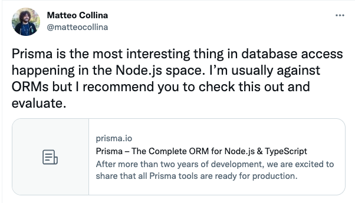

---
{
title: "It's Prisma Time - Introduction",
published: "2021-12-14T07:08:16Z",
tags: ["javascript", "typescript", "database", "orm"],
description: "Hi Folks 👋 and welcome back, Today I want to start a new series about Prisma. But before starting I...",
originalLink: "https://dev.to/this-is-learning/its-prisma-time-introduction-3a3h",
coverImage: "cover-image.png",
socialImage: "social-image.png",
collection: "15827",
order: 1
}
---

Hi Folks 👋 and welcome back,
Today I want to start a new series about [Prisma](https://www.prisma.io/).
But before starting I want to explain the reason why of this series.
In the last months I spent more time using [ORM](https://it.wikipedia.org/wiki/Object-relational_mapping) in the node eco-system. Most of the time I used [typeorm](https://typeorm.io/). In my opinion Typeorm is a great ORM but creates entities and managing them sometimes it's not so easy, especially if you love to use [typescript](https://www.typescriptlang.org/) without classes. But one day in my twitter's wall appeared this [tweet](https://twitter.com/matteocollina/status/1384900740754386946?s=20) of [@Matteo Collina](https://twitter.com/matteocollina) that spoke about [prisma](https://www.prisma.io/), so I decided to spend some of my free time to understand better this tool.

As you can imagine, it left me good impressions so I decide to share them with you using this series.

## What's in this series?

In this series, I'm going to show you how to set up a project with Prisma and how it can work in your codebase. I'm going to try to create shot articles with only one goal for each article, to permit you to understand better the goal and don't switch context during the reading.

## What's not in this series?

In this series I am not going to show you how to create a repository to split the data access layer with the business logic layer or how to structure your project to have a clean code, that's not the goal of the series, and I know that already exist many books and articles that speak about it.

*A little preamble: I don't love so much using ORM in my code, but sometimes they help the team to increase its velocity. Despite everything, it's important to check the queries generated by the ORM because sometimes they aren't optimized. In these cases, it's a good solution writing your query in order to improve the velocity of its execution.*

Let's start with an introduction of **Prisma**.
In this article I picked some infos about Prisma from its site. This helps you to have an idea of what it is and which are they goals.

## Introduction

Prisma is an open source next-generation ORM. It consists of the following parts:

- [Prisma Client](https://www.prisma.io/docs/concepts/components/prisma-client): Auto-generated and type-safe query builder for Node.js & TypeScript
- [Prisma Migrate](https://www.prisma.io/docs/concepts/components/prisma-migrate): Migration system
- [Prisma Studio](https://www.prisma.io/docs/concepts/components/prisma-studio): GUI to view and edit data in your database

*It's important to remember that if you prefer using javascript without typescript, you can choose this way without any problem because Prisma guarantees both solutions.*

## Prisma Goals

Prisma's main goal is to make application developers more productive when working with databases:

- **Thinking in objects** instead of mapping relational data
- **Queries not classes** to avoid complex model objects
- **Single source of truth** for database and application models
- **Healthy constraints** that prevent common pitfalls and antipatterns
- **An abstraction that makes the right thing easy** ("pit of success")
- **Type-safe database queries** that can be validated at compile time
- **Less boilerplate** so developers can focus on the important parts of their app
- **Auto-completion in code editors** instead of needing to look up documentation

## Prisma Connectors

Prima allow us to connect to the major SQL and NOSQL services.

- PostgreSQL
- MySql
- SQLite
- MongoDB
- Microsoft SQL Server

I think that as an introduction of the tool and to give you an idea about it, it may be all. If you are curious and you want to go deep inside about Prisma, in its [documentation](https://www.prisma.io/docs/concepts/overview) you can find more info.

I think for today it's all, but before ending this article, I wish to thank Prisma for the cover of this series, the original image is hosted in the [Prisma facebook account](https://www.facebook.com/prisma.io/) at this [link](https://www.facebook.com/prisma.io/photos/a.1593544297636616/2378801429110895/?type=1\&theater)

So see you in the next article where we'll start to setup our project.
Bye bye 👋
