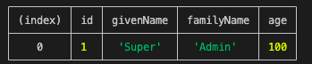
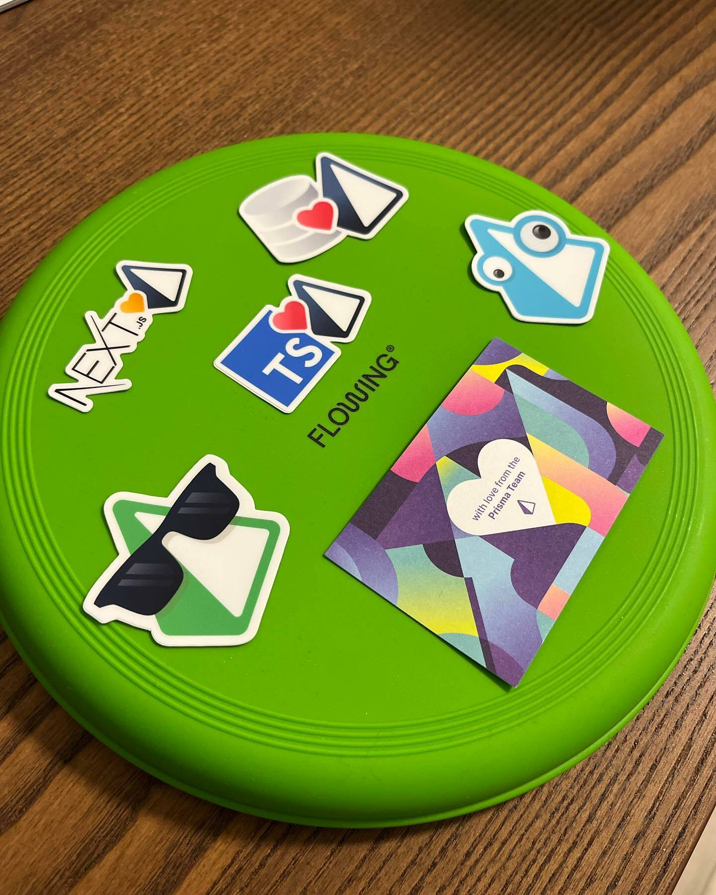

---
{
title: "It's Prisma Time - Seeding",
published: "2022-02-04T06:57:04Z",
tags: ["javascript", "typescript", "database", "orm"],
description: "Hello Folks 👋 Today we'll see how to handle seed with Prisma.  Seeding allows you to re-create...",
originalLink: "https://https://dev.to/playfulprogramming/its-prisma-time-seeding-43h4",
coverImg: "cover-image.png",
socialImg: "social-image.png",
collection: "It's Prisma Time",
order: 16
}
---

Hello Folks 👋
Today we'll see how to handle seed with Prisma.

Seeding allows you to re-create consistently the same data in your database and it can be used to:

- Populate your database with data that is required for your application to start - for example, a default language or a default currency.
- Provide basic data for validating and using your application in a development environment. This is particularly useful if you are using Prisma Migrate, which sometimes requires to reset your development database.

Prisma exposes this feature out of the box.
Creating a seed is not so difficult and now we'll see how to do it.

The first step is to create a file that contains our seeds. In this case we are creating the file `index.ts` inside of the folder `prisma/seed`.
Now, we want that someone executes this file every time. Its code adds inside of the authors table a special author called "Super Admin". The contents of this file therefore could be so

```ts
import { PrismaClient } from "@prisma/client";

const run = async () => {
  const prisma = new PrismaClient();
  try {
    if ((await prisma.author.count()) === 0) {
      await prisma.author.create({
        data: {
          givenName: "Super",
          familyName: "Admin",
          age: 100,
        },
      });
    } else {
      console.log("Default author already created");
    }
  } finally {
    await prisma.$disconnect();
  }
};

run();
```

As you can notice, it's not so difficult to understand the code. We create a connection to the database and check if the author table is empty. If so, we add the "Super Admin" author.
Now we have the file and it's time to execute it.
Prisma is configurable to accept an instruction that can execute this code, and to do that we need to update our package.json file.
The configuration is easy and we can instruct prisma in this way

```json
...
"prisma": {
  "seed": "ts-node prisma/seed"
},
...
```

These three lines of code indicate to Prisma that we want to handle its seed command. When this command is executed the system uses the ts-node tool to build and execute the file `prisma/seed/index.ts`.
But Prisma doesn't stop its work here. It executes this command after the migrate command too. Thus now we can execute this command

```cli
npx prisma migrate dev
```

As you can see, Prisma executes the migration and our seed file.
As a double check, we can update our `src/index.ts` in this way

```ts
import { PrismaClient } from "@prisma/client";

async function main() {
  const prisma = new PrismaClient();
  try {
    const authors = await prisma.author.findMany();
    console.table(authors);
  } catch (error) {
    console.error(error);
    throw error;
  } finally {
    await prisma.$disconnect();
  }
}
main();
```

and after that run the command

```cli
npm run dev
```

the result will seem like this



Our database is ready with all migrations and our seeds.
Now, I think you have all the notions to work with confidence with Prisma, so it's time to let you go for your steps.
This is the last post of this [series](https://https://dev.to/playfulprogramming/series/15827) folks.
I hope my posts helped you to view better this fantastic tool, surely they helped me a lot to understand it better.
So, I hope Prisma can be your friend in your daily work and it can help you to work in the right way with our databases.

Before leaving you I wanted to thank the Prisma team for these fantastic swags.



And [This is Learning](https://twitter.com/Thisis_Learning) for letting me publish this content in its space. I know, I could do more for you but I promise that in the next future the time to do something live will arrive too (I apologize for my bad English spoken😅). Thanks again This is Learning.

Now it's really time to leave you.
I hope you'll miss this Prisma time, but now it's your prisma time. Get those keyboards ready and let's code!

Bye Bye Guys 👋

See you soon with new contents!

*The code of this article is published [here](https://github.com/Puppo/it-s-prisma-time/tree/16-seed)*
