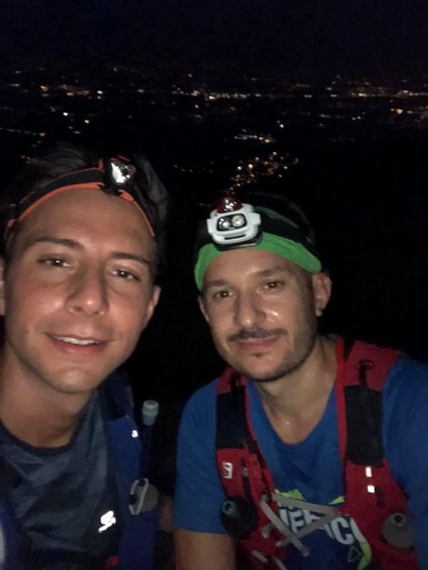
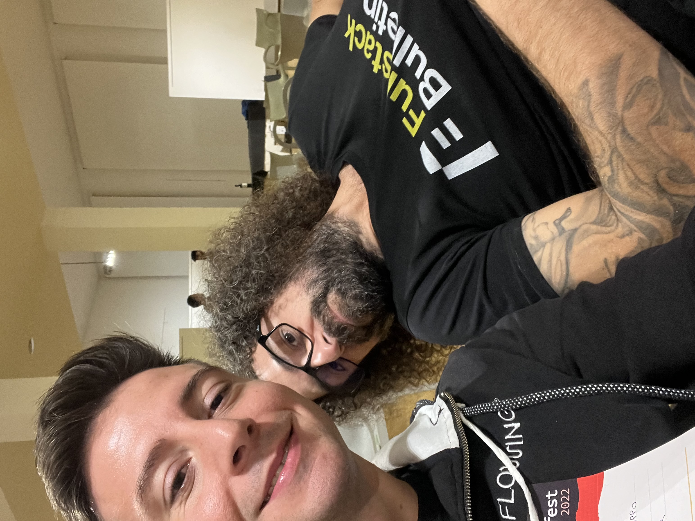
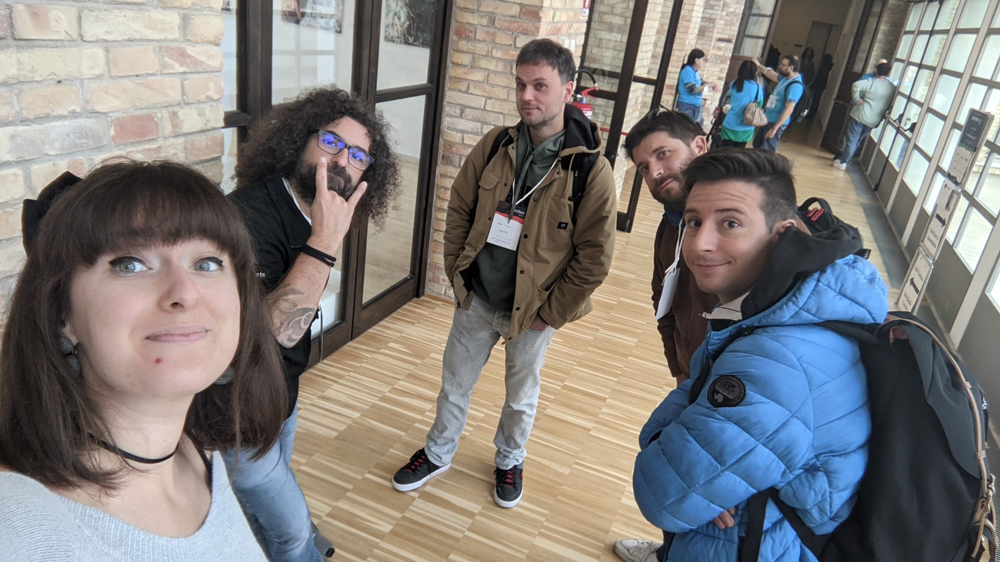
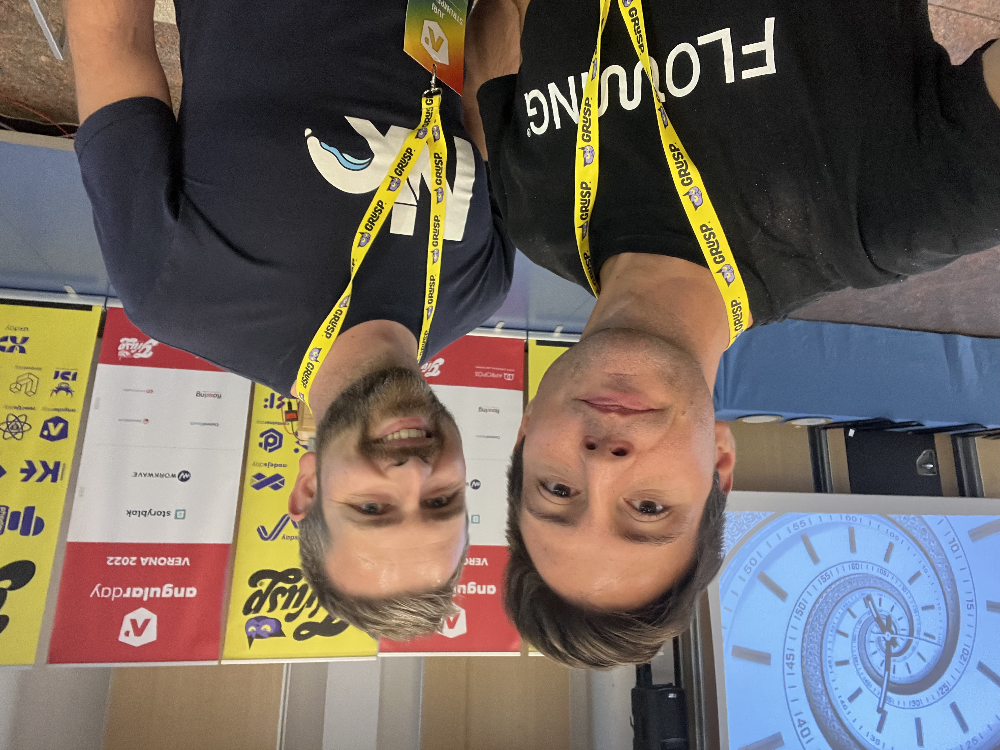
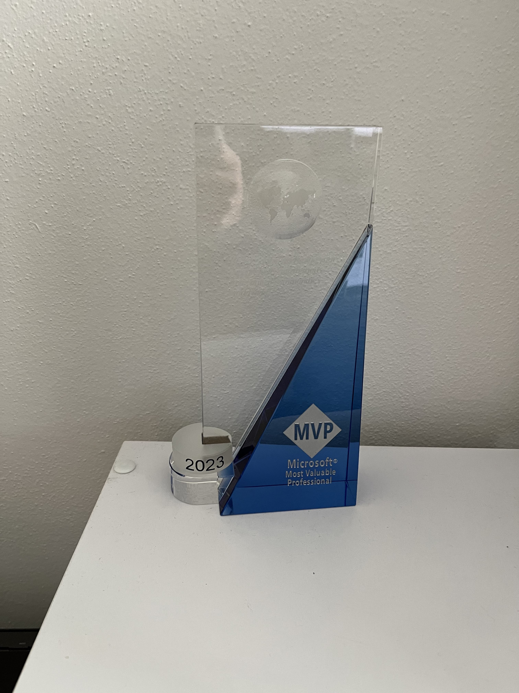

---
{
title: "🏆 My journey to the MVP Award 🏆",
published: "2023-06-09T05:30:39Z",
tags: ["mvp", "award", "microsoft", "journey"],
description: "This history started many years ago! I was a student, and I was going to the ITS in Pordenone. I...",
originalLink: "https://blog.delpuppo.net/my-journey-to-the-mvp-award",
coverImage: "cover-image.png",
socialImage: "social-image.png"
}
---

This history started many years ago! I was a student, and I was going to the [ITS](https://www.itsaltoadriatico.it/) in Pordenone.\
I spent two years of my life in that school, where I met great friends and learned a lot from awesome teachers, one of them is [Andrea Dottor](https://www.dottor.net/).\
In the first lesson with him, he started with his presentation, "I'm a freelancer, I work with different companies and blah blah blah... I'm a Microsoft MVP too".\
That was the first time that I heard about this program. As you can imagine, I was 20, and I didn't get any importance to that tense, but in reality, it was the first moment that I came across the MVP program.

After that, Andrea and I became colleagues and friends. I always see Andrea as a Mentor, and I have always followed him. So I started to go with him to the [xedotnet](https://www.xedotnet.org/) meetup. I met other incredible developers like [Mirco Vanini](https://mvp.microsoft.com/en-us/PublicProfile/4039714?fullName=Mirco%20Vanini) (another MVP), Daniele Morosinotto and many others there. Thanks to xe, I learned what a community is and how a community works. I started to understand the benefit of sharing knowledge in the development environment, and my mind started to build a strange idea "One day you will be like them, maybe not an MVP but a speaker yes, and you will share your knowledge with the others."

I was young at that moment and decided to continue to follow the community, but I put my effort into improving myself in my job.\
For almost 8 years, I dedicated my time to learn stuff in my bedroom and in my free time, developing different projects in my daily routine, and I changed 3 jobs too.\
When I started to work in Flowing, in my mind something happened.\
Flowing was an environment with awesome developers, and many of them were and are speakers too. But I was not ready to do my first talk, so I tried to think of something different that could be useful for the community. After some days, I decided to write my first series about Typescripts.\
Why typescript? It is my favorite language with javascript, and many times, I saw people fighting with it. So I said: "Ok, this is the right topic, let's go!".\
21 articles compose my first series, " **Typescript - Tips & Tricks Series**", which you can find [here](https://dev.to/puppo/series/11213). In reality, the audience at the beginning was not so much, but after some months, [Lars](https://twitter.com/LayZeeDK) contacted me to ask if I would join the "[This is learning](https://dev.to/this-is-learning)" community, and as you can imagine, I accepted :) Here I also met another good man: [Santosh](https://twitter.com/SantoshYadavDev), who runs with Lars "This is learning" community.\
During that period, another crazy and good friend had a strange idea. I organized and took as "Teacher" a workshop about Nx in Flowing, and he was invited as an attendee. He appreciated the workshop so much that he invited me to his youtube channel to speak about Nx ([Nx the return](https://www.youtube.com/watch?v=hS_2Okd-CkM)). The name of the friend is [Francesco Sciuti](https://mvp.microsoft.com/en-us/PublicProfile/5003974?fullName=Francesco%20Sciuti), another MVP and also the Batman of the developers.\
In that period, I was also writing a new series called "[RxJS - Getting Started](https://dev.to/puppo/series/13743)", 15 articles to help developers to be more confident with [RxJS](https://rxjs.dev/). Why this topic? Because I worked on many Angular projects and saw many developers stuck or completely unfamiliar with it.

After that, a colleague and friend ([Francesco Strazzullo](https://www.linkedin.com/in/francescostrazzullo/)) tried to push me out of my comfort zone, and he asked me to be a speaker at the [Mug](https://marcausergroup.it/) meetup. I was a bit scared; speaking in front of many people created a strange sensation in me, but after some sane pushing, I said yes! So the 7th of October 2021, I did my first talk called [Stay Reactive Stay Quiet with RxJS](https://marcausergroup.it/eventi/2021/10/07/stay-reactive-stay-quiet-with-rxjs.html). The sensations at the end were really good, so on the 19th of October, I did the second at the [FEVR](https://www.fevr.it/) community called "[Is it possible to build your UI components using only web components?](https://www.fevr.it/eventi/2021/10/is-it-possible-to-build-your-ui-components-using-only-web-components/)" (thanks to [Matteo Guidotto](https://www.linkedin.com/in/matteoguidotto/) for this talk).\
It was the COVID period, so taking talks and doing conferences in 2021 was really difficult. For this reason, I continued to write another series called: [It's Prisma Time](https://dev.to/puppo/series/15827).

At the beginning of 2022, the decisive turning point. During a chat with Andrea, I told him: "I would become a Microsoft MVP; what have I to do to achieve it?" I had this idea for some months, but I wanted to concretize it at that moment. He looked at me and said, "It's time to do some great conferences and maybe speak more about some Microsoft technologies".\
So I went back home, and with the euphoria in my blood, I started to write some articles about [Visual Studio Code](https://dev.to/puppo/series/16773). These articles spoke about some common commands for me when I worked with VsCode, but these articles were awesome for the community! Many and many people didn't know these commands, and the articles received a lot of appreciation. Another thing I did was research conferences and check out conferences where I could send a CFP.\
I remember I sent so many CFPs that I forgot how many noes I received 😅\
But at the beginning of September, the first confirmations arrived: [AngularDay 2022](https://2022.angularday.it/talks_speakers/), then the [workshop](https://2022.reactjsday.it/workshop/workshop_Unit-Test.html) at the react day with [Fabio Biondi](https://mvp.microsoft.com/en-us/PublicProfile/5003526?fullName=Fabio%20Biondi), another MVP and good friend that shared with me also a great weekend at the GDP Pescara, where I talked about [Prisma](https://devfest.gdgpescara.it/sessions/304) and last but not least the [ngrome](https://www.youtube.com/watch?v=h_Faplx37yk).\
During this period, I also continued to do meetups, thanks to [Milano Frontend](https://www.meetup.com/it-IT/milano-front-end/) and [React JS Milano](https://www.meetup.com/it-IT/react-js-milano/) having me as a speaker.\
If you are curious, you can find the list of all my talks and contributions [here](https://mvp.microsoft.com/en-us/PublicProfile/5005133?fullName=Luca%20Del%20Puppo).

In the middle of December 2022, I spoke again with Andrea to ask him if he could nominate me as Microsoft MVP. He did it, and I spent an evening filling out the form of all my contributions during the last year. Why last year? Because the MVP Award is based on the last year. I started my history 10 years ago, yes, but the MVP Award takes into consideration only the last year. I decided to tell you the entire story because I know the last year is only the cherry on top, but without the previous nine, the last year would probably be a failure.

As you can imagine, after the filling, you have to wait for the evaluation, which takes at most 3 months. I was lucky; on the 3rd of January 2023, in my inbox appeared an email that said: "Congratulation! You are a Microsoft MVP 2023"! Now, I suppose you can imagine how much happy I was, I think I stayed euphory for the following two or three days 😅\
Then after some weeks, I did a call with [Cristina](https://www.linkedin.com/in/crisgonz/). She takes care of all the MVPs on the Meditterian side and explained to me how the program works, its benefits and so on. She is really kind and she really put a lot of effort into helping the MVPs. Thanks Cristina, for all the things you do for us! 🫶

Now my journey is only at the beginning. I have different ideas for continuing.\
I opened my own [Youtube channel,](https://www.youtube.com/@Puppo_92) I'll continue to write articles, and I'll continue to do talks at conferences and meetups.

**What did I learn from this story?**\
The MVP award is "only" a simple and beautiful award that helps me remember all the effort I put in these years to improve myself and try to help others! And if you want to join the program: love communities, and put your effort into helping them! Do this, and you'll be on the right path to being part of the MVP Family.\
Remember: **improve yourself, help others and follow your passion!**

*Photo by [Vlad Bagacian](https://unsplash.com/@vladbagacian?utm_source=Devto\&utm_medium=referral) on [Unsplash](https://unsplash.com/?utm_source=devto\&utm_medium=referral)*
