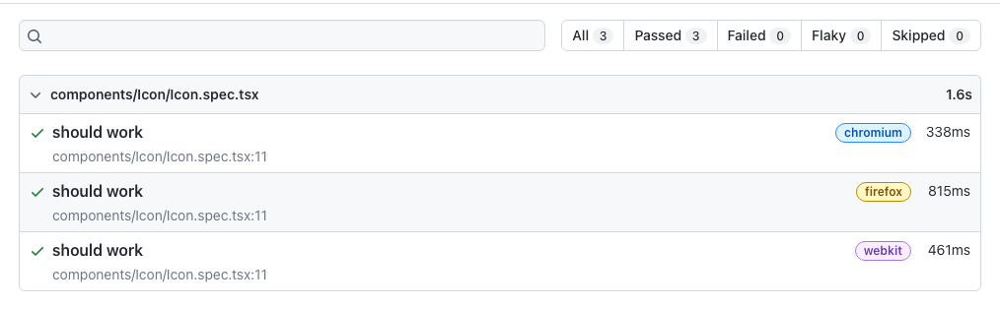

---
{
title: "Playwright - Components testing",
published: "2023-01-12T09:00:42Z",
edited: "2023-02-21T07:20:59Z",
tags: ["playwright", "components", "testing"],
description: "Hi there, Today I'll speak about a beta feature in Playwright: Components.  The team is building a...",
originalLink: "https://blog.delpuppo.net/playwright-components-testing",
coverImage: "cover-image.png",
socialImage: "social-image.png",
collection: "20832",
order: 1
}
---

Hi there,\
Today I'll speak about a beta feature in Playwright: Components.

The team is building a new feature to write component tests with Playwright, so it's time to see how it works.

## Installation

To start to use this feature, you have to install it. To do that, type in your terminal

```sh
npm init playwright@latest -- --ct
```

The command asks you two questions:

- **Which framework do you use? (experimental)**
  choose to *react* to this tutorial

- Install Playwright browsers
  choose to *true*

When the installation ends, there will be a new file in your project called: `playwright-ct.config.ts`. This file contains the configuration for the components' testing.\
For this tutorial, you have to change only one configuration, `testDir` property from `./` to `./src`. Playwright uses this configuration to understand where the files used for the components' tests are located. In this example, you'll put the test file in the same folder as the component.

## First Test

Let's start with the first component test.

Create a file called `Icon.spec.tsx` in the folder `src/components/Icon/`, and inside of it, copy this code.

```ts
import { expect, test } from '@playwright/experimental-ct-react';
import Icon from './Icon';

test.use({ viewport: { width: 500, height: 500 } });

const props = {
  src: 'src',
  title: 'title',
}

test('should work', async ({ mount }) => {
  const component = await mount(<Icon src={props.src} title={props.title} />);
  await expect(component).toHaveAttribute('src', 'src');
  await expect(component).toHaveAttribute('title', props.title);
});

```

As you can see, the structure is similar to other Testing Frameworks.\
You have to import the methods relative to react components from the path `@playwright/experimental-ct-react` and import your component.\
Then you can set up the viewport for your test; it's important to understand that the tests run in different browsers, so you can also test your components in different viewports. And at the end, it's time to check your component.\
The test structure is straightforward; using the `mount` method, you can render the component in the DOM, and then you can check the result using the Playwright APIs.\
For instance, in this case, the test checks if the `src` and `title` attributes have the correct value.\
Using these tests, you can check the proper logic or the right representation of your components and guarantee the right render in different browsers.

## Run the test

Cool, you set up Playwright, and you wrote the tests. Now it's time to run it.\
Easy peasy lemon squeezy, type in your terminal the following command

```sh
npx playwright test -c playwright-ct.config.ts
```

and then

```sh
npx playwright show-report
```

the result is like this.



As you can notice, Playwright runs the test in three different browsers by default. You can decide where to run the tests, adding or removing the browsers from the configuration file.

Perfect! I think you have a good introduction to component testing with Playwright. The feature is in experimental mode, so use it carefully, please.\
You can find out more info in the official [documentation](https://playwright.dev/docs/test-components) if you want to dive into it.

I hope you enjoyed this content.\
See you soon folk.

Bye Bye 👋

*You can find the code of this post* [*here*](https://github.com/Puppo/playwright-series/tree/06-components)


