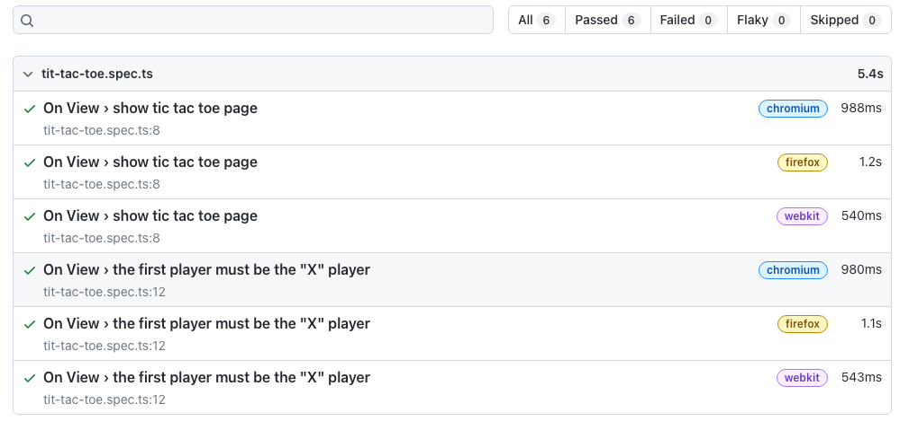

---
{
title: "Playwright - How to write tests",
published: "2022-12-14T09:30:42Z",
edited: "2023-02-21T07:18:45Z",
tags: ["playwright", "e2e"],
description: "What are you going to learn in this post?   In this post, you will learn how to write tests...",
originalLink: "https://blog.delpuppo.net/playwright-how-to-write-tests",
coverImage: "cover-image.png",
socialImage: "social-image.png",
collection: "20832",
order: 1
}
---

## What are you going to learn in this post?

In this post, you will learn how to write tests with Playwright, using assertions, locators and something else.

## Write tests

Let's start with an example

```ts
test('the first player must be the "X" player', async ({ page }) => {
  await page.goto("/");

  const playerParagraph = await page.getByRole("paragraph");

  await expect(playerParagraph).toContainText("X");
});

```

In this example, I introduced two new stuff, `getByRole` and `toContainText`.\
`getByRole` is part of the *locators* and `toContainText` is part of the *assertions*, and now we will dive into these new things.

### Locators

Locators are the central piece of Playwright's auto-waiting and retry-ability. Locators represent a way to find element(s) on the page at any moment.

Using locators, you can retrieve elements in your dom by these commands:

- **page.getByRole(role\[, options])** to locate by explicit and implicit accessibility attributes.

- **page.getByText(text\[, options])** to locate by text content.

- **page.getByLabel(text\[, options])** to locate a form control by associated label's text.

- **page.getByPlaceholder(text\[, options])** to locate an input by placeholder.

- **page.getByAltText(text\[, options])** to locate an element, usually image, by its text alternative.

- **page.getByTitle(text\[, options])** to locate an element by its title attribute.

- **page.getByTestId(testId)** to locate an element based on its `data-testid` attribute (other attributes can be configured).

- **page.locator(selector)** to locate an element base on its selected (Css or XPath)

As you can see, using these eight commands, you can find all the elements on your pages. Watching the previous example, you can view how using the `getByRole` method you can get the paragraph in your DOM and then check whatever you want. Okay, so a quick recap of what locators are: locators are methods that help you to search the elements in the DOM.

### Assertions

Like any test framework that is respected, Playwright has its assertions. Assertions are used to check our results, and as developers, we use them to be sure the application or the code runs as expected. Playwright for this feature uses under the hood the [expect](https://jestjs.io/docs/expect) function built by jest. So if you are familiar with [jest](https://jestjs.io/), you won't have problems with Playwright. The most famous assertions that you can use are: `toEqual`, `toContain`, `toMatch`, `toBe` and many more. The assertions are your best friends to check if your application runs as expected.

As you can imagine, the combination of these two things permits you to build many tests to check the behaviours of your application.

So if you go back to the previous example and type `npm run e2e` in your terminal, you get the following result.

```bash
 npm run e2e

> react-e2e@0.0.0 e2e
> playwright test

Running 6 tests using 4 workers

  6 passed (5s)

```

Wow, it works. 😀 And now you know what to use to create your tests with Playwright.

## Isolate your tests

If you are familiar with testing frameworks, you probably know there is a way to group a test list. To do that with Playwright, you have to use the `describe` method exposed by the `test` object, as in the following example.

```ts
import { expect, test } from "@playwright/test";

test.describe("On View", () => {
  test("show tic tac toe page", async ({ page }) => {
    await page.goto("/");

    await expect(page).toHaveTitle("Tic Tac Toe");
  });

  test('the first player must be the "X" player', async ({ page }) => {
    await page.goto("/");

    const playerParagraph = await page.getByRole("paragraph");

    await expect(playerParagraph).toContainText("X");
  });
});

```

The benefit of grouping is also visible in the report that now appears so.



As you can see, the label `On View` is present before each test.\
So now, you can split your test file into different contexts if you have this need.

## Hooks

Another critical feature if you love working with test frameworks is hooks.\
Hooks allow you to run a piece of code before or after the test execution. Typically they are called: `beforeEach` `beforeAll` `afterEach` `afterAll` and you know what they are called in Playwright? Precisely in the same way 🚀

So, to give an example, you can refactor the code in this way to navigate the home page before each test.

```ts
import { expect, test } from "@playwright/test";

test.describe("On View", () => {
  test.beforeEach(async ({ page }) => {
    await page.goto("/");
  });

  test("show tic tac toe page", async ({ page }) => {
    await expect(page).toHaveTitle("Tic Tac Toe");
  });

  test('the first player must be the "X" player', async ({ page }) => {
    const playerParagraph = await page.getByRole("paragraph");

    await expect(playerParagraph).toContainText("X");
  });
});

```

The result is the same as before, but now you only have the navigation command inside the `beforeEach` hook.\
These hooks are great if you have to mock API or if you have to do something before or after tests.

## Play with your DOM

After all these things, it's time to write the last test of this post.\
Now you will write a test that simulates the user's behaviours in the applications. The test simulates the click of the player "X" in the top left square and then checks if the next player is the "O".

```ts
test.describe("Users behaviours", () => {
  test.beforeEach(async ({ page }) => {
    await page.goto("/");
  });

  test('the first player select the top-left square and then the next player is the "O"', async ({
    page,
  }) => {
    const squares = await page.getByRole("button");

    const topLeftSquare = squares.first();
    await topLeftSquare.click();
    const topLeftSquareImg = await topLeftSquare.getByRole("img");

    await expect(topLeftSquareImg).toHaveAttribute("title", "X");
    await expect(topLeftSquareImg).toHaveAttribute("src", /x.png/i);

    const playerParagraph = await page.getByRole("paragraph");

    await expect(playerParagraph).toContainText("O");
  });
});

```

This example starts to become trickier. As you can notice, there are some new things. Let's start with the first one, the `first` method. In this case, the `getByRole` returns many elements, and only the first is required in the test. Using the `first` method, you can get the first element in the list.\
Then when you have the first square on the board, you can simulate the click of this element by the user. Using the `click` method, you can do that. Easy peasy lemon squeezy. But now things start to become "complex". As you can see, now you can use the `getByRole` from the square element, and the method tries to find an image child of this element. After that, using `toHaveAttribute` assertion, you check if this image has a title with the "X" value and if the source contains the value "x.png". The final step is the same as in the previous post, where you get the paragraph and check if the next player is now the "O" player. Ok, it's not rocket science but a bit more complicated than the previous example.

## Conclusion

Ok, I think you have materials to study for now! 😃\
So, what you have learned in this post:

- Locators
- Assertions
- How to isolate your test
- Hooks\
  I suggest you get your hand dirty with these topics because they will be the fundamentals of your test with Playwright.

Ok, that's all folk, see you soon.\
Bye Bye 👋

*P.s. you can find the result of this post at this* [*link*](https://github.com/Puppo/playwright-series/tree/02-how-to-write-tests)


