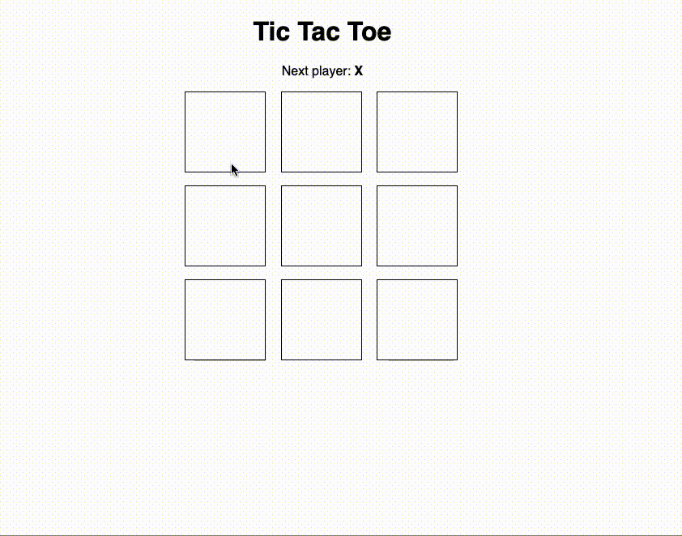
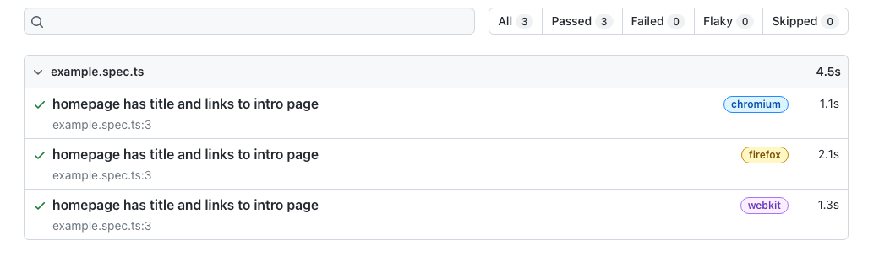
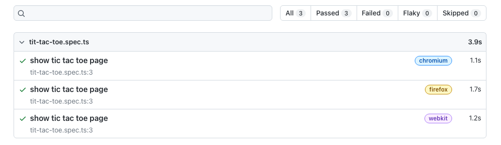

---
{
title: "Playwright - Let's start",
published: "2022-12-07T09:00:44Z",
edited: "2023-02-21T07:18:23Z",
tags: ["playwright", "e2e"],
description: "In the last period, in the frontend ecosystem, a new e2e tool has come up and it has started to...",
originalLink: "https://blog.delpuppo.net/playwright-lets-start",
coverImage: "cover-image.png",
socialImage: "social-image.png",
collection: "Playwright",
order: 1
}
---

In the last period, in the frontend ecosystem, a new e2e tool has come up and it has started to become famous; its name is Playwright. In this short series, I want to leave you with some information on this and tips on how to get started.

## What is it?

Let's start with what Playwright is. Playwright is a testing framework to handle e2e testing. With Playwright we can write e2e tests and run them in different browsers, like Chrome, Firefox and Webkit. We can run our tests on many platforms like Windows, Mac, Linux or CI, and we can write tests in Typescript, Javascript, Java, Phyton or .Net.

If you open the official [website](https://playwright.dev/), you can find these characteristics:

- Any browser Any platform One API

- Resilient No flaky tests

- No trade-offs No limits

- Full isolation Fast execution

- Powerful Tooling

In my opinion, the tool reflects all of these characteristics.

## TicTacToe application

I want to use a TicTacToe application built with vite + react in this series. And you can find it [here](https://github.com/Puppo/playwright-series/tree/00-the-app).



As you can see, the application is straightforward, but with it, we can start to move to the first steps with Playwright.

## Install Playwright

The first step to use Playwright is installing it, that is easy. Open your terminal and type `npm init playwright@latest` (I use npm but if you want to use yarn or pnpm read the [docs](https://playwright.dev/docs/intro#installing-playwright)). Ok, now the installation asks you some questions:

1. Where to put your end-to-end tests? The default option is `tests` but I prefer to use the folder `e2e`.

2. Add a GitHub Actions workflow? The default option is `false`; in this demo, I leave this option to false for now.

3. Install Playwright browsers (can be done manually via 'npx playwright install')? The default option is `true`, and I used this value

and now you have to wait until the installation ends. When the installation is completed... congratulation, you are ready to get your hands dirty with Playwright!

## First Look

The installation created in your repository 3 new files:

- playwright.config.ts

- e2e/example.spec.ts

- tests-examples/demo-todo-app.spec.ts

Let's start with the last one, the easiest 😊 This file contains a list of examples of how you can write tests with Playwright. It uses an application created by the playwright team (a simple to-do app) and illustrates how you can interact with your page.

Carrying on with the second one. This file is a quick example of some tests on the playwright website, but it's here only as a placeholder for your tests.

And now, the first one, the most important. Playwright uses the `playwright.config.ts` file to understand its configuration. Inside it, you can find configurations about the test folder, the timeout used by the expect function, the configurations for the browsers used by Playwright to run the tests, and more.

## Run your first test

It's time to see Playwright in action, so open your terminal again and run the following command `npx playwright test`. The result is something like this



Playwright in this report shows you the result of its execution, and you can check if everything has gone ok. The report shows the result for each browser indicated in the configuration, in this case: Chromium, Firefox and Webkit.

## Write your first test

Ok cool, but now it's time for you to write your first test with Playwright. Before doing this, you have to configure Playwright to be able to run your application before starting with the tests. To do that, you have to open the `playwright.config.ts` and add the following configuration

```ts
const config: PlaywrightTestConfig = {
  ...
  webServer: {
    command: "npm run dev",
    port: 5173,
  },
  ...
};

```

*N.B. check your port running the command* `npm run dev` you have to use the same port exposed by vite.

And now it's time for your first test. Open the file `e2e/example.spec.ts` and rename it to `e2e/tit-tac-toe.spec.ts`. Then clean everything in the file and leave only the import line `import { expect, test } from "@playwright/test";`.

Now add your first test

```ts
test("show tic tac toe page", async ({ page }) => {
  await page.goto("/");

  await expect(page).toHaveTitle("Tic Tac Toe");
});

```

ok, let's see this test together. First of all, you can indicate to Playwright that it is a test using the `test` function. As in every testing framework, the test function's first param is the test's name. The second param is the function to test our application. Using Playwright, this function is always an async function because your tests in these cases are always asynchronous. The first command in this example is a command to say to Playwright to navigate to the home page of our application. As you can see, already this command is async. Now, if the test can navigate to this page, you want to test if the title of the page is "Tic Tac Toe". Yes, it's elementary, but an excellent example of moving your first step.

Now, it's time to check if the test runs in Playwright, but before doing that, you can simplify the interaction with Playwright by adding a new script in the package.json, as shown here

```json
   ....
   "scripts": {
    ...
    "e2e": "playwright test"
  },

```

now in your terminal you can type `npm run e2e` and voila, your test is gone

Adding another script in your package.json, you can open the report result in your browser

```json
   ....
   "scripts": {
    ...
    "e2e": "playwright test",
    "e2e:report": "playwright show-report"
  },

```

And now, if you run the command `npm run e2e:report` in your browser, you can see the result of your first test.



Ok, I think that's all for now. In this post, you learnt:

- How to install Playwright

- How to run your test

- How to write your first test with Playwright

In the next post, we will continue our journey in the Playwright world, but for now, that's all! See you soon, folks.

Bye Bye

*p.s. You can find the result of this post at this* [*link*](https://github.com/Puppo/playwright-series/tree/01-install-and-run)

<!-- ::user id="puppo" -->
