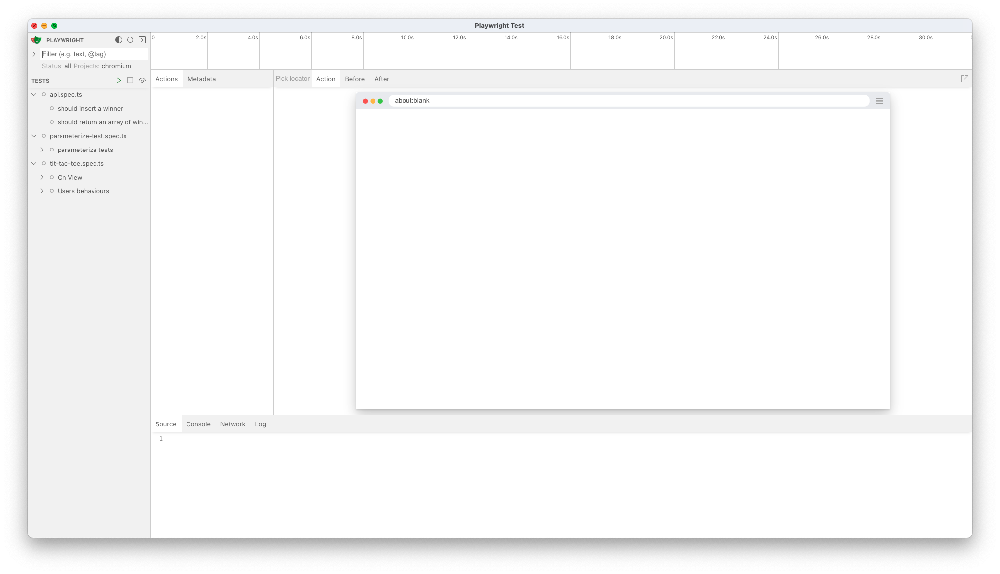
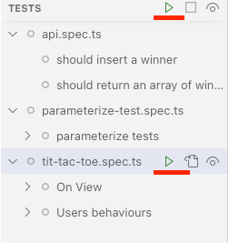
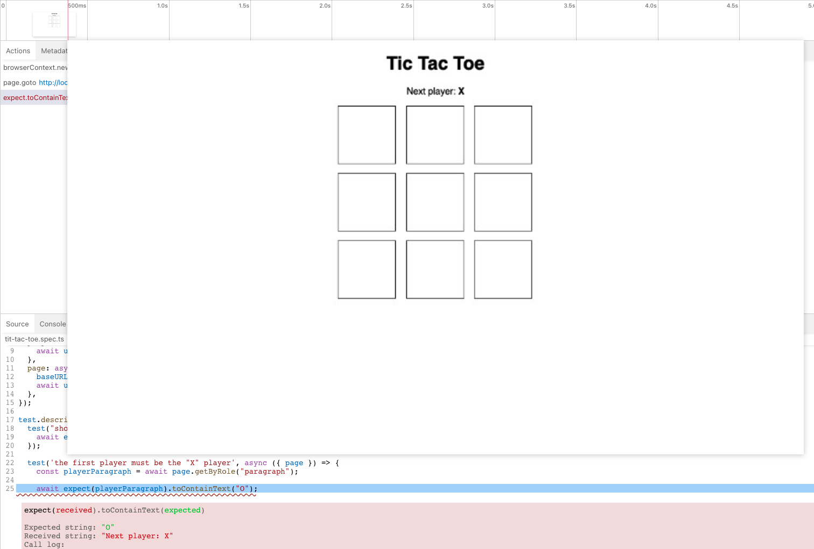
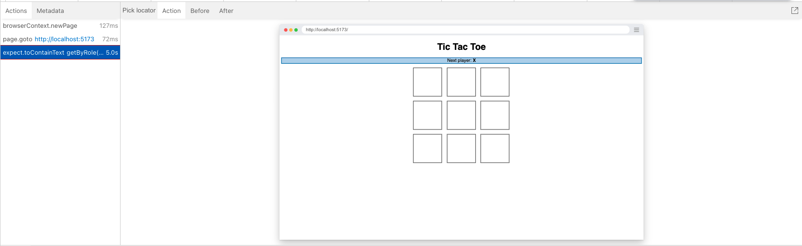
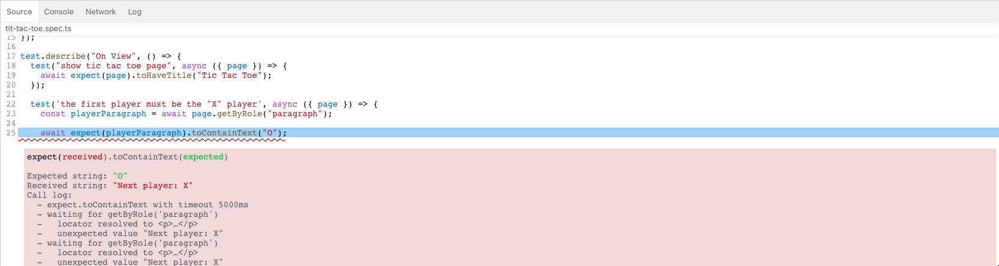
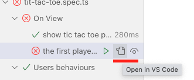

---
{
title: "Playwright - UI Mode",
published: "2023-04-06T06:00:39Z",
tags: ["playwright", "e2e"],
description: "Hi folks, In release 1.32, Playwright released a new cool feature for us, the UI Mode!  This feature...",
originalLink: "https://blog.delpuppo.net/playwright-ui-mode",
coverImage: "cover-image.png",
socialImage: "social-image.png",
collection: "Playwright",
order: 13
}
---

Hi folks,\
In release [1.32](https://playwright.dev/docs/release-notes#version-132), Playwright released a new cool feature for us, the UI Mode!

This feature is still in beta yet, but you can use it by adding a simple option in the CLI `--ui`.

```bash
$ npx playwright test --ui
```

The result of this command is a new window in your display!



Using this view, you can run and debug your test. But let's dive into it.\
The view is split into two parts: the left part contains the list of the tests, and the right part is the crucial view to check and debug the tests. If you are familiar with the Playwright tracer, the right section is similar to the tracer view.

But what can you do with this view?\
First, you can run one or many tests using the run button at the right of each test or group of tests.



Playwright runs the tests by clicking this button, and you can see the result. A green tick means the test is ok, and a red icon with a circle X means there is an error in the test.


Now if you click on one of the tests in the right section, you can see what happened during its execution.\
In this case, let's dive into the wrong test.\
In the top section, you can see the timeline of the test; you can go over it with the mouse and see all the browser views during the execution.



In the action tab, you can find all the actions done by the test, for instance: the page creation, the navigation, each click on the page and so on. You can navigate in the history by clicking on one of these actions, and each time you click the action, the panel on the right shows the view at that specific moment. In this way, you can understand what happened during the test execution.



In the bottom bar, you can access different views: Source, Console, Network, and Log.\
I think the last three views are pretty simple, and I want to focus on the Source view.\
In the Source view, you can see all the code used by Playwright to run the test, and if you click on one of the actions, Playwright highlights the line of code that runs that action. If your test is wrong, Playwright shows you the error in the specific line of code where the error is thrown. In this way, you can immediately see the mistake and try fixing it.



The last cool feature introduced in this view is the possibility to open the Source code directly from the view! If you click the icon at the right of the Run icon, Playwright opens the file using Visual Studio Code.



Last but not least, Playwright keeps syncing your codebase with the Playwright UI Runner, so in this way, you can change and fix errors and retry the test immediately.

If you want to find out more or watch the Playwright UI Runner on working, check out my Youtube video.

<https://www.youtube.com/watch?v=ErkRgqmHCmc>

I think this solution and the integration of Playwright with VsCode are awesome, and Playwright is changing the Developer Experience in the best possible way!

Ok, that's all folks!\
I hope you enjoyed this content, and now your testing phase is more comfortable and easier!

See you later!\
Bye Bye 👋


